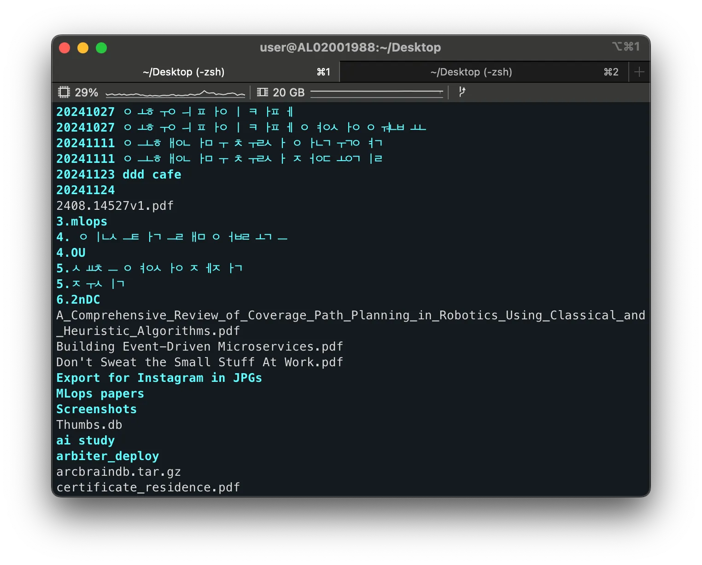
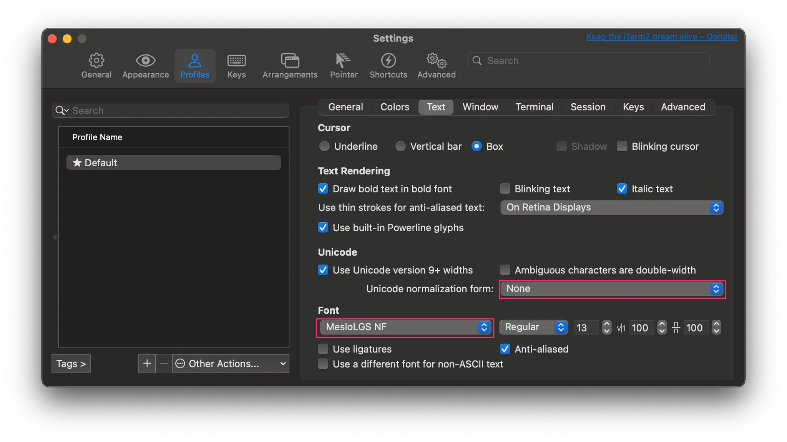
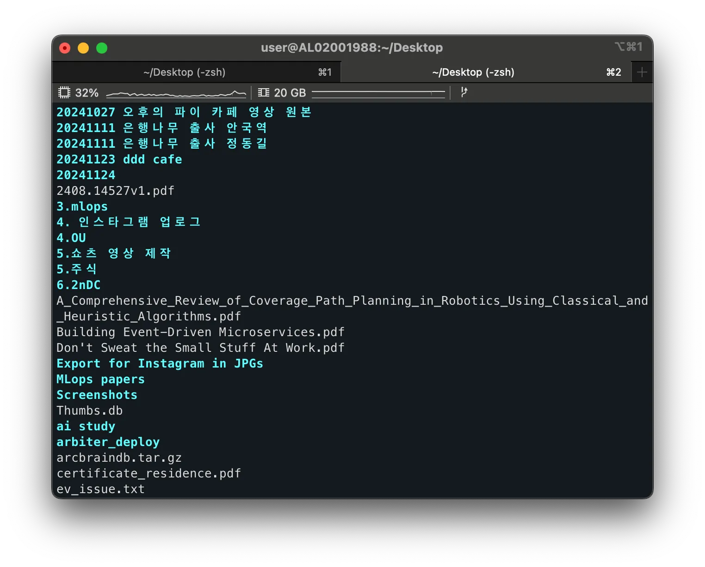

# 1. Overview

After recently reinstalling my MacBook, I ran into a problem where Korean folder and file names appeared garbled while using `iTerm2`. In this post, I'll show you how to fix the garbled Korean text issue in `iTerm2`.

# 2. Garbled Korean Text - Changing `iTerm2` Settings

Garbled Korean text in iTerm2 is mainly caused by two things: the Unicode Normalization Format setting and the font choice. You can fix the problem by following the steps below.

## 2.1 Changing the Unicode Normalization Format

`iTerm2` handles character encoding differently depending on the `Unicode Normalization Format` setting. The default setting isn't suitable for handling Korean, so you need to change it.

Launch `iTerm2` and change the relevant setting in the Profiles > Text tab.

- Change `None` → `NFC`

> `NFC` (Normalization Form C) is the appropriate setting for handling composed Korean characters, and it displays Korean file and folder names correctly.

## 2.2 Changing the Font

The font used in `iTerm2` also affects whether Korean displays properly. To display Korean correctly, it's best to use the `MesloLGS NF` font.

- Select `MesloLGS NF` in the Font settings

> If `MesloLGS NF` isn't in your font list, you can download and install it through [this link](https://github.com/romkatv/powerlevel10k/?tab=readme-ov-file#manual-font-installation).

# 3. Wrapping Up

By following the steps above, I was able to easily fix the garbled Korean text problem in `iTerm2`.

# 4. References

- [[MAC] Fixing Korean character separation / fixing garbled Korean in iTerm2](https://passing-story.tistory.com/entry/MAC-iTerm2-%ED%95%9C%EA%B8%80-%EB%B6%84%EB%A6%AC-%ED%95%B4%EA%B2%B0-iTerm2-%ED%95%9C%EA%B8%80-%EA%B9%A8%EC%A7%90-%ED%95%B4%EA%B2%B0)
