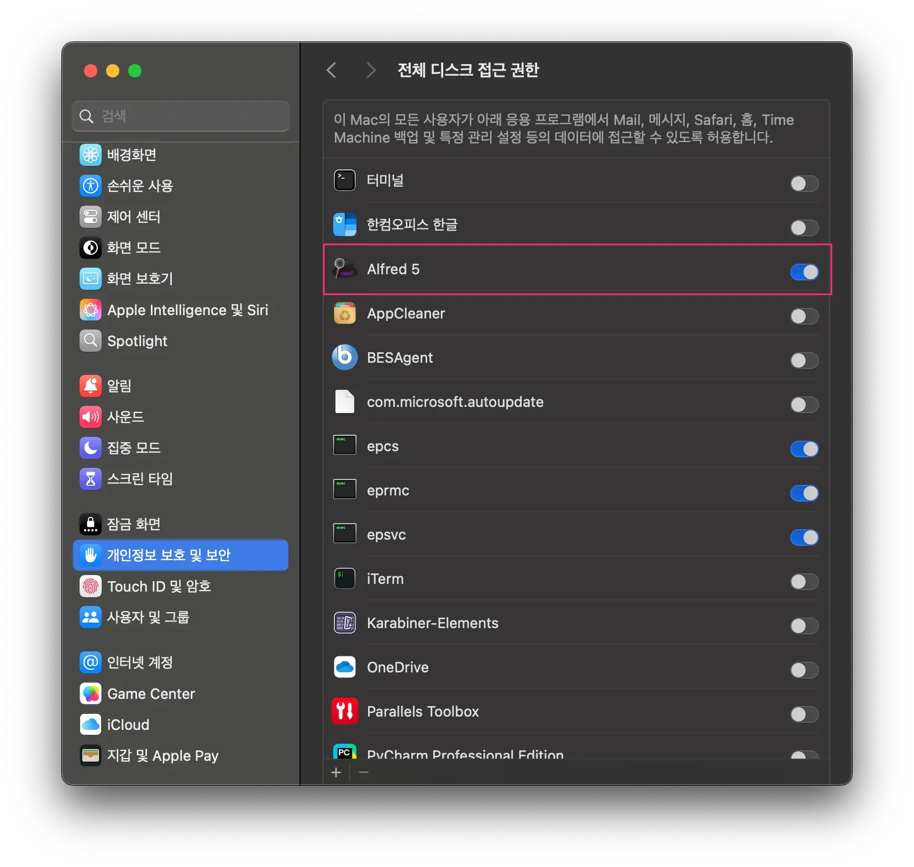
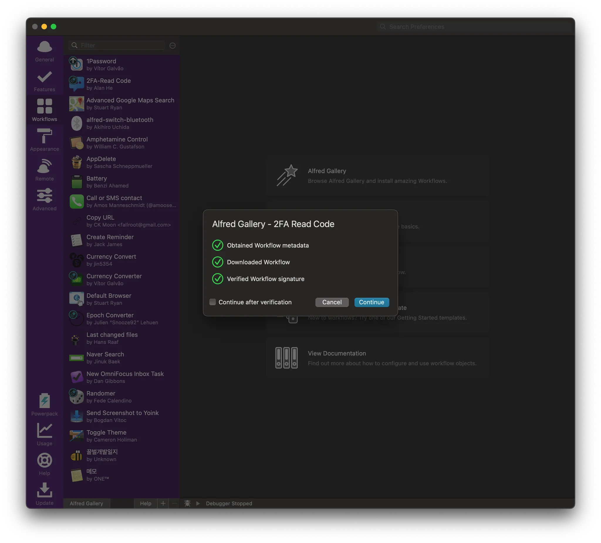
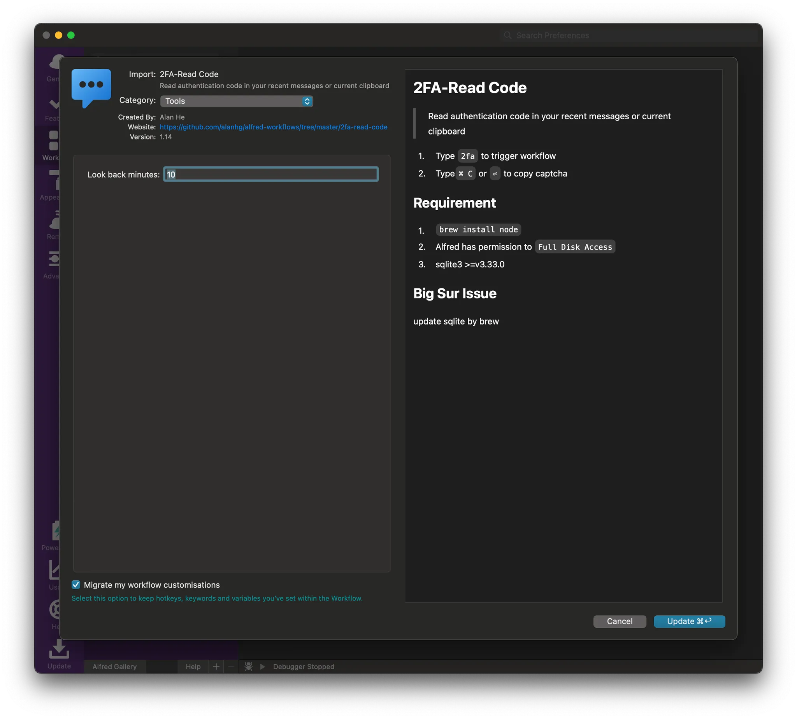
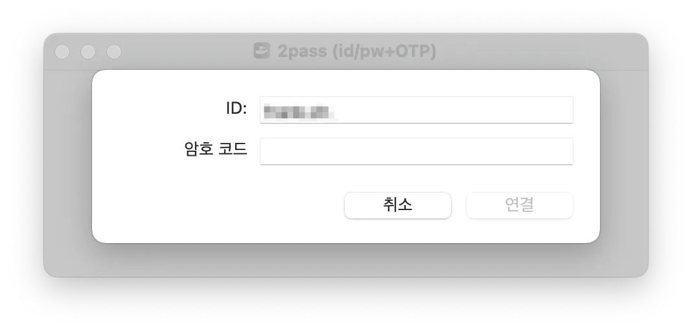
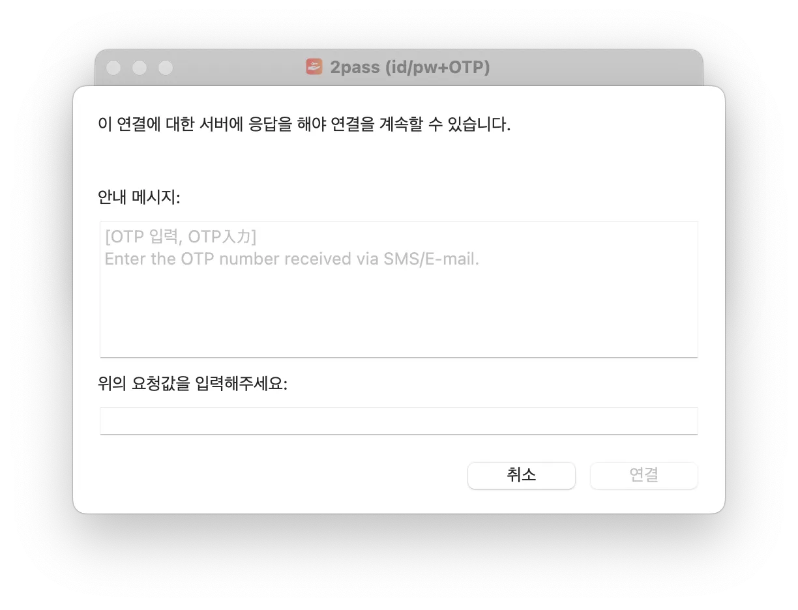
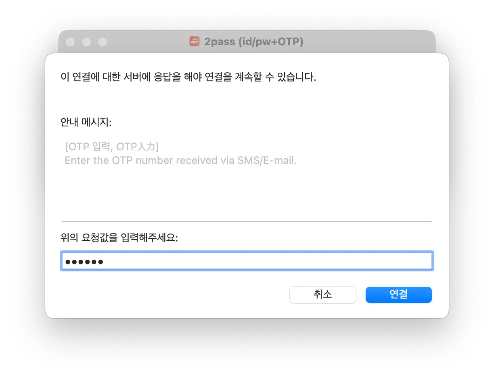

# 1. Overview

Every time I connected to my company VPN, I received an `OTP` (one-time password) by text message and had to type it in manually — a tedious task I repeated every day. But on a coworker's recommendation, I automated this process using an Alfred Workflow, and life got a little easier.

In this post, I'll introduce the Alfred Workflow `2FA Read Code` that I used as the automation tool, and explain how to use it to automatically extract and enter 2FA codes from `iMessage`.

> Alfred Workflow is one of the powerful features of the `Alfred` app, which boosts productivity on macOS by helping you automate repetitive tasks.

## What Is 2FA Read Code?

`2FA Read Code` is an Alfred Workflow that automatically finds and copies `OTP` codes received in `iMessage`. With it, you can easily complete authentication for `VPN` logins, website 2FA entry, and more.

# 2. How to Use `2FA Read Code`

## 2.1 Requirements

To use this Workflow, you need to meet the following conditions.

- A user who uses both an iPhone and a MacBook
- `iMessage` syncing enabled

This way, the 2FA text messages you receive on your iPhone can also be seen on your Mac, and the workflow can read them automatically.

## 2.2 Preparations Before Use

To use the `2FA Read Code` Workflow, you need Node.js and SQLite3. You can install them easily with `brew`.

### Installing Node.js and SQLite3 with Homebrew

Enter the following command in the terminal.

```bash
> brew install node sqlite3
```

Once installation is complete, the `2FA Read Code` Workflow is ready to work properly.

### Setting Alfred Disk Permissions

The `2FA Read Code` Workflow needs disk permissions, so grant `Alfred` disk access in the setting below.



# 2.3 Installing the `2FA Read Code` Workflow

Here's how to install the `2FA Read Code` Workflow.

1. Download the workflow
   - Go to the [2FA Read Code download page](https://alfred.app/workflows/alanhe/2fa-read-code/) and click the `Install in Alfred` button on the site



2. Install the Workflow in `Alfred`

- When `Alfred` launches, click the `Install` button to add the workflow



Now `2FA Read Code` is ready to use in `Alfred`.

## 2.4 How to Use the Workflow

Now let's look at how to actually use `2FA Read Code` to enter an `OTP` automatically.

1. Launch the company `VPN` client
   - Launch the `VPN` client and enter your username/password



It's waiting for the `OTP`. Let's use 2FA.



2. At the `OTP` entry step, launch `Alfred`

- Launch `Alfred` (`⌘ + Space` or your configured shortcut).
- Type `2fa` and press `Enter`, and the most recent 2FA code received in `iMessage` is automatically copied


3. Paste the copied 2FA code

- When the OTP entry field appears in the `VPN` client, enter the code with `⌘ + V` (paste)

Now you no longer need to check your phone directly and type the OTP in manually!

# 3. Wrapping Up

Using the 2FA Read Code Workflow, you can automate OTP code entry and make the login process much more convenient. Especially if you're a user who has to connect to a VPN or complete 2FA authentication every day, this simple automation alone can greatly speed up your work.

If you want to boost your productivity while using a MacBook, give Alfred Workflow a try!

> Once again, thank you to the coworker who introduced this to me.

# 4. References

- [2FA Read Code](https://alfred.app/workflows/alanhe/2fa-read-code/)
- [Full Disk Access](https://www.alfredapp.com/help/getting-started/permissions/#full-disk)
