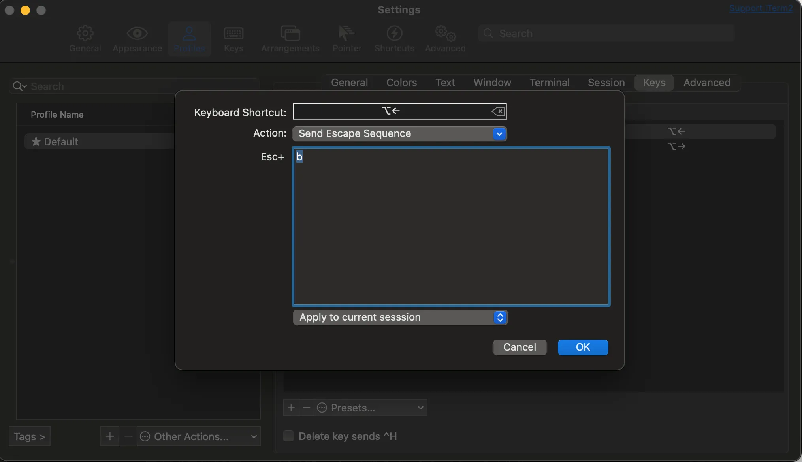
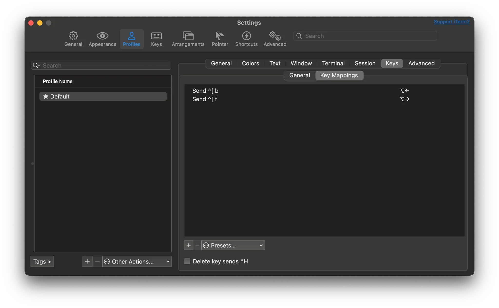

# 1. Overview

When using a terminal in a Linux environment, the Alt key combined with the arrow keys (←, →) lets you move word by word — a feature that's enabled by default and very convenient. However, on the Mac's iTerm2, this feature isn't set up by default; instead, pressing those keys just displays values like `^[D` or `^[C`.

```bash
> helm upgrade --install asynqmon . -f values-dev.yaml -n dev [D[D[C[C
```

In this post, I'll show you how to map the Alt key in iTerm2 so you can use this feature on a Mac as well.

# 2. How to Set Up Alt Key Mapping in iTerm2

In `Settings` > `Profiles` > `Keys` > `Key Mappings`, add new mappings as shown below.

- `⌥←` :
  - Action: select `Send Escape Sequence`
  - Esc +: enter the value `b`
- `⌥→` :
  - Action: select `Send Escape Sequence`
  - Esc +: enter the value `f`




In the end, you just need to add the two key mappings shown below.



# 3. References

- [Making the Alt Key Work in iTerm2](https://www.clairecodes.com/blog/2018-10-15-making-the-alt-key-work-in-iterm2/)
