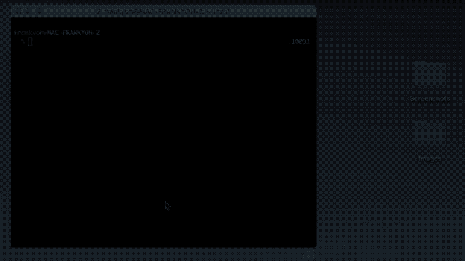
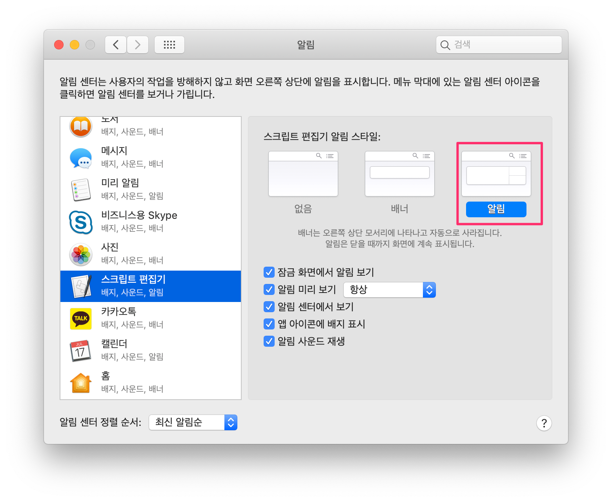
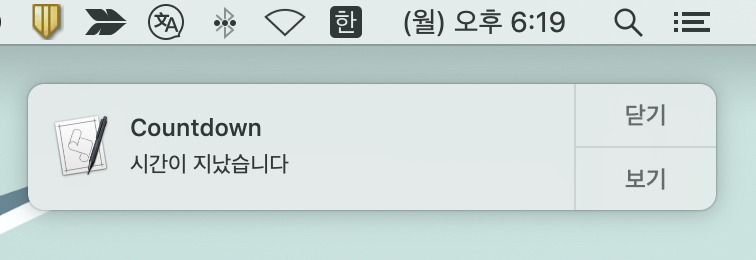

# 1. Introduction

When I open my laptop to start studying or writing a blog post, the first place I go is usually internet news or YouTube videos rather than the actual studying or writing. And after watching for about 30 minutes, I tell myself "okay, time to start" and open Evernote.

Then, when I try to focus and get started, even after about 10 minutes I catch myself watching news or YouTube videos again. Study a bit, watch the news, repeat — and before I know it several hours have flown by. Maybe that's why writing one blog post a week never quite works out.

While reading PD Min-sik Kim's book *Have You Memorized an Entire English Book?*, I learned about the Pomodoro technique and decided to try applying it.

It's one of the time-management techniques mentioned in various books and online. The [Pomodoro technique](https://ko.wikipedia.org/wiki/%EB%BD%80%EB%AA%A8%EB%8F%84%EB%A1%9C_%EA%B8%B0%EB%B2%95) was proposed by Francesco Cirillo and uses a timer to focus on work for 25 minutes, followed by a 5-minute break.

There are plenty of related apps in the App Store and on phones, but I just wrote a shell script that's easy to run from the Mac terminal. And after 25 minutes pass, I wrote the script so that it shows a popup notification on the Mac and plays a sound effect as well.

# 2. Demo Screen

This is the screen where a popup runs after a 1-minute countdown.



# 3. Writing the Script and Configuring System Notifications

I worked in a Mac environment and used the zsh shell.

## 3.1 Editing the Shell Configuration File

Open your shell configuration file in a text editor, add the function below, and save.

```bash
$ code ~/.zshrc
```

[https://gist.github.com/kenshin579/1b8dc3d9db35b6fee534569ec128e62b](https://gist.github.com/kenshin579/1b8dc3d9db35b6fee534569ec128e62b)

To reload the modified shell configuration file in your current shell, reload it with the source command.

```bash
$ source ~/.zshrc
```

## 3.2 Copying the Sound File to the Library Folder

Copy the sound file to the user Library folder.

```bash
$ cp Clock-chimes.mp3 ~\_Library_Sounds
```

<a href='Clock-chimes.mp3'>Clock-chimes.mp3</a>

# 4. Configuring System Notifications

If you don't configure the notification separately, the default is the **banner notification style**, so the notification appears and then disappears automatically. As a result, if you're looking at another screen, you often won't even notice that a notification appeared. It's better to change it to a notification style that doesn't disappear automatically and requires you to click the close button.

Go to System Preferences > Notifications > select Script Editor, and change the notification style as shown below.



## 4.1 Running It

If you enter 1, a 1-minute countdown starts, and after 1 minute passes a popup window appears as shown below.

```bash
$ countdown 1
```



# 5. References

- Display Notification from Mac \* [https://code-maven.com/display-notification-from-the-mac-command-line](https://code-maven.com/display-notification-from-the-mac-command-line)
