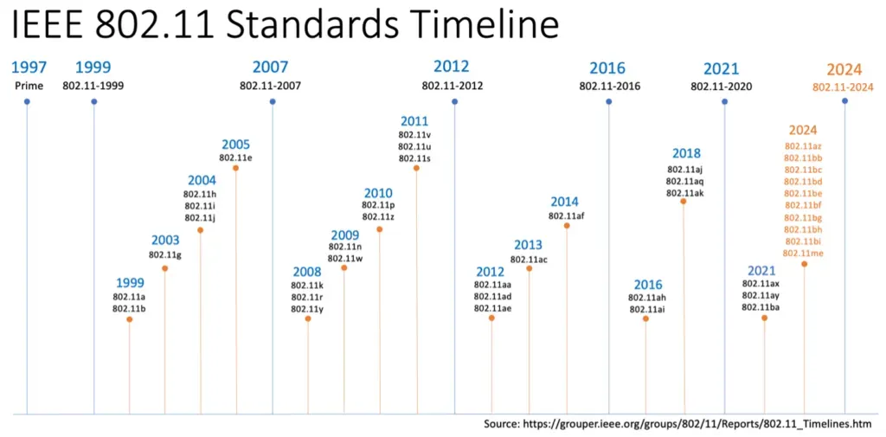
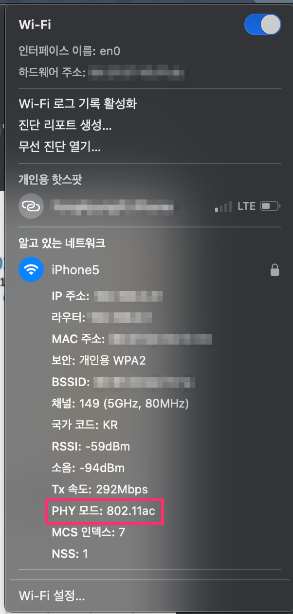
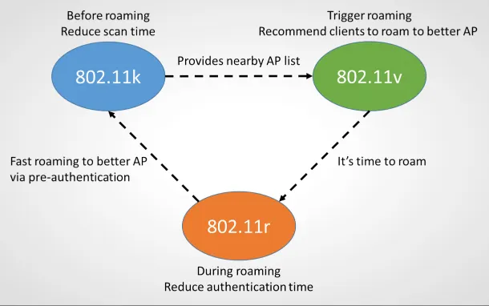
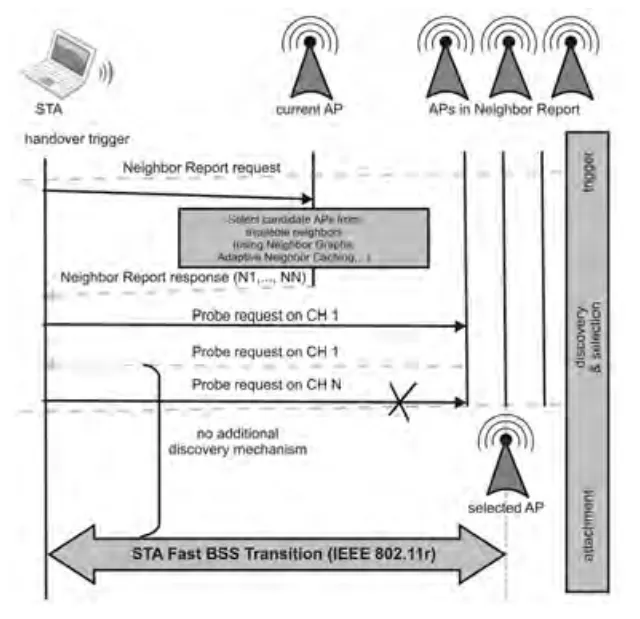
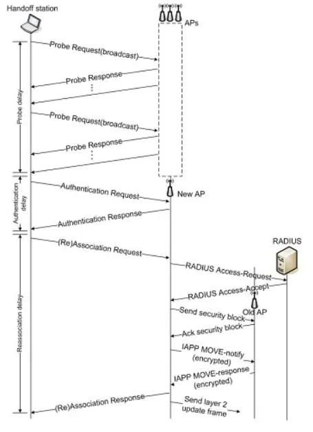
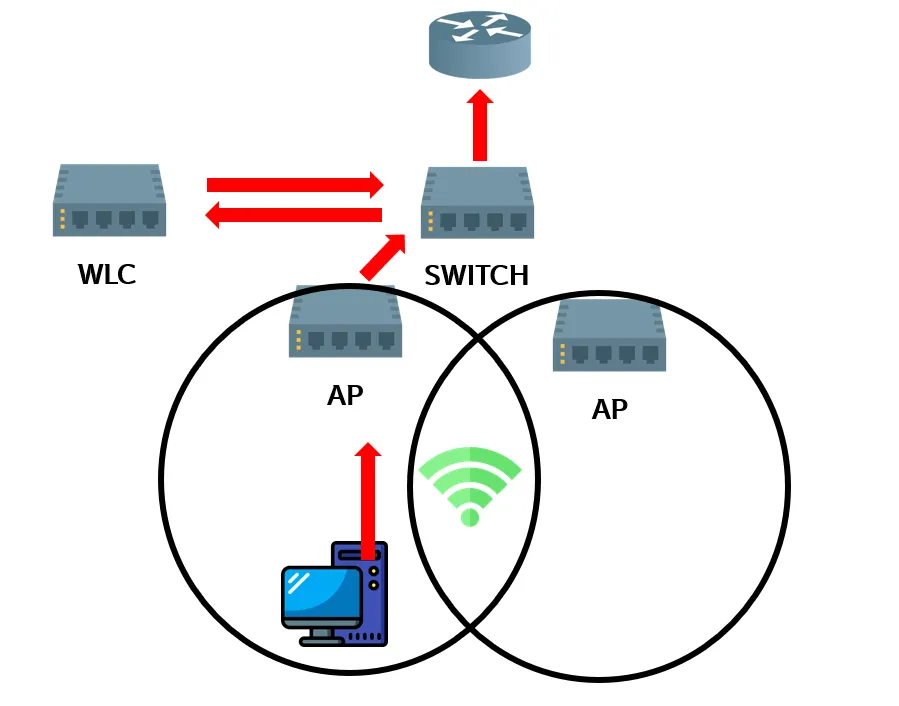
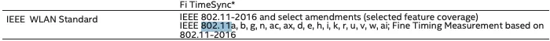
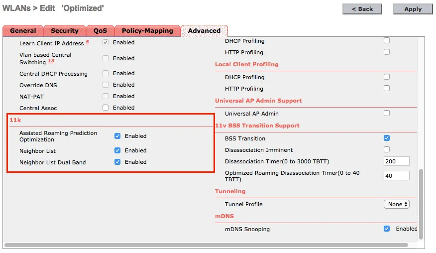

# 1. 개요

# 1.1 IEEE 802.11

오늘날 우리가 와이파이(Wi-Fi)라고 부르는 무선 근거리 통신망(WLAN)의 기반이 되는 국제 표준이다.

- 정의
  - IEEE (국제 전기전자 기술자 협회) 802 위원회의 11번째 워킹 그룹에서 개발한 무선 통신 규격들의 집합이다
- 목적
  - 무선 장치들이 케이블 없이 서로 통신하고 인터넷에 접속할 수 있도록 물리 계층(PHY) 및 매체 접근 제어(MAC) 프로토콜을 정의한다
- 주파수 대역
  - 주로 2.4GHz 및 5GHz 주파수 대역을 사용하며, 최신 표준은 6GHz 대역까지 활용한다
- Wi-Fi와의 관계
  - 와이파이 얼라이언스(Wi-Fi Alliance)는 802.11 표준을 준수하는 제품에 대한 상호 운용성 인증을 제공하며, 'Wi-Fi'는 이 인증을 받은 제품에 사용되는 브랜드 이름이다



- [802.11 Amendments – The “Alphabet Soup”](https://wifivitae.com/2021/11/30/80211-soup/)

## 주요 802.11 표준 (물리) 및 특징

아래 표는 Wi-Fi 기술이 세대를 거치며 어떻게 발전해 왔는지를 한눈에 보여준다.

속도와 주파수 대역, 핵심 기능의 변화 흐름을 통해 각 표준의 특징과 진화 방향을 쉽게 이해할 수 있다.

| **Wi-Fi 세대** | **IEEE 표준** | **출시 연도** | **주파수 대역**  | **최대 이론 속도** | **주요 특징**                      |
| -------------- | ------------- | ------------- | ---------------- | ------------------ | ---------------------------------- |
| Wi-Fi 1        | 802.11b       | 1999          | 2.4GHz           | 11 Mbps            | 최초의 널리 사용된 표준            |
| Wi-Fi 2        | 802.11a       | 1999          | 5GHz             | 54 Mbps            | 5GHz 대역 도입                     |
| Wi-Fi 3        | 802.11g       | 2003          | 2.4GHz           | 54 Mbps            | 2.4GHz에서 속도 향상               |
| Wi-Fi 4        | 802.11n       | 2009          | 2.4GHz/5GHz      | 600 Mbps           | MIMO 기술, 듀얼 밴드 지원          |
| Wi-Fi 5        | 802.11ac      | 2013          | 5GHz             | 3.5 Gbps           | 기가비트 속도, 5GHz 전용           |
| Wi-Fi 6        | 802.11ax      | 2019          | 2.4GHz/5GHz      | 약 9.6 Gbps        | OFDMA, 고효율, 다중 기기 성능 향상 |
| Wi-Fi 6E       | 802.11ax      | 2021          | 2.4GHz/5GHz/6GHz | 약 9.6 Gbps        | 6GHz 대역 추가 지원                |
| Wi-Fi 7        | 802.11be      | 2024 (예정)   | 2.4GHz/5GHz/6GHz | 최대 40 Gbps       | 초고속, 더 넓은 채널 대역폭        |

> 집에서 사용하는 Wi-Fi 모델은?
> 802.11ac 표준을 사용하고 있음
>
> 맥에서는 `Opt` 누른 상태에서 Wifi 클릭하면 상세한 정보를 볼 수 있다



지난 시간에 살펴본 `802.11r`과 함께 같은 해에 발표된 `802.11k` 표준도 알아본다.



참고: [Roaming in 802.11k/v/r Wi-Fi](https://interline.pl/Information-and-Tips/Roaming-802.11k-v-r-Wi-Fi)

# 2. 802.11k (AP Assisted Roaming)

`802.11k`는 모바일 기기가 더 나은 신호의 인접 `AP`를 쉽게 찾도록 돕는 무선 자원 측정(Radio Resource Measurement) 표준이다. 이 표준 덕분에 기기는 주변 `AP` 목록을 미리 알 수 있어, 기존 방식보다 빠르게 최적의 `AP`로 로밍(roaming)할 수 있다. 즉, `802.11k`는 기기가 `AP`를 더 효율적으로 선택하게 하여 Wi-Fi 성능과 안정성을 향상시킨다.

- **목적**
  - 주요 목적은 클라이언트가 최적의 `AP`(액세스 포인트)를 찾기 위해 비효율적인 스캔 과정을 거치지 않도록 하여, 로밍에 걸리는 시간과 배터리 소모를 줄이는 것이다
- **주요 기능 및 이점**
  - 인접 `AP` 정보 제공
    - 일반적으로 클라이언트는 신호 세기가 약해지면 사용 가능한 모든 채널을 스캔하여 새 `AP`를 찾는다. `802.11k`를 지원하는 `AP`는 클라이언트 요청 시 주변 `AP` 목록과 해당 `AP`의 신호 강도, 채널 사용량, 트래픽 부하 등의 정보를 포함하는 인접 보고서(Neighbor Report/List)를 제공한다
  - **빠른 스캔 및 효율적인 로밍**
    - 클라이언트는 전체 채널을 스캔할 필요 없이 제공된 목록 내에서만 스캔하면 되므로, 다음 `AP`로 전환하는 데 걸리는 시간이 크게 단축된다
  - **부하 분산**
    - 신호가 가장 강한 `AP`에 클라이언트가 집중되는 것을 방지하고, 네트워크 부하가 적은 다른 `AP`로 연결을 유도하여 네트워크 효율성을 개선한다
  - **전력 소비 감소**
    - 불필요한 전체 채널 스캔 과정이 줄어들어 모바일 장치의 배터리 수명을 절약하는 데 도움이 된다
- 단점
  - 네트워크 오버헤드 (경미함)
    - `802.11k`는 클라이언트와 `AP` 간에 추가적인 관리 메시지(인접 보고서 요청 및 응답)를 주고받는다. 이 오버헤드는 일반적으로 미미하지만, 극도로 혼잡한 환경에서는 고려 사항이 될 수 있다
  - 호환성 문제 (클라이언트 및 `AP` 모두 요구)
    - `802.11k`는 `AP`와 클라이언트 장치(스마트폰, 노트북 등) 양쪽 모두 이 표준을 지원해야만 작동한다

# 2.1 작동 방식



참고: https://www.researchgate.net/figure/The-Handover-Concept-using-IEEE-80211k-with-neighbor-reports-Figure-10-shows-the-concept_fig9_221922887

`802.11k`는 `AP`와 클라이언트 장치 간에 주변 무선 환경에 대한 정보를 공유함으로써 작동한다. 주요 단계는 다음과 같다.

1. 로밍 트리거 되는 시점
   - 클라이언트의 신호 강도가 특정 Threshold 이하(연결된 `AP`로부터 멀어지는 경우)로 떨어지면 현재 연결이 불안정하다고 판단하고 능동적으로 로밍을 준비한다
   - 현재 연결된 `AP`는 트래픽이 과도하게 집중될 경우, 연결된 장치를 다른 `AP`로 유도할 수 있다
2. **인접 `AP` 목록 요청 (Neighbor Request)**
   - 클라이언트는 현재 신호 강도가 약해지거나 로밍이 필요한 시점에 현재 `AP`에 인접한 `AP` 목록을 요청한다
3. **보고서 제공**
   - `AP`는 요청에 응답하여 신호 품질, 사용 가능한 리소스, 채널 사용률 등 주변 `AP`에 대한 상세 정보가 포함된 인접 보고서(Neighbor Report)를 제공한다
4. **최적의 `AP` 선택**
   - 클라이언트는 이 보고서를 기반으로 전체 채널을 일일이 검색할 필요 없이(이는 시간이 많이 걸리고 배터리를 소모시킴) 다음에 연결할 최적의 `AP`를 신속하게 결정한다
5. **신속한 로밍**
   - 클라이언트는 최적의 `AP` 정보를 미리 알기 때문에 로밍 대기 시간이 줄어들고, VoIP 통화와 같이 지연 시간에 민감한 애플리케이션의 연결 품질이 향상된다

## 참고: 핸드오버 절차



참고: [IEEE 802.11 스펙 및 핸드오버 절차](https://blog.naver.com/pmj0403/103618382)

`STA`가 새로운 `AP`로 이동할 때 이루어지는 절차는 다음과 같다.

1. `AP` 탐색 (Scanning 단계)

`STA`는 더 나은 `AP`로 이동하기 위해 주변 `AP` 정보를 먼저 모아야 한다.

`AP` 탐색 과정

- `STA`는 Probe Request를 보내 `AP`가 존재하는지 능동적으로 탐색
- `AP`는 Probe Response로 응답하여 다음 정보를 제공
  - 지원속도, SSID, 채널 정보, 보안 설정
- 스캔 결과를 기반으로 후보 `AP` 리스트를 구성 (802.11k 전 방식)
  - **`Active`** vs **`Passive`** Scanning - 참고: 용어 섹션

1. 인증 (Authentication)

`STA`가 `AP`에게 접속해도 되는 사용자임을 판단하는 단계이다.

- `STA` → `AP`: Authentication Request 보냄
- `AP` → `STA`: Authentication Response (허가 또는 거부)
- Enterprise 환경인 경우 RADIUS 서버에서 추가 인증 수행 가능
- 인증 성공 시만 다음 단계(Association)로 진행됨

1. 연동 (Association) - `AP`와 실제 연결 관계를 수립하는 단계

`STA`가 선택한 `AP`와 실제 데이터 송수신이 가능한 연결을 설정하는 단계이다.

- `STA` → `AP`: Association Request 보냄
  - SSID
  - 지원 속도
  - 보안 설정
  - 필요 기능(예: 11k/11r 지원 여부 포함) 전달
- `AP` → `STA`: Association Response
  - 연결 허가 시: `AP`가 `STA`에게 AID(Association ID) 발급
  - 필요 자원 할당 및 시간 동기화
- `AP`는 내부적으로
  - 해당 `STA`를 무선 컨트롤러(WLC) 또는 AAA 서버와 동기화
  - 이전 `AP`에게 IAPP 등을 통해 `STA` 이동 알림 가능

1. 새로운 `AP`와 연결 완료

- `STA`는 새로운 `AP`에 완전히 연결되고 정상 통신을 시작할 수 있게 된다

참고: [IEEE 802.11 스펙 및 핸드오버 절차](https://blog.naver.com/pmj0403/103618382)

> 누가 Neighbor List를 만들어주는가?

## 2.1.1 `WLC` - 중앙 집중식 네트워크 관리 시스템

대부분의 기업 또는 대규모 Wi-Fi 환경에서는 `AP`들이 중앙의 **무선 컨트롤러(Wireless LAN Controller, `WLC`)** 시스템에 의해 관리된다.



참고: https://404notonc.tistory.com/153

`WLC`(Wireless LAN Controller) 설정에서 802.11k 기능을 활성화하면, `AP`와 `WLC`는 효율적인 인접 보고서(Neighbor List) 생성을 위해 협력하게 된다. 

> 이 과정은 주기적인 정보 교환과 클라이언트 요청 시의 동적 생성이 결합된 하이브리드 방식으로 작동하며, 구체적인 구현 방식은 네트워크 장비 제조사(Cisco, Aruba, Juniper 등)마다 약간의 차이가 있을 수 있다고 함

**1. 주기적인 정보 교환 (Neighbor 캐싱)**

네트워크 효율성을 위해, `AP`들은 완전히 새로운 목록을 매번 즉시 생성하는 대신, 필요한 정보를 미리 수집한다.

- `AP`의 측정 및 보고
  - `802.11k`가 활성화되면, 개별 `AP`는 주기적으로 주변 채널을 스캔하고 인접 `AP`들의 신호 강도, 채널 정보, BSSID 등의 정보를 측정한다
- `WLC`로 정보 전송
  - `AP`는 이 측정 결과를 `WLC`로 보고한다
- `WLC`의 Neighbor Database 구축
  - `WLC`는 네트워크에 연결된 모든 `AP`로부터 수신한 정보를 취합하여 중앙 집중식 인접 `AP` 데이터베이스(Neighbor Database) 또는 캐시를 구축한다

**2. 클라이언트 요청 시의 응답 (동적 생성 및 조회)**

실제 클라이언트가 로밍을 필요로 할 때, `WLC`는 캐시된 정보를 활용하여 신속하게 응답한다.

- 클라이언트의 Neighbor Request
  - 클라이언트에서 로밍을 위해 `802.11k` 인접 요청 메시지(Neighbor Request)를 현재 연결된 `AP`로 보낸다
- `WLC`의 응답 생성
  - 요청을 받은 `AP`는 이 요청을 `WLC`로 전달한다
  - `WLC`는 앞서 구축해둔 데이터베이스(캐시)를 조회하여, 해당 클라이언트의 위치와 현재 상태를 고려한 최적화된 인접 `AP` 목록을 동적으로 생성한다
- 클라이언트에게 전달
  - `WLC`는 이 목록(Neighbor Report)을 다시 `AP`를 통해 클라이언트에게 전달한다

참고

- [Chapter 11 - 802.11r, 802.11k, 802.11v, 802.11w Fast Transition Roaming](https://www.cisco.com/c/dam/en/us/td/docs/wireless/controller/technotes/8-5/cisco-enterprise-mobility-design-guide-8-5.pdf#pgfId-1140097)
- [시스코 무선 네트워크 아키텍처](https://blog.naver.com/eqelizer/20156516291)
- [Adaptive Neighbor Caching for Fast BSS Transition Using IEEE 802.11k Neighbor Report](https://ieeexplore.ieee.org/document/4725167)

> Neighbor Report에 들어가는 정보
>
> | 정보 항목                           | 설명                                                         |
> | ----------------------------------- | ------------------------------------------------------------ |
> | **BSSID**                           | 이웃 `AP`의 고유 MAC 주소                                      |
> | **채널 정보 (Channel Information)** | 이웃 `AP`가 현재 사용 중인 무선 채널 정보                      |
> | **수신 신호 강도 표시 (RSSI)**      | 클라이언트 장치에서 측정한 이웃 `AP`의 신호 강도               |
> | **운영 클래스 및 PHY 유형**         | `AP`의 작동 주파수 대역(예: 2.4GHz, 5GHz, 6GHz) 및 지원되는 물리 계층(PHY) 유형(예: 802.11n, 802.11ac, 802.11ax)과 같은 운영 세부 정보 |
> | 기능 정보                           | `AP`가 지원하는 기능(예: 보안 방식, 로밍 지원 프로토콜 등)을 나타내는 정보 요소(IE)가 포함 |

# 2.3 성능 비교

> 찾지 못함

# 3. 802.11k 설정해서 사용하는 방법

- `AP`와 Client에서 802.11k를 지원해야 사용할 수 있다
  - `AP`에서 지원하더라도 `WLC` 관리자 웹 UI에서 활성화시켜줘야 한다
  - Client Wi-Fi 장치에서 802.11k를 지원하면 추가 활성화 없이 `AP`에서 이 기능이 활성화되어 있음을 감지하고 자동으로 해당 기능을 사용한다

# 3.1  클라이언트 Wi-Fi device 에서도 802.11k 지원을 하나?

```bash
> sudo lspci -k | grep -A3 -i network
[sudo] password for around:
02:00.0 Ethernet controller: Intel Corporation I211 Gigabit Network Connection (rev 03)
	Subsystem: Intel Corporation I211 Gigabit Network Connection
	Kernel driver in use: igb
	Kernel modules: igb
03:00.0 Ethernet controller: Intel Corporation I211 Gigabit Network Connection (rev 03)
	Subsystem: Intel Corporation I211 Gigabit Network Connection
	Kernel driver in use: igb
	Kernel modules: igb
04:00.0 Network controller: Intel Corporation Wi-Fi 6 AX200 (rev 1a)
	Subsystem: Intel Corporation Wi-Fi 6 AX200
	Kernel driver in use: iwlwifi
	Kernel modules: iwlwifi
```

- 스펙 문서에서 확인하기 - Intel AX200은 지원을 하고 있음
  - 참고: [Intel Wi-Fi 6 AX200 Module](https://www.mouser.com/pdfDocs/wi-fi-6-ax200-module-brief.pdf?srsltid=AfmBOoqxpUZORCd39TcN0BdUdTdOjvJhT4Om7rkgxgqLIFDLAkJGvt1b)



- 명령어로 확인하는 방법

```bash
# iw 명령어는 linux 에서 무선 장치를 구성하고 정보를 표시해주는 명령어
# phy 기능 정보
> iw phy | grep RRM
     * [ RRM ]: RRM
# RRM은 Radio Resource Management의 약자로 802.11k 표준이 포함된 기능을 지원한다는 의미
```

# 3.2 `AP`에서는 802.11k 지원을 하나?

- `AP`에서 지원을 해야 하고 관리자 어드민 UI에서 활성화를 시켜줘야 한다
  - Assisted Roaming Prediction Optimization (로밍 예측 최적화): 802.11k 지원하지 않는 클라이언트를 위한 기능



- Network capture해서 확인하는 방법
  - [Wireshark: How to check If A Wi-Fi Network Supports 802.11k](https://semfionetworks.com/blog/wireshark-how-to-check-if-a-wi-fi-network-supports-80211k/)
  
    


# 4. FAQ

## 4.1 여러 Wifi 로밍을 동시에 설정해서 사용해도 되나?

- 실제 기업/산업용 Wifi 대부분은 각 역할이 다르고 상호 보완이라서 동시에 설정해서 사용하고 있다고 함

## 4.2 드론 행사에서는 어떤 네트워크를 사용하나?

- 드론 쇼 행사에서는 **Wi-Fi를 주 네트워크로 사용**하지만, 안정성과 대역폭 문제로 **mesh 네트워크, 전용 RF(라디오 주파수), 또는 다중 라디오 조합**을 병행한다
  - **Wi-Fi 기반 (주요)**:
    - 5GHz 대역 고성능 `AP`(예: Ubiquiti XG `AP` 100-150대 지원)로 지상국-GCS(지상 제어 시스템)와 드론 간 텔레메트리/명령 전송
    - 2.4GHz는 간섭 많아 제한적 사용
  - **Mesh 네트워크**
    - 드론 간 P2P 통신으로 중앙 지상국 의존도 ↓, 충돌 회피/동기화 강화
    - 에지 컴퓨팅으로 로컬 의사결정
  - **전용 RF + 다중 라디오**
    - Wi-Fi 외 900MHz/2.4GHz 전용 무선 모듈 동시 사용
    - 쇼 파일 전체를 사전 업로드해 오프라인 비행 가능(실시간 제어 최소화)
  - **백업/중복**: GNSS/RTK 위치 + 5G(최신 트렌드)로 지연 0ms 동기화

## 4.3 PSK, PMK, PTK 여러 용어가 헷갈리고 실제 인증, 로밍 인증 흐름에서 어떻게 사용되고 있는지?

- 로봇(클라이언트) ↔ `AP` ↔ 인증 서버(RADIUS) 과정에서 어떤 키가 어떻게 만들어지고 전달되는지 그리고 로밍 시 어떤 키를 재사용하는지를 한눈에 보여주는 다이어그램

  1. WPA2-PSK 와 WPA2-Enterprise(EAP) 공통 구조도

  ```bash
  ┌────────────────────────────┐
  │        로봇 (Client)       │
  └────────────────────────────┘
              │
              │ ① PSK 입력 또는 EAP 인증
              ▼
      PSK (비밀번호)  →  PMK 생성
      EAP-TLS/EAP-PEAP → PMK 생성
              │
              ▼
  ┌────────────────────────────┐
  │   PMK (Pairwise Master Key)│  ← 로밍 시 재사용되는 핵심 키
  └────────────────────────────┘
              │
              │ ② AP와 4-Way Handshake
              ▼
    PTK (Pairwise Transient Key) 생성
    GTK (Group Temporal Key) 수신
              │
              ▼
  ─────────── Wi-Fi 연결 완료 ───────────
              │
              │ ③ 로봇이 이동 → 다른 AP로 전환 필요
              ▼
  ```

  1. 802.11r(FT) Fast Roaming 구조도

  - 802.11r 환경을 구성하면 로봇이 **`AP` 간 로밍할 때 PMK를 다시 만들 필요가 없음** → 매우 빠른 전환

  ```bash
                     (컨트롤러/CAPWAP or AP 간 직접 공유)
         ┌──────────────────────────────────────────┐
         │          PMK-R0 (루트 키)                │
         └──────────────────────────────────────────┘
                             │
               ┌─────────────┴─────────────┐
               ▼                           ▼
  ┌─────────────────────┐       ┌─────────────────────┐
  │ AP1 (R0KH / R1KH)   │       │ AP2 (R0KH / R1KH)   │
  └─────────────────────┘       └─────────────────────┘
               │                           │
               │  로봇 이동                 │
               │───────────────▶───────────│
               ▼                           ▼
  
   로봇이 AP1 연결 중                        로봇이 AP2로 로밍
   ───────────────────                        ───────────────────
  
  1) PMK-R0에서 AP1용 PMK-R1 생성       1) PMK-R0에서 AP2용 PMK-R1 생성
  2) PMK-R1에서 PTK 생성               2) PMK-R1에서 PTK 생성 (새로운)
  3) 연결 유지                         3) 매우 빠르게 연결 재완료 (ms 단위)
  ```

  1. 전체 흐름을 한 번에 보는 통합 다이어그램

  아래는 PSK/EAP → PMK → PTK → FT 로밍까지 전체 과정을 한눈에 보는 그림이다

  ```bash
                                    ┌────────────────────────────┐
                                    │       인증 서버(EAP)       │
                                    │      (RADIUS / 802.1X)      │
                                    └────────────────────────────┘
                                     ▲             │
                                     │EAP 메시지   │ PMK 전달 (Enterprise)
                                     │             ▼
        ┌────────────────────────────┐       ┌────────────────────────────┐
        │         로봇(Client)       │       │     AP1 (R0KH / R1KH)      │
        └────────────────────────────┘       └────────────────────────────┘
              │                                     │
              │1) PSK or EAP 인증                   │
              ▼                                     │
        PMK 생성  ◀──────────────────────────────────┘
              │
              │2) 4-Way Handshake (AP1)
              ▼
          PTK 생성
              │
  ────────── 연결 성공 ──────────
              │
              │3) 로봇 이동 → AP2 신호가 더 좋음
              ▼
        ┌────────────────────────────┐
        │     AP2 (R0KH / R1KH)      │
        └────────────────────────────┘
              ▲
              │4) 802.11r FT 로밍 요청
              │   (PMK-R1 재활용)
              ▼
        새로운 PTK 생성 (빠른 재연결)
  ────────── 로밍 완료 (ms 단위) ──────────
  ```

## 4.4 무선 네트워크 패킷은 어떻게 캡처할 수 있나?

- https://www.cisco.com/c/ko_kr/support/docs/wireless-mobility/wireless-mobility/217042-collect-packet-captures-over-the-air-on.html

# 5. 용어

## 5.1 Wi-Fi 로밍이란?

- Wi-Fi 로밍은 이동 기기가 더 강한 `AP`로 자동으로 전환하는 기술이며, 802.11r/k/v를 활성화하면 전환 속도와 안정성을 크게 향상시킬 수 있다
- `802.11r` (Fast BSS Transition: 빠른 `AP` 이동)
  - FT Wi-Fi 클라이언트가 `AP` 간 로밍 시 기존 인증 절차를 반복하지 않고 Handshake 과정을 최적화하여서 빠르게 재연결하는 기능이다
  - Fast BSS Transition으로 인증 과정 생략, handover 시간 50ms 이내 단축. k/v 정보 기반 빠른 전환
- `802.11k` (Radio Resource Measurement)
  - 주변 `AP` 정보(이웃 보고서) 제공으로 로봇이 스캔 없이 최적 `AP` 후보 파악. 자동으로 `802.11v` 활성화 유발
- `802.11v` (Wireless Network Management)
  - BSS 전환 관리로 네트워크가 로봇에게 "더 나은 `AP`로 이동하라" 지시. 부하 분산과 로밍 트리거 최적화.

| **기능**  | **802.11r (Fast BSS Transition)** | **802.11k (Radio Resource Measurement)** | **802.11v (Wireless Network Management)** |
| --------- | --------------------------------- | ---------------------------------------- | ----------------------------------------- |
| 주요 목적 | 빠른 로밍 (인증 생략)             | 주변 `AP` 정보 제공 (스캔 최적화)          | BSS 전환 관리 및 부하 분산                |
| 작동 단계 | Handover 실행 시                  | 연결 전/후 이웃 보고서 수집              | 연결 유지 중 네트워크 최적화 제안         |
| 핵심 기능 | - OKC (Opportunistic Key Caching) |                                          |                                           |

- 인증 시간 50ms 단축 | - Neighbor Report
- 채널/신호 세기 정보
- 스캔 시간 90% ↓ | - BSS Transition Management
- "더 나은 `AP`로 이동" 요청
- 부하 균형 | | 로봇 효과 | Ping-pong handover ↓ | 불필요 스캔 ↓, 배터리 절약 | 과부하 `AP` 탈출, 안정적 연결 유지 | | 필수 조건 | 동일 Mobility Domain (MDID) | `AP` 간 이웃 테이블 설정 | 클라이언트 동의 필요 (일부 거부 가능) | | 호환성 | iOS/Android 대부분 지원 | 광범위 지원 (legacy 포함) | 최신 기기 위주, 일부 제한 |

## 5.2 무선 신호 관련 용어

- `RSSI` (Received Signal Strength Indicator)

  - 수신 신호 강도
  - 값이 **0에 가까울수록 강하고**, **90dBm 이하**는 매우 약한 신호
  - 로봇이 `AP`와 얼마나 멀리 있는지 판단할 때 사용

- `SNR` (Signal-to-Noise Ratio)

  - **신호 대비 잡음의 비율**

  - `SNR`이 높을수록 더 안정적 (예: 30dB 이상이면 좋음)

  - 예:

    - `RSSI` = -60 dBm

    - `Noise` = -90 dBm

      → `SNR` = 30 dB (좋음)

  - `RSSI`는 신호 자체, `SNR`은 신호의 질(노이즈 대비)

## 5.3 Wi-Fi 암호화/키 관련 용어

- `PSK` (Pre-Shared Key)
  - 공유된 비밀번호(= 우리가 입력하는 Wi-Fi 패스워드)
  - WPA/WPA2-Personal 모드에서 사용
- `PMK` (Pairwise Master Key)
  - PSK 또는 EAP 인증 과정에서 생성되는 상위 키
    - 실제 Wi-Fi 통신 암호화에 사용되는 핵심 키는 PMK
    - PSK(비밀번호)에서 파생됨 (HMAC-SHA1 사용)
  - 로밍의 핵심: PMK는 `AP` 간에 공유 가능
    - WPA/WPA2/LATER 보안 모드에서 클라이언트가 `AP`에 접속할 때 생성되는 마스터 키이다
  - **비밀번호(PSK) → 암호화용 마스터키(PMK) 생성 → 실제 통신 암호화 수행**
- `PMK` caching (또는 PMKID)
  - PMK 캐싱(PMK Caching) 또는 PMKID 캐싱 방식은, 클라이언트가 처음 `AP`에 인증/연결한 후 생성된 PMK 또는 PMKID를 기억 또는 네트워크에 저장해두고, 다른 `AP`로 로밍할 때 전체 인증 절차를 다시 하지 않아도 되는 방식이다
- `PTK` (Pairwise Transient Key)
  - PMK에서 파생된 실제 데이터 암호화 키

## 5.4 Wi-Fi 인증 관련 용어

- `EAP` (Extensible Authentication Protocol) - 인증(로그인) 방식의 프레임워크

  - `WPA`에서 ‘사용자 인증’을 수행하기 위한 여러 방식의 모음이다

    - 즉, `WPA`에서 인증을 어떻게 처리할지 결정하는 하위 프로토콜이다

  - 기업/학교 Wi-Fi에서 쓰는 **고급 인증 프로토콜**

  - 예를 들면 다음 방식들이 EAP 기반:

    - EAP-TLS (가장 강력함, 공개키 인증서 기반)

    - PEAP (비밀번호 기반 + TLS 터널 내부 인증)

    - EAP-TTLS (TLS 터널 내부에서 여러 인증 방식 지원)

      | **항목**         | **EAP-TLS**                | **PEAP**            | **EAP-TTLS**              |
      | ---------------- | -------------------------- | ------------------- | ------------------------- |
      | 인증 방식        | **클라이언트+서버 인증서** | TLS 터널 + 비밀번호 | TLS 터널 + 여러 인증 방식 |
      | 보안             | ⭐⭐⭐⭐⭐ 최고                 | ⭐⭐⭐                 | ⭐⭐⭐⭐                      |
      | 인증서 필요      | 클라이언트 + 서버          | 서버만              | 서버만                    |
      | 관리 난이도      | 어려움                     | 쉬움                | 중간                      |
      | 로봇 사용 적합성 | 인증서 관리 가능하면 최고  | 가장 쉬움           | 유연하고 로봇/IoT에 적합  |
      | Windows 지원     | 매우 좋음                  | 매우 좋음           | 제한적                    |

  - WPA2-Enterprise 환경에서 사용되는 인증 방식

## 5.5 보안 프로토콜

- `WPA` (Wi-Fi Protected Access: Wi-Fi 암호화 표준 / 보안 규격 전체)

  - `WPA`는 Wi-Fi 네트워크를 어떤 방식으로 보호할지 정한 전체 보안 규격으로 Wifi 보안의 전체 틀이다

  - 즉, `WPA`는 이런 것들을 정의한다:

    - **어떤 암호화 알고리즘을 사용할까?** (TKIP? AES?)
    - **어떻게 인증할까?** (비밀번호? 인증 서버?)
    - **키 관리는 어떻게 할까?** (4-way handshake)
    - **로밍 지원?** (802.11r)

  - WPA에는 2가지 인증 모드가 있다

    | **WPA 인증 방식**       | **설명**                                  | **용도**        |
    | ----------------------- | ----------------------------------------- | --------------- |
    | **PSK(Pre-Shared Key)** | 집에서 쓰는 "WiFi 비밀번호" 방식 인증       | WPA2-PSK        |
    | **EAP / 802.1X**        | 회사용 인증 서버(RADIUS) 통해 인증 프로토콜 | WPA2-Enterprise |

- 종류:

  - `WPA` → `TKIP` 기반 (옛날 방식)
  - `WPA2` → `AES` 기반 (지금 표준)
    - **WPA2-PSK**(집에서 쓰는 비밀번호 Wi-Fi)
    - **WPA2-Enterprise (802.1X/EAP 기반 회사 Wi-Fi)**
  - WPA3 → 강화된 최신 표준 (SAE 사용)
    - **WPA3-SAE**
    - **WPA3-Enterprise**

- WPA는 "Wi-Fi에서 보안을 어떻게 적용할까"를 정의한 표준 이름이고, PSK/PMK는 그 안에서 실제로 사용하는 암호화 키 개념이다.

## 5.6 BSSID (Basic Service Set Identifier)

- `AP`의 MAC 주소
- SSID는 Wi-Fi 이름, BSSID는 `AP` 장치 ID

## 5.7 SSID (Service Set Identifier)

- 사용자가 자신의 Wi-Fi 네트워크를 식별하고 연결하기 위한 이름
- 단말기에서 Wi-Fi 목록을 볼 때 보이는 것이 SSID 이다

## 5.8 Wi-Fi Band

- 무선 통신에 사용하기 위해 할당된 특정 주파수 범위를 의미하며, 이 주파수 대역에 따라 통신 속도, 도달 거리, 그리고 간섭 수준이 달라진다. 현재 주로 사용되는 밴드는 2.4GHz, 5GHz, 그리고 최신 기술인 6GHz이다

## 5.9 Channel

- 채널은 `AP`가 통신을 위해 사용하는 특정 주파수 대역을 의미한다 (ex. 채널 1, 6, 11 또는 36, 149등)
- 하나의 `AP`는 보통 하나의 채널 또는 두 개의 채널(2.4GHz 대역 하나, 5GHz 대역 하나)을 사용한다

## 5.10 Scanning

- 스캐닝은 장치가 주변의 Wi-Fi `AP`를 찾고 연결할 수 있는 정보를 수집하는 과정을 말한다. 이 과정은 일반적으로 두 가지 방식으로 이루어진다
  - 수동 스캔(Passive Scanning): 클라이언트가 `AP`가 주기적으로 브로드캐스트하는 비콘(Beacon) 프레임을 조용히 수신 대기하여 정보를 얻는 방식이다. 모든 채널을 확인해야 하므로 시간이 오래 걸릴 수 있다
  - 능동 스캔(Active Scanning): 클라이언트가 특정 채널로 프로브 요청(Probe Request) 프레임을 전송하고, `AP`가 이에 대한 프로브 응답(Probe Response) 프레임을 보내는 방식으로 정보를 얻는다. 수동 스캔보다 빠르지만, 여전히 여러 채널을 오가며 스캔하는 과정에서 시간이 소요될 수 있다

## 5.11 WLC (Wireless LAN Controller)

- `WLC`(Wireless LAN Controller) 동작 원리는 중앙 집중 관리가 핵심으로, 여러 `AP`(액세스 포인트)를 하나의 컨트롤러에서 통합 제어하여 SSID, 보안 정책, 채널 등을 일괄 설정하고, 로드밸런싱, RF 최적화, 클라이언트 로밍 및 장애 관리까지 자동화하여 대규모 무선 네트워크를 효율적으로 운영하는 방식이다

  주요 동작 원리

  1. 중앙 집중식 제어
     - 관리자는 개별 `AP`가 아닌 `WLC` 한 대만 설정하면 모든 `AP`에 동일한 SSID, 보안(WPA3, 802.1X 등), 채널 설정 등을 배포한다
  2. `AP` 자동 발견 및 구성: `AP`는 `WLC`와 연결되면 자동적으로 IP를 할당받고, `WLC`로부터 설정 정보를 받아와 구성된다
  3. 제어 및 데이터 분리
     - 제어(Control) 트래픽: `AP`와 `WLC` 간의 설정, 상태 동기화, 인증 정보 등은 `WLC`가 관리한다 (예: CAPWAP 프로토콜).
     - 데이터(Data) 트래픽: 사용자의 실제 데이터(웹 서핑, 파일 전송 등)는 `AP`에서 `WLC`를 거치지 않고 바로 유선 네트워크(스위치/라우터)로 전달될 수도 있어 효율적이다 (컨트롤러 위치에 따라 다름)
  4. RF 및 성능 관리
     - 채널 최적화: 인접 `AP` 간 간섭을 피하기 위해 자동으로 채널을 조정한다
     - 로드밸런싱: 클라이언트가 특정 `AP`에 몰리지 않도록 부하를 분산시킨다
     - 자동 장애 복구: 특정 `AP`에 문제가 생기면 주변 `AP`가 해당 영역을 커버하도록 자동으로 조정한다
  5. 보안 강화: 중앙에서 강력한 보안 프로토콜을 적용하고, 침입 탐지 및 접근 제어 정책을 모든 `AP`에 일괄 적용하여 네트워크 보안을 강화한다

  `WLC`는 `AP`와 통신하며 제어 정보를 주고받고, 클라이언트 장치(노트북, 스마트폰 등)는 `AP`를 통해 `WLC`와 연결된 유선 네트워크로 접속된다

# 6. 참고

- https://wiki.navercorp.com/pages/viewpage.action?pageId=4265685224&spaceKey=RCWG&title=802.11r%2BFast%2BBSS%2BTransition
- https://www.cisco.com/c/ko_kr/support/docs/wireless/catalyst-9800-series-wireless-controllers/221671-understand-802-11r-11k-11v-fast-roams-on.html
- https://www.come-star.com/ko/blog/802-11r-vs-802-11k-vs-802-11v-wifi-roaming-protocols/
- https://en.wikipedia.org/wiki/IEEE_802.11k-2008
- [802.11r, 802.11k, and 802.11w Deployment Guide, Cisco IOS-XE Release 3.3](https://www.cisco.com/c/en/us/td/docs/wireless/controller/technotes/5700/software/release/ios_xe_33/11rkw_DeploymentGuide/b_802point11rkw_deployment_guide_cisco_ios_xe_release33.pdf)
- https://mrncciew.com/2014/09/11/cwsp-802-11k-ap-assisted-roaming/
- https://www.shixuen.com/router/wifi_network_roaming.html
- https://www.slideshare.net/slideshow/mobile-devices-v15-final/32403571?from_search=4

# 7. Appendix

# 7.1 Commands

## 7.1.1 Wi-Fi 디바이스 연결 상태 출력

지금 wlp4s0 인터페이스가 어느 `AP`/SSID에 어떤 상태로 붙어 있는지를 확인할 때 쓰는 상태 조회 명령어이다.

- `wpa_cli`
  - `wpa_supplicant` 용 CLI 프런트엔드 도구
  - 현재 인증 상태, 연결된 SSID, BSSID, IP 할당 전 상태 등 확인 및 재연결, 스캔 같은 작업을 할 수 있다

```bash
sudo wpa_cli -i wlp4s0 status
bssid=##:##:##:##:##:##
freq=5180
ssid=######
id=0
mode=station
wifi_generation=6
pairwise_cipher=CCMP
group_cipher=CCMP
key_mgmt=WPA2-PSK
wpa_state=COMPLETED
ip_address=##.##.##.##
p2p_device_address=##:##:##:##:##:##
address=##:##:##:##:##:##
uuid=6f10a4a1-5f5e-5adb-8dd5-cc6934d05dae
ieee80211ac=1
```
