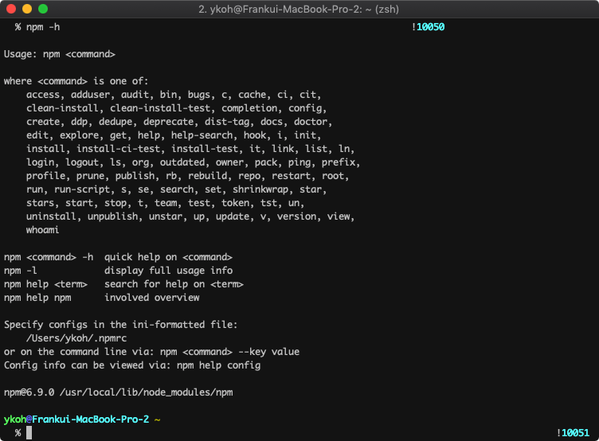
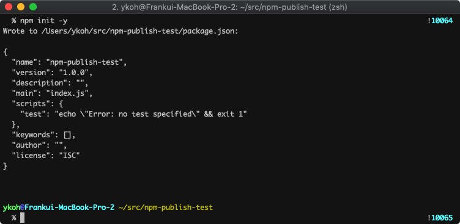
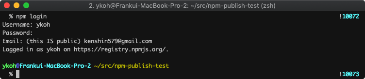
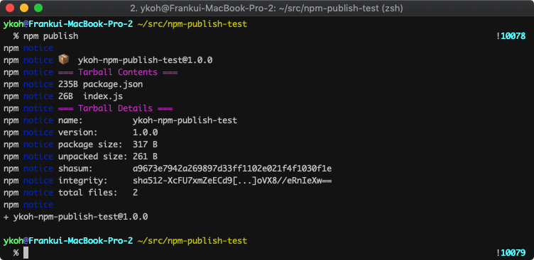
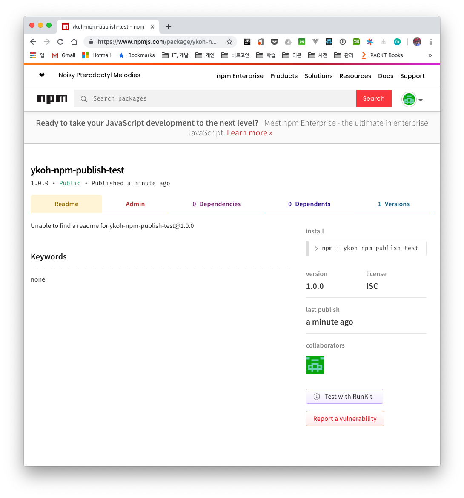
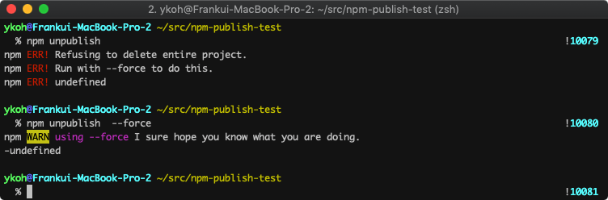

# 1. Introduction

In this post, let's look at how to publish a Node.js module to the NPM registry. NPM stands for Node Package Modules and is a package manager that manages Node.js modules.
With NPM commands, you can easily install Node.js modules to use js libraries, and you can also publish modules you've developed to the registry so that others can use them.

# 2. Publishing to the NPM Registry

Let's walk through the publishing process in a Mac environment.

## 2.1 Installing NPM

The NPM command is installed together when you install Node.js. If Node isn't installed yet, install it with brew.

```bash
$ brew instal nodejs
$ npm -h
```



## 2.2 package.json

You only need a few simple files to publish to the NPM repository. The first one you'll write is package.json. It describes the basic information about the program (e.g. name, version) along with the dependencies the program needs and how to run it.

Using npm's init command with the -y option, you can generate package.json non-interactively with the default settings.

```bash
$ npm init -y
```



Below is the package.json file of [app-timer-pomodoro](https://github.com/kenshin579/app-timer-pomodoro). It contains more than what's set by default, but it's at a level that's easy to understand.

```json
{
  "name": "timer-pomodoro",
  "version": "0.1.1",
  "description": "Simple counting down console pomodoro program.",
  "preferGlobal": true,
  "bin": {
    "timer-pomodoro": "lib/app.js"
  },
  "scripts": {
    "compile": "babel -d lib/ src/",
    "compile:watch": "babel -w -d lib/ src/",
    "coverage": "nyc npm test",
    "coverage:lcov": "nyc npm test && nyc report --reporter=text-lcov | coveralls",
    "lint": "standard --fix",
    "prepublish": "npm run compile",
    "start": "node lib/app.js",
    "test": "mocha --compilers js:babel-core/register",
    "release:patch": "npm run lint && npm run compile && npm version patch && npm publish"
  },
  "repository": {
    "type": "git",
    "url": "git+https://github.com/kenshin579/app-timer-pomodoro.git"
  },
  "keywords": [
      …(omitted)...
    "time management"
  ],
  "author": "Frank Oh <kenshin579@gmail.com>",
  "license": "MIT",
  "bugs": {
    "url": "https://github.com/kenshin579/app-timer-pomodoro/issues"
  },
  "homepage": "https://github.com/kenshin579/app-timer-pomodoro#readme",
  "dependencies": {
    "ascii-numbers": "^1.0.4",
   …(omitted)...
}
```

## 2.3 Source Code

In the simple example generated with npm init, let's create only an index.js source file that prints 'hello world'.

```bash
$ code index.js
> console.log('hello world')

$ node index.js
```

## 2.4 First Publish

To publish to the NPM repository, you need an account on the NPM site, and you can publish after logging in to the site from the command line.

### 2.4.1 Registering a User

If you don't have an account on the NPMJS site, go to the [site](https://www.npmjs.com/) and create an account.

```bash
$ npm login
```



You can also create an account directly via the command line.

```bash
$ npm adduser
```

### 2.4.2 Publishing to the Repository

Publishing a module is simple. Just run the npm publish command in the project folder.

Since npm-publish-test was an already existing project, I changed the name in package.json to ykoh-npm-publish-test and then published again.

```bash
$ npm publish
```



Once it's published without issues, you can check it right away on the NPM site.

[https://www.npmjs.com/package/ykoh-npm-publish-test](https://www.npmjs.com/package/ykoh-npm-publish-test)



## 2.5 Republishing

To republish a module after modifying the code, you need to update the version. Versioning can be updated easily using the npm version command.

If you pass the minor option, it updates the minor number of the version in the package.json file.

```bash
$ npm version minor
```

This updates the patch part of the version.

```bash
$ npm version patch
```

Rather than typing out each command to modify the source, test, bump the version, and publish, you can script the entire publishing process in package.json to make the whole republishing process smoother. Here is the package.json file of app-timer-pomodoro.

```json
"scripts": {
    "compile": "babel -d lib/ src/",
    "lint": "standard --fix",
    "prepublish": "npm run compile",
    "start": "node lib/app.js",
    "test": "mocha --compilers js:babel-core/register",
    "release:patch": "npm run lint && npm run compile && npm test && npm version patch && npm publish"
  }
```

After versioning, just publish again with npm publish.

## 2.6 Removing from the Repository

Even a package you've already published can be removed from the repository with the unpublish command.

```bash
$ npm unpublish
```



## 2.7 Miscellaneous

### 2.7.1 .npmignore

Files or folders listed in the .npmignore file are excluded from publishing. If there is no .npmignore file, the .gitignore file is referenced instead to exclude files from publishing.

Files to exclude include IDE configuration files, test-related files, log files, and so on.

```bash
$ code .npmignore
_~
_.iml
.coveralls.yml
.eslintignore
.eslintrc.json
.idea
.nyc_output
.travis.yml
node_modules
npm-debug.log
src
test
```

# 3. References

- npm
    - [https://blog.outsider.ne.kr/829](https://blog.outsider.ne.kr/829)
    - [https://medium.freecodecamp.org/how-to-create-and-publish-your-npm-package-node-module-in-just-10-minutes-b8ca3a100050](https://medium.freecodecamp.org/how-to-create-and-publish-your-npm-package-node-module-in-just-10-minutes-b8ca3a100050)
    - [https://hackernoon.com/publish-your-own-npm-package-946b19df577e](https://hackernoon.com/publish-your-own-npm-package-946b19df577e)
