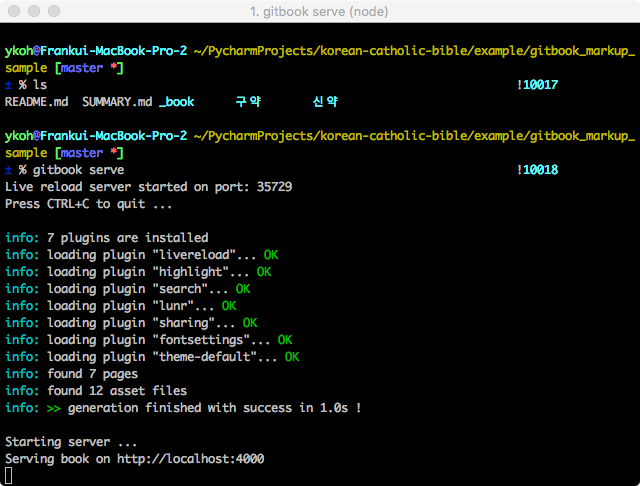
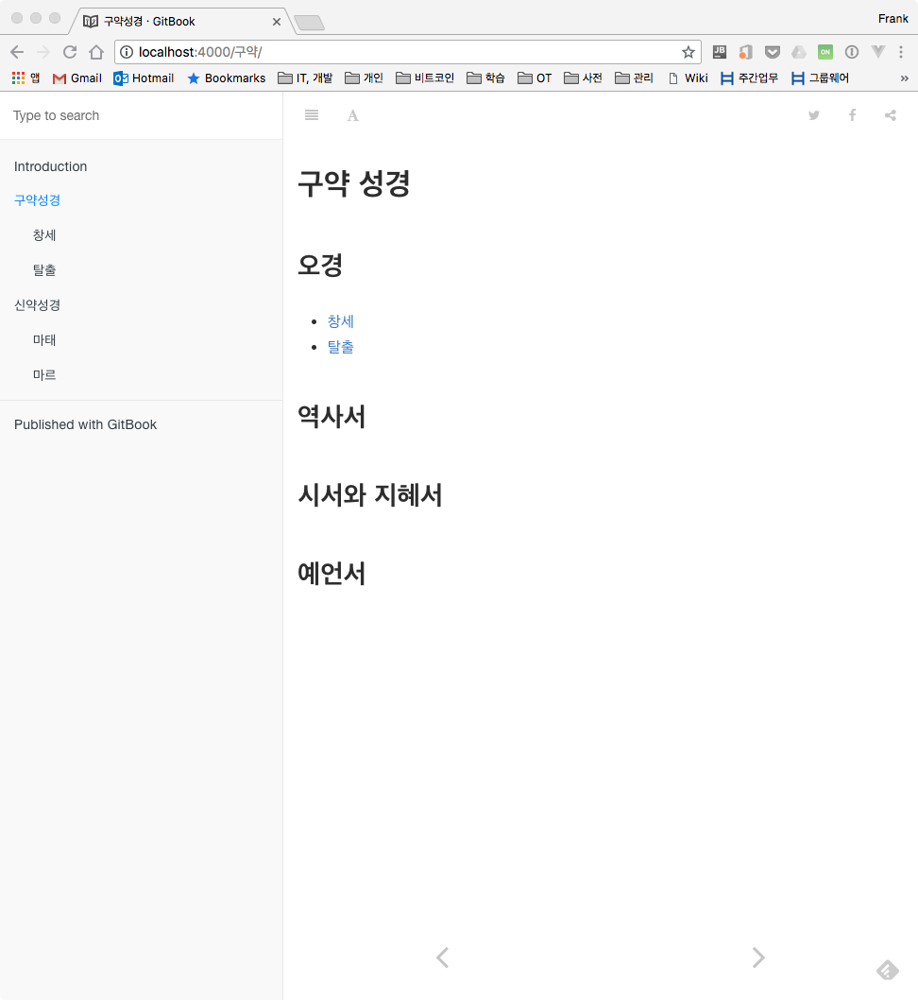
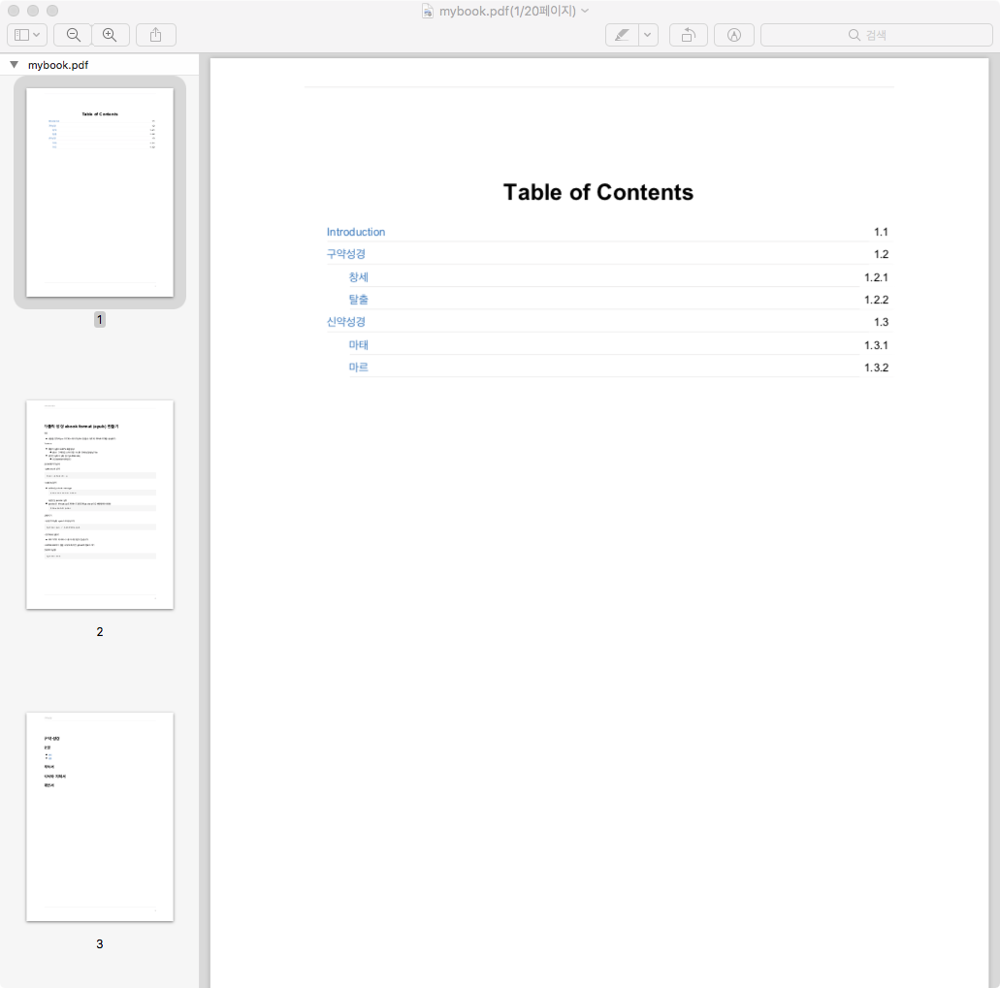
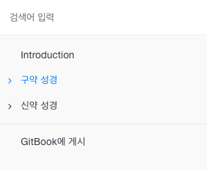
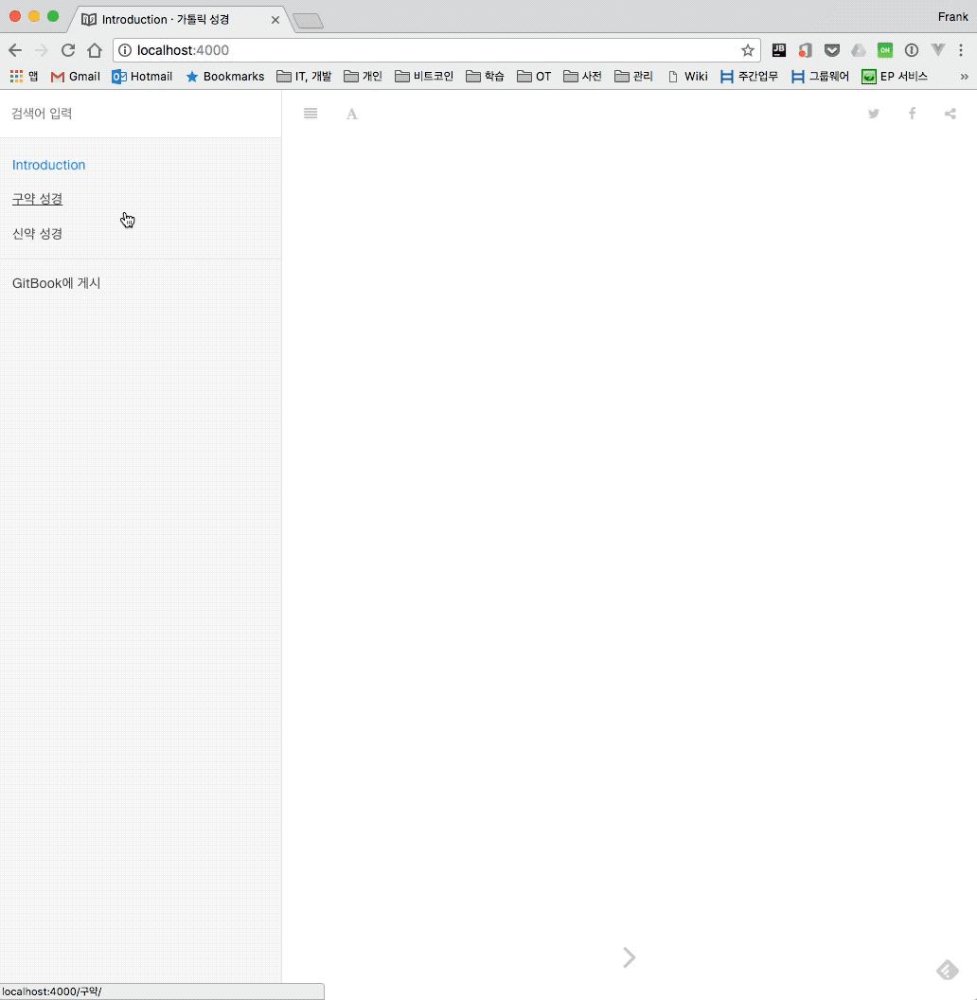

# 1. Overview

It is no exaggeration to say that we live in the age of content. Rather than having a particular broadcasting company create content, the era has shifted to one where individuals create great content themselves and publish it on platforms such as YouTube. As eBook readers like [RIDIBOOKS](https://ridibooks.com/?genre=general) have become widespread and increasingly popular, the eBook market now offers various tools and platforms that let individuals create their own books.

- Apple
    - [iBooks Author](https://www.apple.com/kr/ibooks-author/)
- Hancom
    - [WePubl](https://www.hancom.com/product/productWepublMain.do) (WePubl)
- Kyobo Book Centre
    - [PubPle](http://pubple.kyobobook.co.kr/)

In this post, let's take a look at GitBook, a markdown-based eBook authoring system.

## 1.1 Key Features

- Authoring with markup languages (e.g., AsciiDoc, Markdown)
- Ability to integrate and store projects with GitHub repositories
- GitBook Editor support - Web, GUI (legacy version)
- Support for various eBook formats (e.g., PDF, EPUB, MOBI)
- Support for various plugins (e.g., etoc, splitter)

# 2. Installing GitBook

The installation instructions are written for macOS. To install GitBook, NodeJS must be installed first. If you don't have it, install it with the command below.

```bash
$ brew install nodejs
```

Install the gitbook package via NPM.

```bash
$ npm install gitbook-cli -g
$ gitbook --version
```

To generate eBook formats and PDF, the `ebook-convert` command is required.

```bash
$ brew cask install calibre
```

The `/usr/local/bin` folder must be included in the `$PATH` environment variable.

# 3. Usage

## 3.1 Creating Your First GitBook Project

The command below generates the boilerplate for the book. By default, `README.md` and `SUMMARY.md` are created.

```bash
$ gitbook init
```

If you want to see a more concrete example instead of the basic boilerplate, download and run the sample below from GitHub.

```bash
$ git clone https://github.com/kenshin579/app-korean-catholic-bible.git
$ cd app-korean-catholic-bible/example/gitbook_markup_sample
```

The command below generates a website so you can also view it in a browser.

```bash
$ gitbook serve
```





## 3.2 Generating eBooks and PDF

You can output the book in various eBook formats.

```bash
$ gitbook pdf ./ ./mybook.pdf
$ gitbook epub ./ ./mybook.epub
$ gitbook mobi ./ ./mybook.mobi
```




# 4. Plugins

GitBook provides plugins that extend its various features. Let's look at how to find which plugins are available and how to install them.

## 4.1 How to Find Plugins

You can search for plugins with the features you want on the [GitBook plugin site](http://plugins.gitbook.com).

## 4.2 Configuring and Installing Plugins

Add the plugins you want to the `book.json` file in the root directory, and if needed, configure each plugin as well.

```bash
$ vi book.json
```

```json
[
  {
    "plugins": ["myPlugin", "anotherPlugin"]
  },
  {
    "pluginsConfig": {
      "myPlugin": ""
    }
  }
]
```

After configuring, install the added plugins with the command below.

```bash
$ gitbook install
```

## 4.3 Recommended Plugins

- etoc : automatically generates a Table of Content from the page's content
    - [https://plugins.gitbook.com/plugin/etoc](https://plugins.gitbook.com/plugin/etoc)
- splitter : lets you move the splitter between the menu and the content
    - [https://www.npmjs.com/package/gitbook-plugin-splitter](https://www.npmjs.com/package/gitbook-plugin-splitter)
- expandable-chapters-small : adds a > icon that expands when clicked and collapses when clicked again
    - [https://plugins.gitbook.com/plugin/expandable-chapters-small](https://plugins.gitbook.com/plugin/expandable-chapters-small)
    - 

- toggle-chapters : when you click a chapter, that chapter expands while the rest collapse
    - [https://plugins.gitbook.com/plugin/toggle-chapters](https://plugins.gitbook.com/plugin/toggle-chapters)
    - 

# 5. FAQ

- The `README.md` in the root directory is also used on GitHub. How can I set a different `README.md` in GitBook?
    - Modify `book.json` as follows.

```bash
$ vi book.json
```

```json
"structure" : {
  "readme": "INTRO.md"
}
```

# 6. GitBook Pages Examples

GitBook is widely used in universities and for personal sites. It would be helpful to look at the examples below to see what various plugins are used and how GitBook has been customized.

- [https://www.gitbook.com/book/jackdougherty/datavizforall](https://www.gitbook.com/book/jackdougherty/datavizforall)
- [https://typescript-kr.github.io/](https://typescript-kr.github.io/)

# 7. References

- [https://help.gitbook.com/](https://help.gitbook.com/)
- [https://toolchain.gitbook.com/](https://toolchain.gitbook.com/)
- [https://lab021.gitbooks.io/lab021_manual/gitbook%EC%9D%80-%EC%96%B4%EB%96%BB%EA%B2%8C-%EC%82%AC%EC%9A%A9%ED%95%98%EB%82%98%EC%9A%94.html](https://lab021.gitbooks.io/lab021_manual/gitbook%EC%9D%80-%EC%96%B4%EB%96%BB%EA%B2%8C-%EC%82%AC%EC%9A%A9%ED%95%98%EB%82%98%EC%9A%94.html)
- [http://blog.appkr.kr/work-n-play/pandoc-gitbook-%EC%A0%84%EC%9E%90%EC%B6%9C%ED%8C%90/](http://blog.appkr.kr/work-n-play/pandoc-gitbook-%EC%A0%84%EC%9E%90%EC%B6%9C%ED%8C%90/)
