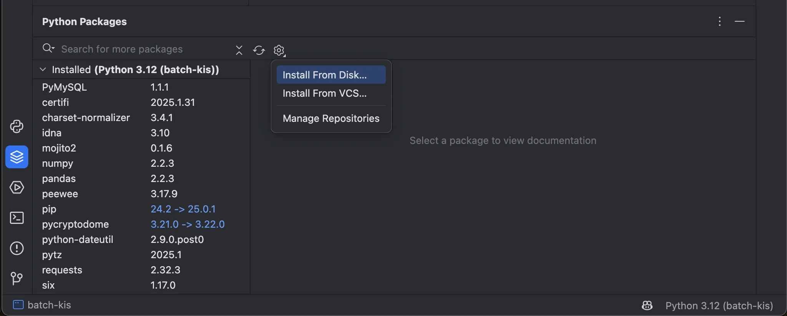
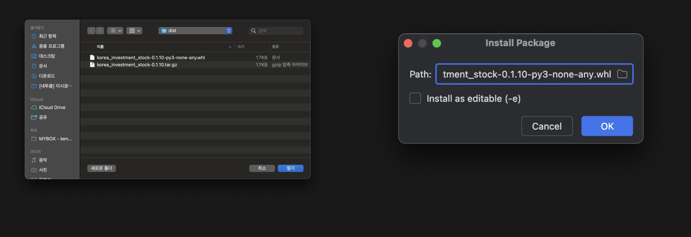
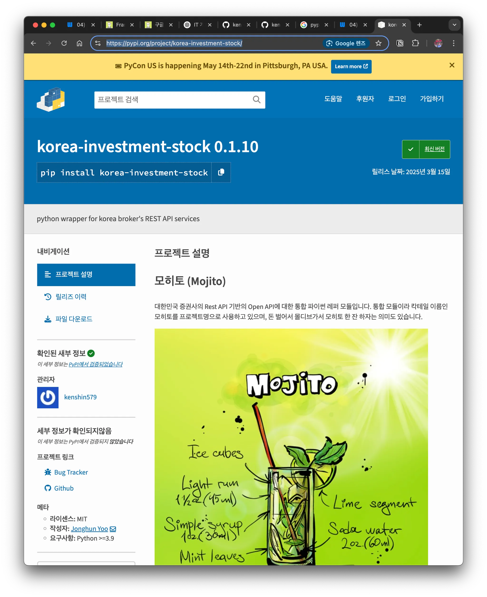
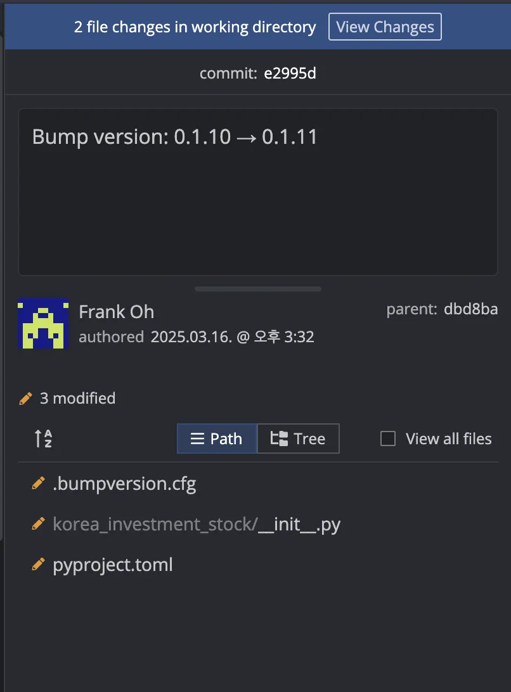

# 1. Overview

After developing a Python package, if you upload it to `PyPi` (Python Package Index), anyone can easily install the package with just the `pip install` command.

> When investing in stocks, I personally use Google Sheets. You can get a lot of information with the `GOOGLEFINANCE` function, but some data isn't provided, so I implement and use custom functions.
>
> In the v1 stock-api, I called the Korea Investment API directly to fetch data, but for the v2 stock-api, I figured I could save time by using an already-implemented Python version, so I'm replacing it with that.
>
> Reference: [Implementing custom functions in Google Sheets](https://blog.advenoh.pe.kr/구글-시트에서-사용자-정의-함수-구현하기/)

In this article, I'll organize and explain the process of packaging the `korea-investment-stock` module that I'm using as a `fork` and uploading it to `PyPi`.

# 2. Packaging a Python Module

## 2.1 Project Structure Explained

```bash
> tree -L 1
korea_investment_stock/
├── src/
│   └── korea_investment_stock/
│       ├── __init__.py
│       ├── core.py
│       └── utils.py
├── pyproject.toml
├── README.md
└── LICENSE
```

## 2.2 Writing the `pyproject.toml` File (Recommended)

`pyproject.toml` is the standard file that defines Python package configuration. In older versions, the configuration was written in a `setup.py` file, but now it is defined in the `toml` format.

```
[build-system]
requires = ["setuptools", "wheel"]
build-backend = "setuptools.build_meta"

[project]
name = "korea-investment-stock"
version = "0.1.10"
description = "python wrapper for korea broker's REST API services"
authors = [
    { name = "Jonghun Yoo", email = "jonghun.yoo@pyquant.co.kr" },
    { name = "Brayden Jo", email = "brayden.jo@pyquant.co.kr" },
    { name = "Frank Oh", email = "kenshin579@gmail.com" }
]
license = { text = "MIT" }
readme = "README.md"
requires-python = ">=3.9"
dependencies = [
    "requests", # dependency package
    "pandas",
    "websockets",
    "pycryptodome"
]

[project.urls]
"Github" = "<https://github.com/kenshin579/korea-investment-stock>"
"Bug Tracker" = "<https://github.com/kenshin579/korea-investment-stock/issues>"
```

## 2.3 Building the Package

To build the package, use the `build` module.

```bash
> pip install build
> python -m build
> ls -l dist/
total 80
-rw-r--r--@ 1 user  staff  16844 Mar 15 20:30 korea_investment_stock-0.1.10-py3-none-any.whl
-rw-r--r--@ 1 user  staff  17144 Mar 15 20:30 korea_investment_stock-0.1.10.tar.gz
```

Once the build is complete, `.whl` and `.tar.gz` files are created in the `dist/` folder.

# 3. Installing the Python Module

## 3.1 Testing the Package Installation Locally

To use it, install the module with pip install.

```bash
> cd stock-api/scripts/batch-kis
> pip install dist/*.whl
```

To install it in the PyCharm IDE, click the `Python Packages` icon located at the bottom left, click `Setting` > `Install From Disk…`, and then select the `whl` file from the location where you built the module.





## 3.2 Uploading the Package to PyPi

### 3.2.1 Prerequisites

- **Create a PyPi account**: https://pypi.org/account/register/

- Create an API token

  : 

  https://pypi.org/manage/account/#api-tokens

  - Note that you must enable 2FA

- Configure the API token in the `$HOME/.pypirc` file

```
[pypi]
  username = __token__
  password = pypi-AgEIcH... # Enter the issued token
 
```

### 3.2.2 Uploading with `twine`

```bash
> pip install twine
> python -m twine upload dist/*
```

If the upload succeeds, you can verify the [package on PyPi](https://pypi.org/project/korea-investment-stock/).



## 3.3 Testing the Package After Upload

```bash
> pip install korea-investment-stock

# If installed correctly, it prints the version
> python -c "import korea_investment_stock; print(korea_investment_stock.__version__)"
0.1.10
```

# 4. Distribution and Maintenance

## 4.1 Package Version Management (`bumpversion`)

> `bumpversion` is a tool that automatically updates the version of a Python package.
>
> It changes the version number according to configured rules (e.g., `major`, `minor`, `patch`) and also modifies the related files (e.g., `setup.py`, `pyproject.toml`). It can even automate Git tags and commits, making package management convenient and pleasant to use.


```bash
> pip install bumpversion
> bumpversion patch  # 0.1.0 -> 0.1.1
> bumpversion minor  # 0.1.1 -> 0.2.0
> bumpversion major  # 0.2.0 -> 1.0.0
```

Running the commands above updates the version in the files that need a version change and even creates a `commit`.



# 5. Conclusion

We've looked at the process of uploading a Python module we developed to `PyPi`. We uploaded it using commands, but with GitHub Actions you can automatically upload to `PyPi` when you push a `git tag`.

- [Automating PyPI package deployment with GitHub Actions](https://velog.io/@bailando/github-actions-으로-pypi-패키지-배포-자동화하기)

# 6. References

- [Registering on PyPI](https://wikidocs.net/78954)
