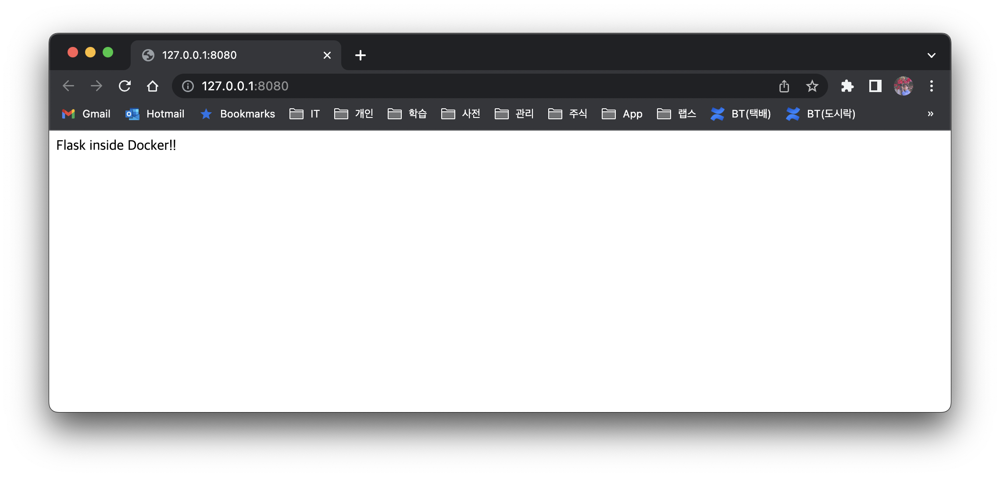

# 1. Dockerize Python Application

Let's look at how to build a Python application into a Docker image. The dockerizing process creates a Docker image through a similar process regardless of the development language. Below is Python code that prints `Hello World` to the screen. Let's build a Docker image from this code.

```python
#!/usr/bin/env python3

print('Hello World')
```


## 1.1 Creating a Dockerfile

Docker can build an image by reading the `Dockerfile` and executing the commands written in it.

```dockerfile
FROM python:3.8-slim-buster
WORKDIR /root
ADD main.py .
CMD ["python3, main.py"]

```

- `FROM` : specifies the Docker image to use as the base image
- `WORKDIR` : specifies the working directory of the container
- `ADD` : adds files when building the image
- CMD : specifies the command to run when the container starts

There are three Python base images you can use. Their differences are as follows.

- `python:3.9-buster`  a version with most of the necessary packages installed
- `python:3.9-slim-buster` : a version with everything excluded except the standard library
- `python:3.9-alpine` : a version that includes BusyBox Linux + the apk package manager

The `alpine` base image is a `lightweight` version provided for many development languages and is widely used. For simple Python, it's fine to use the `alpine` image, but depending on the libraries the application uses, alpine by default does not support `linux wheel`, so a separate build may be required. To dockerize directly without going through such a build process, I recommend choosing `buster` or `slim-buster` as the base image.

### 1.1.1 References

- https://nayoungs.tistory.com/m/entry/Docker-Python-%EC%8A%A4%ED%81%AC%EB%A6%BD%ED%8A%B8%EB%A5%BC-%EC%8B%A4%ED%96%89%ED%95%98%EB%8A%94-Docker-%EC%9D%B4%EB%AF%B8%EC%A7%80-%EB%B9%8C%EB%93%9C%ED%95%98%EA%B8%B0
- https://pythonspeed.com/articles/alpine-docker-python/
- https://jx2lee.github.io/cloud-base-image-with-python/


### 1.1.2 Building the Docker Image

Since my personal MacBook is an `M1` version, I add the `platform` option when building.

```makefile
REGISTRY 	:= kenshin579
APP    		:= advenoh
TAG         := python-hello
IMAGE       := $(REGISTRY)/$(APP):$(TAG)
PLATFORM	:= linux/x86-64

.PHONY: docker-build
docker-build:
	@docker build --platform $(PLATFORM) -t $(IMAGE) -f Dockerfile .

.PHONY: docker-push
docker-push: docker-build
	@docker push $(IMAGE)
```

To make repeated builds easier, write a `Makefile` like the one above and run `make`, or if you want to upload the image directly to Docker Hub, run it with the `docker-push` option.
```bash
$ make docker-build
$ make docker-push
```

## 1.2 Running the Docker Image

Let's print Hello World with `docker run`.

```bash
$ docker run --platform linux/x86-64 kenshin579/advenoh:python-hello
Hello World
```

# 2. Flask Web Application

In addition to the version that prints to the console, let's also dockerize a web application. This is Python code that, after the server starts, prints "Flask inside Docker!!" when you access port 8080.

```python
#!/usr/bin/env python3

from flask import Flask
import os

app = Flask(__name__)


@app.route("/")
def hello():
    return "Flask inside Docker!!"


if __name__ == "__main__":
    port = int(os.environ.get("PORT", 8080))
    app.run(debug=True, host='0.0.0.0', port=port)

```


## 2.1 Writing the Dockerfile

```dockerfile
FROM python:3.8-slim-buster
COPY ../../../src/content/python /app
WORKDIR /app
RUN pip3 install -r requirements.txt

CMD ["python3, app/app.py"]
```


When you run the built Docker image in your local environment and access port 8080, you can confirm that it runs correctly.

```bash
$ make docker-push

$ docker run --rm --platform linux/x86-64 -p 8080:8080 kenshin579/advenoh:python-web-hello
* Serving Flask app 'app' (lazy loading)
 * Environment: production
   WARNING: This is a development server. Do not use it in a production deployment.
   Use a production WSGI server instead.
 * Debug mode: on
 * Running on all addresses (0.0.0.0)
   WARNING: This is a development server. Do not use it in a production deployment.
 * Running on http://127.0.0.1:8080
 * Running on http://172.17.0.2:8080 (Press CTRL+C to quit)
 * Restarting with stat
 * Debugger is active!
 * Debugger PIN: 878-906-556
```


## 2.2 Web Screen



# 3. References

- https://runnable.com/docker/python/dockerize-your-python-application
- https://luis-sena.medium.com/creating-the-perfect-python-dockerfile-51bdec41f1c8
- https://blog.logrocket.com/build-deploy-flask-app-using-docker/
