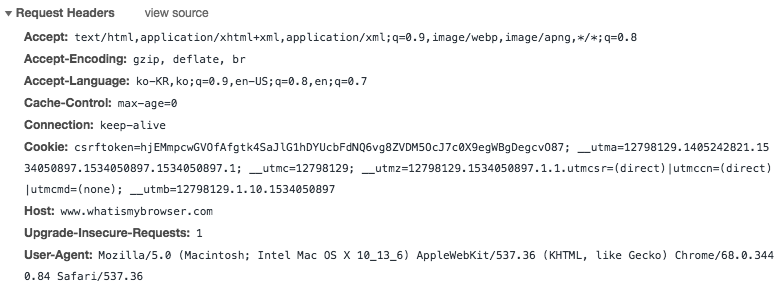
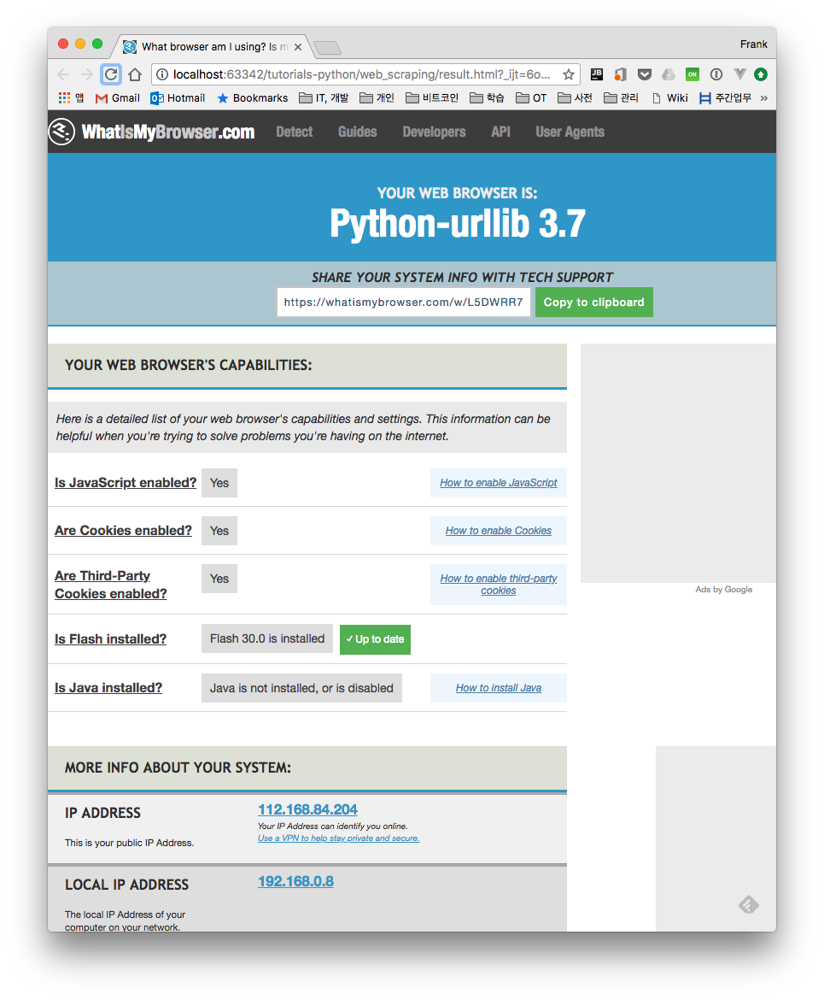
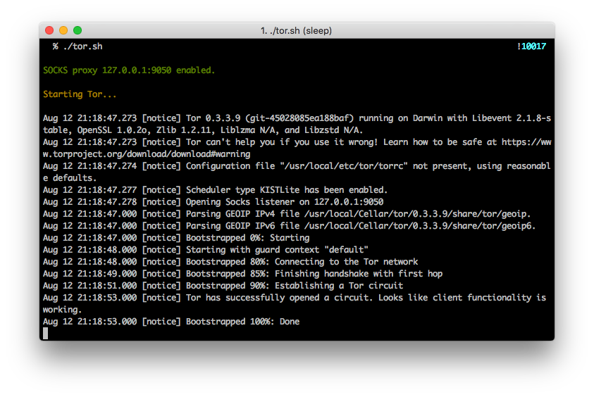
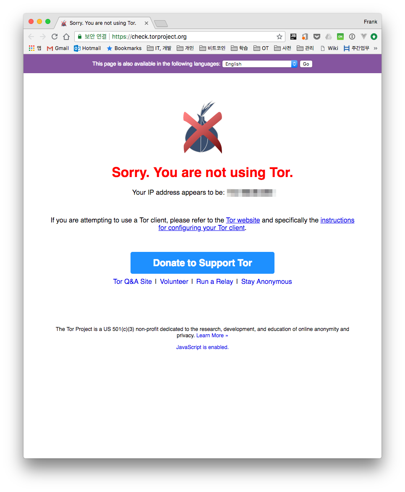
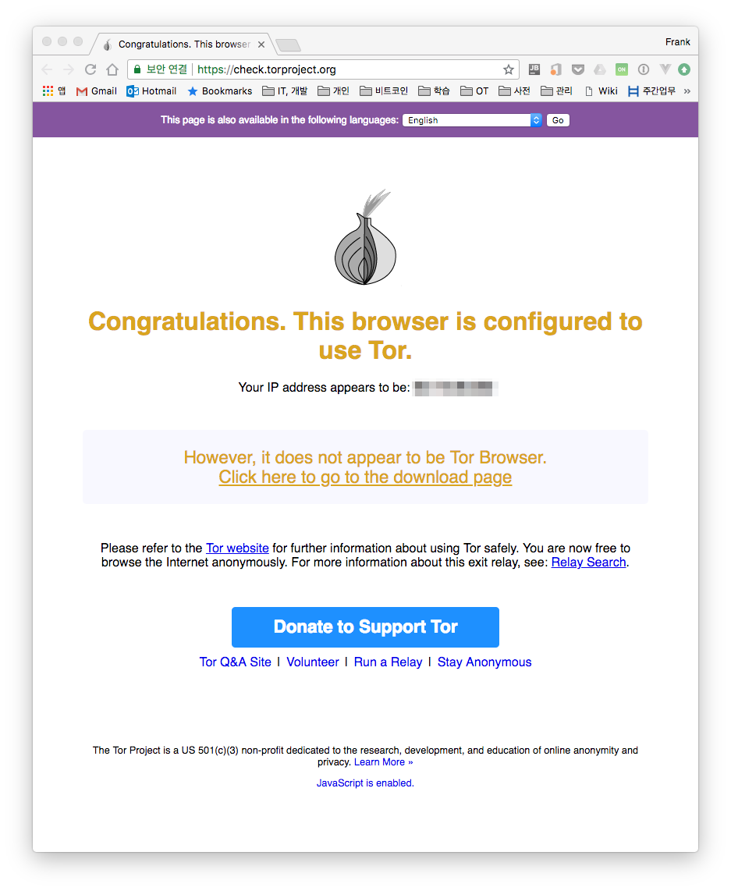
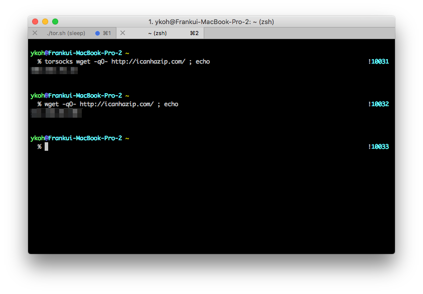
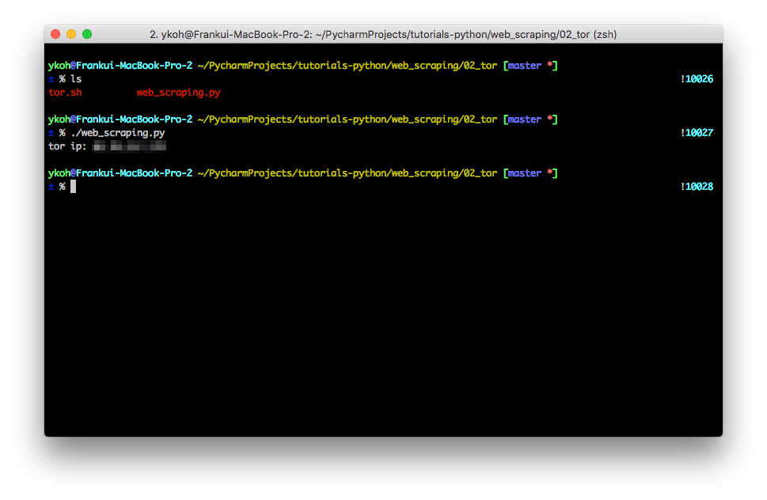
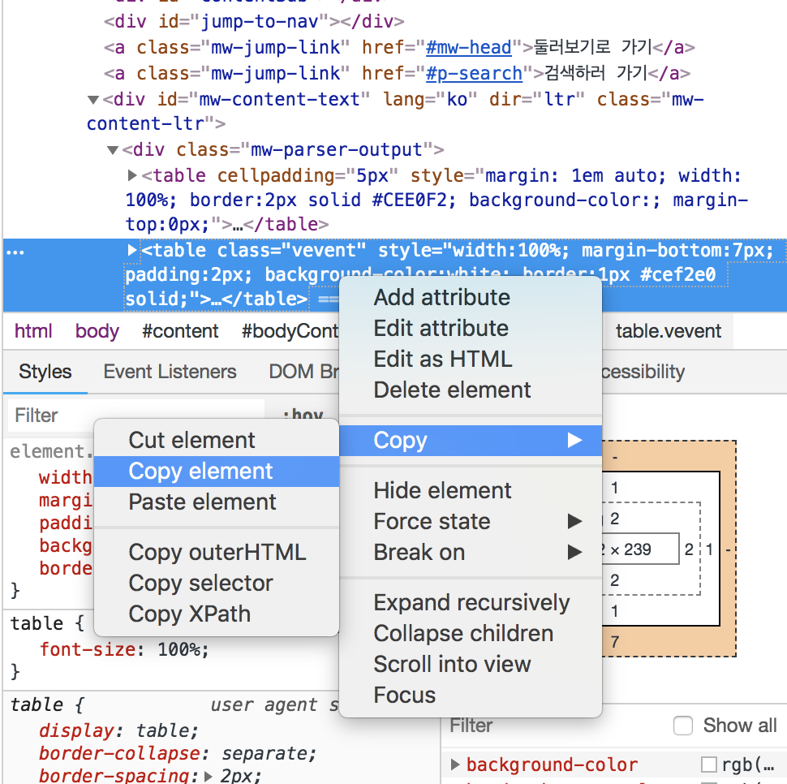

# 1. Introduction
When scraping, you have to connect to a site and extract data, so depending on how you write the code, you can put a heavy load on the server. The team responsible for the web server has no choice but to block places that connect maliciously(?) in order to reduce the heavy load on the server. In this post, let's look at several ways to avoid being blocked by a site while web scraping.

* Check robots.txt
* Set User Agents
* Reduce load by sleeping briefly
* IP rotation - Tor

# 2. Several Ways to Avoid Being Blocked While Web Scraping
## 2.1 Check robots.txt
The robots.txt file defines which web pages a web crawler (search bot) is and isn't allowed to crawl. Many websites (e.g., [Google](http://www.google.com/robots.txt), [Naver](http://www.naver.com/robots.txt)) define a robots.txt file.

```
# Example
User-agent: *
Allow: /
Disallow: /search.php
```

* User-agent : the target crawler (*: all search bots, googlebot: Google's bot, etc.)
* Allow : allowed paths
* Disallow : disallowed paths

If a robots.txt file exists, you should identify in advance which paths you should not access, and be careful not to access those paths while web scraping.

# 3. Set User Agents
The site below is a good place to test how the browser properties of a visitor appear to the web server.

* [http://www.whatismybrowser.com](http://www.whatismybrowser.com/)

When I access the site above with the Chrome browser on my computer, I can see that it is Chrome 68 on Mac.


If you check the HTTP headers sent to the server when accessing a website, you'll see that various pieces of information are included. In particular, the User-Agent information tells you which browser is currently being used.



If you access a site with the urllib module, the HTTP header information shows that the connection was made with python-urllib, and the server-side administrators can easily determine that the connection is not from a regular user, so the chance of being blocked is high. As much as possible, when web scraping, it's better not to use the urllib module but instead to use the requests module and modify the header information before sending.



Below is how to build and send a Chrome browser User-Agent in the header information using the requests module.

```python
import requests

session = requests.Session()
headers = {
"User-Agent": "Mozilla/5.0 (Macintosh; Intel Mac OS X 10_9_5) AppleWebKit 537.36 (KHTML, like Gecko) Chrome",
"Accept": "text_html,application_xhtml+xml,application_xml;q=0.9,image_webp,**/**;q=0.8"
}
html = session.get(WIKI_URL, headers=headers).content
bsObj = BeautifulSoup(html, "html.parser”)
```

## 3.1 Reduce Load by Sleeping Briefly
If you connect to multiple pages and fill out online forms to scrape faster than a real user actually browsing the site would, you give the impression that you're not a user, and you can get blocked. Also, if you load and process multiple pages with loops or handle things with multi-threaded programming, you can put a heavy load on the server. It's best to keep accessing each page and requesting data to a minimum. To do so, putting a small interval between accessing each page with a sleep statement can reduce the load.

```python
//Use a random value to mimic a user connecting

rand_value = randint(1, MAX_SLEEP_TIME)
time.sleep(rand_value)
```

## 3.2 IP rotation - Tor
Tor, short for The Onion Router, is an encrypted router network that makes traffic analysis and IP address tracking impossible. The transmitted data is encrypted at every hop as it is routed through the Tor network, so even if someone obtains a packet in the middle and tries to decrypt it, finding the actual source IP address is not easy. It's described as almost impossible(?). (Book: Web Scraping with Python)

For how Tor actually works, please refer to the link (Reference #4.1). Here, we cover how to actually do web scraping within the Tor network.

The Tor installation and execution instructions are written for Mac. For installation on other OSes, please refer to the link below (Reference #4.5).

### 3.2.1 Installing Tor
```bash
$ brew install tor
$ tor
```

You can run Tor with the tor command, but network traffic is not yet transmitted through Tor.

### 3.2.2 Configuring and Running Tor
For all system traffic to be routed through Tor, you need to change the system's network settings. There's the hassle of configuring the settings for each network you use (e.g., Wi-Fi, Ethernet) and then having to revert the settings to use the default network. The part that changes the network settings can be easily scripted in bash (refer to the kremalicious website, Reference #4.2).

Below is the screen after running the tor.sh script.

```bash
$ tor.sh
```



To verify that Tor is set up correctly, you can access the site below to check.

* [https://check.torproject.org/](https://check.torproject.org/)
  | Connecting via normal network | Connecting via Tor network |
  | -------------------- | -------------------- |
  |   | |


You can also check the public IP address currently in use and the Tor IP address with a command. To check the Tor network, you need to install the torsocks package.
```bash
$ brew install torsocks
$ torsocks wget -q0- http://icanhazip.com/; echo
```



### 3.2.3 Web Scraping in the Tor Network
To web scrape through the Tor network in Python, you need a SOCKS proxy client module. Install it with the pip command.

```bash
$ pip install pysocks
```

```python
#!/usr/bin/env python3
import sys

import requests

def main():
url = "http://icanhazip.com/"
proxies = {
'http': 'socks5://127.0.0.1:9050',
'https': 'socks5://127.0.0.1:9050'
}

response = requests.get(url, proxies=proxies)
print('tor ip: {}'.format(response.text.strip()))

if __name__ == "__main__":
sys.exit(main())
```

You can confirm that the IP address obtained with the torsocks command and the address from running the Python script above are the same.



# 4. Considerations When Writing Web Scrapers
## 4.1 Write Code as Unit Tests
When writing a script, you have to access the website each time you write code. Rather than accessing the site every time, if you copy the necessary HTML part from the Chrome browser, save it to a file, and write the code as a unit test against that file, the chance of being blocked also decreases.



This is the part of the code that loads the saved HTML. For the full code, please refer to the file uploaded on GitHub.

```python
import unittest
import web_scraping as ws

class WebScrapingTest(unittest.TestCase):
FILE_URL = “main_news.html” copied from chrome

def test_(self):
ws.parse_and_process(open(self.FILE_URL))

if __name__ == '__main__':
unittest.main()
```

# 5. References

The files written in this post can be found on [GitHub](https://github.com/kenshin579/tutorials-python/tree/master/web_scraping).

* Related books
    * [Python Web Scraping](https://www.amazon.com/Scraping-Python-Community-Experience-Distilled/dp/1782164367)
      
    * [Web Scraping with Python](http://www.hanbit.co.kr/store/books/look.php?p_code=B7159663510)
      
* Robots.txt
    * [http://www.robotstxt.org/robotstxt.html](http://www.robotstxt.org/robotstxt.html)
    * [https://www.twinword.co.kr/blog/basic-technical-seo/](https://www.twinword.co.kr/blog/basic-technical-seo/)
    * [http://www.searchengines.co.kr/mkt-bootcamp/7807](http://www.searchengines.co.kr/mkt-bootcamp/7807)
* Avoiding web scraping blocks
    * [https://www.scrapehero.com/how-to-prevent-getting-blacklisted-while-scraping/](https://www.scrapehero.com/how-to-prevent-getting-blacklisted-while-scraping/)
    * [https://hackernoon.com/web-scraping-tutorial-with-python-tips-and-tricks-db070e70e071](https://hackernoon.com/web-scraping-tutorial-with-python-tips-and-tricks-db070e70e071)

* Tor
    * [https://namu.wiki/w/Tor(%EC%86%8C%ED%94%84%ED%8A%B8%EC%9B%A8%EC%96%B4)](https://namu.wiki/w/Tor%28%EC%86%8C%ED%94%84%ED%8A%B8%EC%9B%A8%EC%96%B4%29)
    * [https://kremalicious.com/simple-tor-setup-on-mac-os-x/](https://kremalicious.com/simple-tor-setup-on-mac-os-x/)
    * [http://act.jinbo.net/wp/4449/](http://act.jinbo.net/wp/4449/)
    * [https://gist.github.com/DusanMadar/8d11026b7ce0bce6a67f7dd87b999f6b](https://gist.github.com/DusanMadar/8d11026b7ce0bce6a67f7dd87b999f6b)
    * Tor Windows installation
        * [https://guide.jinbo.net/digital-security/communication-security/how-to-use-tor](https://guide.jinbo.net/digital-security/communication-security/how-to-use-tor)
