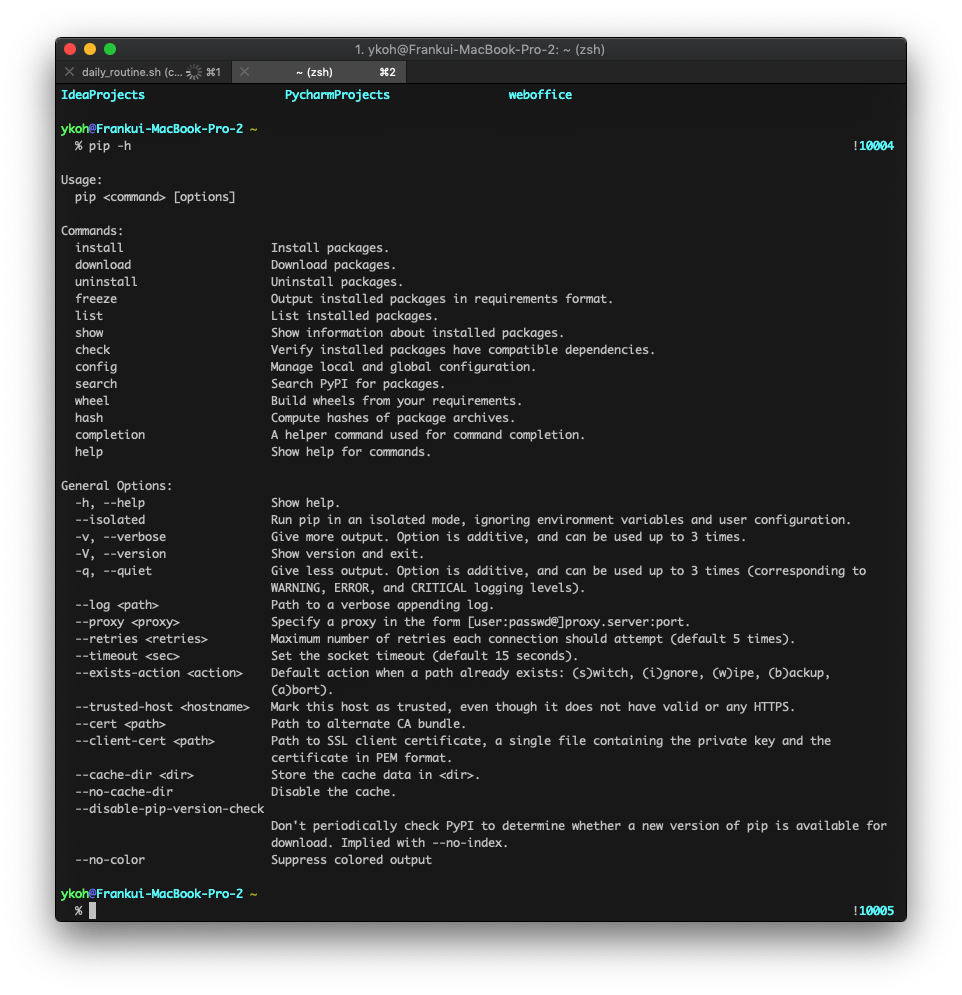
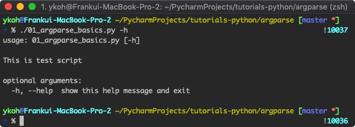
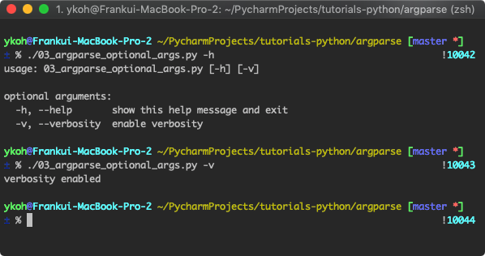
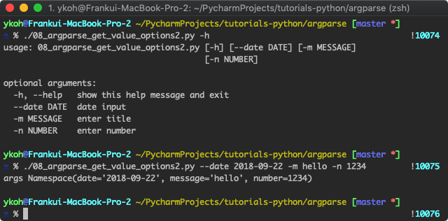
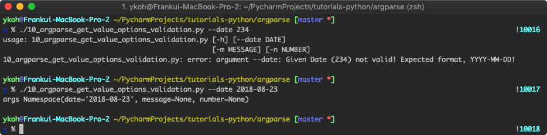
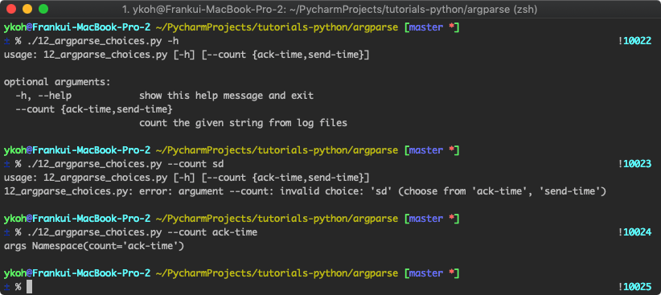

# 1. What Is the argparse Module?

When running shell or Linux commands, there are many options. Below is the list of options for the pip command (Python's package manager). There are flag-style options (e.g., --no-color) and options that can take an input value (e.g., --log <path>).



How would you implement options like these in Python? If you were to actually implement them, you'd need a process to take the run command as an argument and parse it. Implementing it yourself is a bit burdensome. The shell and various languages provide these parts as separate modules. In Python, the command-parsing libraries include getopt, argparse, and docopt. Among these, let's look at **argparse**, which is widely used in Python.

# 2. Exploring argparse Options

argparse is included in the Python standard library, so there's no need to install it separately. To use the module, you just need to add it with import.

```python
import argparse
```

# 3. Adding the help Option

In the command line, most commands provide help. You can check the description of command options with the -h or --help option. In the argparse module, the help option is added by default.

```python
parser = argparse.ArgumentParser(description="This is test script”) # you can also include a description of the script being run
parser.parse_args()
```

When you give the -h option, the argparse module automatically organizes and shows the basic description of the command and its options.



## 3.1 Adding Flag-Style Options

Flag-style options are the most commonly used in the command line. This is an option that runs when a flag option (-v, --verbosity) is given. You can configure various options through the add_argument() function. As shown below, you can specify short and long options with dash input, and you specify the description for that option in the help= keyword. **Setting the action keyword to 'store_true'** assigns a True value when that option is specified, and False when it isn't.

- Short Option : single dash (-)
- Long Option : double dash (--)

```python
parser = argparse.ArgumentParser()
parser.add_argument( **"-v", "--verbosity", action='store_true', help="enable verbosity"** )
args = parser.parse_args()
if args.verbosity: # runs when True
print("verbosity enabled")
```



## 3.2 Receiving a Value for an Option

You can also receive a value for a specific option. For example, you can take date, number, and string values as shown below.

```bash
$ ./08_argparse_get_value_options2.py --date 2018-09-22 -m hello -n 1234
```

```python
parser = argparse.ArgumentParser()
parser.add_argument("--date", action='store', dest="date", help="date input")
parser.add_argument("-m", action='store', dest="message", type=str, help="enter message")
parser.add_argument("-n", action='store', dest="number", type=int, help="enter number")
args = parser.parse_args()
print("args", args)
```

- action='store' : setting action to store saves the entered value in the dest variable
- dest : the variable in which the entered value is stored
    - ex. the entered message is stored in the message variable
- type: you can also specify the type for the entered value
    - if the entered value is not an integer, the error 'error: argument -n invalid int value' is printed



## 3.3 Validating the Entered Value

For types like int or string (e.g., int), validation is performed by default. However, types like date require implementing a separate function. You can check whether the entered date is in YYYY-MM-DD format by running the strptime() function and raising an Exception when it's not the right format.

```python
def valid_date_type(arg_date_str):
    try:
        datetime.datetime.strptime(arg_date_str, "%Y-%m-%d")

        return arg_date_str
    except ValueError:
        msg = "Given Date ({0}) not valid! Expected format, YYYY-MM-DD!".format(arg_date_str)

        raise argparse.ArgumentTypeError(msg)

parser = argparse.ArgumentParser()
parser.add_argument("--date", action='store', dest="date", type=valid_date_type, help="date input")
parser.add_argument("-m", action='store', dest="message", type=str, help="enter message")
parser.add_argument("-n", action='store', dest="number", type=int, help="enter number")
args = parser.parse_args()
print("args", args)
```



## 3.4 Selecting an Input Value from a Set of Choices

With the choices keyword, you can configure it so that the input value can only be given from a defined set of choices.

```python
parser = argparse.ArgumentParser()
parser.add_argument("--count", action='store', choices=["ack-time", "send-time"],

                    help="count the given string from log files")
args = parser.parse_args()
print("args", args)
```

- choices : you can select only one of the values defined in the list
    - ex. choices=['apple', 'orange']



There are various other option configurations, but I've organized only the frequently used options.

For the source code, please refer to [GitHub](https://github.com/kenshin579/tutorials-python/tree/master/argparse).

# 4. References

- Parsing Libraries
- [https://realpython.com/comparing-python-command-line-parsing-libraries-argparse-docopt-click/](https://realpython.com/comparing-python-command-line-parsing-libraries-argparse-docopt-click/)
- Argparse module
    - [https://docs.python.org/ko/3.7/library/argparse.html](https://docs.python.org/ko/3.7/library/argparse.html)

    - [https://docs.python.org/3/howto/argparse.html](https://docs.python.org/3/howto/argparse.html)
