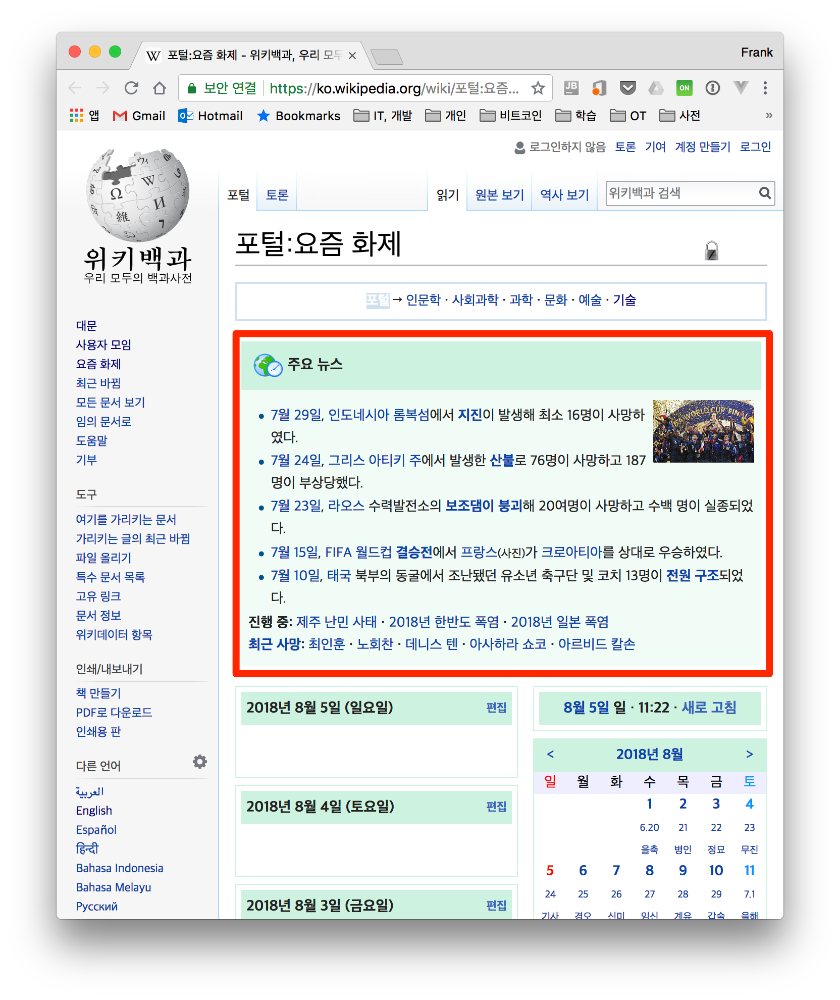
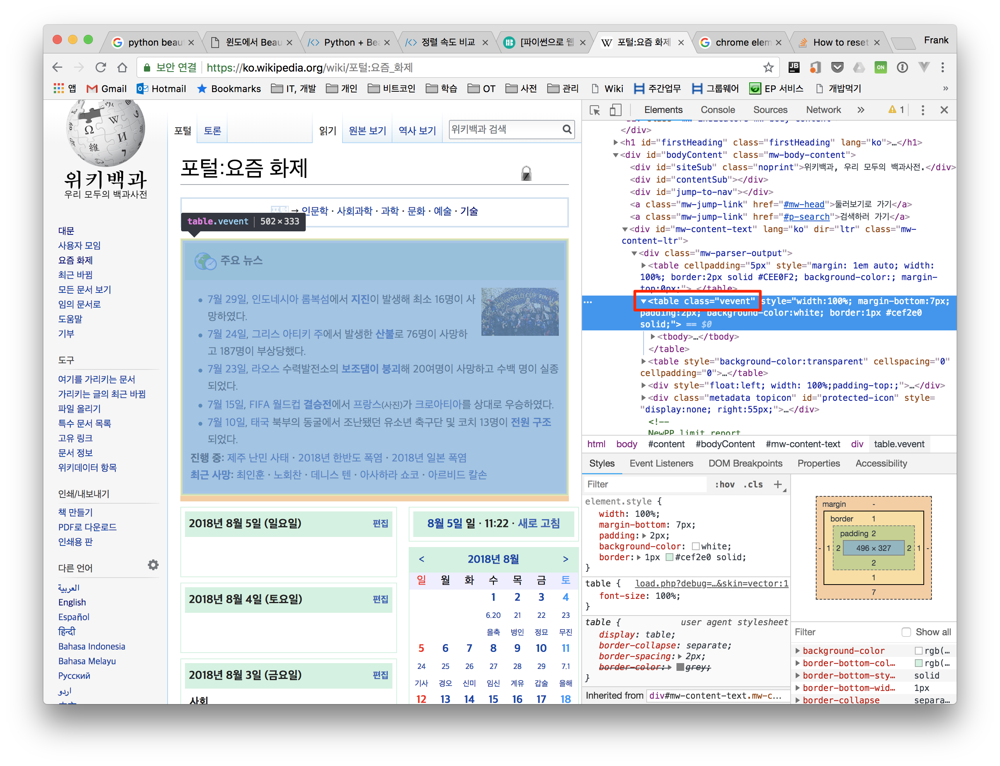
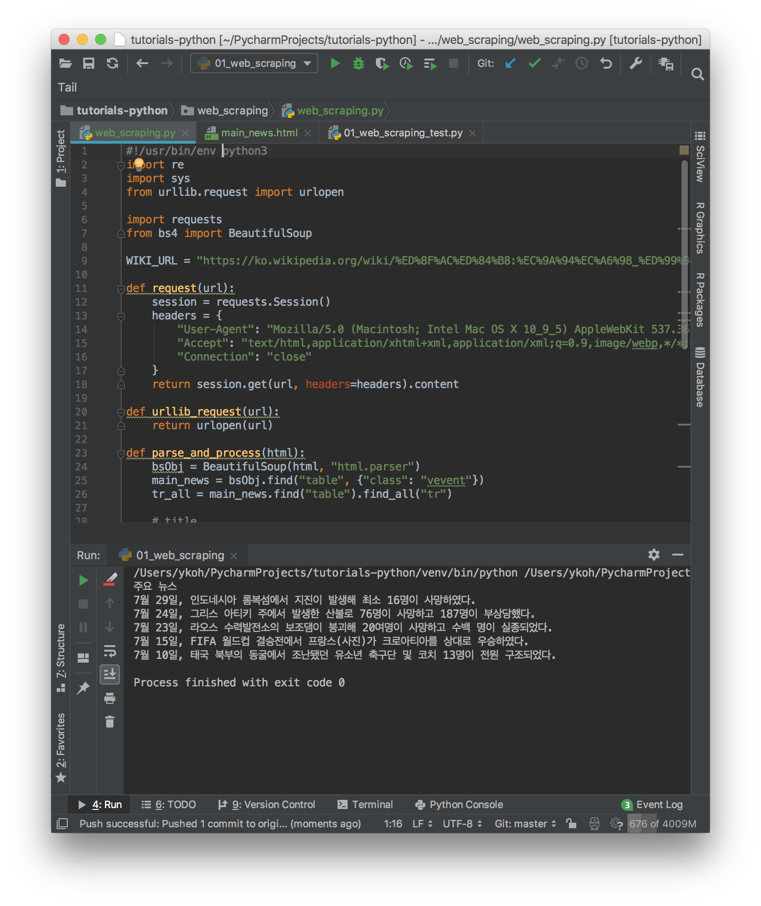

# 1. Introduction

The web holds an enormous amount of data, so much that it could be called an ocean of information. Sites like Twitter and Facebook provide normalized JSON-formatted data via APIs, making it easy to access the data you want. However, the data provided through APIs is limited, and you may not be able to get the data you want.

You need to extract the necessary information directly from the actual site and process the data. This approach is called web crawling and web scraping. Web crawling, also referred to as a web spider or bot, is a method of regularly extracting information from various sites (e.g., Google) like search engines do. Web scraping generally refers to the act of extracting the desired data from a website. The differences between the two are summarized below.

* Web crawling
    * used by search engines and processed automatically on the web like a bot
    * indexes downloaded sites so users can quickly search for what they want
* Web scraping
    * extracts the desired data from a website
    * processes the extracted data into the desired format

# 2. Web Scraping
Python is the most widely used for web scraping. In Node.js, you can also easily extract the data you want using the [Cheerio module](https://medium.com/@moralmk/web-scraping-with-node-js-9a289ad19558), but in this post, we'll look at how to web scrape with Python.

When web scraping, you go through about three stages.

1. Scraping - fetching the data
2. Parsing - parsing the data
3. Manipulation - processing the data

First, let's install the necessary Python modules and look at how to use each module.

## 2.1 Installing the Required Packages and How to Use Them
The installation instructions are written for macOS.

* Beautiful Soup
    * a module for more easily parsing and handling HTML- and XML-formatted data
    * the current version is bs4
* urllib
    * a module for handling URLs
    * a module built into Python by default
* requests
    * can send HTTP/1.1 requests
    * can include headers, form data, multipart files, and parameters in the request content

### 2.1.1 Installing the Packages
Install the necessary packages with the Python package manager command (pip).

```bash
$ pip3 install beautifulsoup4
$ pip3 install requests
```

### 2.1.2 Usage and Examples
First, let's fetch data using the urllib module built into Python by default, and then write an example that fetches data with the requests module. The full example source is written on [GitHub](https://github.com/kenshin579/tutorials-python/tree/master/web_scraping/01_web_scraping).
Let's write an example together that fetches the **main news** information from the **Trending Now** page on Wikipedia.

* [https://ko.wikipedia.org/wiki/포털:요즘_화제](https://ko.wikipedia.org/wiki/%ED%8F%AC%ED%84%B8:%EC%9A%94%EC%A6%98_%ED%99%94%EC%A0%9C)



**1. Open Chrome's developer tools and check the tag of the part you want.**



**2. Access the website,** **parse the HTML with BeautifulSoup,** **and extract the desired data.**

The code below is the approach that accesses the Wikipedia site with the urllib module.

```python
from urllib.request import urlopen
from bs4 import BeautifulSoup

html = urlopen(WIKI_URL)  fetch html with urllib
bsObj = BeautifulSoup(html, "html.parser")
main_news = bsObj.find("table", {"class": "vevent”})  written based on what was checked in chrome
```

Next is the approach that uses the requests module instead of the urllib module to fetch the html. When writing a script, you inevitably have to access the website frequently. If you access it with the urllib module, the information that you connected with urllib remains intact in the server logs, and there's also a risk of being blocked due to a pattern of frequent access. However, the requests module can include additional information in the headers, so it can send the information that a Chrome or Firefox browser sends, making it less likely to be blocked — so I recommend using the requests module. We'll cover the various ways to avoid being added to a blacklist in detail in the next post.

```python
import requests
from bs4 import BeautifulSoup

session = requests.Session()
headers = {
"User-Agent": "Mozilla/5.0 (Macintosh; Intel Mac OS X 10_9_5) AppleWebKit 537.36 (KHTML, like Gecko) Chrome",
"Accept": "text_html,application_xhtml+xml,application_xml;q=0.9,image_webp,**/**;q=0.8",
"Connection": "close"
}

bsObj = BeautifulSoup(session.get(WIKI_URL, headers=headers).content, "html.parser”) fetch html by accessing the url with requests
main_news = bsObj.find("table", {"class": "vevent"})
```

After fetching the HTML, let's look at the code below to see how BeautifulSoup parses it and extracts the desired data.

```python
bsObj = BeautifulSoup(html, "html.parser")
main_news = bsObj.find("table", {"class": "vevent"})
tr_all = main_news.find("table").find_all("tr")

 # title
print(tr_all[0].get_text().strip())

 # ui list
news_all = tr_all[1].find_all("li")

for each_tr in news_all:
text = each_tr.get_text().strip().replace("\n", " ")
striped_text = re.sub('\s\s+', " ", text)
print(striped_text)
```

In line 1, the HTML is parsed with html.parser, which is built into Python by default. You can also use external parsers such as lxml. (requires installation via pip)
ex. bsObj = BeautifulSoup(html, 'lxml')

From line 2, it first fetches the entire content of the vevent class containing the main news, and then extracts the tr part once more.

tr [0] - main title
tr [1] - news content

To extract the text part of the fetched tag content, use the get_text() function, and remove unnecessary whitespace with the strip() or replace() functions.
The execution result is as follows.



# 3. Additional Examples
Because so much data exists on the internet, you can produce a variety of data with web scraping techniques.

* Scraping to compare prices of the same product (e.g., Danawa)
* Scraping to get feedback about a company's products from various social networks (e.g., Twitter)

Personally, I sometimes wanted to read the Bible on the RIDIBOOKS Paper (an eBook reader), so I thought it would be nice to create an EPUB. After learning web scraping techniques, I wrote a script to convert it into EPUB format. The idea is not much different from the example above.

[https://github.com/kenshin579/app-korean-catholic-bible](https://github.com/kenshin579/app-korean-catholic-bible)


# 4. Summary

When web scraping, you can get blocked by the sites you access, so in the next post ([How to Avoid Getting Blocked While Web Scraping](http://advenoh.tistory.com/3)) let's look at how to web scrape without getting blocked.

# 5. References

I recommend the book below a bit more.

* Book : [Web Scraping with Python](http://www.hanbit.co.kr/store/books/look.php?p_code=B7159663510)
    * 
* Crawling vs. Scraping
    * [http://stophyun.tistory.com/142](http://stophyun.tistory.com/142)
    * [https://ko.wikipedia.org/wiki/웹_크롤러](https://ko.wikipedia.org/wiki/%EC%9B%B9_%ED%81%AC%EB%A1%A4%EB%9F%AC)
* Web scraping with Node.js
    * [https://medium.com/@moralmk/web-scraping-with-node-js-9a289ad19558](https://medium.com/@moralmk/web-scraping-with-node-js-9a289ad19558)
