# 1. What is URDF?

`URDF` (Unified Robot Description Format) is an XML file that defines information about a robot, such as its geometric models (circles, ellipses, rectangles, etc.), joints, and sensors. In this XML file, you model a robot by defining information such as the links that represent parts of the robot and the joints that provide dynamic motion. The modeled information can be checked and simulated using visualization programs such as RViz (ROS Visualization) and Gazebo.

In addition to `URDF`, several other file formats exist for robot modeling, simulation, and control, as shown below.

- [URDF](http://wiki.ros.org/urdf): Unified Robot Description Format
    - Mainly used for robot modeling and simulation, and is used by the [RViz](http://wiki.ros.org/rviz) tool
- **[SDF](http://sdformat.org/)**: Simulation Description Format
    - `SDF` is an XML file used for robot simulation, and is used by simulation tools such as [Gazebo](https://gazebosim.org/home)
    - You can also convert URDF → SDF using the Gazebo conversion command
      ```bash
      $ gz sdf -p model.urdf > model.sdf
      ```
- **[SRDF](http://wiki.ros.org/srdf)**: Semantic Robot Description Format
    - Used together with `URDF`, this is an XML file that defines information such as the robot's groups, path planning, and collision checking, and is used by [MoveIt](https://moveit.ros.org/)
    - You can easily convert URDF → SRDF through the Setup Assistant program

# 2. The Robot to Model — Manipulator

> A manipulator is a type of robot that performs motions similar to a human arm.
> 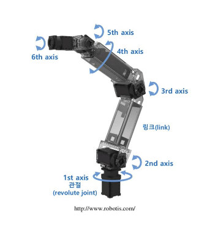

<br>
<br>

The robot we will model with URDF is a manipulator. The basic structure of a manipulator consists of a base, links, joints, and an end effector, as shown below.

## 2.1 Basic Structure of a Manipulator

- Base: the part where the manipulator is fixed
    - Depending on the purpose, it can be the floor within the workspace
    - It can also be a dynamically moving mobile robot
- Link: acts as a rigid body that connects the base, joints, and end effector
    - \- Simply put, you can think of it as a frame
- Joint: the part that creates the robot's movement
    - Has dynamic motion such as revolute (rotational) and prismatic (translational) types
- End effector: the part or equipment that corresponds to a human hand
    - Varies depending on the robot's purpose, such as gripping or suctioning to lift, or spraying paint

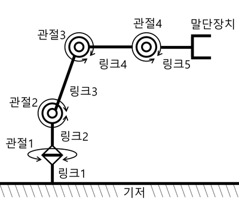

Among the components, the most important parts are the links and joints.

- Link `<link>` = the link's name, appearance, mass (kg), and moment of inertia (kg·m^2)
    - Appearance: simple models such as cylinders, cones, and rectangular boxes are used. For complex structures, the `stl` and `dae` (`collada`) formats that represent meshes are used
- Joint `<joint>` = the joint's name, type, reference axis of motion, minimum and maximum joint values, and the force / velocity applied to the joint
    - A joint describes the relationship with the preceding/following links
    - It can be defined with various joint types as shown below

# 3. Creating the Description Package

Let's write the basic information of the manipulator described above as URDF. In the ROS community, a package containing a robot's modeling information is commonly named `robotname_description`.

- If you search for `description` in the [ROS Index](https://index.ros.org/), you can find various already-written URDFs as examples

Let's create the `testbot_description` package that we will write.

```bash
# Create a package to hold the robot's modeling information
$ cd ~/robot_ws/src
$ ros2 pkg create testbot_description --build-type ament_cmake --dependencies urdf

# Create the urdf folder and then create the urdf file
$ cd testbot_description
$ mkdir urdf
$ cd urdf
$ vim testbot.urdf
```

## 3.1 Full URDF Example

  ```bash
  <?xml version="1.0" ?>
  <robot name="testbot">
  
    <material name="green">
      <color rgba="0 0.6 0 1" />
    </material>
    <material name="orange">
      <color rgba="1.0 0.4 0.0 1.0"/>
    </material>
  
    <link name="base"/>
  
    <link name="link1">
      <inertial>
        <origin xyz="0.0 0.0 0.25" rpy="0.0 0.0 0.0"/>
        <mass value="1.0"/>
        <inertia ixx="1.0" ixy="0.0" ixz="0.0" iyy="1.0" iyz="0.0" izz="1.0"/>
      </inertial>
      <visual>
        <origin xyz="0.0 0.0 0.25" rpy="0.0 0.0 0.0"/>
        <geometry>
          <box size="0.1 0.1 0.5"/>
        </geometry>
        <material name="green"/>
      </visual>
      <collision>
        <origin xyz="0.0 0.0 0.25" rpy="0.0 0.0 0.0"/>
        <geometry>
          <box size="0.1 0.1 0.5"/>
        </geometry>
      </collision>
    </link>
  
    <link name="link2">
      <inertial>
        <origin xyz="0.0 0.0 0.25" rpy="0.0 0.0 0.0"/>
        <mass value="1.0"/>
        <inertia ixx="1.0" ixy="0.0" ixz="0.0" iyy="1.0" iyz="0.0" izz="1.0"/>
      </inertial>
      <visual>
        <origin xyz="0.0 0.0 0.25" rpy="0.0 0.0 0.0"/>
        <geometry>
          <box size="0.1 0.1 0.5"/>
        </geometry>
        <material name="orange"/>
      </visual>
      <collision>
        <origin xyz="0.0 0.0 0.25" rpy="0.0 0.0 0.0"/>
        <geometry>
          <box size="0.1 0.1 0.5"/>
        </geometry>
      </collision>
    </link>
  
    <link name="link3">
      <inertial>
        <origin xyz="0.0 0.0 0.5" rpy="0.0 0.0 0.0"/>
        <mass value="1.0"/>
        <inertia ixx="1.0" ixy="0.0" ixz="0.0" iyy="1.0" iyz="0.0" izz="1.0"/>
      </inertial>
      <visual>
        <origin xyz="0.0 0.0 0.5" rpy="0.0 0.0 0.0"/>
        <geometry>
          <box size="0.1 0.1 1.0"/>
        </geometry>
        <material name="green"/>
      </visual>
      <collision>
        <origin xyz="0.0 0.0 0.5" rpy="0.0 0.0 0.0"/>
        <geometry>
          <box size="0.1 0.1 1.0"/>
        </geometry>
      </collision>
    </link>
  
    <link name="link4">
      <inertial>
        <origin xyz="0.0 0.0 0.25" rpy="0.0 0.0 0.0"/>
        <mass value="1.0"/>
        <inertia ixx="1.0" ixy="0.0" ixz="0.0" iyy="1.0" iyz="0.0" izz="1.0"/>
      </inertial>
      <visual>
        <origin xyz="0.0 0.0 0.25" rpy="0.0 0.0 0.0"/>
        <geometry>
          <box size="0.1 0.1 0.5"/>
        </geometry>
        <material name="orange"/>
      </visual>
      <collision>
        <origin xyz="0.0 0.0 0.25" rpy="0.0 0.0 0.0"/>
        <geometry>
          <box size="0.1 0.1 0.5"/>
        </geometry>
      </collision>
    </link>
  
    <joint name="base_joint" type="fixed">
      <parent link="base"/>
      <child link="link1"/>
    </joint>
  
    <joint name="link1_link2" type="revolute">
      <origin xyz="0.0 0.0 0.5" rpy="0.0 0.0 0.0"/>
      <parent link="link1"/>
      <child link="link2"/>
      <axis xyz="0.0 0.0 1.0"/>
      <limit lower="-2.617" upper="2.617" effort="30.0" velocity="1.571"/>
    </joint>
  
    <joint name="link2_link3" type="revolute">
      <origin xyz="0.0 0.0 0.5" rpy="0.0 0.0 0.0"/>
      <parent link="link2"/>
      <child link="link3"/>
      <axis xyz="0.0 1.0 0.0"/>
      <limit lower="-2.617" upper="2.617" effort="30.0" velocity="1.571"/>
    </joint>
  
    <joint name="link3_link4" type="revolute">
      <origin xyz="0.0 0.0 1.0" rpy="0.0 0.0 0.0"/>
      <parent link="link3"/>
      <child link="link4"/>
      <axis xyz="0.0 1.0 0.0"/>
      <limit lower="-2.617" upper="2.617" effort="30.0" velocity="1.571"/>
    </joint>
  
  </robot>
  ```

## 3.2 Screen Rendered in RViz
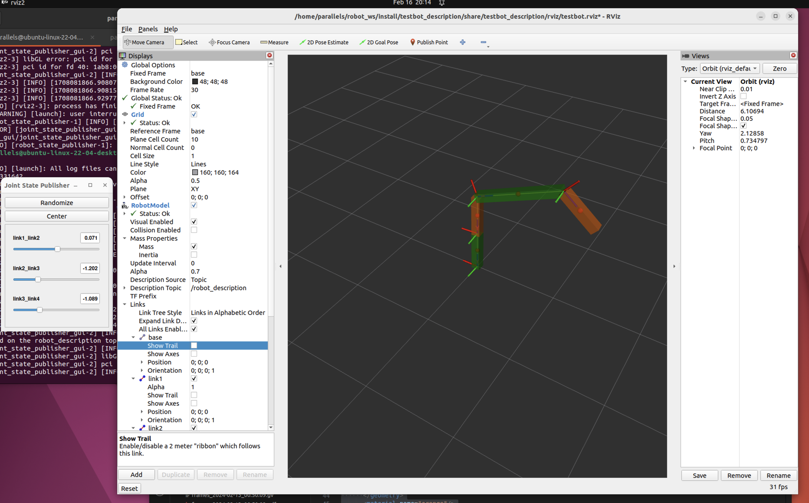

# 4. Writing the URDF

URDF is an XML specification for describing a robot, and it describes each component of the robot using XML tags. This specification is designed to be as general as possible, but it cannot describe every robot. The main constraints are that it can only represent tree structures, so robots that operate in parallel are difficult to model. It also assumes that the robot's joints consist of rigid links, and does not support flexible elements.

> You can check the specification for URDF XML in the ROS documentation. https://wiki.ros.org/urdf/XML

## 4.1 `<robot>`
The `<robot>` tag is the `root` element of the robot description file and must be declared first. The description of the robot consists of a set of link elements and joint elements that connect the links to each other.

```xml
<?xml version="1.0" ?>
<robot name="testbot">

  <link name="base"/>
  <link name="link1"> ... </link>
  <link name="link2"> ... </link>

  <joint name="base_joint" type="fixed"> ... </joint>
  <joint name="link1_link2" type="fixed"> ... </joint>
  <joint name="link2_link3" type="fixed"> ... </joint>

</robot>
```

## 4.2 `<link>`
The `<link>` tag is generally used to represent each part of the robot (e.g. body, arm, leg, wheel, etc.), and each link is connected to other links through joints.

The base, which is the first component of the manipulator, is represented as a link in URDF. The base is connected to the first link by a joint, and this joint is set to the `fixed` type so that it does not move, fixed in place at the origin (0.0, 0.0, 0.0).

```xml
<link name="base">

<joint name="base_joint" type="fixed">
    <parent link="base"/>
    <child link="link1"/>
</joint>

<link name="link1">
    <visual>
      <origin xyz="0.0 0.0 0.25" rpy="0.0 0.0 0.0"/>
      <geometry>
        <box size="0.1 0.1 0.5"/>
      </geometry>
      <material name="green"/>
    </visual>
    <collision>
      <origin xyz="0.0 0.0 0.25" rpy="0.0 0.0 0.0"/>
      <geometry>
        <box size="0.1 0.1 0.5"/>
      </geometry>
    </collision>
		<inertial>
      <origin xyz="0.0 0.0 0.25" rpy="0.0 0.0 0.0"/>
      <mass value="1.0"/>
      <inertia ixx="1.0" ixy="0.0" ixz="0.0" iyy="1.0" iyz="0.0" izz="1.0"/>
    </inertial>
</link>
```

<br>
<br>

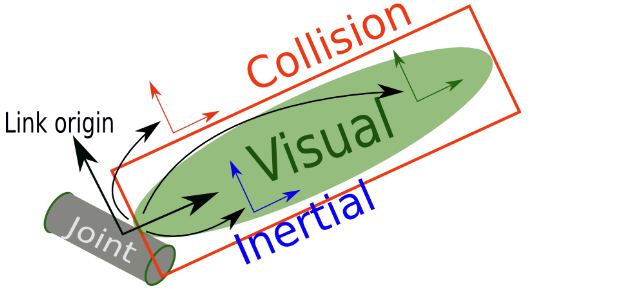

A `<link>` consists of the visual `<visual>`, collision `<collision>`, and inertial `<inertial>` tags.

- common tag

    - `<origin>` \- the origin coordinates
        - The coordinates express the robot's position in 3D space through the `xyz` coordinate system, and express the robot's orientation through the `rpy` Euler angles
        - The units used are `xyz` (meter) and `rpy` (radian)
- `<visual>`
    - The `<geometry>` tag specifies the display range, shape, and size centered on the origin coordinates
        - The model's shape input provides box, cylinder, and sphere forms by default
        - For models that are difficult to represent, you can also input CAD files such as STL and DAE
- `<collision>`
    - In the `<collision>` tag, you input information that represents the link's interference range
    - The `<origin>` and `<geometry>` tags are the same as mentioned above, but they represent the interference range rather than the display range, and you can make it larger than the display range of the `<visual>` tag to consider safety even more
- `<inertial>`
    - This tag specifies the physical properties: mass and the inertia tensor values
    - The `<mass>` tag is the link's mass (unit: kg)
    - The `<inertia>` tag defines the moments of inertia (unit: kg·m^2) as a 3x3 rotational inertia matrix. Since it is symmetric, only the underlined values below need to be defined

      | ixx  | ixy  | ixz  |
          | ---- | ---- | ---- |
      | ixy  | iyy  | iyz  |
      | ixz  | iyz  | izz  |

  > [Example of 3D inertia tensor values](https://en.wikipedia.org/wiki/List_of_moments_of_inertia#List_of_3D_inertia_tensors)

### 4.2.1 `<material>`

The `<material>` tag is used to specify the color or texture of a link.

- The color is specified with the `<rgba>` tag
    - You can set it by entering numbers between 0.0 and 1.0 corresponding to red, green, and blue respectively
    - The last number is the transparency (alpha), with a value between 0.0 and 1.0; a value of 1.0 means displaying the original color as-is without using the transparency option
- `<texture>` textures are specified as a file (e.g. .png)

```xml
<material name="green">
    <color rgba="0 0.6 0 1" />
</material>
<material name="orange">
  <color rgba="1.0 0.4 0.0 1.0"/>
</material>
```

## 4.3 `<joint>`

The `<joint>` tag is used to define the robot's joints, and each joint connects two links and defines how they can move.

### 4.3.1 Joint Types Supported by URDF

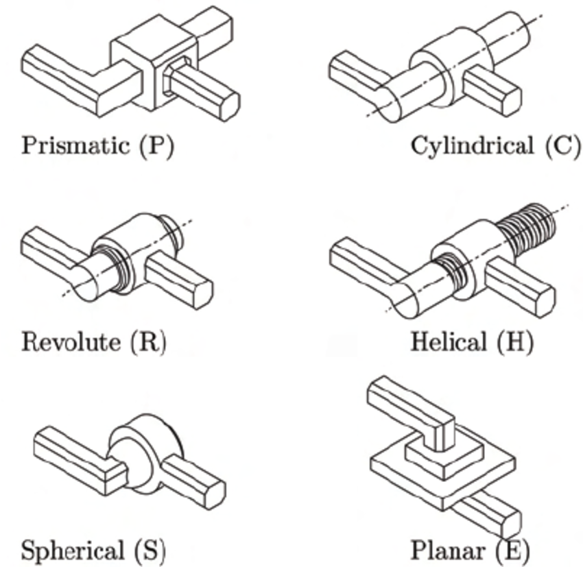

<br>

- `fixed`: a joint where no movement is allowed
- `revolute`: a joint that rotates within a certain angular range, like the left-right rotation of a fan
- `continuous`: a joint that rotates continuously, like a car wheel
- `prismatic`: a joint that slides linearly along a single axis, with maximum and minimum position limits
- `floating`: a joint that allows 6-DOF translation and rotation
- `planar`: a joint that can translate and rotate perpendicular to a single plane

<br>
<br>

```xml
<joint name="link1_link2" type="revolute">
    <origin xyz="0.0 0.0 0.5" rpy="0.0 0.0 0.0"/>
    <parent link="link1"/>
    <child link="link2"/>
    <axis xyz="0 0 1"/>
    <limit lower="-2.617" upper="2.617" effort="30.0" velocity="1.571"/>
</joint>
```

<br>
<br>

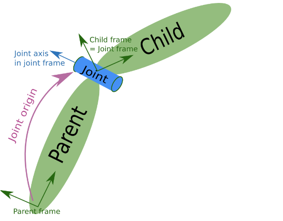

- `<parent>`, `<child>`
    - For the links being connected, you specify the names of the parent link and the child link; generally, you can think of the link closer to the base as the parent link
- `<axis>`
    - Defines the axis of rotation. The axis is defined relative to the robot's reference coordinates and determines the direction of rotational motion.
        - `<axis xyz="0 0 1"/>` sets x and y to zero and only sets the z value, so in the case of the `link1` and `link2` joint, it rotates around the z axis like the neck of a fan
- `<limit>`
    - Sets the constraints on the joint's motion.
        - The attributes set the limit values for the minimum and maximum joint (lower, upper, unit: radian), the force applied to the joint (effort, unit: N), and the velocity (unit: rad/s)
    - 2.617 radians is about 150 degrees

> To understand each tag and the values they set, it helps to change the values directly and test how the robot is rendered and how it moves in RViz, which aids in understanding URDF

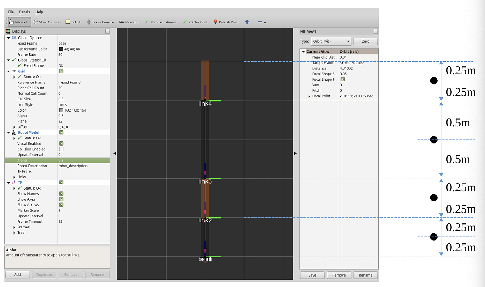

References

- https://wiki.ros.org/urdf/XML/link
- [Adding physical and collision properties](https://docs.ros.org/en/humble/Tutorials/Intermediate/URDF/Adding-Physical-and-Collision-Properties-to-a-URDF-Model.html)
- https://duvallee.tistory.com/11

# 5. Creating and Running the URDF Launch File

## 5.1 Creating the Launch File

You can simply check the syntax or the rendered appearance of the URDF you wrote using commands such as `check_urdf` or `urdf_to_graphiz` (see: 8. URDF file validation check), but for a more detailed model, checking it in RViz is best. To do this, first move to the `testbot_description` package folder and create the `testbot.launch.py` file as shown in the following example.

```bash
$ cd ~/robot_ws/src/testbot_description
$ mkdir launch
$ cd launch
$ vim testbot.launch.py
```

<br>
<br>

```python
import os

from ament_index_python.packages import get_package_share_directory
from launch import LaunchDescription
from launch_ros.actions import Node

def generate_launch_description():
    rviz_display_config_file = os.path.join(
        get_package_share_directory('testbot_description'),
        'rviz',
        'testbot.rviz')
    urdf_file = os.path.join(
        get_package_share_directory('testbot_description'),
        'urdf',
        'testbot.urdf')
    with open(urdf_file, 'r') as infp:
        robot_description_file = infp.read()

    ld = LaunchDescription()

    robot_state_publisher = Node(
        package='robot_state_publisher',
        executable='robot_state_publisher',
        parameters=[
            {'use_sim_time': False},
            {'robot_description': robot_description_file}
        ],
        output='screen')

    joint_state_publisher_gui = Node(
        package='joint_state_publisher_gui',
        executable='joint_state_publisher_gui',
        output='screen')

    rviz2 = Node(
        package='rviz2',
        executable='rviz2',
        arguments=['-d', rviz_display_config_file],
        output='screen')

    ld.add_action(robot_state_publisher)
    ld.add_action(joint_state_publisher_gui)
    ld.add_action(rviz2)

    return ld
```

<br>
<br>

It consists of the `robot_description` parameter containing the URDF, and the `joint_state_publisher`, `robot_state_publisher`, and `rviz2` nodes.

- `joint_state_publisher` node
    - When a URDF is given to the `robot_description` parameter of the parameter server, this node continuously publishes default values for all movable joints of the URDF to the `/joint_states` topic in the form of `sensor_msgs/msg/JointState` messages
    - Published Topic
        - `/joint_states` (`sensor_msgs/JointState`) - the state values of all moving joints in the system
    - ```
    joint_state_publisher_gui
    ```
      provides a GUI tool for commanding the joints

        - 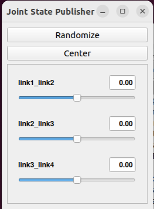

- `robot_state_publisher` node
    - It computes the kinematic tree model (TF) and 3D position information from the robot information set in the URDF and the `sensor_msgs/msg/JointState` topic information, and publishes them to the `/tf` and `/tf_static` topics
    - Published Topics
        - `/robot_description` (`std_msgs/msg/String`) - the String value for the robot URDF. When a value is set in the `robot_description` parameter, it is republished to this topic so that dynamic information can also be conveyed
        - `/tf` (`tf2_msgs/msg/TFMessage`) - sends information about the robot's movable joints
        - `/tf_static` (`tf2_msgs/msg/TFMessage`) - sends information corresponding to the robot's static joints
    - Subscribed Topic
        - `/joint_states` (`sendor_msgs/msg/JointState`) - the joint states for the robot's position are updated

### 5.1.1 RQT
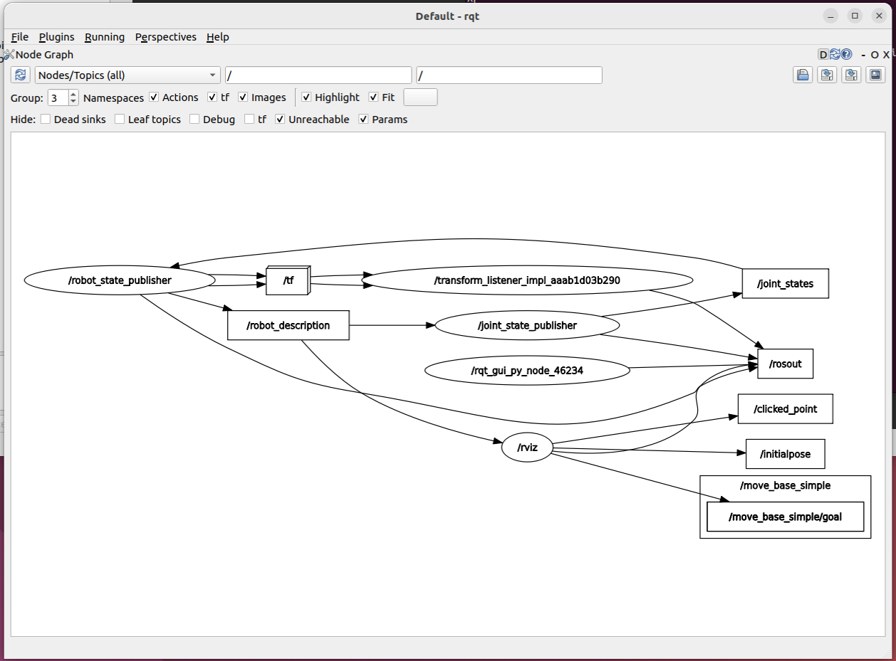

References

- http://wiki.ros.org/robot_state_publisher
- https://github.com/ros/robot_state_publisher
- https://github.com/ros/joint_state_publisher/tree/noetic-devel/joint_state_publisher

## 5.2 Building and Running

After creating the launch file, you just need to create the rviz display configuration file. All files are in the [github repo](https://github.com/kenshin579/tutorials-ros2), so refer to the original files and add them.

For reference, the example `testbot_description` package depends on the following packages, so you need to install them before building.

```bash
$ sudo apt install ros-humble-joint-state-publisher ros-humble-joint-state-publisher-gui ros-humble-robot-state-publisher
```
<br>
<br> 

```bash
# Compile and run the launch
$ cd ~/robot_ws/
$ colcon build --symlink-install
$ ros2 launch testbot_description testbot.launch.py
```
<br>
<br>

> If you create aliases for frequently used commands, you can quickly run ROS-related commands.
>
> ```bash
> alias cba='colcon build --symlink-install'
> alias cbp='colcon build --symlink-install --packages-select'
> alias cw='cd ~/robot_ws'
> alias sl='source $HOME/robot_ws/install/local_setup.bash'
> ```


### 5.2.1 How to Run Without a Launch File

Using `ros-humble-urdf-tutorial`, you can load a URDF into RViz without writing a launch file. The `ros-###-urdf-tutorial` package must be installed.

```bash
# Install
> sudo apt install ros-humble-urdf-tutorial
```

```bash
# Run with the command below
> ros2 launch urdf_tutorial [display.launch.py](<http://display.launch.py/>) model:=/home/parallels/robot_ws/src/testbot_description/urdf/testbot.urdf
```

Just like running it with the launch file, you can see the manipulator rendered in RViz.

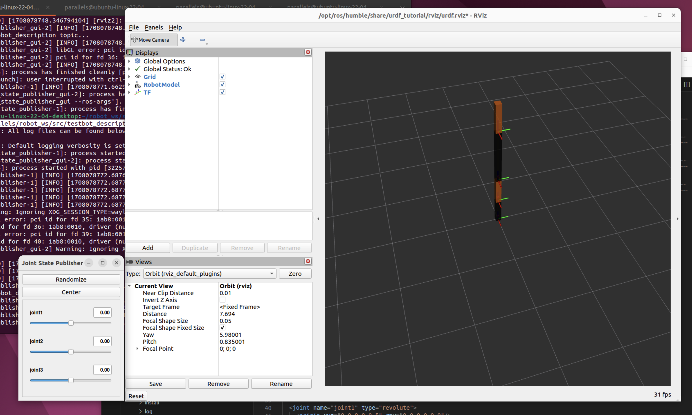

# 6. Tools Needed When Writing URDF

## 6.1 URDF for VSCode

- URDF support
    - Supports XML format for `.urdf` and `.xacro` files
    - Some snippet support
- There doesn't seem to be a supported plugin for JetBrains PyCharm


References

- https://marketplace.visualstudio.com/items?itemName=smilerobotics.urdf

## 6.2 ~~ROS: Preview URDF~~ ← this one doesn't work well

- Marketplace > install the ROS extension
- How to use: open the urdf file, then select `Command Palette` > `ROS: Preview URDF`
    - It works with ROS, but I suspect it doesn't work with ROS 2

### 6.2.1 Expected screen - doesn't work

- When you run it, a blank screen appears

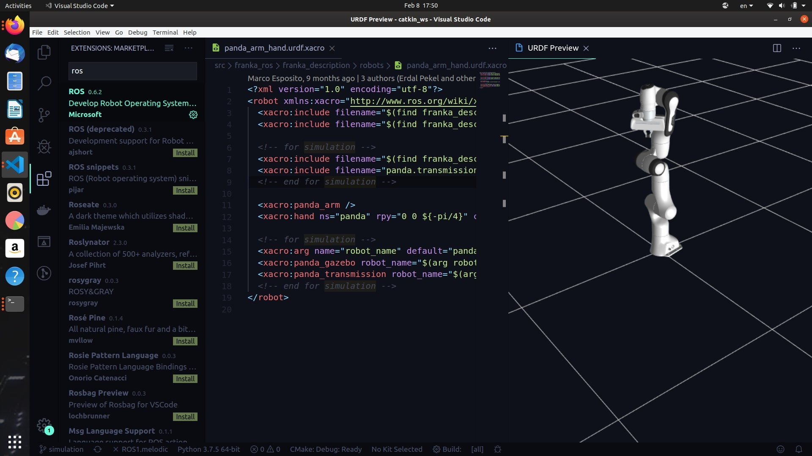

References

- https://hiro-group.ronc.one/vscode_urdf_previewer.html

## 6.3 URDF File Validation Check

There are several commands you can use to verify that the robot model has been written well in URDF.

### 6.3.1 `check_urdf`

In ROS, you can use the `check_urdf` command to check the syntactic errors of the URDF you wrote and the connection relationships of each link.

```bash
$ check_urdf testbot.urdf
robot name is: testbot
---------- Successfully Parsed XML ---------------
root Link: base has 1 child(ren)
    child(1):  link1
        child(1):  link2
            child(1):  link3
                child(1):  link4
```

### 6.3.2 `urdf_to_graphiz`

You can also represent the model you wrote as a `graphiz` diagram. If you run the `urdf_to_graphiz` command as shown below, a .gv file and a .pdf file are created. You can see at a glance the relationships between links and joints, and the relative coordinate transformations between each joint.

```bash
$ urdf_to_graphiz testbot.urdf
Created file testbot.gv
Created file testbot.pdf
```
<br>
<br>

#### 6.3.2.1 The relationship between links and joints in the URDF

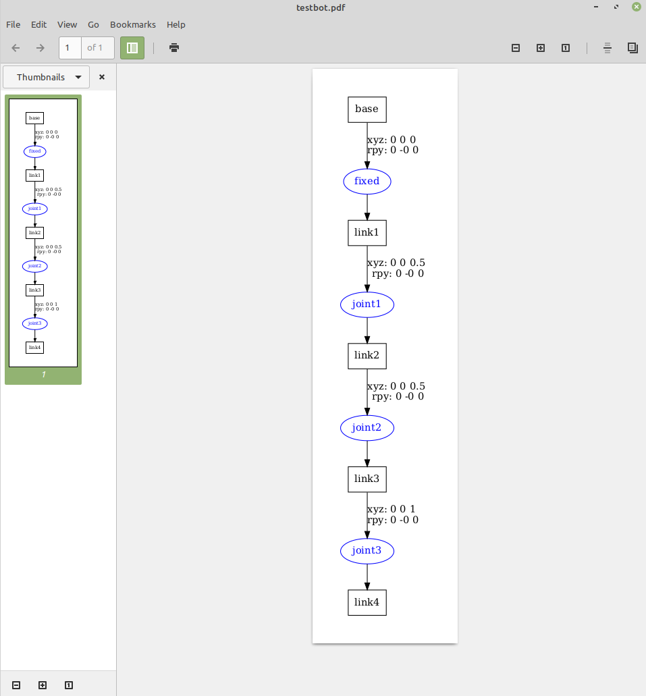


### 6.3.3 `tf2_tools`

`view_frames` is a graphical debugging tool that generates a PDF graph of the current TF tree.

```bash
$ ros2 run tf2_tools view_frames
$ evince frames_2024-02-16_19.20.58.pdf
```

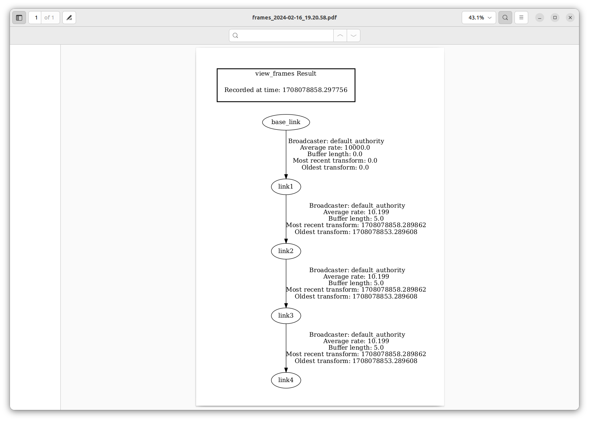

References

- http://wiki.ros.org/tf2_tools
- https://docs.ros.org/en/humble/Tutorials/Intermediate/Tf2/Introduction-To-Tf2.html#tf2-tools

## 6.4 RViz

RViz (ROS Visualization) is one of ROS's visualization tools that visualizes a robot's position and pose, sensor data, map information, etc., allowing the user to understand and debug the robot system. If RViz is not installed, install it with the command below and run it with `rviz2`.

### 6.4.1 Install and Run

```bash
# Install
> sudo apt install ros-humble-rviz2

# Run
> rviz2
```

References

- http://wiki.ros.org/rviz

# 7. FAQ

## 7.1 What is the difference between `xyz` and `rpy`?

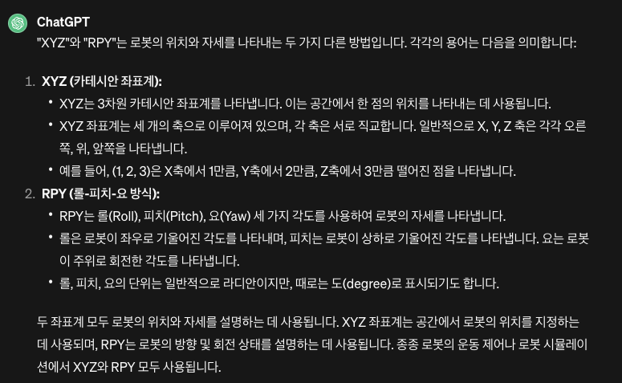

<br>
<br>

### 7.1.1 RPY angles

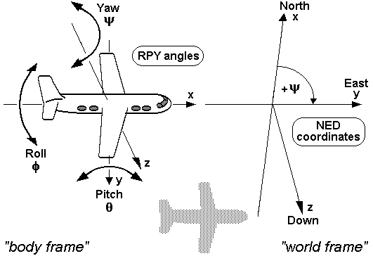

References

- https://commons.wikimedia.org/wiki/RPY_angles
- https://www.youtube.com/watch?v=sFi6i8YzQVA
- https://www.youtube.com/watch?v=Hg3EGzB3oqQ

## 7.2 What is `xacro`?

- A `xacro` file is short for `XML Macro`, a macro language that lets you load repeated code
- You can create a URDF by loading XML, but using `xacro` you can define reusable parts to keep the code concise and improve reusability

### 7.2.1 Xacro Features

#### 7.2.1.1 Properties and property blocks

```xml
<xacro:property name="the_radius" value="2.1" />
<xacro:property name="the_length" value="4.5" />

<geometry type="cylinder" radius="${the_radius}" length="${the_length}" />
```

#### 7.2.1.2 Provides mathematical constants and functions
- e.g. `pi`, `sqrt(x)`, `radians(x)`

```xml
<xacro:property name="circle_revolute_upper" value="${pi/2}"/>
<xacro:property name="circle_revolute_upper" value="${radians(180)}"/>

<origin xyz="0.0 0.0 ${height/2+joint_height}" rpy="0.0 0.0 0.0"/>
```

#### 7.2.1.3 Conditional blocks

- Conditional blocks let you define things differently depending on whether a variable is true (true, 1) or false (false, 0)

```xml
<xacro:property name="var" value="useit"/>

<xacro:if value="${var == 'useit'}">
   <...some xml code here...>
</xacro:if>
<xacro:if value="${var.startswith('use') and var.endswith('it')}">
   <...some xml code here...>
</xacro:if>
```

#### 7.2.1.4 Macros

- A macro can take parameters

```xml
<xacro:macro name="link_box_macro" params="suffix">
    <link name="link_${suffix}">
      <xacro:insert_block name="link_inertial_box" />
      <xacro:insert_block name="link_visual_box" />
      <xacro:insert_block name="link_collision_box" />
    </link>
</xacro:macro>

<xacro:link_box_macro suffix="1" />
```

References

- https://duvallee.tistory.com/17
- http://wiki.ros.org/xacro
- https://kumoh-irl.tistory.com/77

## 7.3 What is the difference between `base_link` and `base_footprint`?

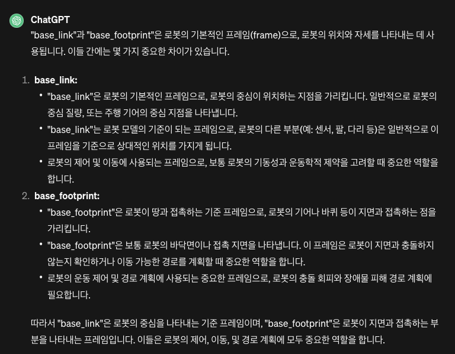

## 7.4 Manipulator

- It is a robotic mechanism that performs motions similar to a human arm
- It usually has multiple degrees of freedom and is a mechanism composed of connected joints that perform relative rotational or sliding motions, for the purpose of gripping or moving an object (a part or tool)

References

- https://terms.tta.or.kr/mobile/dictionaryView.do?subject=머니퓰레이터
- https://roomedia.tistory.com/entry/41일차-매니퓰레이션-소개-및-URDF-작성법

## 7.5 What do `ixx` and `ixy` mean when defining inertia?

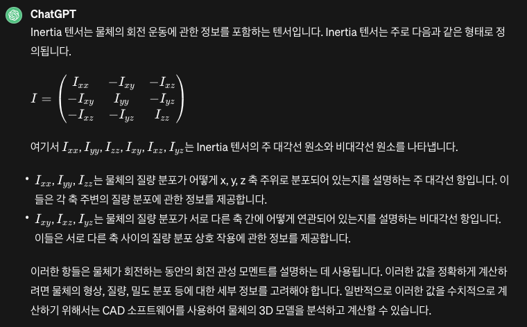

# 8. Next Study Topics

- Controlling the modeled robot
- Robot modeling with Gazebo
- Navigation-related study

# 9. References

- [ROS 2 Course by Yoonseok Pyo](https://cafe.naver.com/openrt/24070)
- [Building a Visual Robot Model with URDF from Scratch](http://wiki.ros.org/urdf/Tutorials/Building a Visual Robot Model with URDF from Scratch)
- http://wiki.ros.org/urdf#Verification
- [URDF for robot models in ROS2](https://app.theconstructsim.com/courses/83)
- https://duvallee.tistory.com/11
