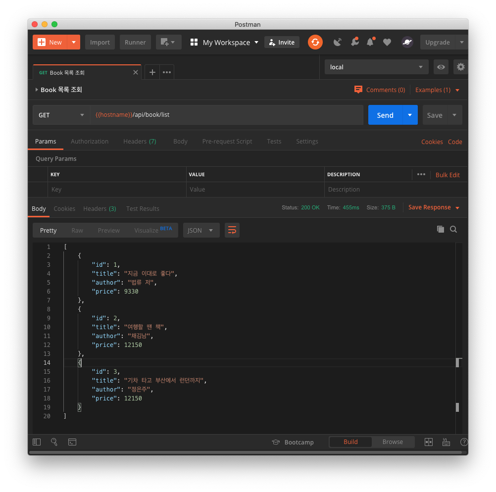
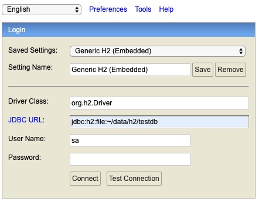
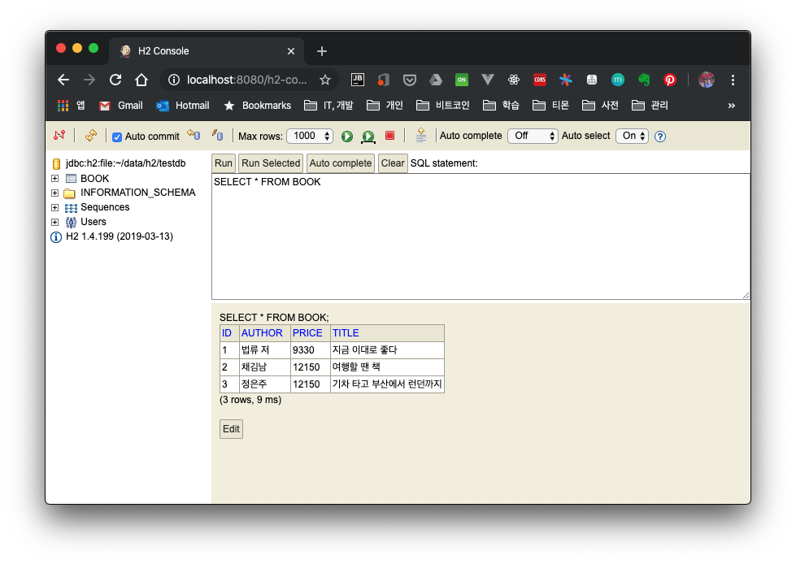
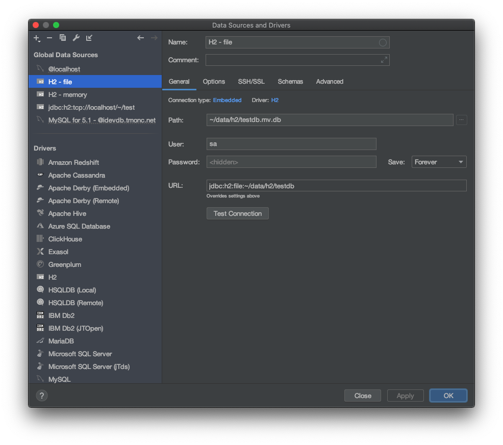
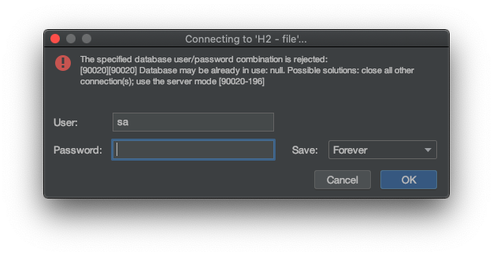
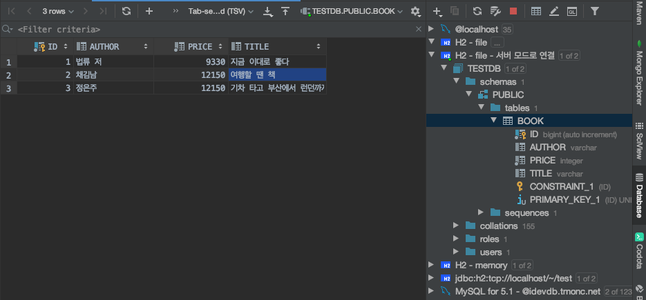

# 1. Introduction

H2 is an open-source database implemented in Java. It can be configured as an in-memory or file-based database. You can either embed it in a Java application or run it in server mode. It is a widely used database thanks to the advantage of being usable as an embedded database right away, without any separate installation process.

In this post, besides the various modes that H2 provides, let's also look at how to connect to H2 from the web console and from IntelliJ.

- Embedded mode
    - Memory
    - File
- Server mode - the same DB can be accessed from multiple tools

# 2. Development Environment

This is the development environment and source code used during the work.

* OS : Mac OS
* IDE: Intellij
* Java : JDK 1.8
* Source code : [github](https://github.com/kenshin579/tutorials-java/tree/master/springboot-data-jpa-h2)
* Software management tool : Maven


# 3. Using the H2 DB in Spring Boot

## 3.1 Writing JPA Sample Code

To connect Spring Boot and the H2 DB, you need to add the H2 library to the pom.xml file.

```xml
<dependency>
  <groupId>com.h2database</groupId>
  <artifactId>h2</artifactId>
</dependency>
```

To test H2 in various environments, let's write some simple JPA sample code. If you set up JPA's automatic DDL generation option (jpa.hiberate.ddl-auto) along with initial data loading, you can easily verify the H2 settings, so let's write the related code and configuration first.

Let's create a simple Book entity to use with JPA.

```java
@Getter
@Setter
@Entity
@NoArgsConstructor
@Table(name = "book")
public class Book {
    @Id
    @GeneratedValue(strategy = GenerationType.IDENTITY)
    private Long id;

    private String title;

    private String author;

    private int price;
}
```

Create a src/main/resources/data.sql file so that the initial data is inserted into the DB. When the server starts, the data.sql script runs and loads the data.

```sql
INSERT INTO book (`title`, `author`, `price`) VALUES ('지금 이대로 좋다', '법류 저', 9330);
INSERT INTO book (`title`, `author`, `price`) VALUES ('여행할 땐 책', '채김남', 12150);
INSERT INTO book (`title`, `author`, `price`) VALUES ('기차 타고 부산에서 런던까지', '정은주', 12150);
```

To also call it via the API, I created the BookController and BookRepository files as well. Please check the source code uploaded to github for these two files.

## 3.2 H2 Database Configuration

### 3.2.1 In-Memory

The datasource values are similar to when configuring other databases.

- spring.datasource.url
    - Connection URL - reference : [Database URL](https://www.h2database.com/html/features.html)
        - H2 supports various URL formats, allowing different modes and settings
    - Examples.
        - Embedded connection : ```jdbc:h2:[file:][<path>][databaseName]```
        - In-memory : ```jdbc:h2:mem:<databaseName>```
        - Server mode : ```jdbc:h2:tcp://<server>[:<port>]/[<path>]<databaseName>```
    - Additional options - for details on the options, please refer to the [H2 homepage](https://www.h2database.com/html/features.html)
        - MODE
            - H2 supports compatibility modes so that it can behave like various other databases. It does not perfectly support every feature
            - ex. MODE=mysql (e.g. INDEX() and KEY() can be used in the CREATE TABLE statement)

```yml
# Database Settings
spring:
  datasource:
    url: jdbc:h2:mem:testdb;MODE=mysql;
    platform: h2
    username: sa
    password:
    driverClassName: org.h2.Driver
```

Since in-memory stores data only in memory, it exists only while the application is running.

### 3.2.2 Configuring with a File

If you configure the DataSource as a file, the data remains even after the application shuts down. If you write the Connection URL in file format, it is saved as a file.

```yml
# Database Settings
spring:
  datasource:
    url: jdbc:h2:file:~/data/h2/testdb;MODE=MySQL
    platform: h2
    username: sa
    password:
    driverClassName: org.h2.Driver
```

## 3.3 Running Spring Boot and Calling the API

Now let's run Spring Boot and check whether everything works fine according to each configuration.

Using Postman, if you call the http://localhost:8080/api/book/list API, you can see the data added to the DB as the response value.



# 4. Connecting with a DB Client

To make DB-related work easier, most people connect with a separate DB client. Let's connect using the H2 web console and the IntelliJ IDE.

## 4.1 H2 Web Console

H2 provides a web console. To use the web console, you need to add spring-boot-devtools to pom.xml.

```xml
 <dependency>
   <groupId>org.springframework.boot</groupId>
   <artifactId>spring-boot-devtools</artifactId>
 </dependency>
```

Set spring.h2.console.enabled to true in application.yml to enable the web console.

```yml
# H2 Settings
h2:
  console:
    enabled: true
    path: /h2-console
```

When you access http://localhost:8080/h2-console, you can see the following screen.




When you set the JDBC URL and click the Connect button, you connect to the DB. Inside this console, you can run queries to check the data.



## 4.2 IntelliJ Database Tool

Next, let's connect with the IntelliJ Database tool. Open the IntelliJ IDE and click Database in the right sidebar. Select H2 as the Data Source and enter the data as shown below.



When you click, a warning window appears saying that the connection failed because the database is already in use. In the case of memory and file, you cannot access it simultaneously. To connect to the same DB from multiple places, you need to connect in server mode.



# 5. Connecting to the H2 DB in Server Mode

Let's look at how to connect to the H2 DB in server mode.

## 5.1 Adding the Configuration File

To connect in server mode, register the following Spring bean.

```java
@Configuration
public class H2ServerConfig {
	
	@Bean(initMethod = "start", destroyMethod = "stop")
	public Server H2DatabaseServer() throws SQLException {
		return Server.createTcpServer("-tcp", "-tcpAllowOthers", "-tcpPort", "9091");
	}
}
```

The methods defined by the initMethod and destroyMethod arguments are run by Spring when the bean is initialized or destroyed; the start and stop methods are executed respectively to start and stop the H2 DB.

- tcp : configures H2 to run as a TCP server
- tcpAllowOthers: a setting that allows access from other external sources
- tcpPort : specifies the port number

## 5.2 Retrying the Connection with the IntelliJ Database

If you try to connect again from the IntelliJ Database tool, you can confirm that it loads without any problems.



# 6. Wrap-up

We looked at how to connect the H2 DB in Spring Boot. We were able to create the DB as in-memory, file, and so on. However, we also confirmed that while only a single connection is allowed, you need to connect in server mode to make multiple connections. In the next post, let's look at how to use the H2 DB when running unit tests.

# 7. References

* Installing and using H2
    * [https://en.wikipedia.org/wiki/H2_(DBMS](https://en.wikipedia.org/wiki/H2_%28DBMS) )
    * [https://jojoldu.tistory.com/234](https://jojoldu.tistory.com/234)
    * [https://www.tutorialspoint.com/h2_database/](https://www.tutorialspoint.com/h2_database/)
    * [http://www.h2database.com/html/cheatSheet.html](http://www.h2database.com/html/cheatSheet.html)
* Spring Boot
    * [https://engkimbs.tistory.com/794](https://engkimbs.tistory.com/794)
* Server mode
    * [https://www.baeldung.com/spring-boot-access-h2-database-multiple-apps](https://www.baeldung.com/spring-boot-access-h2-database-multiple-apps)
    * [https://jehuipark.github.io/java/springboot-h2-tcp-setup](https://jehuipark.github.io/java/springboot-h2-tcp-setup)
