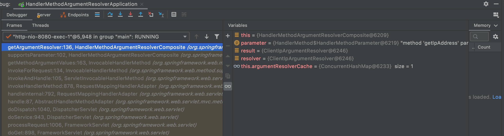

# 1. What Is HandlerMethodArgumentResolver?

## 1.1 Introduction

Let's look at `HandlerMethodArgumentResolver`. As shown below, we often work by adding various argument values (e.g. `@PathVariable`) to controller methods. Such arguments are handled by `HandlerMethodArgumentHandler`.

As needed, we add various argument values to controller methods, and these arguments are handled by `HandlerMethodArgumentHandler`.

```java
@GetMapping
public ResponseEntity<?> getStudentList(
  @PathVariable(value = "version") Integer version,
  @RequestParam(value = "listSize", defaultValue = "10") Integer listSize) {
  ...omitted...
}
```

`HandlerMethodArgumentHandler` is responsible for passing the actual value to the controller according to the annotation or type. Spring also has several Argument Resolvers implemented by default.

- `PathVariableMethodArgumentResolver`
    - an Argument Resolver that handles arguments declared with the `@PathVariable` annotation
- `RequestParamMethodArgumentResolver`
    - specifies the actual value of an argument declared with the `@RequestParam` annotation
- RequestHeaderMapMethodArgumentResolver
    - specifies the actual value of an argument declared with the `@RequestHeader` annotation

Using `HandlerMethodArgumentHandler` has the advantage of reducing duplicate code and extracting it as a common feature for reuse. Now let's implement a custom `HandlerMethodArgumentResolver` ourselves.


# 2. Creating a Custom Argument Resolver

## 2.1 Example of Using an Argument Resolver in a Controller

Let's create a Resolver that can obtain the client IP address when you pass an argument annotated with `@ClientIp` in a controller method.

```java
@RestController
public class IpController {
    @GetMapping("/test")
    public String getIpAddress(@ClientIp String clientIp) {
        return String.format("ip address : %s", clientIp);
    }
}

```

## 2.2 Creating the Argument Resolver

The Argument Resolver interface has two methods, and `resolveArgument()` is executed when `supportsParameter()` is true.

```java
public interface HandlerMethodArgumentResolver {

	boolean supportsParameter(MethodParameter parameter);

	@Nullable
	Object resolveArgument(MethodParameter parameter, @Nullable ModelAndViewContainer mavContainer,
			NativeWebRequest webRequest, @Nullable WebDataBinderFactory binderFactory) throws Exception;

}

```

| Method              | Description                                                       |
| ------------------- | ---------------------------------------------------------- |
| `supportsParameter` | returns true/false for whether the resolver supports the current parameter |
| `resolveArgument`   | returns the actual object to bind                              |


```java
@Slf4j
@Component
public class ClientIpArgumentResolver implements HandlerMethodArgumentResolver {
    @Override
    public boolean supportsParameter(MethodParameter methodParameter) {
        return methodParameter.hasParameterAnnotation(ClientIp.class);
    }

    @Override
    public Object resolveArgument(MethodParameter methodParameter, ModelAndViewContainer modelAndViewContainer, NativeWebRequest nativeWebRequest, WebDataBinderFactory webDataBinderFactory) throws Exception {
        HttpServletRequest request = (HttpServletRequest) nativeWebRequest.getNativeRequest();

        String clientIp = request.getHeader("X-Forwarded-For");
        if (StringUtils.isEmpty(clientIp) || "unknown".equalsIgnoreCase(clientIp)) {
            clientIp = request.getRemoteAddr();
        }
        log.debug("[debug] clientIp : {}", clientIp);
        return clientIp;
    }
}
```

- the `supportsParameter()` method checks whether the argument value includes the ClientIp annotation
- the `resolveArgument()` method has the logic to obtain the actual client IP address from the request

## 2.3 Registering the Argument Resolver

Now you just need to add the Resolver you created earlier in the `addArgumentResolvers()` method.

```java
@RequiredArgsConstructor
@Configuration
public class WebConfig implements WebMvcConfigurer {
    private final ClientIpArgumentResolver clientIpArgumentResolver;

    @Override
    public void addArgumentResolvers(List<HandlerMethodArgumentResolver> argumentResolvers) {
        argumentResolvers.add(clientIpArgumentResolver);
    }
}
```

## 2.4 Running the Controller

Let's verify it with a unit test. The controller is returning the client IP address correctly.

```java
@Test
void getIpAddress() throws Exception {
  this.mockMvc.perform(get("/test"))
  .andDo(print())
  .andExpect(status().isOk())
  .andExpect(jsonPath("$", is("ip address : 127.0.0.1")));
}
```

# 3. How the Argument Resolver Works

We implemented a custom Argument Resolver. Now let's look at how the Argument Resolver is called internally within Spring. This is an image that clearly shows the Argument Resolver operating structure (referenced from [Carrey's tech blog](https://jaehun2841.github.io/2018/08/10/2018-08-10-spring-argument-resolver/#spring-argument-resolver)).


The broad order in which the Argument Resolver runs when processing a request is as follows. You can understand it more easily if you debug during actual execution.

1. The client sends a request
2. The request is handled by the Dispatcher Servlet
3. HandlerMapping processing for the request
    1. (at Spring startup) `RequestMappingHandlerAdapter` registers the necessary Argument resolvers ([#1.2.1](https://blog.advenoh.pe.kr/handler-method-argument-resolver-이란/#121-스프링-기본--Custom-Argument-Resolver은-어디서-등록이-되나))
    2. (on request) `RequestMappingHandlerAdapter.invokeHandlerMethod()` runs the Argument resolver ([#1.2.2](https://blog.advenoh.pe.kr/handler-method-argument-resolver-이란/#122-supportsParameter는-어디에서-호출되나))
        1. `DispatcherServlet.doDispatch()` -> `RequestMappingHandlerAdapter.handleInternal()` -> `invokeHandlerMethod()`
4. The controller method is executed

### 1.2.1 Where Are the Default Spring + Custom Argument Resolvers Registered?

When the `RequestMappingHandlerAdapter` object is initialized (e.g. at Spring startup), `afterPropertiesSet()` calls the `getDefaultArgumentResolvers()` method to register the default Spring resolvers and the custom resolver.

```java
private List<HandlerMethodArgumentResolver> getDefaultArgumentResolvers() {
		List<HandlerMethodArgumentResolver> resolvers = new ArrayList<>(30);
		...omitted...
      
		resolvers.add(new PathVariableMethodArgumentResolver());
		resolvers.add(new RequestPartMethodArgumentResolver(getMessageConverters(), this.requestResponseBodyAdvice));
		resolvers.add(new RequestHeaderMethodArgumentResolver(getBeanFactory()));

    ...omitted...
		// Custom arguments
		if (getCustomArgumentResolvers() != null) {
			resolvers.addAll(getCustomArgumentResolvers());
		}
}
```

### 1.2.2 Where Is supportsParameter Called?

In the `HandlerMethodArgumentResolverComposite.getArgumentResolver()` method, `supportsParameter()` is executed, and if it returns true, the corresponding Argument Resolver is returned.

```java
private HandlerMethodArgumentResolver getArgumentResolver(MethodParameter parameter) {
		HandlerMethodArgumentResolver result = this.argumentResolverCache.get(parameter);
		if (result == null) {
			for (HandlerMethodArgumentResolver resolver : this.argumentResolvers) {
				if (resolver.supportsParameter(parameter)) { //if true, returns resolveArgument as the result
					result = resolver;
					this.argumentResolverCache.put(parameter, result);
					break;
				}
			}
		}
		return result;
}
```

The `getArgumentResolver()` method is called by the several methods below.

- You can confirm that it runs in the order `DispatcherServlet.doDispatch()` -> ...omitted... -> `invokeHandlerMethod()` -> ...omitted... -> `InvocableHandlerMethod.getMethodArgumentValues()` -> `getArgumentResolver()`.




# 4. Wrap-up

`HandlerMethodArgumentResolver` is used to handle argument values in controller methods. Spring already provides many of these as common features, but you can also easily write your own for user purposes, which is handy for reducing a lot of duplicate logic.

You can refer to the related source on [github](https://github.com/kenshin579/tutorials-java/tree/master/springboot-handler-method-argument-resolver).

# 5. References

- https://webcoding-start.tistory.com/59
- https://velog.io/@riechu3228/HandlerMethodArgumentResolver
- http://wonwoo.ml/index.php/post/1092
- https://sun-22.tistory.com/76
- https://www.mscharhag.com/spring/json-schema-validation-handlermethodargumentresolver
- https://jaehun2841.github.io/2018/08/10/2018-08-10-spring-argument-resolver/
- [https://jekalmin.tistory.com/entry/%EC%BB%A4%EC%8A%A4%ED%85%80-ArgumentResolver-%EB%93%B1%EB%A1%9D%ED%95%98%EA%B8%B0](https://jekalmin.tistory.com/entry/커스텀-ArgumentResolver-등록하기)
- https://a1010100z.tistory.com/127
