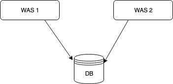
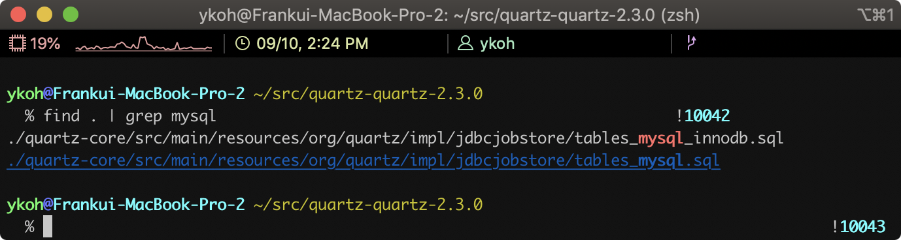
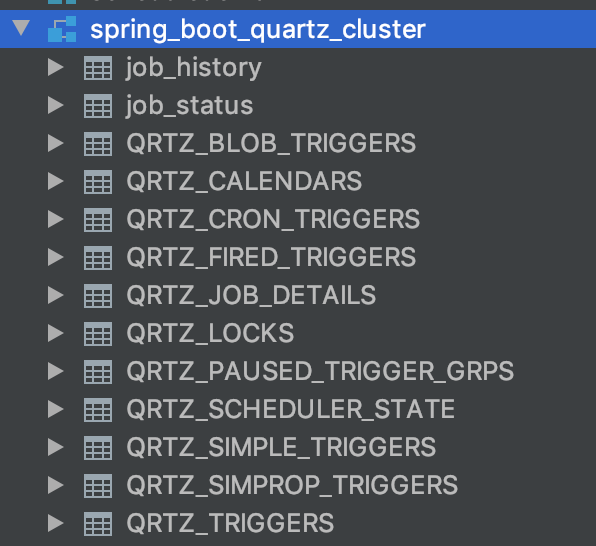
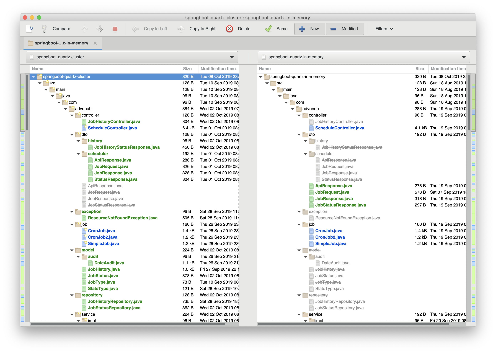
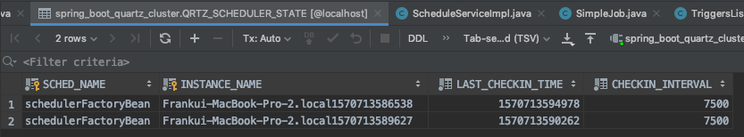
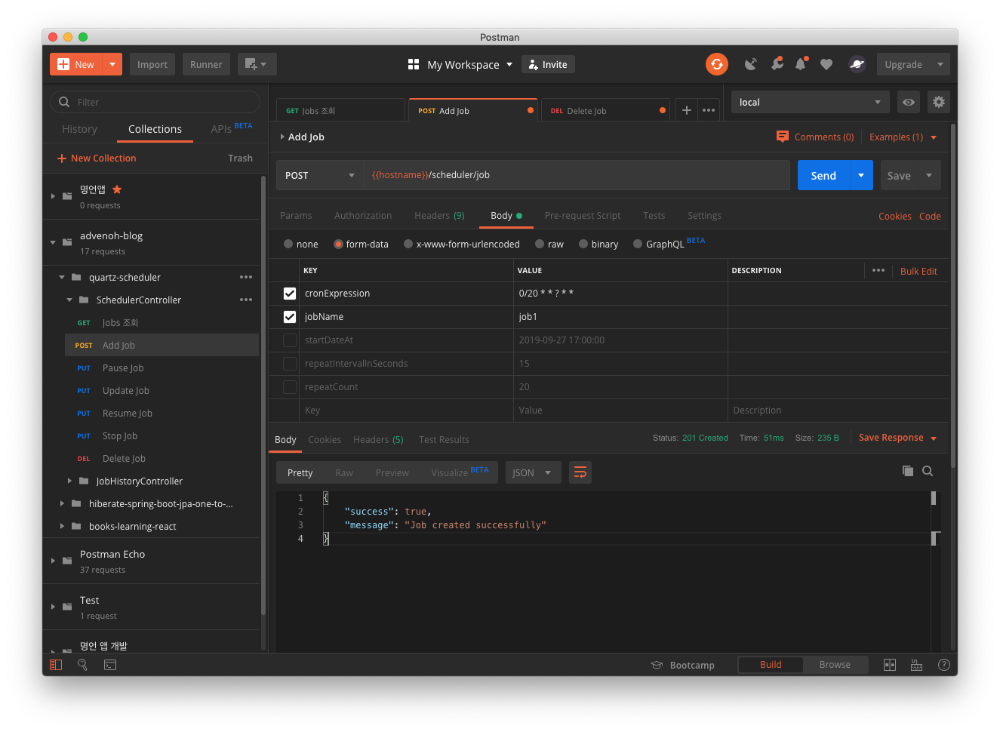
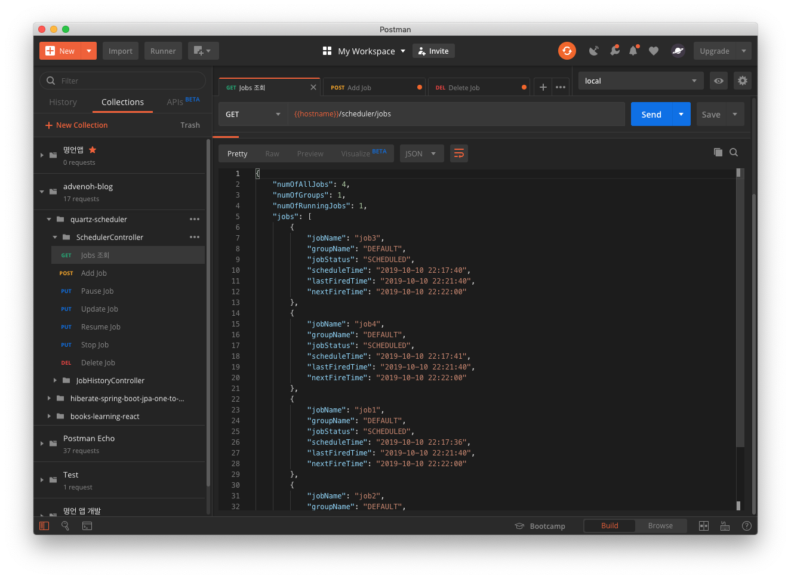
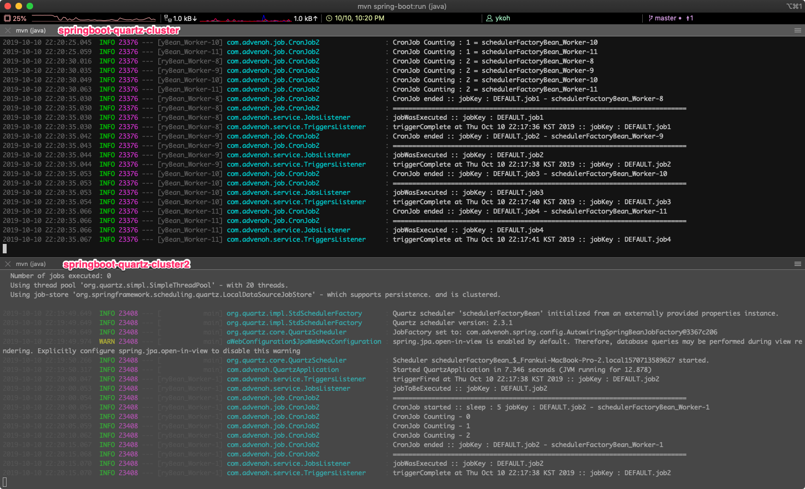

# 1. Introduction

Quartz supports not only a memory-based scheduler but also a DB-based scheduler. In the case of a DB-based scheduler, the scheduler information is stored in the DB rather than in memory, so scheduling across multiple servers is possible. Quartz works in a master-slave form where the instances do not communicate with each other; each scheduler instance simply runs the Job it is supposed to run based on DB update information.



Because scheduling is possible in a cluster environment, several advantages are provided by default compared to a non-cluster environment.

- High Availability
    - Even if one server shuts down, the Job is run by another server, so there is no downtime
- Scalability
    - When you start a Quartz-configured server, it is automatically registered in the DB as a scheduler instance
    - A shut-down server is removed from the DB by another server
- Load balancing
    - With a cluster configuration, multiple Jobs are distributed and run across multiple servers
    - Load balancing algorithms include Hashing, Round-robin, etc., but Quartz provides only a random algorithm as a minimal implementation

# 2. Development Environment

Please refer to the github link below for the code written in this post.

- OS : Mac OS
- IDE: Intellij
- Java : JDK 1.8
- Source code : [github](https://github.com/kenshin579/tutorials-java/tree/master/springboot-quartz-cluster)
- Software management tool : Maven

# 3. Building a Spring Boot-Based Quartz Cluster Scheduler

## 3.1 Creating the DB Schema for Quartz

The DB schema is included in the Quartz [source code](https://github.com/quartz-scheduler/quartz/releases), so find the DB schema you want in the source code. I'll use MySql.



```bash
$ cat tables_mysql_innodb.sql
```

```sql
…(omitted)...
CREATE TABLE QRTZ_JOB_DETAILS(
SCHED_NAME VARCHAR(120) NOT NULL,
JOB_NAME VARCHAR(190) NOT NULL,
JOB_GROUP VARCHAR(190) NOT NULL,
DESCRIPTION VARCHAR(250) NULL,
JOB_CLASS_NAME VARCHAR(250) NOT NULL,
IS_DURABLE VARCHAR(1) NOT NULL,
IS_NONCONCURRENT VARCHAR(1) NOT NULL,
IS_UPDATE_DATA VARCHAR(1) NOT NULL,
REQUESTS_RECOVERY VARCHAR(1) NOT NULL,
JOB_DATA BLOB NULL,
PRIMARY KEY (SCHED_NAME,JOB_NAME,JOB_GROUP))
ENGINE=InnoDB;
…(omitted)...
```

Create a database for quartz in the DB and run the schema script.

```sql
mysql> CREATE DATABASE spring_boot_quartz_cluster
```



## 3.2 Adding Maven Libraries

Add the libraries needed in Spring Boot to configure the Quartz Cluster.

```xml
<dependency>
    <groupId>org.springframework.boot</groupId>
    <artifactId>spring-boot-starter-data-jpa</artifactId>
</dependency>
<dependency>
    <groupId>org.springframework.boot</groupId>
    <artifactId>spring-boot-starter-quartz</artifactId>
</dependency>
<dependency>
    <groupId>mysql</groupId>
    <artifactId>mysql-connector-java</artifactId>
    <version>5.1.48</version>
</dependency>
```

## 3.3 Quartz-Related Configuration

### 3.3.1 Configuring the DataSource and Quartz Property Values

The dataSource configuration in Spring Boot is simple. Thanks to the @EnableAutoConfiguration annotation (included by the @SpringBootApplication annotation), the spring.datasource.\* properties in application.properties are automatically recognized once defined.

However, if you implement a separate DataSource with JavaConfig and register it as a Bean, the spring.datasource.\* properties are not applied.

```
## Spring DATASOURCE (DataSourceAutoConfiguration & DataSourceProperties)
spring.datasource.platform=org.hibernate.dialect.MySQL5Dialect
spring.datasource.driver-class-name=com.mysql.jdbc.Driver
spring.datasource.url=jdbc:mysql://localhost:3306/spring_boot_quartz_cluster?useSSL=false&serverTimezone=UTC&useLegacyDatetimeCode=false
spring.datasource.username=mybatis
spring.datasource.password=mybatis$
```

For details on the Quartz properties, please refer to the [official Quartz page](http://www.quartz-scheduler.org/documentation/quartz-2.3.0/configuration/#configuration-reference). I added brief extra explanations for the parts I personally didn't understand.

```
#Quartz
spring.quartz.scheduler-name=QuartzScheduler
[spring.quartz.properties.org.quartz.scheduler.instanceId=AUTO](http://spring.quartz.properties.org.quartz.scheduler.instanceid=auto/)
[spring.quartz.properties.org.quartz.threadPool.threadCount=20](http://spring.quartz.properties.org.quartz.threadpool.threadcount=20/)
[spring.quartz.properties.org.quartz.jobStore.tablePrefix=QRTZ](http://spring.quartz.properties.org.quartz.jobstore.tableprefix=qrtz/) _
[spring.quartz.properties.org.quartz.jobStore.isClustered=true](http://spring.quartz.properties.org.quartz.jobstore.isclustered=true/)
[spring.quartz.properties.org.quartz.jobStore.class=org.quartz.impl.jdbcjobstore.JobStoreTX](http://spring.quartz.properties.org.quartz.jobstore.class=org.quartz.impl.jdbcjobstore.jobstoretx/)
[spring.quartz.properties.org.quartz.jobStore.driverDelegateClass=org.quartz.impl.jdbcjobstore.StdJDBCDelegate](http://spring.quartz.properties.org.quartz.jobstore.driverdelegateclass=org.quartz.impl.jdbcjobstore.stdjdbcdelegate/)
[spring.quartz.properties.org.quartz.jobStore.useProperties=true](http://spring.quartz.properties.org.quartz.jobstore.useproperties=true/)
[spring.quartz.properties.org.quartz.jobStore.misfireThreshold=60000](http://spring.quartz.properties.org.quartz.jobstore.misfirethreshold=60000/)
```

- jobStore.useProperties=true
    - If this value is true, the values stored in the JobDataMaps in the DB are stored as string values rather than binary
- jobStore.misfireThreshold=60000 (default value : 1 minute)
    - When a Job should run but the server was shut down or there are not enough threads, it may not run on time; this case is called a misfire
    - This is the time after which a Trigger is considered to have misfired; after 1 minute passes, it is judged to have misfired

### 3.3.2 Configuring the dataSource in Quartz

Just specify the dataSource in the SchedulerFactoryBean.

```java
@Autowired
private DataSource dataSource;

@Bean
public SchedulerFactoryBean schedulerFactoryBean(ApplicationContext applicationContext) {
	…(omitted)...
	schedulerFactoryBean.setDataSource(dataSource); // you only need to add this part
	schedulerFactoryBean.setQuartzProperties(properties);
	schedulerFactoryBean.setWaitForJobsToCompleteOnShutdown(true);
	return schedulerFactoryBean;
}
```

Simple, right? If you compare it with [Implementing a Job Scheduler Using Spring Boot + Quartz (In-memory)](https://blog.advenoh.pe.kr/spring-boot-quartz%EC%9D%84-%EC%9D%B4%EC%9A%A9%ED%95%9C-job-scheduler-%EA%B5%AC%ED%98%84-In-memory/), you can easily grasp at a glance how the configuration differs. Among the programs that compare files or folders, I personally make good use of an open source tool called [Meld](http://meldmerge.org/).

Install it once and try comparing. You can grasp it more easily by just looking at the code than from the blog.

```bash
$ brew cask install meld
$ cd tutorials-java
$ meld springboot-quartz-cluster/ springboot-quartz-in-memory
```



### 3.3.3 Running Duplicated Servers

Shall we check whether the scheduler runs fine even when the server is run in a duplicated (redundant) configuration? First, I'll copy the project.

```bash
$ cp -r springboot-quartz-cluster/ springboot-quartz-cluster2
```

After copying, change the server port to a different number.

```bash
$ cd springboot-quartz-cluster2
$ code src_main_resources/application.properties
server.port=7070

$ mvn spring-boot:run
```

After running each server, check the QRTZ\_SCHEDULER_STATE table to see whether the two instances are registered.

```sql
mysql> SELECT * FROM QRTZ_SCHEDULER_STATE;
```



Add an arbitrary job in Postman.



When you query with the GET /scheduler/jobs API, you can confirm that it is registered well.



You can also see in the terminal that the job runs on each WAS. If you shut down WAS1 (quartz-cluster), you can confirm that WAS2 (quartz-cluster2) picks up the job and runs it without any problems.



## 3.4 Cautions When Configuring the Quartz Cluster

- Server time synchronization
    - Quartz has many parts that make judgments based on time within its internal logic, so server time synchronization is essential
- Quartz configuration tuning
    - Quartz configuration tuning is needed depending on the Job Workload Type
    - Long Jobs - Jobs that run for a long time (e.g. CPU intensive)
    - Short Jobs - Jobs that run briefly (e.g. run every second)
    - Especially in the case of Short Jobs, you must guarantee execution every second. If one server shuts down, a running Job misfires, and if there is a condition that another server must immediately take over and run it, tuning is essential
        - For reference, there were many Short Jobs on the server I'm currently operating, so I tuned it as below

```
#============================================================================
# Configure Main Scheduler Properties
#============================================================================
org.quartz.scheduler.instanceName=admin-tmon-media
org.quartz.scheduler.instanceId=AUTO
org.quartz.scheduler.batchTriggerAcquisitionMaxCount=20
org.quartz.scheduler.idleWaitTime=1000
org.quartz.scheduler.skipUpdateCheck=true

#============================================================================
# Configure ThreadPool
#============================================================================

org.quartz.threadPool.threadCount=20
org.quartz.threadPool.threadNamePrefix=QuartzScheduler

#============================================================================
# Configure JobStore
#============================================================================

org.quartz.jobStore.class=org.quartz.impl.jdbcjobstore.JobStoreCMT
org.quartz.jobStore.driverDelegateClass=org.quartz.impl.jdbcjobstore.StdJDBCDelegate
org.quartz.jobStore.useProperties=true
org.quartz.jobStore.misfireThreshold=1100
org.quartz.jobStore.tablePrefix=QRTZ\_
org.quartz.jobStore.isClustered=true
org.quartz.jobStore.clusterCheckinInterval=15000
org.quartz.jobStore.acquireTriggersWithinLock=true
```

## 3.5 Job History Feature

Quartz only manages currently running Jobs and does not record the Job History. I thought it would be nice to add it to the main page of the admin UI later, so I worked on it this time as well. I'll cover this content in the admin UI post.

# 4. Wrap-up

The Quartz Cluster configuration can be set up without much difficulty by just configuring the DB dataSource properties and the cluster-related settings.

Quartz uses a DB in a cluster environment and acquires a lock and updates information every time it accesses the DB. When there are many Quartz servers or a large number of Short Jobs, more locks can occur, increasing the likelihood that a Job you want to run will misfire. In such cases, I think it would be good to use another storage such as Redis.

Quartz provides only two storages by default (Memory, DB), but there are implementations on Github that allow storing in storages such as Redis or MongoDB. If running with a DB becomes a problem, it would be good to try storing in another storage.

# 5. References

- Quartz Cluster
    - [https://jeroenbellen.com/configuring-a-quartz-scheduler-in-a-clustered-spring-boot-application/](https://jeroenbellen.com/configuring-a-quartz-scheduler-in-a-clustered-spring-boot-application/)
    - [https://github.com/heidiks/spring-boot-quartz-cluster-environment](https://github.com/heidiks/spring-boot-quartz-cluster-environment)
    - [https://medium.com/@Hronom/spring-boot-quartz-scheduler-in-cluster-mode-457f4535104d](https://medium.com/@Hronom/spring-boot-quartz-scheduler-in-cluster-mode-457f4535104d)
    - [https://flylib.com/books/en/2.65.1/how_clustering_works_in_quartz.html](https://flylib.com/books/en/2.65.1/how_clustering_works_in_quartz.html)
    - [https://www.baeldung.com/spring-quartz-schedule](https://www.baeldung.com/spring-quartz-schedule)
    - [https://kingbbode.tistory.com/38](https://kingbbode.tistory.com/38)
    - [https://www.callicoder.com/spring-boot-quartz-scheduler-email-scheduling-example/](https://www.callicoder.com/spring-boot-quartz-scheduler-email-scheduling-example/)
- How to configure a DataSource in Spring Boot
    - [https://www.holaxprogramming.com/2015/10/16/spring-boot-with-jdbc/](https://www.holaxprogramming.com/2015/10/16/spring-boot-with-jdbc/)
- Unit tests related to JPA page
    - [https://velog.io/@jayjay28/JPA를-이용한-단순-게시물-처리](https://velog.io/@jayjay28/JPA%EB%A5%BC-%EC%9D%B4%EC%9A%A9%ED%95%9C-%EB%8B%A8%EC%88%9C-%EA%B2%8C%EC%8B%9C%EB%AC%BC-%EC%B2%98%EB%A6%AC)
- JobStore
    - [https://dzone.com/articles/using-quartz-for-scheduling-with-mongodb](https://dzone.com/articles/using-quartz-for-scheduling-with-mongodb)
    - [https://github.com/jlinn/quartz-redis-jobstore](https://github.com/jlinn/quartz-redis-jobstore)
- Misfire
    - [https://dzone.com/articles/quartz-scheduler-misfire](https://dzone.com/articles/quartz-scheduler-misfire)
    - [https://stackoverflow.com/questions/32075128/avoiding-misfires-with-quartz](https://stackoverflow.com/questions/32075128/avoiding-misfires-with-quartz)
    - [https://www.nurkiewicz.com/2012/04/quartz-scheduler-misfire-instructions.html](https://www.nurkiewicz.com/2012/04/quartz-scheduler-misfire-instructions.html)
- Short Running Jobs
    - [https://airboxlab.github.io/performance/scalability/scheduler/quartz/2017/06/20/perf_tuning_quartz.html](https://airboxlab.github.io/performance/scalability/scheduler/quartz/2017/06/20/perf_tuning_quartz.html)
    - [https://www.ebayinc.com/stories/blogs/tech/performance-tuning-on-quartz-scheduler/](https://www.ebayinc.com/stories/blogs/tech/performance-tuning-on-quartz-scheduler/)
