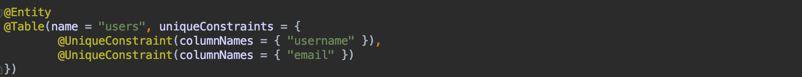
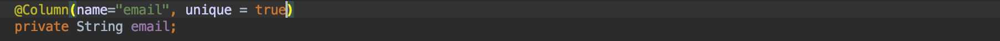
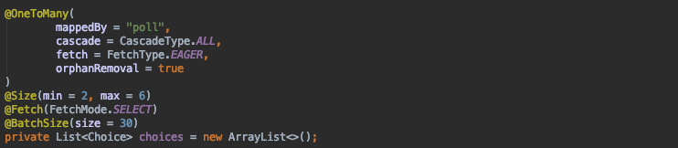
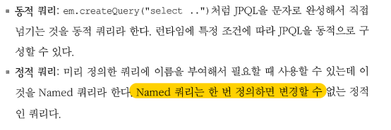

This is material where I personally jot down things I don't know and briefly organize the parts I come to understand.
If you know any of the unanswered ones, please leave a comment. Thank you.

# Full Q&A List

## [Answered]

I organize them in alphabetical order to make them easy to find.

## @EntityScan

This annotation is used to specify where to scan for entity classes. If there are no entity classes within the main application package, you can use this annotation to designate entities that exist outside the package. By default, entities are scanned in the location specified by the @EnableAutoConfiguration annotation.

Reference
* [https://dzone.com/articles/spring-boot-entity-scan](https://dzone.com/articles/spring-boot-entity-scan)

## @UniqueConstraint

This annotation is used when you want to make two or more JPA columns unique.

For reference, to apply a unique setting to a single column, it is as follows.

Reference
* [https://gs.saro.me/dev?page=4&tn=499](https://gs.saro.me/dev?page=4&amp;tn=499)
* [https://stackoverflow.com/questions/3126769/uniqueconstraint-annotation-in-java](https://stackoverflow.com/questions/3126769/uniqueconstraint-annotation-in-java)

## @CreatedDate, @LastModified

This annotation injects the creation date and modification date when the entity object is first saved.

Reference
* [https://eclipse4j.tistory.com/201](https://eclipse4j.tistory.com/201)

## @BatchSize(size=30)

This annotation is one of the ways to solve JPA's N+1 problem. When querying associated entities, it uses SQL's IN clause for the specified size to fetch and query that many at once.

Reference

* [https://joont92.github.io/jpa/JPA-%EC%84%B1%EB%8A%A5-%EC%B5%9C%EC%A0%81%ED%99%94/](https://joont92.github.io/jpa/JPA-%EC%84%B1%EB%8A%A5-%EC%B5%9C%EC%A0%81%ED%99%94/)

- - - -

## [Unanswered Questions]

### - @NaturalId
A named query that can be used instead of a Named query in Hibernate is a static query that cannot be changed once defined.

Reference
* [https://howtodoinjava.com/hibernate/hibernate-naturalid-example-tutorial/](https://howtodoinjava.com/hibernate/hibernate-naturalid-example-tutorial/)

### - @EntityListeners, @EnableJpaAuditing

Reference
* [https://www.logicbig.com/tutorials/java-ee-tutorial/jpa/entity-listeners.html](https://www.logicbig.com/tutorials/java-ee-tutorial/jpa/entity-listeners.html)
* [https://www.logicbig.com/tutorials/java-ee-tutorial/jpa/entity-audit-listener.html](https://www.logicbig.com/tutorials/java-ee-tutorial/jpa/entity-audit-listener.html)
