# 1. Introduction

I wrote the content about the Quartz Job Scheduler in a series format. Let's look at the tutorials below together, starting with a brief explanation of Quartz, then the implementation of the Quartz Job Scheduler on a Spring Boot basis, and also the Quartz Cluster configuration that is widely used in redundant environments.

* Part 1 : [What Is the Quartz Job Scheduler?](https://blog.advenoh.pe.kr/quartz-job-scheduler란/)
* Part 2 : [Implementing a Job Scheduler Using Spring Boot + Quartz (In memory)](https://blog.advenoh.pe.kr/spring-boot-quartz을-이용한-job-scheduler-구현-In-memory/)
* Part 3 : [Implementing a Clustered Quartz Job Scheduler for Multi-WAS Environments](https://blog.advenoh.pe.kr/multi-was-환경을-위한-cluster-환경의-quartz-job-scheduler-구현/)
* Part 4 : [How to Gracefully Shut Down a Job Scheduler by Interrupting a Running Job in Quartz](https://blog.advenoh.pe.kr/quartz에서-실행중인-job을-interrupt하여-job-scheduler를-정상종료-시키는-방법/)

## 1.1 What Is Quartz?

Quartz is a Job Scheduling library developed by a company called [Terracotta](http://www.quartz-scheduler.org/). It is fully developed in Java, so it can be easily integrated and developed in any Java program. Quartz can run anywhere from dozens to thousands of tasks, and it also supports complex scheduling with simple interval formats or Cron expressions. For example, you can specify a task that runs every Friday at 1:30 a.m. or a task that runs on the last day of every month.

## 1.2 Pros and Cons

There are reasons why Quartz is frequently used as a Job Scheduler when developing with Spring, but there are also disadvantages.

Pros

* Provides clustering between schedulers based on a DB
    * Supports system fail-over and round-robin load distribution
* Also provides an in-memory Job Scheduler
* Provides several built-in plugins
    * ShutdownHookPlugin - catches the JVM shutdown event and notifies the scheduler of the shutdown
    * LoggingJobHistoryPlugin - leaves logs about Job execution, which is useful for debugging

Cons
* It provides clustering, but it is a simple random method, so perfect load distribution between clusters is not possible
* It does not provide an admin UI
* It does not keep a history of scheduling executions
* It does not guarantee the Fixed Delay type, so additional work is needed

# 2. Quartz Architecture and Components

To become familiar with the Quartz Scheduler, let's look at the frequently used terms.

## 2.1 Terminology

* **Job**
    * The Quartz API provides the Job interface with a single method, execute(JobExecutionContext context). Developers using Quartz implement the actual work to be performed in this method.
    * When a Job's Trigger fires, the scheduler passes a JobExecutionContext object and calls the execute method.
        * JobExecutionContext is an object that provides information about the Job instance, including the Scheduler, Trigger, JobDetail, etc.

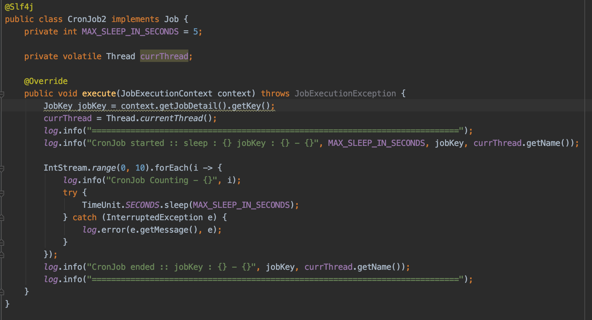

* **JobDataMap**
    * JobDataMap is an object that can hold the information you want so that a Job instance can use it when it runs.
    * When creating a JobDetail, you can set the JobDataMap together
      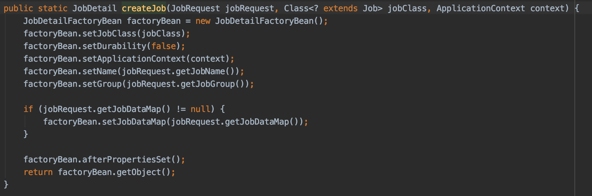
    * When the Job runs, you can access and use the JobDataMap object that you put in when adding the Job to the scheduler, as shown below
      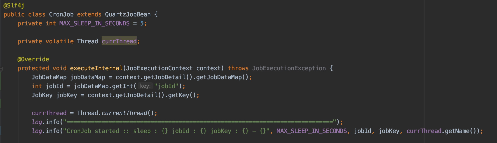

* **JobDetail**
    * This is an object that holds the information for running a Job. You can specify the Job's name, group, JobDataMap properties, etc. When a Trigger runs a Job, it schedules based on this information
      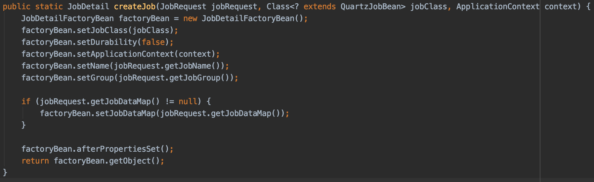

* **Trigger**
    * A Trigger holds the scheduling conditions (e.g. repeat count, start time) for running a Job, and the Scheduler runs the Job based on this information.
    * Summary of the relationship between Trigger and Job
        * 1 Trigger = 1 Job
            * One Trigger must specify exactly one Job
        * N Trigger = 1 Job
            * One Job can be run at multiple times (e.g. every Saturday, every hour)
    * A Trigger can be specified in two forms
        * SimpleTrigger
            * Used to run a Job at a specific time, and you can specify the repeat count, execution interval, etc.
              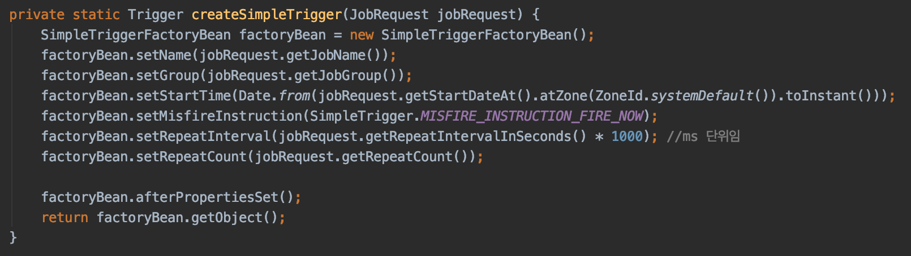
        * CronTrigger
            * CronTrigger is a way to define a Trigger with a cron expression (e.g. every day at 12 o'clock - '0 0 12 * * ?')
            * Like SimpleTrigger, a Cron expression can specify not only simple repetition but also more complex scheduling (e.g. run every few minutes from 3 p.m. to 3 p.m. on the last Friday of every month)
            * For Cron expressions, please refer to [this site](https://www.freeformatter.com/cron-expression-generator-quartz.html)
              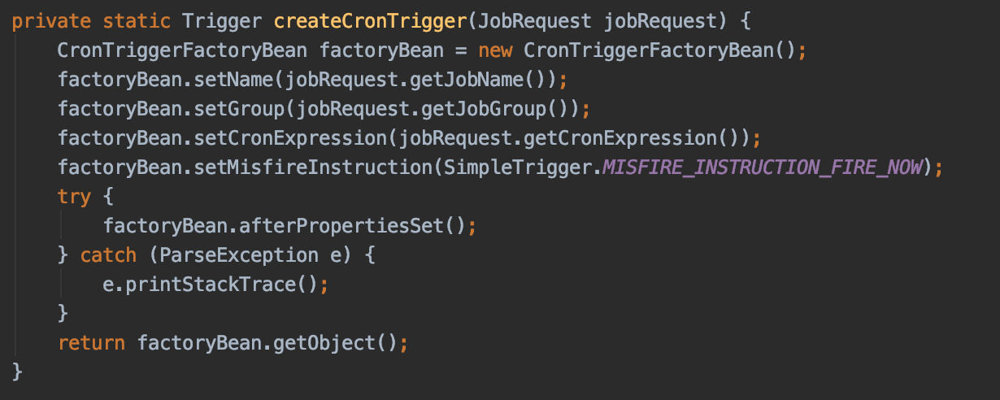

* Misfire Instructions
    * A Misfire means a failed execution where the Job did not keep its fire time, the time it should have run
    * Such a Misfire can occur when the Scheduler shuts down or when there are no available threads in the thread pool
    * The Scheduler supports various policies for how to handle a misfired Trigger.
        * For example..
            * MISFIRE_INSTRUCTION_FIRE_NOW - run immediately
            * MISFIRE_INSTRUCTION_DO_NOTHING - do nothing
* Listener
    * A Listener is an interface provided by Quartz so that you can receive Scheduler events, and it provides two
        * JobListener
            * You can receive events before and after Job execution

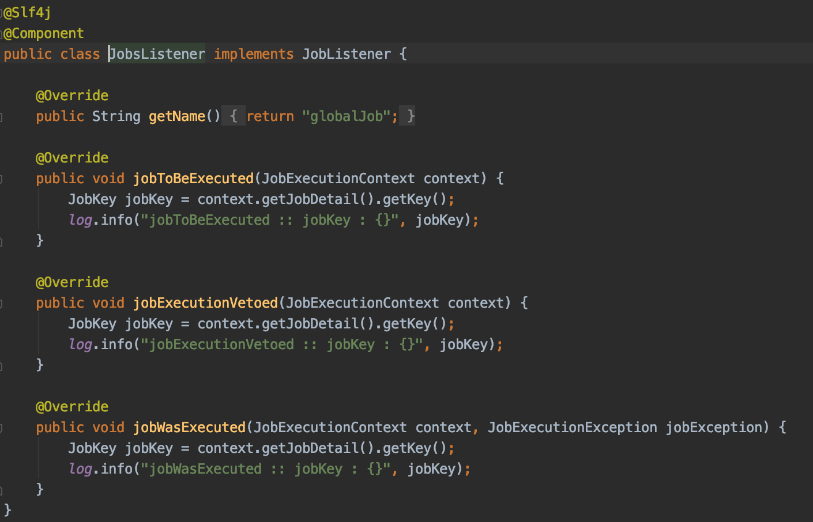

		* TriggerListener
			* You can receive events when a Trigger fires, when a misfire occurs, or when a Trigger completes

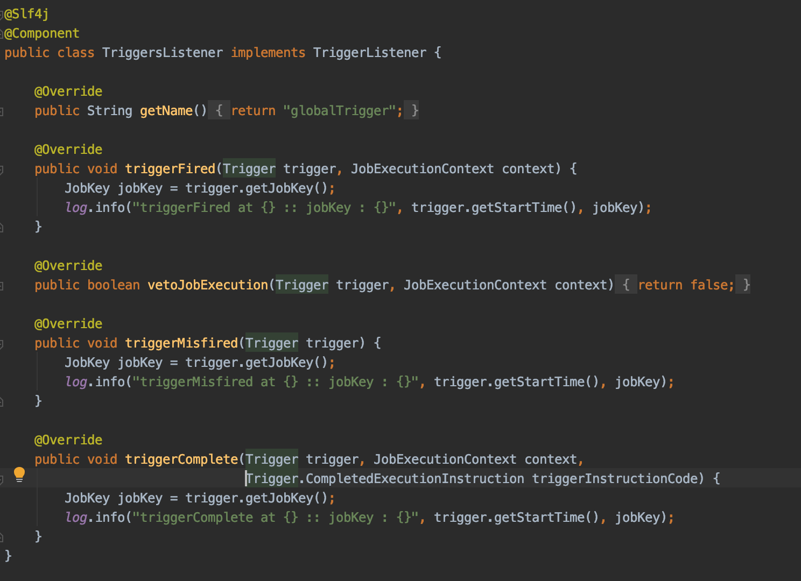

* JobStore
    * Job and Trigger information can be stored in two ways
        * RAMJobStore
            * By default, it stores schedule information in memory
            * Because it stores in memory, it is the best in terms of performance, but it has the disadvantage that it cannot retain schedule data when a system problem occurs
        * JDBC JobStore
            * Stores schedule information in a DB
            * Even if the system shuts down, the schedule information is retained, so Jobs can run again when the system restarts
        * Other JobStores
            * You can extend the Quartz JobStore to store in other storages (Redis, MongoDB). For the actual implementations, please refer to the links below
                * [RedisJobStore](https://github.com/RedisLabs/redis-quartz)
                * [MongoDBJobStore](https://github.com/michaelklishin/quartz-mongodb)

# 3. Quartz Components

This is a diagram taken from the [Java Articles](https://www.javarticles.com/2016/03/quartz-scheduler-model.html) blog. It is a figure that clearly shows the overall structure and flow of Quartz. While the official documentation helps in understanding Quartz's detailed settings, looking at the actual [source code](https://github.com/quartz-scheduler) helps a lot in understanding Quartz's operation and overall architecture structure.

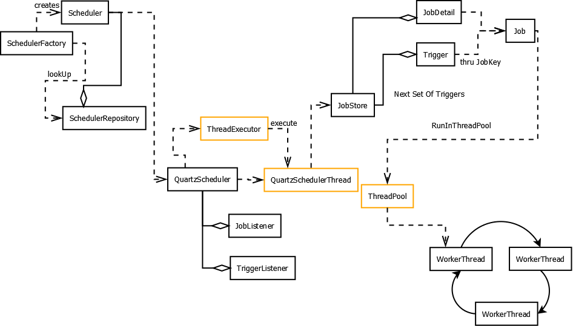

Let's briefly look at when the Quartz scheduler starts and by what tasks the registered Jobs are executed, while looking at the code we will use in the next tutorial.

* Question 1 - How does the Quartz Scheduler start in Spring?
* Question 2 - How does an added Job start?
* Question 3 - How are the JobListener and TriggerListener that are called during Job execution invoked?

This is the screen printed to the console when Spring Boot starts. You can see that after the Quartz Scheduler is initialized and started, the added SimpleJob runs.

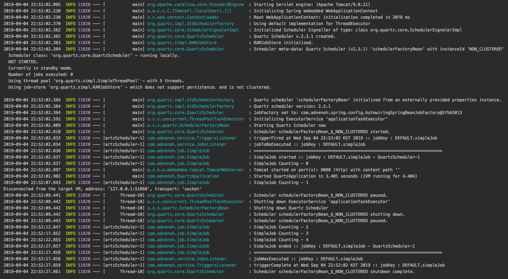

I tried to organize the analyzed code in my own way, but it's not easy to write up the code I understood as text. I think it would be good to set a breakpoint and follow along while reading the organized content.

* SchedulerFactoryBean
    * The Quartz scheduler's scheduler-related settings are initialized, started, and stopped by Spring's container bean lifecycle management
      
    * **1.1 ==> void afterPropertiesSet() : called by the InitializingBean interface**
        * **The prepareSchedulerFactory() method returns StdSchedulerFactory, which is a SchedulerFactory instance, and passes it as the argument of prepareScheduler()** to initialize the Scheduler instance
          
        * **1.2 ==> Scheduler prepareScheduler(SchedulerFactory schedulerFactory) :**
            * **Obtains a Scheduler instance from the SchedulerFactory**
              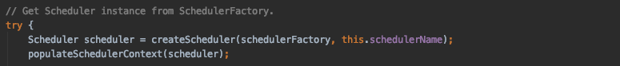
            * **1.3 ==>** **Scheduler createScheduler(SchedulerFactory schedulerFactory, @Nullable String schedulerName)**
                * **After StdSchedulerFactory.getScheduler() runs several initialization steps, it returns a Scheduler instance**
                    * Loads the related Quartz classes (e.g. JobFactory, SimpleThreadPool, JobStore)
                    * Configures the DataSource and SchedulerPlugins
                    * Creates and configures the JobListeners and TriggerListeners objects
                    * Also starts the QuartzSchedulerThread
                    * etc. …..
                      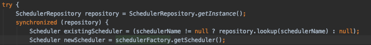
    * **2.1 ==> start() : called by the SmartLifeCycle interface**
        * **Passes the initialized Scheduler instance and startUpDelay as arguments of the startScheduler() method**
          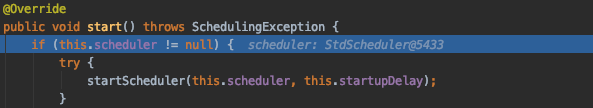
        * **Answer to Question 2** **2.2 ==>** **void startScheduler(final Scheduler scheduler, final int startupDelay)**
            * **In the StdScheduler.start() method, it actually starts the QuartzScheduler-related threads and runs the registered Jobs**
              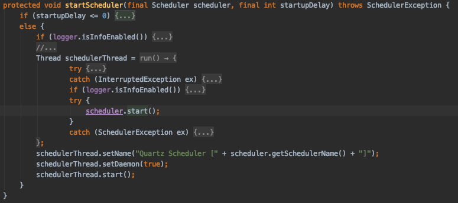
    * **2.2 ==> stop() : called by the SmartLifeCycle interface**
        * The stop() method is called when Tomcat shuts down
          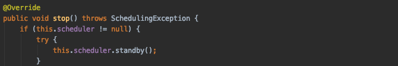

* QuartzScheduler :
    * **3.1 ==> start() : the Quartz scheduler starts**
        * **Depending on the JobStore setting, the additional processing work differs slightly**
            * RAMJobStore : no additional work
            * JobStoreSupport :
                * Runs the ClusterManager as a separate thread
                * Runs the MisfireHandler as a separate thread

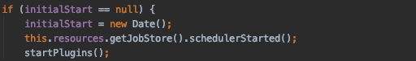

* QuartzSchedulerThread extends Thread
    * **4.1 ==> Called in the QuartzScheduler constructor, and the QuartzScheduler constructor is called by StdSchedulerFactory.getScheduler() -> instantiate()**
        * StdSchedulerFactory.instantiate()
          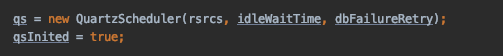
        * QuartzScheduler constructor
          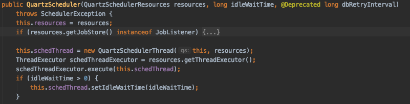
    * **4.2 ==> run()**
        * **As long as the scheduler is not halted, it contains the main logic that keeps looping and running Jobs**
        * When there is a Thread to run
            * After obtaining the list of Triggers to fire from the DB
              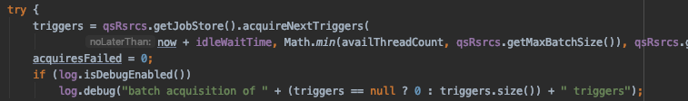
            * It creates a new JobRunShell thread object with the TriggerFiredBundle information passed as an argument and runs the thread in runInThread(shell)
              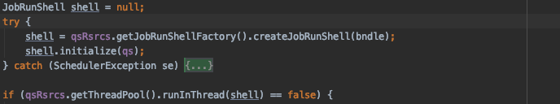
                * **Answer to Question 2 ==> 4.2.1 job.execute(jec)**
                    * **The Job we actually defined (e.g. SimpleJob, CronJob) is run**
                      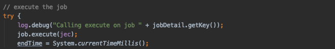
        * It briefly changes to the WAITING state for the calculated random idle waitTime

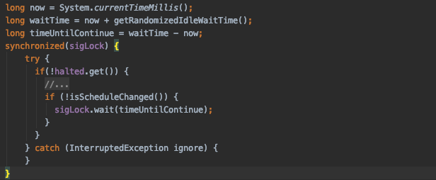

* ClusterManager extends Thread
    * Finds the failed node among the nodes and updates the information about the failed Trigger and Job to recover them
    * Deletes the failed node from SCHEDULER_STATE in the DB
* MisfireHandler extends Thread
    * Scans misfired Jobs and changes their state in the DB to STATE_WAITING so that they are included in scheduling
    * If there are misfired Jobs, it wakes up all the sleeping QuartzSchedulerThread threads
* JobListener / TriggerListener
    * ==> In JobRunShell.run(), during the process of running the job, it runs the listener methods for the Job and Trigger
        * ex. the triggerFired() method runs inside the method below

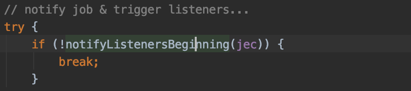

# 4. Wrap-up

We looked at the basic concepts and terminology of Quartz, as well as when and how the Quartz scheduler runs in Spring and how an added Quartz Job starts, while reading Quartz's code.
In the next tutorial, let's implement scheduling using the actual RAMJobStore.

# 5. References

* Quartz official site
    * [http://www.quartz-scheduler.org](http://www.quartz-scheduler.org/)
    * [https://github.com/quartz-scheduler](https://github.com/quartz-scheduler)
* What is Quartz
    * [https://www.baeldung.com/quartz](https://www.baeldung.com/quartz)
    * [https://homoefficio.github.io/2018/08/12/Java-Quartz-Scheduler-Job-Chaining-구현/](https://homoefficio.github.io/2018/08/12/Java-Quartz-Scheduler-Job-Chaining-%EA%B5%AC%ED%98%84/)
    * [https://examples.javacodegeeks.com/enterprise-java/quartz/quartz-scheduler-tutorial/](https://examples.javacodegeeks.com/enterprise-java/quartz/quartz-scheduler-tutorial/)
    * [https://ymh0302.tistory.com/entry/Quartz-Scheduler](https://ymh0302.tistory.com/entry/Quartz-Scheduler)
    * [https://juliuskrah.com/tutorial/2017/10/06/persisting-dynamic-jobs-with-quartz-and-spring/](https://juliuskrah.com/tutorial/2017/10/06/persisting-dynamic-jobs-with-quartz-and-spring/)
    * [https://www.baeldung.com/spring-quartz-schedule](https://www.baeldung.com/spring-quartz-schedule)
* Quartz pros and cons
    * [https://kingbbode.tistory.com/38](https://kingbbode.tistory.com/38) f
    * [https://github.com/HomoEfficio/dev-tips/blob/master/Quartz%20Advanced.md](https://github.com/HomoEfficio/dev-tips/blob/master/Quartz%20Advanced.md)
* Quartz Architecture
    * [https://www.javarticles.com/2016/03/quartz-scheduler-model.html](https://www.javarticles.com/2016/03/quartz-scheduler-model.html)
* Quartz Plugin
    * [https://medium.com/@himsmittal/quartz-plugins-a-must-have-for-all-quartz-implementations-7ca01e98e620](https://medium.com/@himsmittal/quartz-plugins-a-must-have-for-all-quartz-implementations-7ca01e98e620)
* Quartz Cron Generator
    * [https://www.freeformatter.com/cron-expression-generator-quartz.html](https://www.freeformatter.com/cron-expression-generator-quartz.html)
* Misfire Instruction
    * [https://www.nurkiewicz.com/2012/04/quartz-scheduler-misfire-instructions.html](https://www.nurkiewicz.com/2012/04/quartz-scheduler-misfire-instructions.html)
* JobStore implementation
    * [https://github.com/jlinn/quartz-redis-jobstore](https://github.com/jlinn/quartz-redis-jobstore)
    * [https://github.com/michaelklishin/quartz-mongodb](https://github.com/michaelklishin/quartz-mongodb)
* Fixed Delay
    * [https://reachmnadeem.wordpress.com/2017/01/18/fixed-delay-scheduling-with-quartz/](https://reachmnadeem.wordpress.com/2017/01/18/fixed-delay-scheduling-with-quartz/)
    * [https://gist.github.com/mnadeem/367f115cff54b704c91b4813b240b1fd](https://gist.github.com/mnadeem/367f115cff54b704c91b4813b240b1fd)
