# 1. Introduction

When using Memcached as an in-memory DB, the [simple-spring-memcached](https://github.com/ragnor/simple-spring-memcached) (SSM) library is frequently used in Java. By declaring SSM annotations on methods, related data is easily managed in the cache. Since version 3.1, Spring also supports a cache service abstraction, making it possible to easily swap in various cache implementations (e.g. Ehcache, Redis) without changing the business logic. Let's cover Spring's cache feature in more detail in another post.

# 2. Development Environment

- OS : Mac OS
- IDE: Intellij
- Java : JDK 11
- Source code : [github](https://github.com/kenshin579/tutorials-spring-examples/tree/master/simple-spring-memcached)
- Software management tool : Maven

# 3. Simple Spring Memcached (SSM) Setup and Usage

You need to add the dependency required to use SSM and the Spring bean configuration file.

## 3.1 Adding the Maven Dependency

I used maven for the library. Choose one between Simple-spring-memcached and a Memcache provider and add it to pom.xml. The difference between spymemcached and xmemcached is as follows. In this post, I mainly explain xmemcached.

- spymemcached \* a simple asynchronous, single-threaded memcached Java library
- **xmemcached (mainly explained in this post)** \* a high-performance multi-threaded memcached Java library

```xml
<dependency>
    <groupId>com.google.code.simple-spring-memcached</groupId>
    <artifactId>simple-spring-memcached</artifactId>
    <version>4.1.1</version>
</dependency>
```

### **xmemcached**

```xml
<dependency>
  <groupId>com.google.code.simple-spring-memcached</groupId>
  <artifactId>xmemcached-provider</artifactId>
  <version>4.1.1</version>
</dependency>
```

### **spymemcached**

```xml
<dependency>
  <groupId>com.google.code.simple-spring-memcached</groupId>
  <artifactId>spymemcached-provider</artifactId>
  <version>4.1.1</version>
</dependency>
```


## 3.2 Spring Configuration File

The Spring bean configuration includes Memcached-related settings. The Memcached server information and cache settings are specified using the ConsistentHashing method.

> **Additional explanation**
> The ConsistentHashing method is a way that, even if multiple servers change, does not redistribute the data assigned to each server but redistributes only the data of the downed server to other servers. K(keys) = 10,000, N(number of memcache servers : slots) = 5 => each server can hash about 2000 keys. When a server failure occurs (1 server, A, goes down), only the keys of server A are redistributed to other servers.
> For a more detailed explanation, please refer to [Consistent Hashing](https://jistol.github.io/software%20engineering/2018/07/07/consistent-hashing-sample/).

```xml
File : resources/applicationContext-cached.xml

<context:annotation-config/>
<context:component-scan base-package="sample.di.business.*"/>
<context:component-scan base-package="sample.di.dataaccess"/>

<import resource="simplesm-context.xml"/>
<aop:aspectj-autoproxy/>

<bean name="defaultMemcachedClient" class="com.google.code.ssm.CacheFactory">
    <property name="cacheClientFactory">
        <bean class="com.google.code.ssm.providers.xmemcached.MemcacheClientFactoryImpl"/>
    </property>
    <property name="addressProvider">
        <bean class="com.google.code.ssm.config.DefaultAddressProvider">
            <property name="address" value="127.0.0.1:11211"/>
        </bean>
    </property>
    <property name="configuration">
        <bean class="com.google.code.ssm.providers.CacheConfiguration">
            <property name="consistentHashing" value="true"/>
        </bean>
    </property>
</bean>

```

simplesm-context.xml is a configuration file included in the [SSM github](https://github.com/ragnor/simple-spring-memcached) source, and since it is needed when using SSM, you can copy and use it.

## 3.3 Representative SSM Cache Annotations

Below are the representative, frequently used annotations. For other annotations you need to use, please refer to the [library's Wiki](https://github.com/ragnor/simple-spring-memcached/wiki/Getting-Started).

- Read
    - @ReadThroughAssignCache
    - @ReadThroughSingleCache
    - @ReadThroughMultiCache
- Update
    - @UpdateAssignCache
    - @UpdateSingleCache
    - @UpdateMultiCache
- Invalidate
    - @InvalidateAssignCache
    - @InvalidateSingleCache
    - @InvalidateMultiCache
- Counter
    - @ReadCounterFromCache
    - @IncrementCounterInCache
    - @DecrementCounterInCache

Most SSM annotations can be classified by Cache Action and Cache Type.

| **Cache Action** | **Description**                                 |
| ---------------- | ----------------------------------------------- |
| ReadThrough      | If there is no key stored in the Cache, it stores it in the Cache |
| Update           | Updates the value of the key stored in the Cache |
| Invalidate       | Deletes the key stored in the Cache             |

| **Cache Type** | **Description**                                              |
| -------------- | ------------------------------------------------------------ |
| AssignCache    | The cache key is the value specified by the assignedKey property, used when the method has no arguments<br/>ex. used for methods like List<Person> getAllUsers() |
| SingleCache    | The cache key is generated from the method argument declared with the SSM annotation, used when there is one argument.<br/>Note. if the argument is of List type, it cannot be used to generate a cache key<br/>ex. Person getUser(int int) |
| MultiCache     | The cache key is generated from multiple method arguments declared with the SSM annotation. One of the arguments must be of List type, and the return result must also be of List type. Each element of the returned result List is stored with the specified cache key.<br/>ex. List<Person> getUserFromData(List workInfo) |

For SingleCache and MultiCache, you must specify the @ParameterValueKeyProvider annotation among the method arguments.

In addition to the basic cache annotations, there are properties used together with various annotations; let's look at them in more detail through examples.

- Other annotations and properties
    - @CacheName(“QuoteApp”) : a concept that can group related caches into one, and it can be declared on methods as well as on classes
    - @CacheKeyMethod : declares the method to use as the cache's key value
    - the cache key is the method declared with @CacheKeyMethod
    - if @CacheKeyMethod is not specified, the Object.toString() method is used
    - @ParameterValueKeyProvider : applied to method arguments, obtains the key value using the method declared with @CacheKeyMethod or toString()
    - @ParameterDataUpdateContent : the annotation is applied to a method argument and specifies the value to be newly stored
    - @ReturnDataUpdateContent : stores the return value in the cache
- Properties
    - namespace : used to prevent cases where there are names with the same key value
    - expiration : the time at which the key value expires (in seconds)
    - assignedKey : the key value used when storing in the cache

### 3.3.1 Read Cache

**@ReadThroughAssignCache example**

The @ReadThroughAssignCache annotation can be applied to methods with no arguments. In the cache area, key : value (all : List<Product) is stored under the namespace name 'area'.

@ReadThroughAssignCache(namespace = "area", assignedKey="all")

```java
@ReadThroughAssignCache(namespace = "area", assignedKey="all")
public List<Product> findAllProducts() {
    slowly(); // intentionally delay
    List<Product> productList = new ArrayList<>();
    return storage.values().stream().collect(Collectors.toList());
}
```

To easily understand the differences between each cache annotation, I wrote unit tests. To get the desired result in each test, it is written to flush memcache for every test. Since the @ReadThroughAssignCache annotation stores when reading from the cache if it's not there, in the code below you can confirm that it stores in the cache at Comment #1 and fetches the data from the cache at Comment #2.

```java
@Test
public void testReadThroughAssignCache() {
    this.executeWithMemcachedFlush(productService, () -> {
        productService.addProduct(new Product("microsoft", 100));
        productService.addProduct(new Product("sony", 100));
        productService.findAllProducts(); //#1 - caching

        productService.findAllProducts(); //#2 - fetched from cache

    });
}
```

**Unit Test execution result**

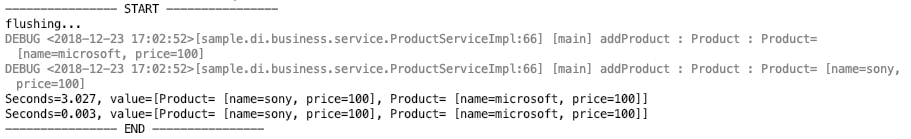

**watch monitoring result**

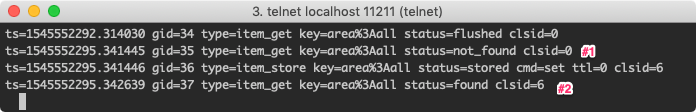

To check the process of storing in the cache and verifying the value in real time, log in via telnet and run the watch command. For more details, please refer to #3.4 Useful Memcached Commands Collection.

**@ReadThroughSingleCache**

The @ReadThroughSingleCache annotation is used only when there is one argument. If you declare the @ParameterValueKeyProvider annotation on the argument, the method specified with @CacheKeyMethod is used to generate the cache key, and if there is none, the toString() method is used.

```java
@ReadThroughSingleCache(namespace = "area")
public Product findProduct(@ParameterValueKeyProvider String name) {
    slowly(); // intentionally delay

    return storage.get(name);
}

@CacheKeyMethod
public String getName() {
    return name;
}
```

This annotation also stores in the cache if it's not there when reading, so you can confirm with the watch command that it stores at Comment #1 in the code and fetches the value from the cache at Comment #2.

```java
@Test
public void testReadThroughSingleCache() {
    this.executeWithMemcachedFlush(productService, () -> {
        productService.addProduct(new Product("microsoft", 100));
        productService.addProduct(new Product("sony", 100));
        productService.findProduct("microsoft”); //#1 - caching

        productService.findProduct(("microsoft”); //#2 - fetched from cache

    });
}}
```

**Unit Test execution result**

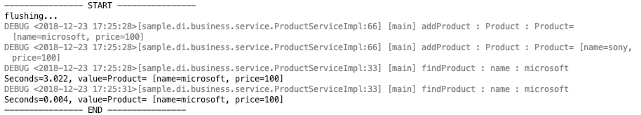

**watch monitoring result**

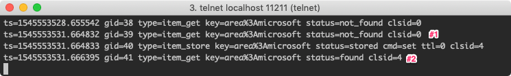

**@ReadThroughMultiCache**

MultiCache must have an argument of List type among the method arguments. And for the cached key : value, each List element of the argument and each element of the return result are stored in the cache as key : value respectively.
You can find out by checking the key values with the stats cachedump command. For an explanation of the cachedump result format, please refer to **#3.4 Useful Memcached Commands Collection**.

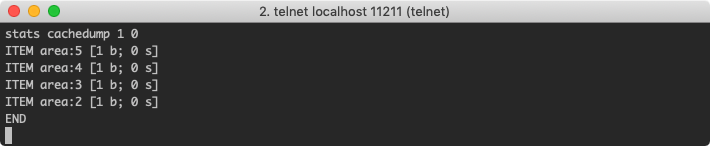

```java
@ReadThroughMultiCache(namespace = "area")
public List<Integer> getIncrementValue(@ParameterValueKeyProvider List<Integer> nums, int incrementValue) {
    slowly(); // intentionally delay
    return nums.stream().map(x -> x + incrementValue).collect(Collectors.toList());
}
```

Since each element of the nums list passed to getIncrementValue is not stored in the cache, you can confirm with the watch command that each element is stored as a key. When getIncrementValue is called for the second time, the result is fetched directly from the cache. As some of you may have noticed, the converted result is wrong. Since the argument passed was 1, [3, 4, 5, 6] should be returned, but because it was fetched from the cache, [6, 7, 8, 9] was returned. If synchronization between cache data and actual data is important, you need to pay attention to such parts during development.

```java
@Test
public void testReadThroughMultiCache() {
    this.executeWithMemcachedFlush(productService, () -> {
        List<Integer> nums = new ArrayList<Integer>(Arrays.asList(2, 3, 4, 5));
        productService.getIncrementValue(nums, 4); //#1 - caching

        productService.getIncrementValue(nums, 1); //#2 - fetches the cached value

    });
}
```

**Unit Test execution result**

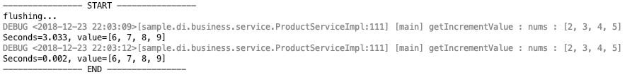

**watch monitoring result**

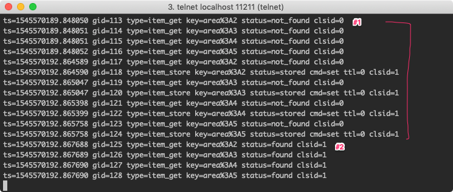

### 3.3.2 Update Cache

Annotations starting with Update are annotations that forcibly overwrite the value stored in the cache. Let's look at the various annotations for Update.

**@UpdateAssignCache**

The AssignCache annotation uses the value specified by assignedKey as the key.

```java
@ReturnDataUpdateContent
@UpdateAssignCache(namespace = "area", assignedKey = "all")
public List<Product> resetPriceForAllProducts() {
    slowly(); // intentionally delay
    return storage.values().stream()
            .map(product -> {
                product.setPrice(0);
                return product;
            }).collect(Collectors.toList());
}
```

Looking at the watch monitoring result below, at Comment #1 there was no data in the cache so it was stored, and at Comment #2 it confirmed it was in the cache but overwrote it again.

```java
@Test
public void testUpdateAssignCache() {
    this.executeWithMemcachedFlush(productService, () -> {
        productService.addProduct(new Product("microsoft", 100));
        productService.addProduct(new Product("sony", 100));
        productService.findAllProducts(); //#1 - cached

        productService.resetPriceForAllProducts(); //#2 - overwrites the cached data

    });
}
```

**Unit Test execution result**

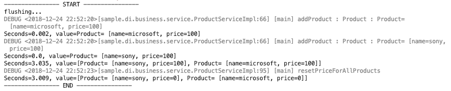

**watch monitoring result**

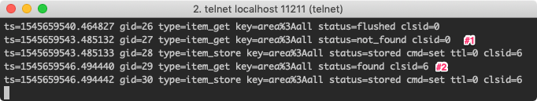

**@UpdateSingleCache**

Because it is SingleCache, it is used only when the method has one argument, and because it is an annotation starting with Update, it overwrites if it's in the cache. The @ParameterDataUpdateContent annotation is used together with @Update\*Cache annotations and is declared on the method argument as the value to be updated.

```java
@UpdateSingleCache(namespace = "area")
public void changeProduct(@ParameterValueKeyProvider String productName, @ParameterDataUpdateContent int overridePrice) {
    slowly(); // intentionally delay
    Product product = storage.get(productName);
    product.setPrice(overridePrice);
    storage.replace(productName, product);
}
```

Same as @UpdateAssignCache, you can confirm that at Comment #2 it overwrites the data in the cache again.

```java
@Test
public void testUpdateSingleCache() {
    this.executeWithMemcachedFlush(productService, () -> {
        Product product = new Product("microsoft", 100);
        productService.addProduct(product);
        productService.changeProduct(product.getName(), 500); //#1 - caching

        productService.changeProduct(product.getName(), 1000); //#2 - overwrites the data in the cache

    });
}
```

**Unit Test execution result**

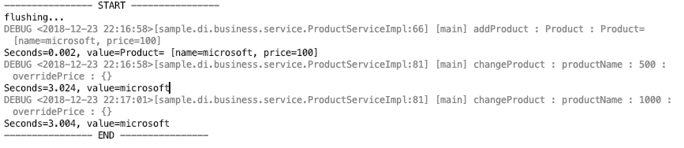

**watch monitoring result**

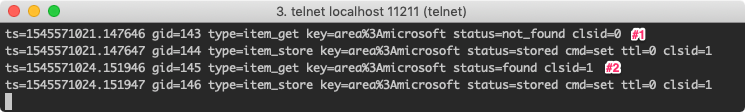

**@UpdateMultiCache**

The @ReturnDataUpdateContent annotation is used together with @Update\*Cache annotations and is used to mark the return value being updated. Like other MultiCache annotations, it is used only when of List type.

```java
@ReturnDataUpdateContent
@UpdateMultiCache(namespace = "area")
public List<Product> updatePriceForGivenProductName(@ParameterValueKeyProvider List<String> nameList, @ParameterDataUpdateContent int overridePrice) {
    slowly(); // intentionally delay
    List<Product> result = new ArrayList<>();
    Product product;

    for (String name : nameList) {
        product = storage.get(name);
        product.setPrice(overridePrice);
        result.add(product);
    }

    return result;
}
```


```java
@Test
public void testUpdateMultiCache() {
    this.executeWithMemcachedFlush(productService, () -> {
        productService.addProduct(new Product("microsoft1", 100));
        productService.addProduct(new Product("microsoft2", 100));
        productService.addProduct(new Product("microsoft3", 100));
        List<String> names = new ArrayList<>(Arrays.asList("microsoft1", "microsoft3"));
        productService.updatePriceForGivenProductName(names, 1000); //#1 - caching

        productService.updatePriceForGivenProductName(names, 500); //#2 - overwrites the cached data

    });
}
```

**Unit Test execution result**

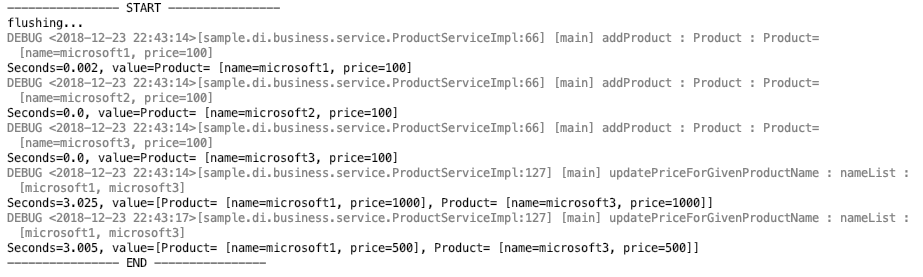

**watch monitoring result**

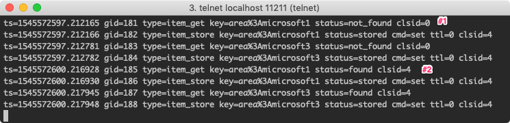

### 3.3.3 Invalidate Cache

Annotations starting with Invalidate delete the corresponding key from the cache if it exists.

**@InvalidateAssignCache**

@InvalidateAssignCache deletes the key specified by assignedKey if it exists in the cache. As a feature that forcibly deletes from the cache, it can be used when you want to fetch the latest data into the cache.

```java
@InvalidateAssignCache(namespace = "area", assignedKey = "all")
public List<Product> getAllProductsFromMemory() {
    slowly(); // intentionally delay
    return storage.values().stream().collect(Collectors.toList());
}
```

At Comment #1, it is stored in the cache by the findAllProduct method, but at the next line it is deleted from the cache, so if you check the result with cachedump, you can confirm that there is no stored key.

```java
@Test
public void testInvalidateAssignCache() {
    this.executeWithMemcachedFlush(productService, () -> {
        productService.addProduct(new Product("microsoft", 100));
        productService.findAllProducts(); //#1 - caching

        productService.getAllProductsFromMemory(); //#2 - deleted from cache

    });
}
```

**stats cachedump result**
There is no result because it was deleted from the cache.

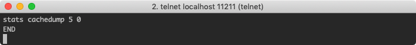

**Unit Test execution result**

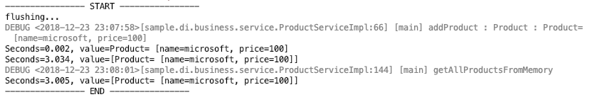

**watch monitoring result**

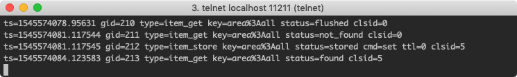

**@InvalidateSingleCache**

Because it is SingleCache, when used with a single argument, the invalidate annotation deletes the key if it is stored in the cache.

```java
@InvalidateSingleCache(namespace = "area")
public Product getProductFromMemory(@ParameterValueKeyProvider String name) {
    slowly(); // intentionally delay
    return storage.get(name);
}
```

You can confirm the result deleted from the cache at Comment #2 with the stats cachedump command.

```java
@Test
public void testInvalidateSingleCache() { //todo: start working from here
    this.executeWithMemcachedFlush(productService, () -> {
        productService.addProduct(new Product("microsoft", 100));
        productService.findProduct("microsoft"); //#1 - caching

        productService.getProductFromMemory("microsoft”); //#2 - deleted from cache

    });
}}
```

**stats cachedump result**
There is no result because it was deleted from the cache.

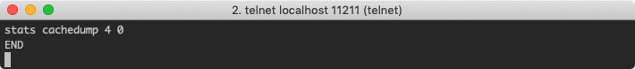

**Unit Test execution result**

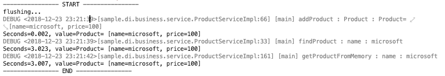

**watch monitoring result**

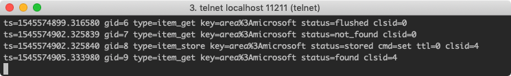

**@InvalidateMultiCache**

Because it is MultiCache, it is applied to methods whose argument and return value must be of List type, and if there is a key stored in the cache, it is deleted from the cache.

```java
@InvalidateMultiCache(namespace = "area")
public List<Product> getProductGivenProductNameFromMemory(@ParameterValueKeyProvider List<String> nameList) {
    slowly();
    List<Product> result = new ArrayList<>();
    Product product;

    for (String name : nameList) {
        product = storage.get(name);
        result.add(product);
    }
    return result;
}

```

```java
@Test
public void testInvalidateMultiCache() {
    this.executeWithMemcachedFlush(productService, () -> {
        productService.addProduct(new Product("microsoft1", 100));
        productService.addProduct(new Product("microsoft2", 200));
        productService.addProduct(new Product("microsoft3", 300));
        productService.findProduct("microsoft1”); //#1 - caching

        List<Product> list = productService.getProductGivenProductNameFromMemory(Arrays.asList(("microsoft1", "microsoft2")); //#2 - deleted from cache

        assertEquals(2, list.size());
    });
}
```

**stats cachedump result**
There is no result because it was deleted from the cache.

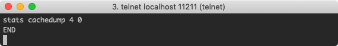

**Unit Test execution result**

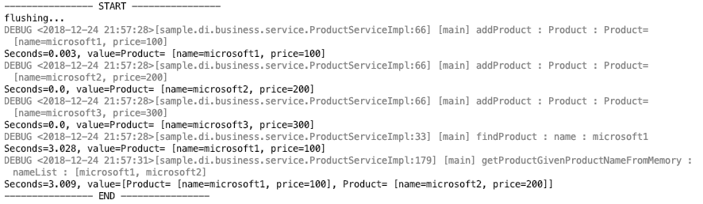

**watch monitoring result**

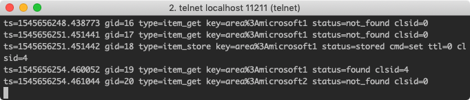

## 3.4 Useful Memcached Commands Collection

### 3.4.1 watch

Memcached provides the watch command so that you can check events in real time when storing in the cache or fetching a value.

Command : watch <options>

- options : you can select one or more desired events among fetchers, mutations, evictions

```bash
$ telnet localhost 11211
watch fetchers mutations evictions
```

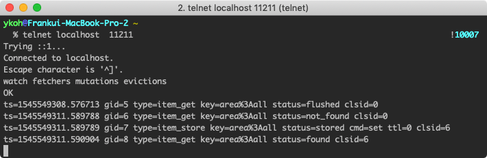

### 3.4.2 stats cachedump

This command is a feature not supported by the Memcached team and may be removed in future versions, but it exists in the current 1.5.12 version.

Command : stats cachedump <slabs_id> <limit>
Arguments :

- slabs_id : the slab_id of the location to search for the key
- limit : the size to search (0 : infinite)


Return value : ITEM <item_key> [<item_size> b; <expiration_timestamp> s]

- item_keys : key name
- item_size : byte size including the key
- expiration_timestamp : expiration timestamp in seconds (0 —> infinite)

## 3.5 Cautions When Using SSM

### 3.5.1 When Specifying Expiration, Keep It Within 30 Days

If expiration exceeds 30 days, it is calculated as an infinite value.

### 3.5.2 Override toString()

When the argument specified as the cache key is an object type rather than a primitive type, the key is generated using the toString() method. If you don't override toString(), Object.toString() is used, and the default implementation returns a value using the class name and hashcode() as shown below. Because hashCode depends on the memory address, the cache may not be applied if the memory address changes, so it is recommended to override toString() or use @CacheKeyMethod.

return getClass().getName() + "@" + Integer.toHexString(hashCode())

### 3.5.3 When an Object Is Cached, It Must Be Serializable

When the value stored in the cache is an object, that object must be serializable, and don't forget to generate the serialVersionUID as well.

> Tips
> If an object implemented as Serializable does not have a serialVersionUID, the JVM generates it automatically. If the serialVersionUID changes automatically as the class changes, problems can occur during deserialization, so it's better to specify it explicitly. There is also a plugin (GenerateSerialVersionUID) in IntelliJ IDE that generates it automatically.

### 3.5.4 The Cache Key Length Is Limited to 250 Characters

The maximum key length is 250 characters, and if exceeded, an IllegalArgumentException occurs.

# 4. References

- Books
    - 
- SSM
    - [https://m.blog.naver.com/PostView.nhn?blogId=kbh3983&logNo=220934569378&proxyReferer=https%3A%2F%2Fwww.google.co.kr%2F](https://m.blog.naver.com/PostView.nhn?blogId=kbh3983&logNo=220934569378&proxyReferer=https%3A%2F%2Fwww.google.co.kr%2F)
    - [https://github.com/ragnor/simple-spring-memcached](https://github.com/ragnor/simple-spring-memcached)
    - [https://m.blog.naver.com/PostView.nhn?blogId=akaroice&logNo=220298608077&proxyReferer=https%3A%2F%2Fwww.google.co.kr%2F](https://m.blog.naver.com/PostView.nhn?blogId=akaroice&logNo=220298608077&proxyReferer=https%3A%2F%2Fwww.google.co.kr%2F)
    - [https://github.com/ragnor/simple-spring-memcached/wiki/Getting-Started#spring-31-cache-integration](https://github.com/ragnor/simple-spring-memcached/wiki/Getting-Started#spring-31-cache-integration)
    - [https://m.blog.naver.com/PostView.nhn?blogId=writer0713&logNo=220937148327&proxyReferer=https%3A%2F%2Fwww.google.co.kr%2F](https://m.blog.naver.com/PostView.nhn?blogId=writer0713&logNo=220937148327&proxyReferer=https%3A%2F%2Fwww.google.co.kr%2F)
    - [http://blog.naver.com/tmondev/220725135383](http://blog.naver.com/tmondev/220725135383)
    - [https://www.memcachier.com/documentation/spring-boot](https://www.memcachier.com/documentation/spring-boot)
    - [http://eclipse4j.tistory.com/254](http://eclipse4j.tistory.com/254)
    - [https://jistol.github.io/java/2018/11/27/ssm-annotation-multicache/](https://jistol.github.io/java/2018/11/27/ssm-annotation-multicache/)
    - [https://ragnor.github.io/simple-spring-memcached/index.html?com/google/code/ssm/api/InvalidateAssignCache.html](https://ragnor.github.io/simple-spring-memcached/index.html?com/google/code/ssm/api/InvalidateAssignCache.html)
        - [https://tmondev.blog.me/220725135383?Redirect=Log&from=postView](https://tmondev.blog.me/220725135383?Redirect=Log&from=postView)
- Consistent Hashing
    - [https://charsyam.wordpress.com/2011/11/25/memcached-%EC%97%90%EC%84%9C%EC%9D%98-consistent-hashing/](https://charsyam.wordpress.com/2011/11/25/memcached-%EC%97%90%EC%84%9C%EC%9D%98-consistent-hashing/)
    - [https://jistol.github.io/software%20engineering/2018/07/07/consistent-hashing-sample/](https://jistol.github.io/software%20engineering/2018/07/07/consistent-hashing-sample/)
        - [http://sarghis.com/blog/726/](http://sarghis.com/blog/726/)
- Memcached commands
    - [https://www.solanara.net/solanara/memcached](https://www.solanara.net/solanara/memcached)
    - [https://serverfault.com/questions/207356/view-content-of-memcached](https://serverfault.com/questions/207356/view-content-of-memcached)
        - [https://blog.elijaa.org/2010/12/24/understanding-memcached-stats-cachedump-command/](https://blog.elijaa.org/2010/12/24/understanding-memcached-stats-cachedump-command/)
- Spring Cache
    - [https://minwan1.github.io/2018/03/18/2018-03-18-Spring-Cache/](https://minwan1.github.io/2018/03/18/2018-03-18-Spring-Cache/)
- Cautions
    - [https://charsyam.wordpress.com/2016/10/21/입-개발-아는-사람은-알지만-모르는-사람은-모르는-memcached/](https://charsyam.wordpress.com/2016/10/21/%EC%9E%85-%EA%B0%9C%EB%B0%9C-%EC%95%84%EB%8A%94-%EC%82%AC%EB%9E%8C%EC%9D%80-%EC%95%8C%EC%A7%80%EB%A7%8C-%EB%AA%A8%EB%A5%B4%EB%8A%94-%EC%82%AC%EB%9E%8C%EC%9D%80-%EB%AA%A8%EB%A5%B4%EB%8A%94-memcached/)
    - [https://stackoverflow.com/questions/1418324/memcache-maximum-key-expiration-time](https://stackoverflow.com/questions/1418324/memcache-maximum-key-expiration-time)
