# 1. Introduction

The Spring Framework provides broadly **two types of REST clients—synchronous and asynchronous—so that you can call the endpoints of a REST service**. In this post, let's look at the synchronous RestTemplate.

- **RestTemplate**
    - Supported since Spring 3, it is a synchronous approach that waits until it receives a response after calling a REST API
- **AsyncRestTemplate**
    - An asynchronous RestTemplate added in Spring 4
    - Deprecated in Spring 5.0
- **WebClient**
    - A non-blocking, reactive web client added in Spring 5 that supports both synchronous and asynchronous approaches


RestTemplate is **designed according to the same principles as the various other Template classes provided by Spring (e.g. JdbcTemplate, RedisTemplate), making complex tasks easy through simple calls**. The RestTemplate class is designed to call REST services and provides various methods that match the HTTP protocol methods (e.g. GET, POST, DELETE, PUT).

| Method | HTTP | Description |
| ------------- | ------------- | ------------- |
| getForObject  | GET | Sends an HTTP GET to the given URL and returns the result as an object | 
| getForEntity | GET | Sends an HTTP GET to the given URL and returns the result as a ResponseEntity | 
| postForLocation | POST | Sends a POST request and returns the URI stored in the header as the result | 
| postForObject | POST | Sends a POST request and returns the result as an object | 
| postForEntity | POST | Sends a POST request and returns the result as a ResponseEntity | 
| delete | DELETE | Executes the HTTP DELETE method to the given URL |
| headForHeaders | HEADER | Uses the HTTP HEAD method to obtain all header information |
| put | PUT | Executes the HTTP PUT method to the given URL |
| patchForObject | PATCH | Executes the HTTP PATCH method to the given URL |
| optionsForAllow | OPTIONS | Queries the HTTP methods supported by the given URL |
| exchange | any | Can create new HTTP headers and use any HTTP method |
| execute | any | Can modify the Request/Response callback |

# 2. Development Environment

- OS : Mac OS
- IDE: Intellij
- Java : JDK 1.8
- Source code : [github](https://github.com/kenshin579/tutorials-java/tree/master/spring-resttemplate)
- Software management tool : Maven

The example project is written with Spring Boot, so if you add the basic Spring Boot dependencies, the RestTemplate-related dependencies are added automatically.

If you are using plain Spring, you can just add the spring-webmvc dependency. RestTemplate is actually a class included in the spring-web dependency, but **since spring-web is included in the spring-webmvc dependency, the dependency is included together**.

```xml
<dependency>
    <groupId>org.springframework</groupId>
    <artifactId>spring-webmvc</artifactId>
    <version>4.3.7.RELEASE</version>
</dependency>
```

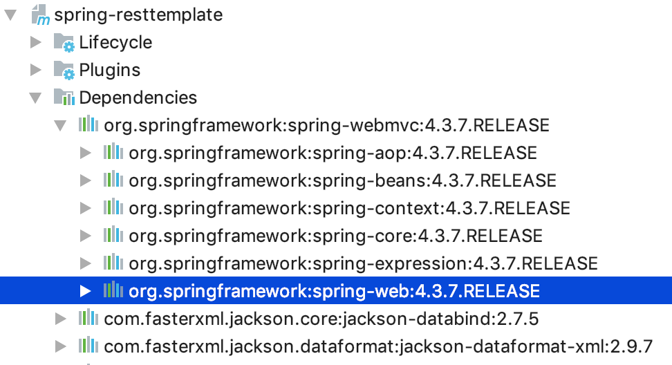

# 3. How RestTemplate Works

The content about how RestTemplate works is well organized on the [빨간색코딩](https://sjh836.tistory.com/141) blog, so I did not organize it separately. Please go to that link to refer to a more detailed explanation.

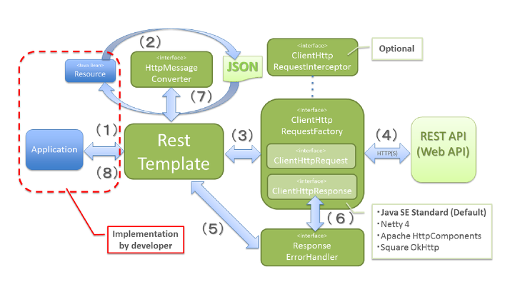

# 4. RestTemplate Method Examples

Let's look at the frequently used methods of RestTemplate.

## 4.1 GET Methods

### 4.1.1 getForObject()

The getForObject() method performs a GET and converts the HTTP response into an object type to return. In this example, it returns an Employee object.

**Client Code - Unit Test**

```java
@Test
public void test_getForObject() {
   Employee employee = restTemplate.getForObject(BASE_URL + "/{id}", Employee.class, 25);
   log.info("employee: {}", employee);
}
```

In the Controller, when getEmployee() is called, it converts the Employee object into JSON form as the response. If you run the example, you can see that it is received well in JSON form automatically without any additional configuration.

In Spring Boot, **if you add the @RestController annotation to the Controller, it handles JSON responses by default as long as Jackson2 (jackson-databind) is on the classpath**. If you added the spring-boot-starter-web dependency, jackson-databind is included together via transitive dependencies.

**Controller Code**

```java
@RequestMapping(method = RequestMethod.GET, value = "/{id}", produces = MediaType.APPLICATION_JSON_VALUE)
public Employee getEmployee(@PathVariable Long id) {
   log.info("id: {}", id);
 
   Employee employee = Employee.builder()
         .id(id)
         .name("Frank Oh")
         .gender(Gender.FEMALE)
         .address(Address.builder()
               .street("123-dong 135-ho Paran Apartment")
               .city("Seoul")
               .postalCode("1234")
               .build())
         .build();
   log.info("employee: {}", employee);
   return employee;
}
```
**Execution screen**

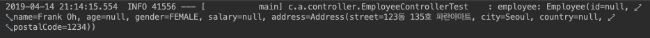

### 4.1.2 getForEntity()

In the case of the getForEntity() method, you receive the response as a ResponseEntity object. Unlike getForObject(), it holds additional information about the HTTP response, so you can check the response code and the actual data for the GET request. Also, depending on the ResponseEntity<T> generic type, you can receive the response as a String or an Object.

In the example, the response value is received in JSON string form.

**Client Code - Unit Test**

```java
@Test
public void test_getForEntity() {
   ResponseEntity<String> responseEntity = restTemplate.getForEntity(BASE_URL + "/{id}", String.class, 25);
   log.info("statusCode: {}", responseEntity.getStatusCode());
   log.info("getBody: {}", responseEntity.getBody());
}
```

**Execution screen**

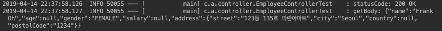

### 4.1.3 Passing params Containing Multiple Values to getForEntity()

The getForEntity() method can also make a GET request by taking params containing multiple values as an argument. In the example, the name and country variables needed in the URL PATH are put into a LinkedMultiValueMap object and passed as params.

**Client Code - Unit Test**

```java
@Test
public void test_getForEntity_여러_path_variables을_넘겨주는_경우() {
   MultiValueMap<String, String> params = new LinkedMultiValueMap<>();
   params.add("name", "Frank Oh");
   params.add("country", "US");
 
   ResponseEntity<Employee> responseEntity = restTemplate.getForEntity(BASE_URL + "/{name}/{country}", Employee.class, params);
   log.info("statusCode: {}", responseEntity.getStatusCode());
   log.info("getBody: {}", responseEntity.getBody());
}
```

**Execution screen**

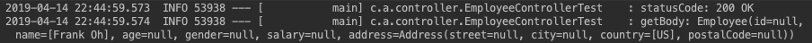

## 4.2 POST

Next are the methods for the POST method.

### 4.2.1 Sending postForObject() Without Including a Header

postForObject(), like getForObject(), is a method that returns the return value of a POST request as the corresponding object. It sends the Employee object as the body of the POST.

**Client Code - Unit Test**

```java
@Test
public void testPostForObject_해더_포함해서_보내지_않기() {
   Employee newEmployee = Employee.builder()
         .name("Frank")
         .address(Address.builder()
               .country("US")
               .build())
         .build();
 
   Employee employee = restTemplate.postForObject(BASE_URL + "/employee", newEmployee, Employee.class);
   log.info("employee: {}", employee);
}
```

In the Controller, you would normally receive the Employee object via the POST method and execute the service logic, but here it is simply printed to the log. As the response value, it returns the received object and the response code HTTP 201 as a ResponseEntity.

**Controller Code**

```java
@RequestMapping(value = "/employee", method = RequestMethod.POST)
public ResponseEntity<Employee> saveEmployee(
      @RequestHeader(value = "headerTest", required = false) String headerTest,
      @RequestBody Employee employee) {
   log.info("headerTest: {}", headerTest);
   log.info("employee: {}", employee);
   return new ResponseEntity<>(employee, HttpStatus.CREATED);
}
```

**Execution screen**

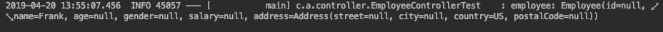

### 4.2.2 Sending postForObject() With a Header Included

This time, let's send data in the header. Create an HttpEntity by passing the Employee object and a custom header as arguments. If you put the created HttpEntity into postForObject and send it, you can obtain the value in the Controller with the @RequestHeader annotation.

**Client Code - Unit Test**

```java
@Test
public void testPostForObject_해데_포함해서_보내기() {
   Employee newEmployee = Employee.builder()
         .name("Frank")
         .address(Address.builder()
               .country("US")
               .build())
         .build();
 
   HttpHeaders headers = new HttpHeaders();
   headers.set("headerTest", "headerValue");
 
   HttpEntity<Employee> request = new HttpEntity<>(newEmployee, headers);
 
   Employee employee = restTemplate.postForObject(BASE_URL + "/employee", request, Employee.class);
   log.info("employee: {}", employee);
}
```

**Execution screen**

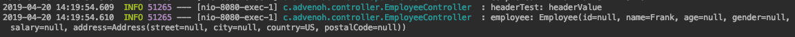

### 4.2.3 postForEntity()

The postForEntity() method can receive data as a ResponseEntity<T> object. In the example, instead of receiving it as an Employee object, it is received as a String, so the response body is printed in string JSON form.

**Client Code - Unit Test**

```java
@Test
public void testPostForEntity_스트링값으로_받기() {
   Employee newEmployee = Employee.builder()
         .name("Frank")
         .address(Address.builder()
               .country("US")
               .build())
         .build();
 
   ResponseEntity<String> responseEntity = restTemplate.postForEntity(BASE_URL + "/employee", newEmployee, String.class);
   log.info("statusCode: {}", responseEntity.getStatusCode());
   log.info("getBody: {}", responseEntity.getBody());
}
```

**Execution screen**

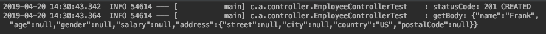

### 4.2.4 postForLocation()

The postForLocation() method returns the URI location of the created resource instead of returning an object.

**Client Code - Unit Test**

```java
@Test
public void testPostForLocation() {
   Employee newEmployee = Employee.builder()
         .name("Frank")
         .address(Address.builder()
               .country("US")
               .build())
         .build();
 
   HttpEntity<Employee> request = new HttpEntity<>(newEmployee);
 
   URI location = restTemplate.postForLocation(BASE_URL + "/employee/location", request);
   log.info("location: {}", location);
}
```

In the Controller, it stores the URI location value in the header and returns it as a ResponseEntity.

**Controller Code**

```java
@RequestMapping(value = "/employee/location", method = RequestMethod.POST)
public ResponseEntity<Void> locationURI(
      @RequestBody Employee employee,
      UriComponentsBuilder builder) {
 
   HttpHeaders headers = new HttpHeaders();
   headers.setLocation(builder.path("/location/{name}").buildAndExpand(employee.getName()).toUri());
 
   log.info("headers: {}", headers);
   return new ResponseEntity<>(headers, HttpStatus.CREATED);
}
```

**Execution screen**


## 4.3 DELETE

The delete() method performs an HTTP DELETE, and when you pass the member's name, the mapped Controller's deleteEmployeeByName method is executed.

**Client Code - Unit Test**

```java
@Test
public void testDelete() {
   Map<String, String> params = new HashMap<>();
   params.put("name", "Frank");
   restTemplate.delete(BASE_URL + "/employee/{name}", params);
}
```

**Controller Code**

```java
@RequestMapping(value = "/employee/{name}", method = RequestMethod.DELETE)
public void deleteEmployeeByName(@PathVariable(value = "name") String name) {
   log.info("deleting employee: {}", name);
}
```

**Execution screen**


## 4.4 PUT

The put() method is similar to other methods (e.g. postForObject). Since PUT sends a request to update data, it sends the data in the body. In the example, it sends an Address object.

**Client Code - Unit Test**

```java
@Test
public void testPut() {
   Map<String, String> params = new HashMap<>();
   params.put("name", "Frank");
   Address address = Address.builder()
         .city("Columbus")
         .country("US")
         .build();
   restTemplate.put(BASE_URL + "/employee/{name}", address, params);
}
```

**Controller Code**

```java
@RequestMapping(value = "/employee/{name}", method = RequestMethod.PUT)
public void updateEmployee(@PathVariable(value = "name") String name, @RequestBody Address address) {
   log.info("name : {} address {}", name, address);
}
```

**Execution screen**


## 4.5 Exchange()
### 4.5.1 Executing the HTTP GET Method with Exchange()

So far, we have looked at the APIs provided by RestTemplate for each HTTP method. Although it provides separate methods, it also generally provides a single method, the Exchange API, that can handle everything.
Let's query a value using the exchange() method instead of the getForObject() method we used earlier. This is an example of calling with a value included in the header.

**Client Code - Unit Test**

Store the "Hello World" string value and the header settings in an HttpEntity object. Specify the HttpMethod.GET method in the exchange() method to send the header value as well to the corresponding URL, and print the result on the screen.

```java
@Test
public void test_exchange() {
   HttpHeaders headers = new HttpHeaders();
   headers.setContentType(MediaType.APPLICATION_JSON);
   HttpEntity<String> request = new HttpEntity<>("Hello World!", headers);
   log.info("request: {}", request);
 
   ResponseEntity<Employee> empEntity = restTemplate.exchange(BASE_URL + "/exchange/employee/{id}", HttpMethod.GET, request, Employee.class, 50);
   log.info("empEntity: {}", empEntity);
}
```

**Controller Code**

```java
@RequestMapping(method = RequestMethod.GET, value = "/exchange/employee/{id}", produces = MediaType.APPLICATION_JSON_VALUE)
public ResponseEntity<Employee> getEmployeeByExchangeMethod(
   @PathVariable Long id,
   @RequestHeader HttpHeaders headers) {
   log.info("id : {} headers: {}", id, headers);
 
   Employee employee = Employee.builder()
         .name("Frank")
         .address(Address.builder()
               .country("US")
               .build())
         .build();
 
   log.info("employee: {}", employee);
   return new ResponseEntity<>(employee, HttpStatus.OK);
}
```

**Execution screen**

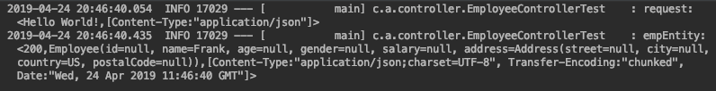

### 4.5.2 Receiving a Collection of Objects with exchange()

In the Controller, we define a method that simply returns information about a single object (e.g. an employee), but there are times when you need an endpoint that queries all employees and returns them as a List<Employee>.

**Controller Code**

This is a method that queries and returns all employees. It puts two employees into a list and returns a List<Employee>.

```java
@RequestMapping(method = RequestMethod.GET, value = "/employees", produces = MediaType.APPLICATION_JSON_VALUE)
public List<Employee> getAllEmployees() {
   List<Employee> lists = new ArrayList();
 
   lists.add(Employee.builder()
         .name("frank1")
         .address(Address.builder()
               .country("US")
               .build())
         .build());
 
   lists.add(Employee.builder()
         .name("frank2")
         .address(Address.builder()
               .country("US")
               .build())
         .build());
 
   log.info("lists: {}", lists);
   return lists;
}
```

**Client Code - Unit Test**

To obtain a list-form object list from RestTemplate, you can use the ResponseEntity and ParameterizedTypeReference objects. Using the ParameterizedTypeReference object, you can specify a generic type for the response instead of a Class. In the example, the response is specified as the List<Employee> type. Since the ParameterizedTypeReference object is an abstract class, an anonymous inline class is used to use it directly; for more details, please refer to super type tokens.

```java
@Test
public void test_get_lists_of_objects() {
   ResponseEntity<List<Employee>> responseEntity = restTemplate.exchange(BASE_URL + "/employees", HttpMethod.GET, null,  new ParameterizedTypeReference<List<Employee>>(){});
   log.info("responseEntity: {}", responseEntity);
}
```

**Execution screen**

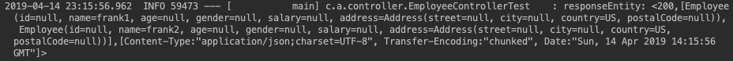

## 4.6 optionsForAllow()

optionsForAllow() is a method that queries the HTTP methods supported by the corresponding URI.

**Client Code - Unit Test**

```java
@Test
public void test_optionsForAllow() {
   final Set<HttpMethod> optionsForAllow = restTemplate.optionsForAllow(BASE_URL + "/employee");
 
   log.info("optionsForAllow: {}", optionsForAllow);
   log.info("optionsForAllow: {}", optionsForAllow);
}
```

**Execution screen**

The HTTP methods supported by [http://localhost:8080/employee](http://localhost:8080/employee) are POST and OPTIONS.


## 4.7 Configuring a Timeout

When using RestTemplate, you can additionally configure connection settings such as timeouts. For simple settings, you can use the SimpleClientHttpRequestFactory object, but since it does not provide many features, in a real environment you use a separate HTTP Client library that provides more features (e.g. retry). In this example, let's add Apache's httpclient and configure a Read timeout to use it.

Add the library to the pom.xml file.

```xml
<dependency>
    <groupId>org.apache.httpcomponents</groupId>
    <artifactId>httpclient</artifactId>
    <version>4.5.6</version>
</dependency>
```

**Client Code - Unit Test**

I set the connection and read timeouts to 5 seconds in the ClientHttpRequestFactory object. The controller sleeps for 10 seconds, so it does not return the result within 5 seconds; you can confirm that a ResourceAccessException occurs and "Read timed out" is printed.

```java
@Test
public void test_timeout() {
   final ClientHttpRequestFactory requestFactory = getRequestFactory();
   final RestTemplate restTemplateTimeout = new RestTemplate(requestFactory);
 
   assertThatThrownBy(() -> restTemplateTimeout.getForObject(BASE_URL + "/timeout/{id}", Employee.class, 25))
         .isInstanceOf(ResourceAccessException.class);
}
 
ClientHttpRequestFactory getRequestFactory() {
   final int timeoutInSecs = 5;
 
   final HttpComponentsClientHttpRequestFactory clientHttpRequestFactory = new HttpComponentsClientHttpRequestFactory();
   clientHttpRequestFactory.setConnectTimeout(timeoutInSecs * 1000);
   clientHttpRequestFactory.setReadTimeout(timeoutInSecs * 1000);
   return clientHttpRequestFactory;
}
```

**Execution screen**

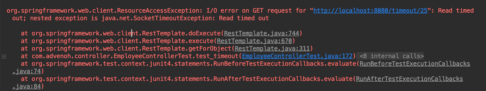

## 4.8 patchForObject()

patchForObject() executes the HTTP PATCH method to the given URL. There are three methods for creating a resource in HTTP. Let's briefly review them and then look at the Patch example code.

- POST
    - An operation that creates a resource without specifying the resource's location
    - POST is not idempotent (the concept that repeating an operation yields the same value)
    - ex. POST /employee
    - A new resource is created in a different place each time it is executed (ex. /employee/2, /employee/3)
- PUT
    - Used at a clear resource location, an operation used for creating or updating a resource
    - PUT is idempotent
        - ex. PUT _employee_{id}
- PATCH
    - Used at a fixed resource location like PUT, but updates only partial data rather than all parameters
    - ex. PATCH _employee_{id}

Since the JDK HttpURLConnection does not support the PATCH method, the error below occurs. Instead of the default HttpURLConnection, use Apache's HttpComponents, which supports the Patch method.

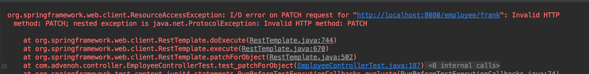

**Client Code - Unit Test**

```java
@Test
public void test_patchForObject() {
   final RestTemplate patchRestTemplate = new RestTemplate(getRequestFactory());
 
   Address address = Address.builder()
         .city("Columbus")
         .country("US")
         .build();
 
   patchRestTemplate.patchForObject(BASE_URL + "/employee/{name}", address, Address.class,"frank");
}
```

## 4.9 Execute()

Finally, let's look at the Execute() method. Execute() is the most general method provided by RestTemplate that performs a request by fully controlling the request preparation and response extraction through callbacks. So in fact, the methods mentioned so far, such as getForObject() and put(), internally call the execute() method.

The code below is the implementation part of the getForObject() and put() methods. They call execute() with the passed parameters.

```java
public void put(String url, @Nullable Object request, Map<String, ?> uriVariables) throws RestClientException {
    RequestCallback requestCallback = this.httpEntityCallback(request);
    this.execute(url, HttpMethod.PUT, requestCallback, (ResponseExtractor)null, (Map)uriVariables);
}
 
@Nullable
public <T> T getForObject(String url, Class<T> responseType, Object... uriVariables) throws RestClientException {
    RequestCallback requestCallback = this.acceptHeaderRequestCallback(responseType);
    HttpMessageConverterExtractor<T> responseExtractor = new HttpMessageConverterExtractor(responseType, this.getMessageConverters(), this.logger);
    return this.execute(url, HttpMethod.GET, requestCallback, responseExtractor, (Object[])uriVariables);
}
```

**Client Code - Unit Test**

Before sending the request to the URL, the request callback sets the passed Address object in the body and also sets the header values.

```java
@Test
public void testExecute() {
   Address address = Address.builder()
         .city("Columbus")
         .country("US")
         .build();
   restTemplate.execute(BASE_URL + "/employee/{name}", HttpMethod.PUT, requestCallback(address), clientHttpResponse -> null, "frank");
}
 
RequestCallback requestCallback(final Address address) {
   return clientHttpRequest -> {
      log.info("address : {}", address);
      ObjectMapper mapper = new ObjectMapper();
      mapper.writeValue(clientHttpRequest.getBody(), address);
      clientHttpRequest.getHeaders().add(
            HttpHeaders.CONTENT_TYPE, MediaType.APPLICATION_JSON_VALUE);
      clientHttpRequest.getHeaders().add(
            HttpHeaders.AUTHORIZATION, "Basic " + "testpasswd");
   };
}
```

**Execution screen**

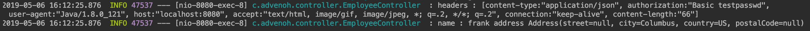

# 5. References

- RestTemplate
    - [https://www.baeldung.com/rest-template](https://www.baeldung.com/rest-template)
    - [https://howtodoinjava.com/spring-restful/spring-restful-client-resttemplate-example/](https://howtodoinjava.com/spring-restful/spring-restful-client-resttemplate-example/)
    - [https://vnthf.github.io/blog/Java-RestTemplate%EC%97%90-%EA%B4%80%ED%95%98%EC%97%AC/](https://vnthf.github.io/blog/Java-RestTemplate%EC%97%90-%EA%B4%80%ED%95%98%EC%97%AC/)
    - [https://docs.spring.io/spring/docs/current/spring-framework-reference/integration.html#rest-client-access](https://docs.spring.io/spring/docs/current/spring-framework-reference/integration.html#rest-client-access)
    - [https://www.concretepage.com/spring/spring-mvc/spring-rest-client-resttemplate-consume-restful-web-service-example-xml-json](https://www.concretepage.com/spring/spring-mvc/spring-rest-client-resttemplate-consume-restful-web-service-example-xml-json)
    - [https://howtodoinjava.com/spring-restful/spring-restful-client-resttemplate-example/](https://howtodoinjava.com/spring-restful/spring-restful-client-resttemplate-example/)
- How RestTemplate works
    - [https://sjh836.tistory.com/141](https://sjh836.tistory.com/141)
- Get Lists of Objects
    - [https://www.baeldung.com/spring-rest-template-list](https://www.baeldung.com/spring-rest-template-list)
- WebClient
    - [https://docs.spring.io/spring/docs/current/spring-framework-reference/integration.html#rest-client-access](https://docs.spring.io/spring/docs/current/spring-framework-reference/integration.html#rest-client-access)
    - [https://www.baeldung.com/spring-5-webclient](https://www.baeldung.com/spring-5-webclient)
- Super type tokens (ParameterizedTypeReference)
    - [https://homoefficio.github.io/2016/11/30/%ED%81%B4%EB%9E%98%EC%8A%A4-%EB%A6%AC%ED%84%B0%EB%9F%B4-%ED%83%80%EC%9E%85-%ED%86%A0%ED%81%B0-%EC%88%98%ED%8D%BC-%ED%83%80%EC%9E%85-%ED%86%A0%ED%81%B0/](https://homoefficio.github.io/2016/11/30/%ED%81%B4%EB%9E%98%EC%8A%A4-%EB%A6%AC%ED%84%B0%EB%9F%B4-%ED%83%80%EC%9E%85-%ED%86%A0%ED%81%B0-%EC%88%98%ED%8D%BC-%ED%83%80%EC%9E%85-%ED%86%A0%ED%81%B0/)
    - [https://www.bsidesoft.com/?p=2903](https://www.bsidesoft.com/?p=2903)
    - [https://docs.spring.io/spring-framework/docs/current/javadoc-api/org/springframework/core/ParameterizedTypeReference.html](https://docs.spring.io/spring-framework/docs/current/javadoc-api/org/springframework/core/ParameterizedTypeReference.html)
- Anonymous Inner Class
    - [https://www.geeksforgeeks.org/anonymous-inner-class-java/](https://www.geeksforgeeks.org/anonymous-inner-class-java/)
- Patch vs Put vs Post
    - [https://1ambda.github.io/javascripts/rest-api-put-vs-post/](https://1ambda.github.io/javascripts/rest-api-put-vs-post/)
    - [https://blog.fullstacktraining.com/restful-api-design-post-vs-put-vs-patch/](https://blog.fullstacktraining.com/restful-api-design-post-vs-put-vs-patch/)
