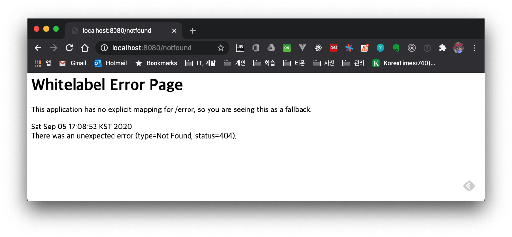
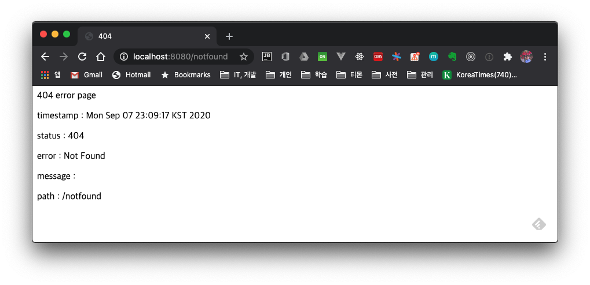

# 1. Introduction

When you access an API that does not exist, you often encounter the Whitelabel Error Page as shown below. If you haven't done any separate configuration, Spring Boot shows the Whitelabel Error Page by default.



Let's look at what processing is done by default regarding error handling and how you can change it.

## 1.1 BasicErrorController - The Default Error Handling Controller

In Spring Boot, BasicErrorController is responsible for this default error handling. If you haven't set `server.error.path` in `application.properties`, `/error` is specified as the default error handling PATH address.

```java
@Controller
@RequestMapping("${server.error.path:${error.path:/error}}")
public class BasicErrorController extends AbstractErrorController {
...
```

### 1.1.1 Whitelabel error page

When you access it from the browser, it shows the Whitelabel Error Page.


```html
GET http://localhost:8080/notfound
Accept: text/html

...omitted...

<html>
<body><h1>Whitelabel Error Page</h1>
<p>This application has no explicit mapping for /error, so you are seeing this as a fallback.</p>
<div id='created'>Sat Sep 05 16:54:38 KST 2020</div>
<div>There was an unexpected error (type=Not Found, status=404).</div>
<div></div>
</body>
</html>

Response code: 404; Time: 212ms; Content length: 286 bytes

```

When the Accept attribute value in the request header is `text/html`, the code below runs and returns the error page as a view.

```java
@RequestMapping(produces = MediaType.TEXT_HTML_VALUE)
public ModelAndView errorHtml(HttpServletRequest request, HttpServletResponse response) {
		HttpStatus status = getStatus(request);
		Map<String, Object> model = Collections
				.unmodifiableMap(getErrorAttributes(request, getErrorAttributeOptions(request, MediaType.TEXT_HTML)));
		response.setStatus(status.value());
		ModelAndView modelAndView = resolveErrorView(request, response, status, model);
		return (modelAndView != null) ? modelAndView : new ModelAndView("error", model);
}
```

### 1.1.2 Json Response

When the Accept value is `application/json`, it returns the response value in JSON form as well.

```json
GET http://localhost:8080/notfound
Accept: application/json

...omitted...

{
  "timestamp": "2020-09-05T07:58:28.016+00:00",
  "status": 404,
  "error": "Not Found",
  "message": "",
  "path": "/notfound"
}

Response code: 404; Time: 221ms; Content length: 110 bytes

```

The Json response value is handled and returned in the `error(HttpServletRequest request)` method.

```java
@RequestMapping
public ResponseEntity<Map<String, Object>> error(HttpServletRequest request) {
		HttpStatus status = getStatus(request);
		if (status == HttpStatus.NO_CONTENT) {
			return new ResponseEntity<>(status);
		}
		Map<String, Object> body = getErrorAttributes(request, getErrorAttributeOptions(request, MediaType.ALL));
		return new ResponseEntity<>(body, status);
}
```

> The response value is filled in by the `getErrorAttributes()` method.

```java
public class DefaultErrorAttributes implements ErrorAttributes, HandlerExceptionResolver, Ordered {

  ...omitted...
  public Map<String, Object> getErrorAttributes(WebRequest webRequest, boolean includeStackTrace) {
      Map<String, Object> errorAttributes = new LinkedHashMap();
      errorAttributes.put("timestamp", new Date());
      this.addStatus(errorAttributes, webRequest);
      this.addErrorDetails(errorAttributes, webRequest, includeStackTrace);
      this.addPath(errorAttributes, webRequest);
      return errorAttributes;
  }
}
```

# 2. Handling a Custom Error Page

# 2.1 Error-Related Properties

The server error-related settings are as follows.

| Key                 | Default  | Description     |
| -------------------------- | -------- | -------- |
| `server.error.include-binding-errors` | `never`  | When including binding errors|
| `server.error.include-exception`      | `false`  | When including exception content |
| `server.error.include-message`        | `never`  | When including error messages |
| `server.error.include-stacktrace`     | `never`  | When including the stacktrace |
| `server.error.path`                   | `/error` | The controller path to handle errors   |
| `server.error.whitelabel.enabled`     | `true`   | Determines whether to show the error page in the browser. <br />If set to false, Tomcat's error page is loaded |


## 2.2 Creating a Custom Error Page for a Specific Response Code

Creating and using a custom error page is simple. If you create a file in the format `error/{response-code}.<extension>` in one of the folders below, Spring Boot loads the corresponding file according to the HTTP status value.

- Folders
    - `/templates/error`
    - `/static/error`
- Files
    - `4xx.<extension>`
        - This file is loaded when any 400-range status code occurs
    - `404.<extension>`
        - This file is loaded when the HTTP status code is 404

In this post, I used Mustache as the View Template Engine and created files corresponding to 404 and 5xx in the `templates/error` folder.

```shell
% tree .
.
├── application.properties
├── static
└── templates
    ├── error
    │   ├── 404.mustache
    │   └── 5xx.mustache
    └── index.mustache
```

Write the `404.mustache` file.

```html
<!DOCTYPE html>
<html lang="en">
<head>
    <meta charset="UTF-8">
    <title>404</title>
</head>
<body>
404 error page
<p>timestamp : {{timestamp}}</p>
<p>status : {{status}}</p>
<p>error : {{error}}</p>
<p>message : {{message}}</p>
<p>path : {{path}}</p>
</body>
</html>
```

When you access a non-existent path in the browser, a 404 response error occurs and the above view file is handled as the response.



## 2.3 Creating a Separate ErrorController

As above, the method of creating a view file for a specific response code has the disadvantage that you cannot perform specific logic. In such a case, you can create a Custom Error Controller so that calls to the `/error` PATH are handled by this controller.

```java
@Slf4j
@Controller
public class CustomErrorController implements ErrorController {

    @GetMapping("/error")
    public String handleError(HttpServletRequest request) {
        Object status = request.getAttribute(RequestDispatcher.ERROR_STATUS_CODE);
        if (status != null) {
            int statusCode = Integer.valueOf(status.toString());
            if (statusCode == HttpStatus.NOT_FOUND.value()) {
                return "errors/404-custom";
            }
        }
        return "error";
    }

    /**
    * This method is deprecated since Spring Boot 2.3.x
    * - Instead of this method, to specify a custom path you must use the server.error.path property
    */
    @Override
    public String getErrorPath() {
        return null;
    }
}

```

In `handleError()`, it returns the `errors/404-custom` view. When a 404 error occurs, it shows a separate view.

# 4. Wrap-up

We briefly looked at the internal code of Spring Boot to see how the Whitelabel Error Page is loaded, and we also looked at how to change the error handling differently.

For the full source code, please refer to [github](https://github.com/kenshin579/tutorials-java/tree/master/springboot-whitelabel-error-page).

# 5. References

* Spring Boot error handling
    * https://www.baeldung.com/spring-boot-custom-error-page
    * https://velog.io/@godori/spring-boot-error
    * https://goddaehee.tistory.com/214
    * https://supawer0728.github.io/2019/04/04/spring-error-handling/
* Spring Boot property list
    * https://docs.spring.io/spring-boot/docs/current/reference/html/appendix-application-properties.html
