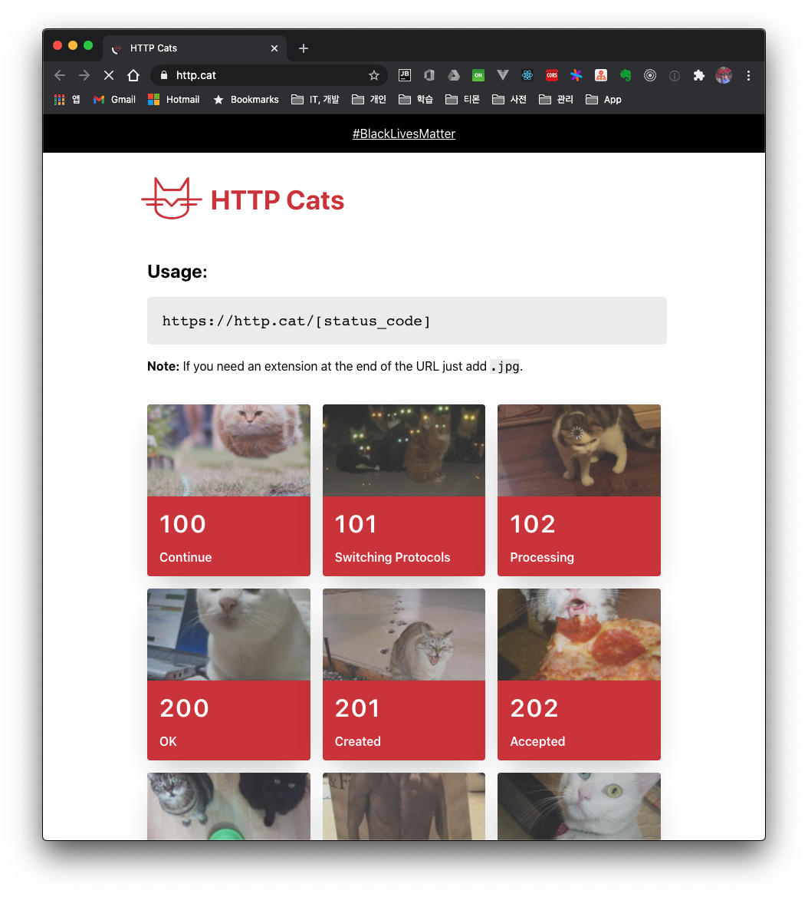

I summarized the HTTP status codes you encounter during API development. There are many more besides these, but these are the response codes you've heard of and encountered at least once.

There is even a site that shows cat images according to the HTTP status value. This developer must really love cats.

- [HTTP Cats API](https://http.cat/)

# Http Status Code

## **1xx** (Informational)
- Personally, this is a response value I haven't encountered yet

## **2xx** (Success) : These status code values return a response when the request processing is successful.
- **200** (`OK` Success)
- **201** (`Created`)
  - Returned when the request is processed and a new resource is successfully created

## **3xx** (Redirection) : These status code values indicate that the client must take additional action to complete the request. And most 3xx status codes are used for URL redirection.
- **301** (`Moved Permanently`)
   - Used when permanently moving the requested page to a new location
   - If this response value is returned for a GET or HEAD request, the client automatically moves to the new location
   

## **4xx** (Client Error) : These status code values are returned when caused by a client-side error
- **400** (`Bad Request`)
- **401** (`Unauthorized`)
  - Occurs when authentication is required for the request and is returned when not authenticated

- **403** (`Forbidden`)
  - This is the case where the request is denied by the server. It can occur because the requesting user does not have permission.

- **404** (`Not Found`)
- **409** (`Conflicts`)
  - Returned as the response value when the request cannot be processed because a conflict occurred

## **5xx** (Server Error) : These response code values are returned when the server cannot process the request
- **500** (`Internal Server Error`)
  - Used for general server errors

- **501** (`Not Implemented`)
- **502** (`Bad Gateway`)
- **503** (`Service Unavailable`) 
  - Used when the server is running but overloaded due to many requests
- **504** (`Gateway Timeout`)

# References

- Http Status Code
    - https://http.cat/
    - https://ko.wikipedia.org/wiki/HTTP_%EC%83%81%ED%83%9C_%EC%BD%94%EB%93%9C
- On errors
    - https://www.baeldung.com/rest-api-error-handling-best-practices
    - https://developer.twitter.com/en/docs/basics/response-codes
