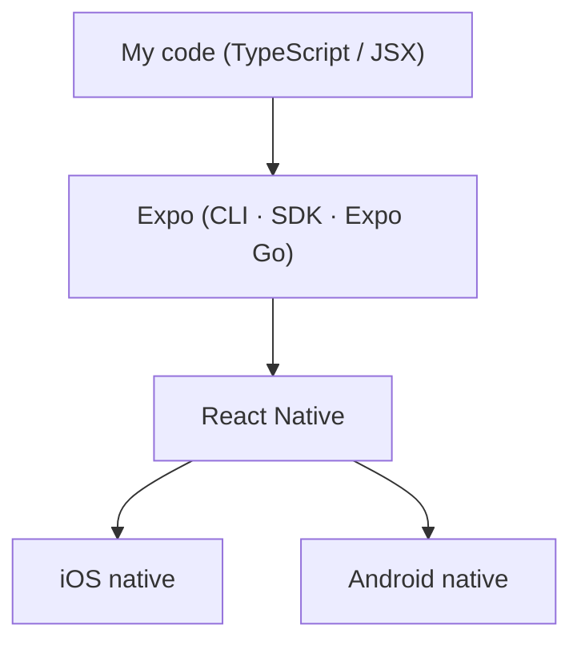
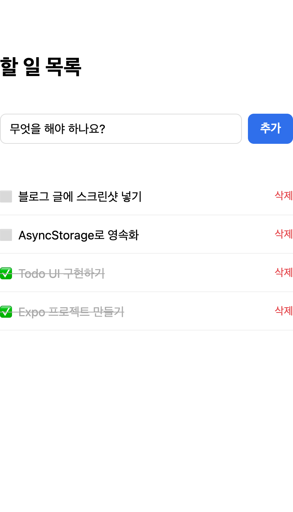
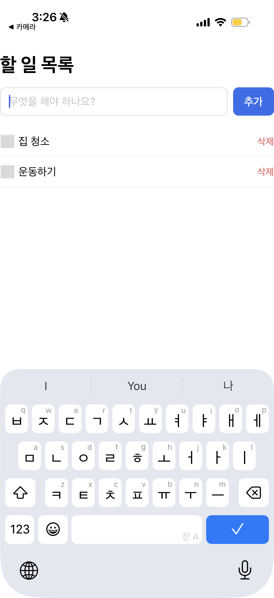

# 1. Introduction

Have you ever built a web app with React but felt lost about where to even start with a mobile app? With React Native, you can build iOS/Android apps using the same React syntax you already know. But when you actually try to get started, you run into barriers like Xcode, Android Studio, and native build configuration.

**Expo** removes almost all of those barriers. In this article, we'll set up a development environment with Expo and build a simple **Todo app** from start to finish. The features we'll build are:

- Add a task / toggle completion / delete
- Persist data so the list survives even after closing and reopening the app

This article targets readers familiar with React (components, JSX, `useState`), and focuses on **"how to develop with Expo"** rather than React syntax itself. You can find the complete code in the [GitHub repository](https://github.com/kenshin579/tutorials-go/tree/master/web/expo-todo-app).

> The environment is based on macOS, and assumes the [Node.js](https://nodejs.org/) LTS version is installed.

# 2. What Is Expo? Why Expo?

**React Native** is a framework that renders code written in JavaScript/TypeScript as actual native UI. In other words, it produces a real native app, not an app faked with a webview.

The problem is that to start with pure React Native, you have to install Xcode and Android Studio and configure the native build environment yourself. For beginners, this initial setup alone is the biggest wall.

**Expo** is a collection of tools and services layered on top of React Native that dramatically lowers this wall.

- **Start without a native build environment**: you can create a project and run it immediately with a single command
- **Expo Go**: if you install the Expo Go app from the App Store/Play Store, you can scan a QR code and instantly launch your app on your phone. No separate build needed
- **Rich SDK**: you can use native features like camera, location, notifications, and local storage just by installing a package
- **EAS Build**: later, when you want to build a real app and publish it to the stores, you can use the cloud build service

Here's how your code relates to the runtime environment.



We write code in `App.tsx`, and Expo connects it to React Native and renders it as each platform's native screen.

# 3. Getting Started: From Project Creation to Running

First, check whether Node is installed.

```bash
node -v
```

Now create a project with `create-expo-app`. Here we use the **blank TypeScript template**.

```bash
npx create-expo-app@latest my-todo-app --template blank-typescript
```

> Expo's default template includes file-based routing (Expo Router) and tab navigation, which is a bit heavy for beginners. So we chose the `blank-typescript` template that starts with a single empty screen. We'll only touch on Expo Router as a keyword in Section 7.

Once creation is done, move into the project folder and start the development server.

```bash
cd my-todo-app
npx expo start
```

A QR code and a run-options menu appear in the terminal. Pick the one that fits your situation.

- **Expo Go (easiest)**: install the [Expo Go](https://expo.dev/go) app on your phone and scan the QR code in the terminal
- `i`: run on the iOS simulator (requires macOS + Xcode)
- `a`: run on the Android emulator (requires Android Studio)
- `w`: run in a web browser

When it runs, you'll see the default screen that says "Open up App.tsx to start working on your app!". If you've made it this far, your development environment is ready.

The terminal displays a QR code and a key-shortcut menu similar to the following. Seeing this screen means the development server has started successfully.


Below the QR code, the following guidance and shortcut menu are also shown.

```text
› Metro waiting on exp://192.168.0.10:8081
› Scan the QR code above with Expo Go (Android) or the Camera app (iOS)

› Press s │ switch to development build
› Press a │ open Android
› Press i │ open iOS simulator
› Press w │ open web

› Press r │ reload app
› Press m │ toggle menu
› Press ? │ show all commands
```

The `exp://...` address is the location where the Metro bundler is running, and your phone's [Expo Go](https://expo.dev/go) app connects to this address to download and run the app bundle. On iOS, scan the QR above with the default Camera app; on Android, scan it with the scanner inside Expo Go, and the app launches on your phone right away. For the simulator/emulator/web, press the `i`/`a`/`w` keys respectively.

## 3.1 What If You Don't Have an iOS Simulator?

The iOS simulator only works with **macOS + Xcode**. If you don't have Xcode, use Windows/Linux, or find the installation burdensome, you can run the app perfectly fine without a simulator.

- **Real device + Expo Go (most recommended)**: install the Expo Go app on your phone and scan the QR code from `npx expo start`. On iOS, scan with the default Camera app; on Android, scan with the scanner inside Expo Go. Your **PC and phone must be on the same Wi-Fi**, and if a corporate network or similar prevents the connection, you can work around it with `npx expo start --tunnel`
- **Web browser**: with `npx expo start --web` (or the `w` key), you can check it immediately without any installation. The Todo app we'll build also works on the web, where AsyncStorage is handled as the browser's `localStorage`, so the list persists even after a refresh. There may, however, be subtle differences from a real mobile device
- **Android emulator**: if you have Android Studio, you can create an AVD and run it with the `a` key

If you really want to use the iOS simulator, install Xcode from the Mac App Store, then download the iOS simulator runtime from **Xcode → Settings → Components (or Platforms)** and press the `i` key in `npx expo start`.

> If you just want to quickly check the screen, use **web**; if you need a real mobile feel, **a real device + Expo Go** is recommended. Installing the iOS simulator is optional.

# 4. Looking at the Project Structure

Let's look at only the core files of the generated project.

```
my-todo-app/
├── App.tsx          # The app's entry point. Where the screen is drawn
├── app.json         # Expo settings such as app name, icon, splash
├── package.json     # List of dependencies
├── tsconfig.json    # TypeScript settings (extends expo/tsconfig.base)
└── assets/          # Resources such as icons and splash images
```

The one place where we'll spend almost all our time is the single file **`App.tsx`**. Like the web's `index.html` or a root component, this component is the first thing drawn on the screen when you open the app.

One more thing: Expo supports **Fast Refresh**. When you edit and save `App.tsx`, the changes are immediately reflected on the screen without needing to restart the app. Think of it as the same experience as HMR (Hot Module Replacement) in web development.

Now let's build the Todo app in earnest.

# 5. Building the Todo App

Now we implement the Todo app in `App.tsx`. The screen composition and state management are almost the same as the React we know, so here we'll point out only **the parts that differ from the web and the parts that are Expo-specific**. You can find the full code on [GitHub](https://github.com/kenshin579/tutorials-go/tree/master/web/expo-todo-app).

In React Native, you use dedicated components instead of web tags.

- `View` / `Text`: corresponds to `<div>` / `<p>`. All text must go inside a `Text`
- `TextInput`: an input field. It receives values via `onChangeText`, not `onChange`
- `FlatList`: list rendering. A virtualized list that only draws the items visible on screen
- `TouchableOpacity`: a touch area that acts as a button
- Styles are written not in a CSS file but as objects created with `StyleSheet.create` (properties are camelCase, and Flexbox is the default for layout)

The state and core logic (add/complete/delete) are ordinary React code.

```tsx
type Todo = { id: string; text: string; done: boolean };

const [todos, setTodos] = useState<Todo[]>([]);
const [text, setText] = useState('');

const addTodo = () => {
  const trimmed = text.trim();
  if (!trimmed) return;
  setTodos((prev) => [
    { id: Date.now().toString(), text: trimmed, done: false },
    ...prev,
  ]);
  setText('');
};

const toggleTodo = (id: string) => {
  setTodos((prev) =>
    prev.map((t) => (t.id === id ? { ...t, done: !t.done } : t)),
  );
};

const deleteTodo = (id: string) => {
  setTodos((prev) => prev.filter((t) => t.id !== id));
};
```

The screen consists of an input field (`TextInput` + an add button) and a list (`FlatList`); tapping an item toggles completion, and pressing "Delete" removes it. Since the full JSX and styles (`StyleSheet`) are lengthy, refer to the [GitHub source](https://github.com/kenshin579/tutorials-go/tree/master/web/expo-todo-app). At this point, you have a Todo app that works in memory.

| Web | App (Expo Go) |
|-----|---------------|
|  |  |

The result after adding 4 todos and marking 2 of them complete (✅, strikethrough) — it works identically in the Web and the Expo Go app.

## 5.1 Persisting Data (AsyncStorage)

Right now, the app loses all its tasks when you close and reopen it. That's because all state lives only in memory. To save data on the device, we use **AsyncStorage** (an asynchronous key-value local storage).

Here is where Expo's real strength shows. When adding a native module, you use **`npx expo install`** instead of `npm install`.

```bash
npx expo install @react-native-async-storage/async-storage
```

`expo install` automatically picks and installs a version **compatible** with the current project's Expo SDK version. Native modules are sensitive to compatibility depending on the SDK version, and Expo takes care of matching this for you. And you don't have to touch native code directly or eject the project.

Now, with `useEffect`, we (1) load the saved list when the app starts and (2) save it whenever the list changes.

```tsx
const STORAGE_KEY = '@expo_todo_app/todos';

const [loaded, setLoaded] = useState(false);

// Load saved todos when the app starts
useEffect(() => {
  (async () => {
    const raw = await AsyncStorage.getItem(STORAGE_KEY);
    if (raw) setTodos(JSON.parse(raw));
    setLoaded(true);
  })();
}, []);

// Save whenever todos change (after the initial load completes)
useEffect(() => {
  if (!loaded) return;
  AsyncStorage.setItem(STORAGE_KEY, JSON.stringify(todos));
}, [todos, loaded]);
```

The reason for the `loaded` flag is to prevent the save effect from running before the initial load finishes and overwriting the existing data with an empty array. Now, even after adding items, fully quitting the app, and reopening it, the list is preserved as is.

# 6. Expo's Limitations and Considerations

Expo makes getting started easy, but it isn't a silver bullet. There are some limitations worth knowing before applying it in real-world projects.

- **In Expo Go, you can only use the native modules included in the SDK.** Arbitrary third-party native libraries (e.g., a specific payment SDK or a Bluetooth library) won't work directly in the Expo Go app. In that case, you need to create a **development build** (a development app you build yourself). In other words, the convenience of "scan a QR with Expo Go and run instantly" only holds within the scope of pure JS and built-in modules
- **Reflecting the latest native features can be slow.** A new OS feature or a particular native SDK may take time to be included in the Expo SDK, or you may have to write a **config plugin** yourself
- **Versions are tied to the Expo SDK.** It's hard to freely bump the versions of React Native or some libraries, and you have to follow the Expo SDK upgrade cycle. The fact that `expo install` enforces compatible versions is a convenience and a constraint at the same time
- **Build and deployment are ultimately the native domain.** To publish to the stores, you need EAS Build (cloud build, with a free quota) or a local native build. Development may be easy, but at the deployment stage you face the reality of native builds
- **App size and low-level control.** Because the Expo runtime is included, the binary size can be somewhat larger, and there can be constraints for apps that require fine-grained native handling, such as high-performance graphics or special hardware control

> For reference, the old concept of "eject" (detaching Expo to switch to a pure native project) has now been replaced by **prebuild** and development builds. It's now common to add the native code you need while keeping Expo, so the old worry that "if you start with Expo, you'll get stuck later" has largely been resolved.

In summary, **Expo is enough for most typical apps**, and the limitations above mainly apply when you need deep native customization.

# 7. Conclusion

To summarize the flow of getting started with a React Native app using Expo:

1. Create a project with `create-expo-app`
2. Run instantly on Expo Go or the simulator with `expo start`
3. Write the screen and logic in `App.tsx` (check immediately with Fast Refresh)
4. Compose the UI with RN components like `View`/`Text`/`TextInput`/`FlatList`
5. Easily add native modules (AsyncStorage) with `expo install`

The core appeal of Expo is being able to build a working app with React knowledge alone, without complex native configuration.

Good topics to explore as next steps are:

- **Expo Router**: compose multiple screens and tab navigation with file-based routing
- **EAS Build**: build the app in the cloud and publish it to the App Store/Play Store
- Make use of various **Expo SDKs** (camera, location, notifications, etc.)

# 8. References

- [Expo Official Docs](https://docs.expo.dev/)
- [create-expo-app Docs](https://docs.expo.dev/more/create-expo/)
- [AsyncStorage Docs](https://react-native-async-storage.github.io/async-storage/)
- [Full Source Code (GitHub)](https://github.com/kenshin579/tutorials-go/tree/master/web/expo-todo-app)
