# 1. Mermaid란?

Mermaid는 마크다운과 유사한 텍스트 기반 문법으로 다이어그램을 생성하는 JavaScript 라이브러리이다. 코드처럼 다이어그램을 작성할 수 있어 버전 관리가 쉽고, 문서와 함께 관리할 수 있다는 장점이 있다.

## 1.1 주요 특징

- 텍스트 기반으로 다이어그램 작성
- Git으로 버전 관리 가능
- 다양한 다이어그램 유형 지원
- GitHub, GitLab, Notion 등에서 기본 지원

---

# 2. Flowchart (플로우차트)

플로우차트는 프로세스나 알고리즘의 흐름을 시각화하는 데 사용한다.

## 2.1 기본 문법

**코드:**

```text
flowchart TD
    A[시작] --> B{조건 확인}
    B -->|Yes| C[작업 수행]
    B -->|No| D[다른 작업]
    C --> E[종료]
    D --> E
```

**렌더링 결과:**

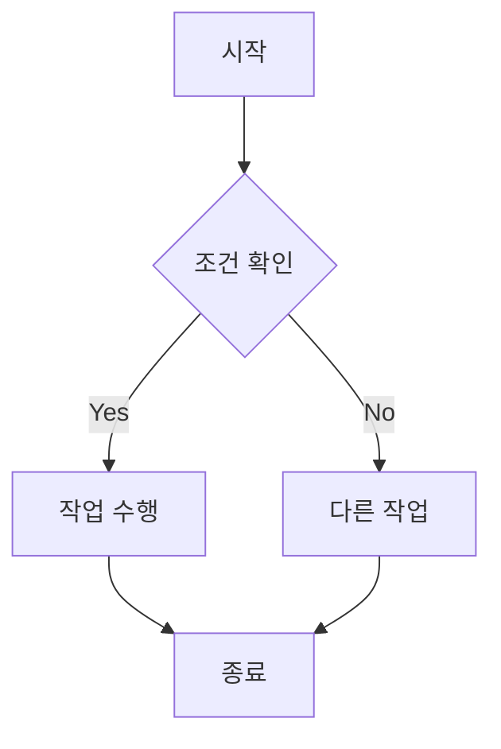

## 2.2 방향 설정

- `TD` 또는 `TB`: 위에서 아래로 (Top to Bottom)
- `BT`: 아래에서 위로 (Bottom to Top)
- `LR`: 왼쪽에서 오른쪽으로 (Left to Right)
- `RL`: 오른쪽에서 왼쪽으로 (Right to Left)

## 2.3 노드 모양

**코드:**

```text
flowchart LR
    A[사각형] --> B(둥근 사각형)
    B --> C([스타디움])
    C --> D[[서브루틴]]
    D --> E[(데이터베이스)]
    E --> F((원형))
    F --> G{다이아몬드}
    G --> H{{육각형}}
```

**렌더링 결과:**

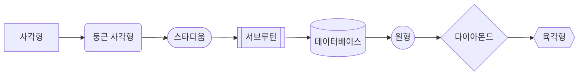

---

# 3. Sequence Diagram (시퀀스 다이어그램)

시퀀스 다이어그램은 객체 간의 상호작용을 시간 순서대로 표현한다.

## 3.1 API 호출 예시

**코드:**

```text
sequenceDiagram
    participant Client
    participant API Gateway
    participant Auth Service
    participant Database

    Client->>API Gateway: POST /login
    API Gateway->>Auth Service: 인증 요청
    Auth Service->>Database: 사용자 조회
    Database-->>Auth Service: 사용자 정보
    Auth Service-->>API Gateway: JWT 토큰
    API Gateway-->>Client: 200 OK + Token
```

**렌더링 결과:**

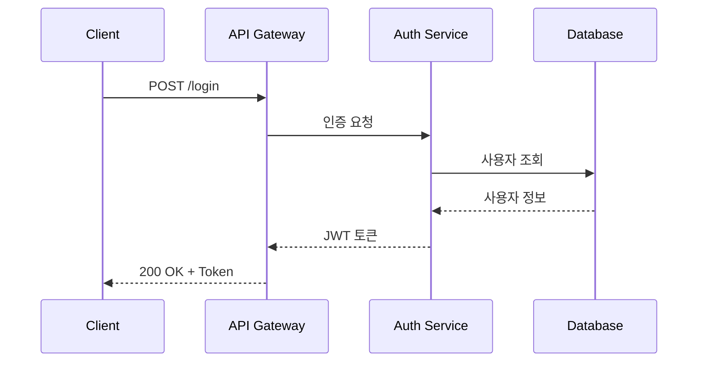

## 3.2 메시지 유형

**코드:**

```text
sequenceDiagram
    A->>B: 동기 메시지 (실선 화살표)
    B-->>A: 응답 (점선 화살표)
    A-)B: 비동기 메시지
    B--)A: 비동기 응답
    A-xB: 실패/거부
```

**렌더링 결과:**

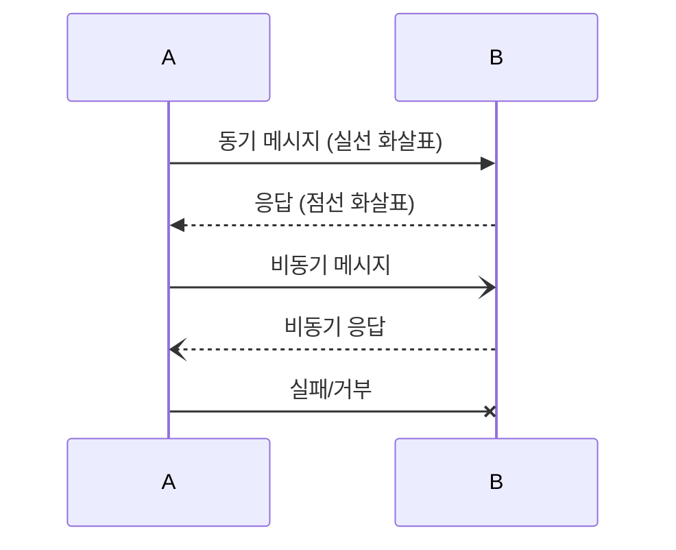

## 3.3 활성화 및 노트

**코드:**

```text
sequenceDiagram
    participant User
    participant Server

    User->>+Server: 요청
    Note right of Server: 처리 중...
    Server-->>-User: 응답

    Note over User,Server: 통신 완료
```

**렌더링 결과:**

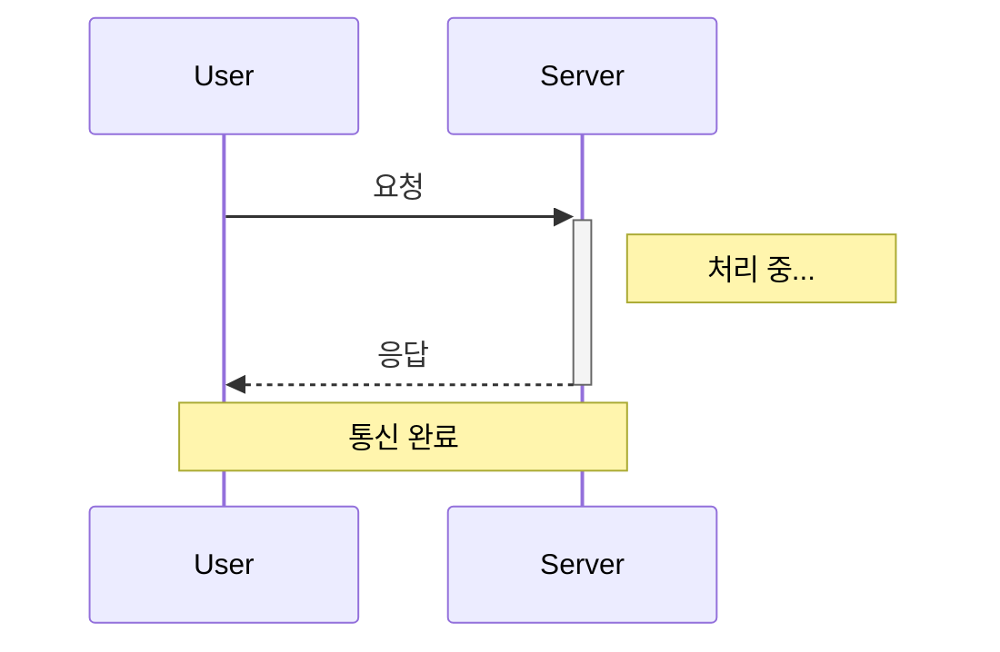

---

# 4. Class Diagram (클래스 다이어그램)

클래스 다이어그램은 객체 지향 설계에서 클래스 간의 관계를 표현한다.

## 4.1 기본 클래스 구조

**코드:**

```text
classDiagram
    class Animal {
        +String name
        +int age
        +makeSound() void
        +move() void
    }

    class Dog {
        +String breed
        +bark() void
        +fetch() void
    }

    class Cat {
        +String color
        +meow() void
        +scratch() void
    }

    Animal <|-- Dog : 상속
    Animal <|-- Cat : 상속
```

**렌더링 결과:**

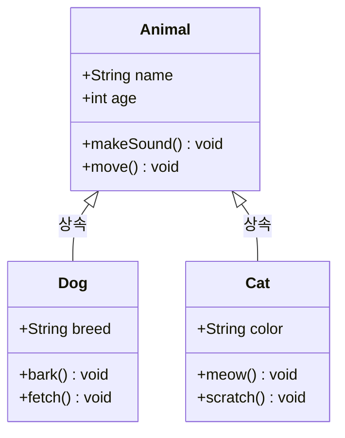

## 4.2 관계 표현

**코드:**

```text
classDiagram
    classA --|> classB : 상속
    classC --* classD : 컴포지션
    classE --o classF : 집합
    classG --> classH : 연관
    classI ..> classJ : 의존
    classK ..|> classL : 구현
```

**렌더링 결과:**

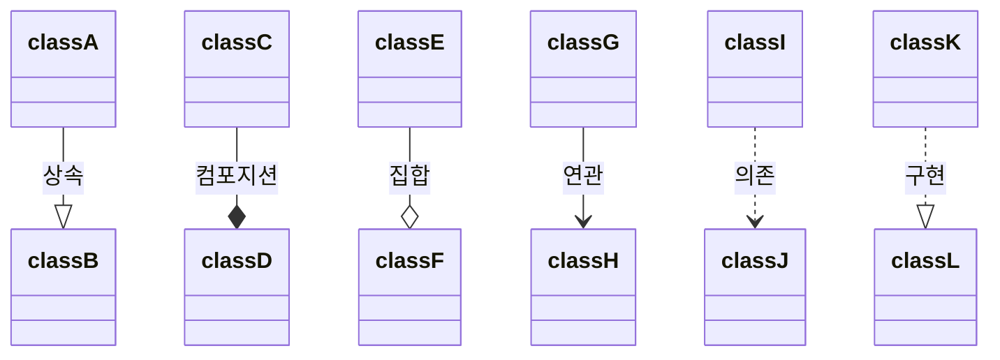

---

# 5. State Diagram (상태 다이어그램)

상태 다이어그램은 객체의 상태 변화를 표현한다.

## 5.1 주문 상태 예시

**코드:**

```text
stateDiagram-v2
    [*] --> 주문접수
    주문접수 --> 결제대기 : 주문 확인
    결제대기 --> 결제완료 : 결제 성공
    결제대기 --> 주문취소 : 결제 실패
    결제완료 --> 배송준비
    배송준비 --> 배송중 : 출고
    배송중 --> 배송완료 : 도착
    배송완료 --> [*]
    주문취소 --> [*]
```

**렌더링 결과:**

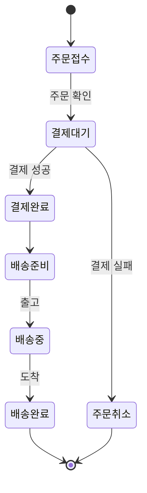

## 5.2 복합 상태

**코드:**

```text
stateDiagram-v2
    [*] --> Active

    state Active {
        [*] --> Idle
        Idle --> Processing : start
        Processing --> Idle : done
    }

    Active --> Inactive : suspend
    Inactive --> Active : resume
    Inactive --> [*] : terminate
```

**렌더링 결과:**

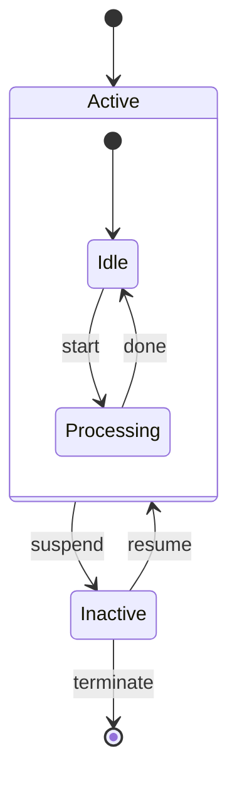

---

# 6. Entity Relationship Diagram (ERD)

ERD는 데이터베이스 설계에서 엔티티 간의 관계를 표현한다.

**코드:**

```text
erDiagram
    USER ||--o{ ORDER : places
    USER {
        int id PK
        string name
        string email UK
        datetime created_at
    }

    ORDER ||--|{ ORDER_ITEM : contains
    ORDER {
        int id PK
        int user_id FK
        datetime order_date
        string status
    }

    ORDER_ITEM }|--|| PRODUCT : references
    ORDER_ITEM {
        int id PK
        int order_id FK
        int product_id FK
        int quantity
    }

    PRODUCT {
        int id PK
        string name
        decimal price
        int stock
    }
```

**렌더링 결과:**

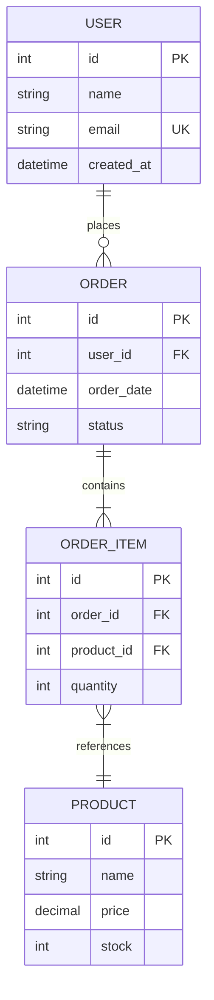

---

# 7. Git Graph

Git의 브랜치와 커밋 히스토리를 시각화한다.

**코드:**

```text
gitGraph
    commit id: "초기 커밋"
    branch develop
    checkout develop
    commit id: "기능 A 개발"
    branch feature/login
    checkout feature/login
    commit id: "로그인 UI"
    commit id: "로그인 로직"
    checkout develop
    merge feature/login
    checkout main
    merge develop tag: "v1.0.0"
    checkout develop
    commit id: "기능 B 개발"
```

**렌더링 결과:**

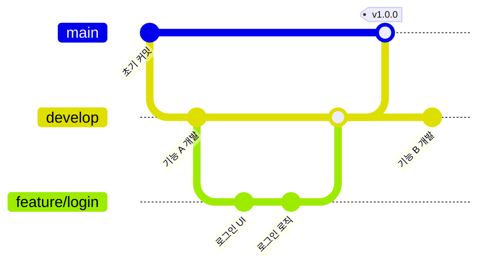

---

# 8. Gantt Chart (간트 차트)

프로젝트 일정을 시각화하는 간트 차트이다.

**코드:**

```text
gantt
    title 프로젝트 일정
    dateFormat YYYY-MM-DD

    section 기획
    요구사항 분석     :a1, 2026-01-01, 7d
    설계 문서 작성    :a2, after a1, 5d

    section 개발
    백엔드 개발      :b1, after a2, 14d
    프론트엔드 개발   :b2, after a2, 14d

    section 테스트
    통합 테스트      :c1, after b1, 7d
    버그 수정        :c2, after c1, 5d

    section 배포
    운영 배포        :d1, after c2, 2d
```

**렌더링 결과:**

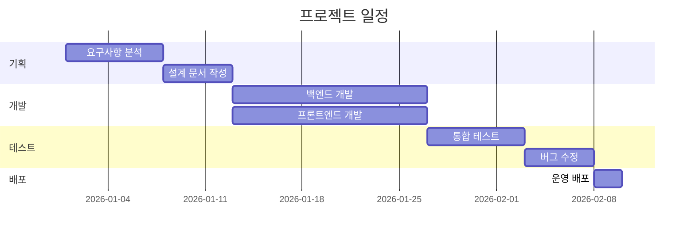

---

# 9. Pie Chart (파이 차트)

**코드:**

```text
pie showData
    title 기술 스택 사용 비율
    "JavaScript" : 35
    "TypeScript" : 30
    "Python" : 20
    "Go" : 10
    "기타" : 5
```

**렌더링 결과:**

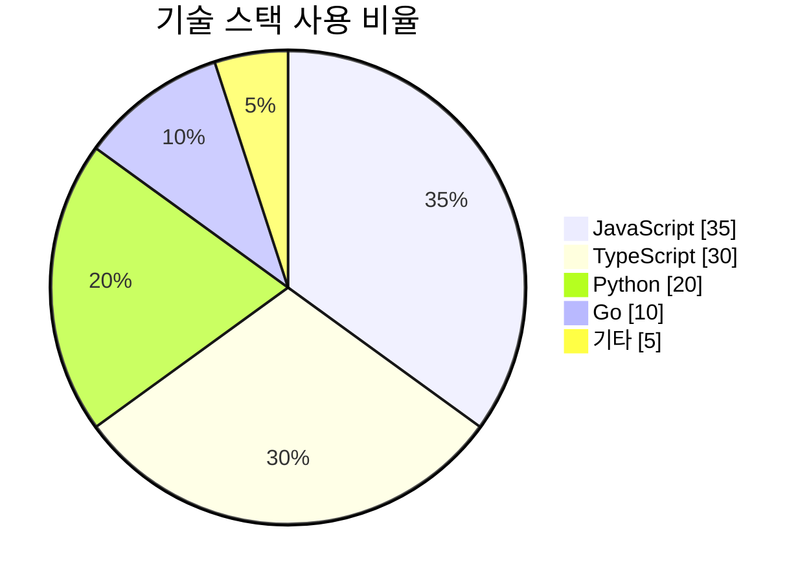

---

# 10. Mermaid 렌더링 도구

Mermaid 다이어그램을 렌더링할 수 있는 다양한 도구와 플랫폼이 있다.

## 10.1 온라인 에디터

| 도구 | 설명 |
|-----|------|
| [Mermaid Live Editor](https://mermaid.live/) | 공식 온라인 에디터. 실시간 미리보기 및 이미지 내보내기 지원 |
| [Mermaid Chart](https://www.mermaidchart.com/) | 팀 협업을 위한 Mermaid 에디터 |

## 10.2 기본 지원 플랫폼

다음 플랫폼에서는 별도 설정 없이 Mermaid 코드 블록을 자동으로 렌더링한다.

- **GitHub** - README, Issue, PR, Wiki 등
- **GitLab** - Markdown 파일, Issue, MR 등
- **Notion** - 코드 블록에서 Mermaid 선택
- **Obsidian** - 기본 지원
- **Typora** - 기본 지원

## 10.3 IDE 확장 프로그램

| IDE | 확장 프로그램 |
|-----|-------------|
| **VS Code** | [Markdown Preview Mermaid Support](https://marketplace.visualstudio.com/items?itemName=bierner.markdown-mermaid) |
| **IntelliJ / WebStorm** | [Mermaid Plugin](https://plugins.jetbrains.com/plugin/20146-mermaid) |

## 10.4 웹 프레임워크 통합

| 프레임워크 | 라이브러리 |
|-----------|-----------|
| **React / Next.js** | `mermaid` (클라이언트 렌더링) |
| **VuePress** | `vuepress-plugin-mermaidjs` |
| **Docusaurus** | `@docusaurus/theme-mermaid` |
| **Hugo** | 내장 지원 (shortcode) |
| **Jekyll** | `jekyll-mermaid` |

## 10.5 CLI 도구

```bash
# mermaid-cli 설치
npm install -g @mermaid-js/mermaid-cli

# SVG로 내보내기
mmdc -i diagram.mmd -o diagram.svg

# PNG로 내보내기
mmdc -i diagram.mmd -o diagram.png
```

---

# 11. 마무리

Mermaid는 텍스트만으로 플로우차트부터 ERD, 간트 차트까지 그릴 수 있다. 그림 파일을 따로 들고 다닐 필요 없이 코드와 같이 버전 관리되니, README나 기술 문서에 끼워 넣기에 특히 편하다.

## 11.1 참고 자료

- [Mermaid 공식 문서](https://mermaid.js.org/)
- [Mermaid Live Editor](https://mermaid.live/)
- [GitHub Mermaid 지원 문서](https://docs.github.com/en/get-started/writing-on-github/working-with-advanced-formatting/creating-diagrams)
