## What is Mermaid?

Mermaid is a JavaScript library that generates diagrams using a Markdown-like text-based syntax. Since you can write diagrams like code, they are easy to version-control and can be managed alongside your documentation.

### Key Features

- Write diagrams as text
- Version-control with Git
- Supports various diagram types
- Natively supported in GitHub, GitLab, Notion, and more

---

## 1. Flowchart

Flowcharts are used to visualize the flow of a process or algorithm.

### Basic Syntax

**Code:**

```text
flowchart TD
    A[Start] --> B{Check condition}
    B -->|Yes| C[Perform task]
    B -->|No| D[Other task]
    C --> E[End]
    D --> E
```

**Rendered result:**

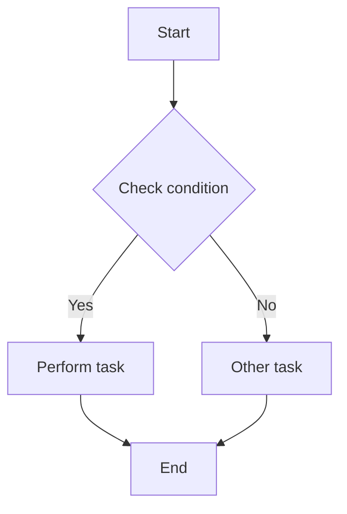

### Setting Direction

- `TD` or `TB`: Top to Bottom
- `BT`: Bottom to Top
- `LR`: Left to Right
- `RL`: Right to Left

### Node Shapes

**Code:**

```text
flowchart LR
    A[Rectangle] --> B(Rounded rectangle)
    B --> C([Stadium])
    C --> D[[Subroutine]]
    D --> E[(Database)]
    E --> F((Circle))
    F --> G{Diamond}
    G --> H{{Hexagon}}
```

**Rendered result:**

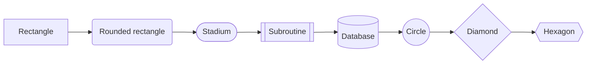

---

## 2. Sequence Diagram

A sequence diagram represents the interactions between objects in chronological order.

### API Call Example

**Code:**

```text
sequenceDiagram
    participant Client
    participant API Gateway
    participant Auth Service
    participant Database

    Client->>API Gateway: POST /login
    API Gateway->>Auth Service: Authentication request
    Auth Service->>Database: Query user
    Database-->>Auth Service: User information
    Auth Service-->>API Gateway: JWT token
    API Gateway-->>Client: 200 OK + Token
```

**Rendered result:**

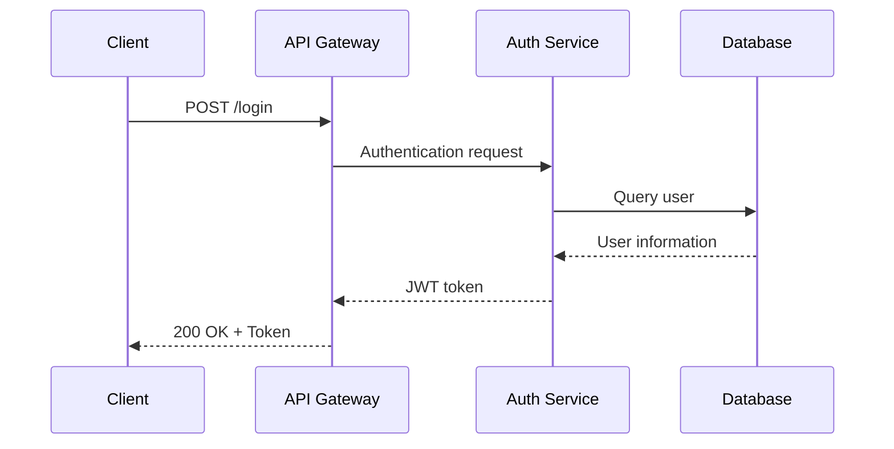

### Message Types

**Code:**

```text
sequenceDiagram
    A->>B: Synchronous message (solid arrow)
    B-->>A: Response (dashed arrow)
    A-)B: Asynchronous message
    B--)A: Asynchronous response
    A-xB: Failure/rejection
```

**Rendered result:**

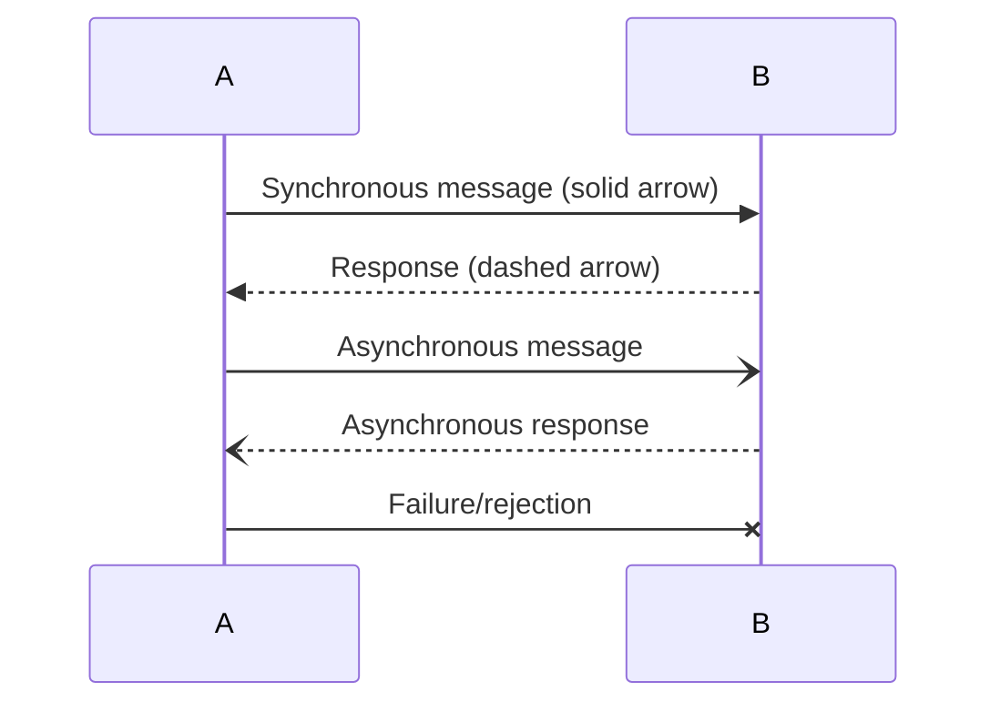

### Activation and Notes

**Code:**

```text
sequenceDiagram
    participant User
    participant Server

    User->>+Server: Request
    Note right of Server: Processing...
    Server-->>-User: Response

    Note over User,Server: Communication complete
```

**Rendered result:**

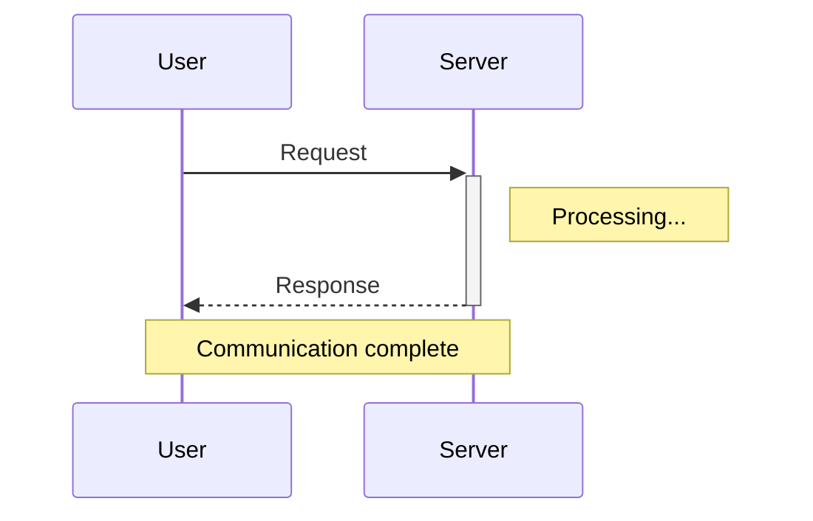

---

## 3. Class Diagram

A class diagram represents the relationships between classes in object-oriented design.

### Basic Class Structure

**Code:**

```text
classDiagram
    class Animal {
        +String name
        +int age
        +makeSound() void
        +move() void
    }

    class Dog {
        +String breed
        +bark() void
        +fetch() void
    }

    class Cat {
        +String color
        +meow() void
        +scratch() void
    }

    Animal <|-- Dog : Inheritance
    Animal <|-- Cat : Inheritance
```

**Rendered result:**

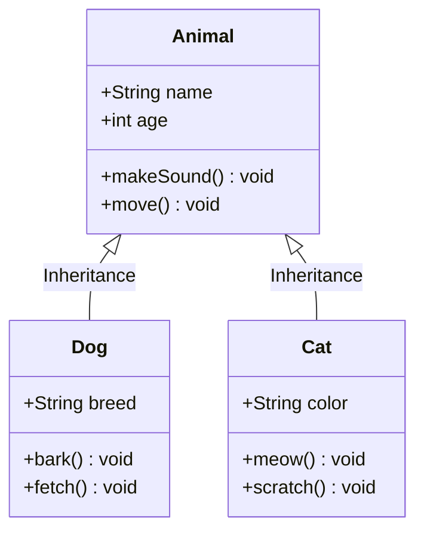

### Relationship Notation

**Code:**

```text
classDiagram
    classA --|> classB : Inheritance
    classC --* classD : Composition
    classE --o classF : Aggregation
    classG --> classH : Association
    classI ..> classJ : Dependency
    classK ..|> classL : Realization
```

**Rendered result:**

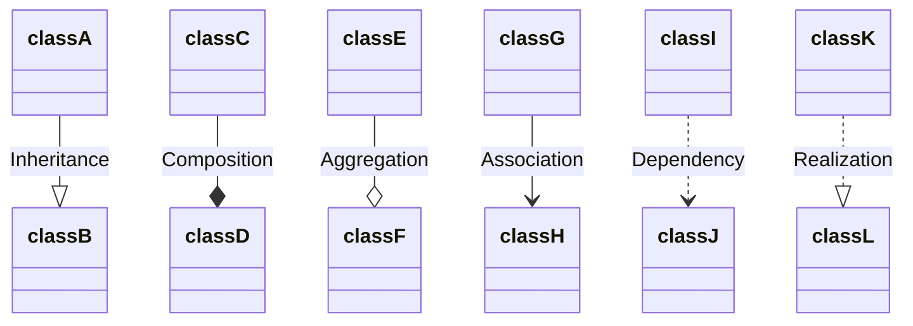

---

## 4. State Diagram

A state diagram represents the state transitions of an object.

### Order State Example

**Code:**

```text
stateDiagram-v2
    [*] --> OrderReceived
    OrderReceived --> AwaitingPayment : Order confirmed
    AwaitingPayment --> PaymentCompleted : Payment success
    AwaitingPayment --> OrderCancelled : Payment failure
    PaymentCompleted --> PreparingShipment
    PreparingShipment --> Shipping : Dispatched
    Shipping --> Delivered : Arrived
    Delivered --> [*]
    OrderCancelled --> [*]
```

**Rendered result:**

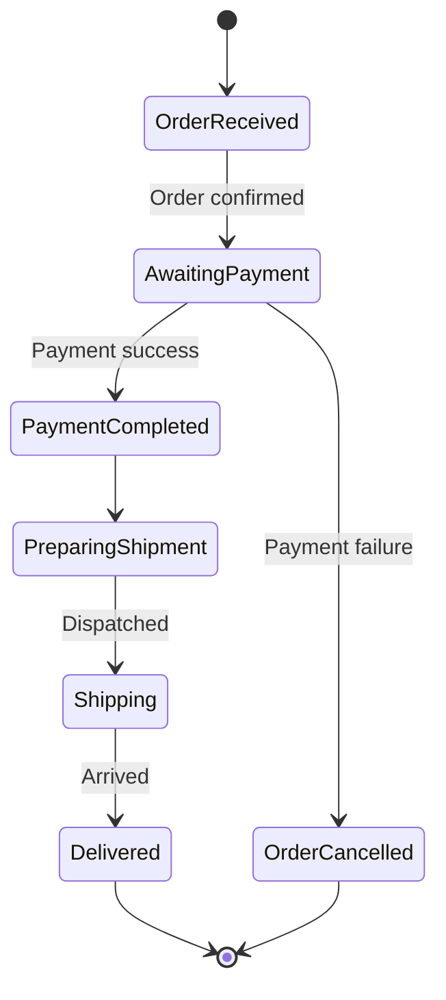

### Composite States

**Code:**

```text
stateDiagram-v2
    [*] --> Active

    state Active {
        [*] --> Idle
        Idle --> Processing : start
        Processing --> Idle : done
    }

    Active --> Inactive : suspend
    Inactive --> Active : resume
    Inactive --> [*] : terminate
```

**Rendered result:**

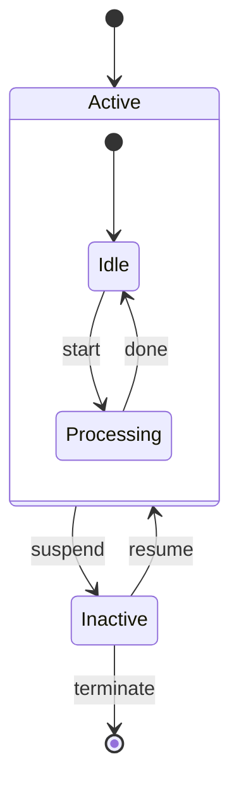

---

## 5. Entity Relationship Diagram (ERD)

An ERD represents the relationships between entities in database design.

**Code:**

```text
erDiagram
    USER ||--o{ ORDER : places
    USER {
        int id PK
        string name
        string email UK
        datetime created_at
    }

    ORDER ||--|{ ORDER_ITEM : contains
    ORDER {
        int id PK
        int user_id FK
        datetime order_date
        string status
    }

    ORDER_ITEM }|--|| PRODUCT : references
    ORDER_ITEM {
        int id PK
        int order_id FK
        int product_id FK
        int quantity
    }

    PRODUCT {
        int id PK
        string name
        decimal price
        int stock
    }
```

**Rendered result:**

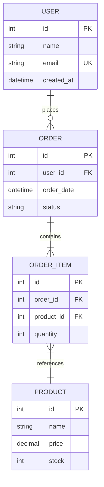

---

## 6. Git Graph

Visualizes Git branches and commit history.

**Code:**

```text
gitGraph
    commit id: "Initial commit"
    branch develop
    checkout develop
    commit id: "Develop feature A"
    branch feature/login
    checkout feature/login
    commit id: "Login UI"
    commit id: "Login logic"
    checkout develop
    merge feature/login
    checkout main
    merge develop tag: "v1.0.0"
    checkout develop
    commit id: "Develop feature B"
```

**Rendered result:**

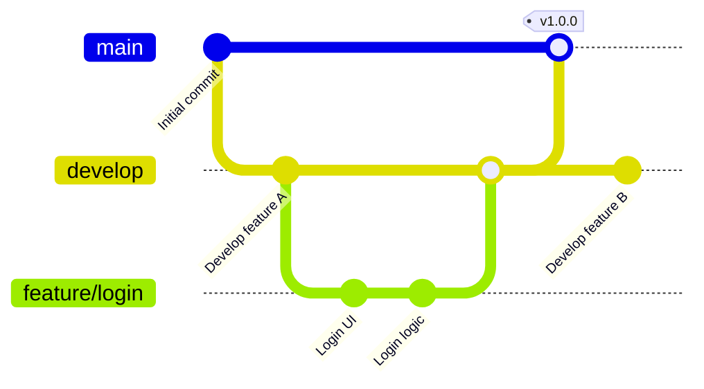

---

## 7. Gantt Chart

A Gantt chart that visualizes a project schedule.

**Code:**

```text
gantt
    title Project Schedule
    dateFormat YYYY-MM-DD

    section Planning
    Requirements analysis     :a1, 2026-01-01, 7d
    Design document writing    :a2, after a1, 5d

    section Development
    Backend development      :b1, after a2, 14d
    Frontend development   :b2, after a2, 14d

    section Testing
    Integration testing      :c1, after b1, 7d
    Bug fixes        :c2, after c1, 5d

    section Deployment
    Production deployment        :d1, after c2, 2d
```

**Rendered result:**

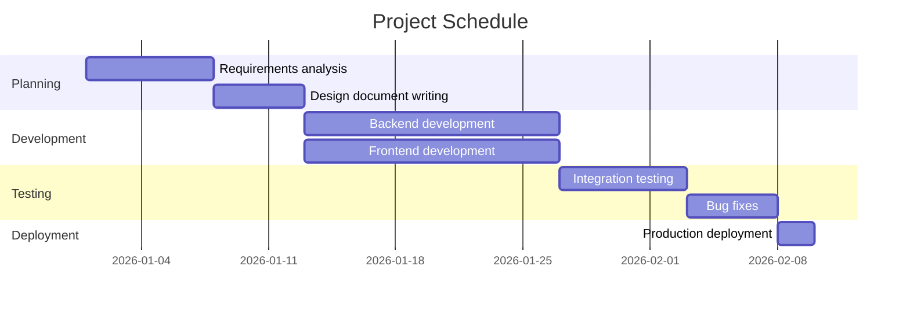

---

## 8. Pie Chart

**Code:**

```text
pie showData
    title Tech Stack Usage Ratio
    "JavaScript" : 35
    "TypeScript" : 30
    "Python" : 20
    "Go" : 10
    "Others" : 5
```

**Rendered result:**

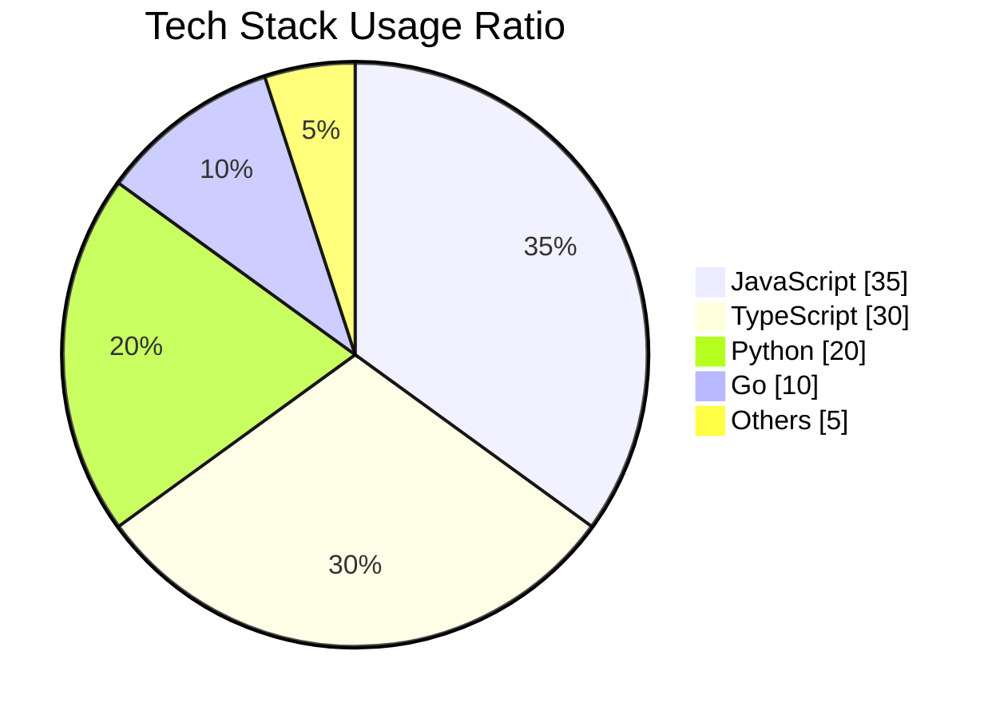

---

## 9. Mermaid Rendering Tools

There are various tools and platforms that can render Mermaid diagrams.

### Online Editors

| Tool | Description |
|-----|------|
| [Mermaid Live Editor](https://mermaid.live/) | The official online editor. Supports real-time preview and image export |
| [Mermaid Chart](https://www.mermaidchart.com/) | A Mermaid editor for team collaboration |

### Natively Supported Platforms

The following platforms automatically render Mermaid code blocks without any additional setup.

- **GitHub** - README, Issues, PRs, Wiki, etc.
- **GitLab** - Markdown files, Issues, MRs, etc.
- **Notion** - Select Mermaid in code blocks
- **Obsidian** - Native support
- **Typora** - Native support

### IDE Extensions

| IDE | Extension |
|-----|-------------|
| **VS Code** | [Markdown Preview Mermaid Support](https://marketplace.visualstudio.com/items?itemName=bierner.markdown-mermaid) |
| **IntelliJ / WebStorm** | [Mermaid Plugin](https://plugins.jetbrains.com/plugin/20146-mermaid) |

### Web Framework Integration

| Framework | Library |
|-----------|-----------|
| **React / Next.js** | `mermaid` (client-side rendering) |
| **VuePress** | `vuepress-plugin-mermaidjs` |
| **Docusaurus** | `@docusaurus/theme-mermaid` |
| **Hugo** | Built-in support (shortcode) |
| **Jekyll** | `jekyll-mermaid` |

### CLI Tool

```bash
# Install mermaid-cli
npm install -g @mermaid-js/mermaid-cli

# Export to SVG
mmdc -i diagram.mmd -o diagram.svg

# Export to PNG
mmdc -i diagram.mmd -o diagram.png
```

---

## Conclusion

Mermaid is a powerful tool that lets you easily create various diagrams using a text-based approach. It is especially useful for visually expressing complex concepts in technical documentation, READMEs, blog posts, and more.

### References

- [Mermaid Official Documentation](https://mermaid.js.org/)
- [Mermaid Live Editor](https://mermaid.live/)
- [GitHub Mermaid Support Documentation](https://docs.github.com/en/get-started/writing-on-github/working-with-advanced-formatting/creating-diagrams)
