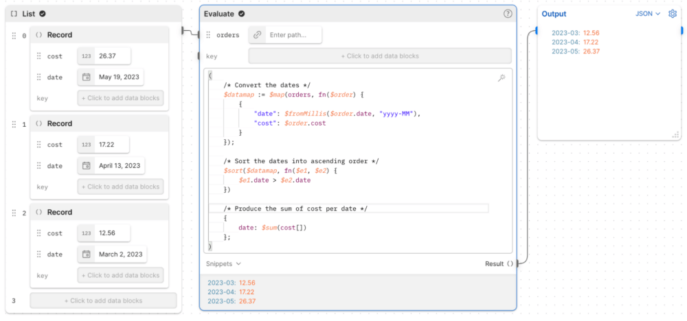
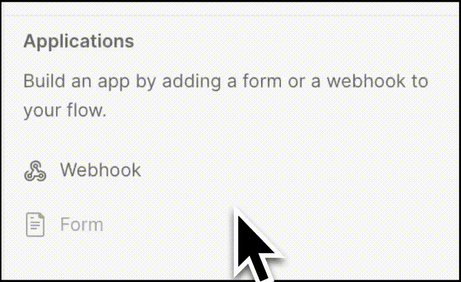
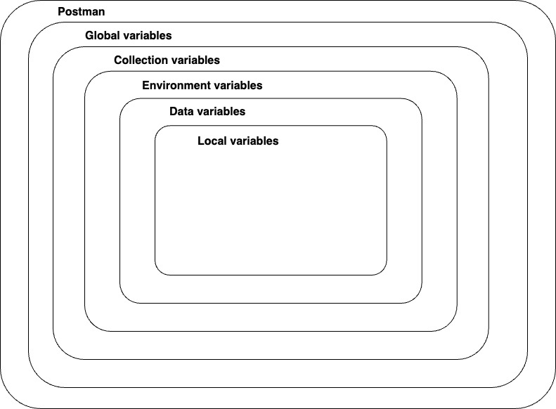

## 1.Postman Flows이란?

Postman Flows는 여러 타입의 빌딩 블록을 서로 연결하여 작업 흐름을 정의하고 자동화하는 데 사용되는 도구이다. Flows는 코드 한 줄도 작성하지 않고 작업 흐름을 정의할 수 있는 UI를 제공해 주고 있어서 개발자 외에도 누구나? 쉽게 Flows를 사용할 수 있다. 다음은 Postman Flows 의 주요 특징 및 기능에 대해서 알아보자.

#### 참고

- [Learning Center: Postman Flows](https://learning.postman.com/docs/postman-flows/gs/flows-overview/)
- [Flow Snippets](https://www.postman.com/postman/workspace/flows-snippets/overview)
- [Postman Flows - Youtube Video Playlist](https://www.youtube.com/playlist?list=PLM-7VG-sgbtCWIWHJSXdJPbahXb_QWWEC)
- [Various Postman Flows Usecase Example](https://learning.postman.com/docs/postman-flows/gs/flows-overview/#what-can-you-do-with-flows)

> Postman에서는 다양한 형태의 문서를 제공해 주고 있어 쉽게 Postman Flows를 학습할 수 있다.
>

#### 1.1 Postman Flows 특징 및 기능

- 기본적으로 Postman에서 제공하는 여러 Collection, Environment 등의 값을 Flows 내에서 바로 사용할 수 있다
- 여러 타입의 Flow Blocks을 제공한다
    - ex. 데이터 정보 생성/필터, 조건, 반복, 실행, 결과
    - 정보 결과를 ex. JSON, charts, table, video, images 등과 같은 형태로 보여줄 수 있다
- Evaluate block에서 작성할 수 있는 `Flow Query Language` (`FQL`) 을 AI prompt를 통해서 작성 가능하다
    - 아직 `Alpha` 버전이라 chatGPT 만큼의 성능은 보여주지 못하는 듯하다
- Flow를 배포하여 클라우드에서 실행할 수 있어 다른 애플리케이션과도 연동할 수 있다

#### 1.1.1 Flow Blocks

Flow에서는 아래와 같은 여러 block 타입을 제공한다.

- **Information blocks**
    - `Template`, `Record` (ex. Map), `List`, `Date`, etc
    - `Select`
        - JSON 결과 특정 값을 선택할 수 있는 필터 역할을 한다
    - `Start`
        - Flow기 실행될 때 실행되는 첫 번째 block이다

- **Decision blocks**
    - `If`
        -  `FQL` condition 값에 따라서 Data 값으로 넘겨진 값을 다음 block으로 전달한다
    - `Evaluate`
        -  `FQL` 를 실행해서 결과를 다음 block으로 전달할 수 있다

- **Repeating blocks**
    - `Repeat`
        - 입력한 값만큼 반복해서실행한다. ex 입력값: `5` -> `0, 1, 2, 3, 4`
    - `For`
        - `[1,2,3]`, `["one", "two", "three"]` list에 있는 데이터를 하나씩 다음 block으로 전달한다
    - `Collect`
        - `For`, `Repeat` 의 하나의 값을 받아서 새로운 list를 생성하여 다음 block으로 전달한다
- **Action blocks**
    - `Delay`
        - 입력한 delay (ns ms) 만큼 기다렸다가 실행한다
    - `Send Request`
        - Postman Collection에 있는 request 를 실행한다
- **Output blocks**
    - `Log (Console)`
        - Postman console에 출력된다
    - `Output`
        - JSON, charts, table, image, videos 타입과 같은 형태로 정보를 출력할 수 있다

##### 참고

- [Postman Flows blocks](https://learning.postman.com/docs/postman-flows/reference/blocks-list/)
- [Flow Snippets](https://www.postman.com/postman/workspace/flows-snippets/overview)

#### 1.1.2 Flows Query Language (FQL)

`Flows Query Language` (`FQL`)을 사용하여 JSON 데이터를 파싱하고 JSON 데이터를 변환하여 원하는 필드나 구조를 가져올 수 언어이다.

- FQL으로 할 수 있는 작업
    - 기본 값 가져오기 (ex. nested field, specific index)
    - 조건부 데이터 선택 (ex. 필터링)
    - 구조화된 데이터 반환 (ex. 여러 데이터를 조합해서 array 반환)
    - 데이터 조작 (ex. string의 길이)
- Prompt 기능 제공하여 직접 FQL를 작성하지 않고 Prompt의 도움을 받아서 작성할 수 있다
    - Alpha 버전이라서 그런지 실제로 사용해보면 복잡한 건 제대로 작성을 하지 못한다
- 여러 FQL 함수를 실행하려면 아래와 같이 작성해서 `( ... )` 실행하면 순차적으로 실행할 수 있다

##### 참고

- [Introduction to Flows Query Language](https://learning.postman.com/docs/postman-flows/flows-query-language/introduction-to-fql/)
- [FQL function reference](https://learning.postman.com/docs/postman-flows/flows-query-language/function-reference/)
- [Advanced FQL expressions in Postman Flows](https://blog.postman.com/advanced-fql-expressions-in-postman-flows/)

#### 1.1.2 Organize a Flow

Flow에서 block이 많아지면 복잡해져서 아래와 같은 기능을 통해서 작성된 Flow를 조금 더 쉽게 이해할 수 있도록 도와주는 듯하다.

- Colors
    - Block을 선택해서 다른 색을 지정할 수 있다
- Annotation
    - 텍스트를 입력해서 추가로 설명을 달 수 있다
- Grouping
    - 여러 block을 grouping 해주는 기능이다

#### 1.1.3 Webhook 기능

Flow를 클라우드에 배포해서 Webhook으로 트리거하여 Flow를 실행시킬 수 있다. 아래와 같이 Flow를 Webhook으로 생성하면 API 주소가 나오고 API를 호출하면 Flow가 트리거할 수 있다.

참고

- [Publish a Flow to the Postman cloud](https://learning.postman.com/docs/postman-flows/concepts/automatic-runs/)

## 2.Postman Flows 사용해보기

### Examples

- [Concatenating Strings](https://www.postman.com/postman/workspace/flows-snippets/flow/63db5fecac73d5464a5f18ce)
- [Condition (If...then.else)](https://www.postman.com/postman/workspace/flows-snippets/flow/62c67c1ea47e56004fa14ce5)
- [https://www.postman.com/postman/workspace/flows-snippets/flow/641784c895e5e70033f029ad](https://www.postman.com/postman/workspace/flows-snippets/flow/641784c895e5e70033f029ad)

## 3.FAQ

#### 3.1 Postman에서 변수는 어디에 어떻게 저장할 수 있나?

Postman에서 변수는 여러 곳, Global, Collection, Environment 등에서 변수를 저장하여 사용할 수 있다. 변수 참조시 Postman에서 아래 스코프 기준으로 참조할 변수를 찾는다.

##### 3.1.1 Postman Variables Scope

- Global
    - Global 변수는 전역 변수로 어디서나 사용 가능한다
    - ex. Collection, Envrionment, Request, Test Script
- Collection
    - Collection 변수는 Collection의 Request 전체에서 사용할 수 있고 Environment과는 무관한다
    - 환경이 하나인 경우에는 Collection 변수를 사용하는 게 적합하다
- Environment
    - Environment 변수르르 사용하면 로컬 개발 환경, 테스트, 프로덕션 환경 등 다양한 환경으로 작업 범위를 지정할 수 있다
- Data
    - Data 변수는 newman 이나 Collection Runner를 실행할 때 사용할 수 있는 데이터 집합을 정의할 기 위해 외부 CSV, JSON 파일에서 가져온다
    - Data  변수는 현재 값을 가지며, 요청 또는 컬렉션 실행 이후에는 지속되지 않는다
- Local
    - Local 변수는 Test Script에서 생성하는 임시 변수이다

참고: [Store and reuse values using variables](https://learning.postman.com/docs/sending-requests/variables/)

#### 3.2 Initial와 Current 값의 차이점은?

- Initial value
    - Initial 값은 Collection, Environment, Global에서 설정된 값이다. 이 값은 Postman의 서버와 동기화되면, 해당 요소를 공유할 때 팀과 공유가 된다
    - 초기 값은 팀원들과 공동 작업할 때 유용할 수 있습니다.
- Current value
    - Request 을 보낼 때 현재 값이 사용된다. 이 값은 로컬 값이며 Postman 서버에 동기화되지 않는다
    - 현재 값을 변경하면 원래 공유 컬렉션, 환경 또는 전역에 유지되지 않는다

#### 3.3 Flow를 주기적으로 실행 할 수는 없나?

`Postman Flows` 자체에서는 제공하지 않지만, Postman 에서 제공하는 Monitor 기능을 통해서 주기적으로 실행할 수 있다.

- 작성한 Flow를 Cloud에 배포한다
- 새로운 Collection 생성하고 Post Request를 생성하고 Cloud에 배포해서 얻은 Flow Webhook 주소를 입력한다
- Postman Monitor에서 주기적으로 실행할 Collection을 선택한다

참고: [Scheduling the Flow with a monitor](https://learning.postman.com/docs/postman-flows/tutorials/make-your-own-automatically-scheduled-tasks/)

#### 3.4 작성한 Flow를 다른 Flow에 사용할 수 없나?

Postman Flow UI 상에서는 flow 간에 연결해서 사용할 수는 없습니다. 단, 특정 Flow를 Cloud에 배포해서 다른 Flow에서 API로 호출해서 다른 Flow를 호출할 수 있습니다.

#### 3.5 Postman Flows는 언제 release 되었나?

- 정확한 날짜는 확인이 안되고 Eary Access는 2022년 말쯤에 릴리스된 것으로 판단됨
    - https://blog.postman.com/announcing-postman-flows-early-access/

#### 3.6 FQL는 표준화 언어인가?

- `FQL`는 표준화된 쿼리 언어는 아니고 Postman 에서만 사용하는 자체 개발된 쿼리 언어이다

## 4.마무리

#### 장점

- Postman에서 기본적으로 사용하는 API Collection, Environment 등을 Flows에서 바로 사용할 수 있음
- Git 기반의 Fork를 사용해서 다른 사람이 작성한 여러 Flow, Collecttion을 Fork해서 테스트해볼 수 있어서 좋았음
- 간단한 로직인 경우에는 비개발자가 flow를 사용해서 작성해서 자동화나 통합 테스트도 가능해짐

#### 아쉬운 점

- UI 상으로 Flow 간의 연결해서 사용할 수가 없음
    - 가능한 해결책은 Flow을 Cloud 배포해서 API로 호출해서 trigger하는 방법이 있음
    - Cloud에 배포된 Flow 실행 시 디버깅이 쉽지 않음 - 로컬에서만 디버깅이 되는 듯함
- Flow가 길어지면 전체 보기가 좀 어려움이 있음
    - grouping 한 부분을 folding으로 숨기는 기능 같은 게 있으면 좋을 듯함
- 로직이 좀 복잡한 경우에 flow의 FQL를 사용해도 좀 답답한 면이 있었음
    - 아직 flow로 작성하는 게 익숙하지 않아서 그럴 수 있음

