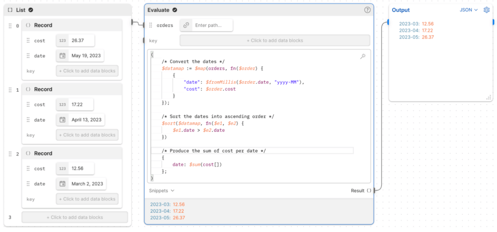
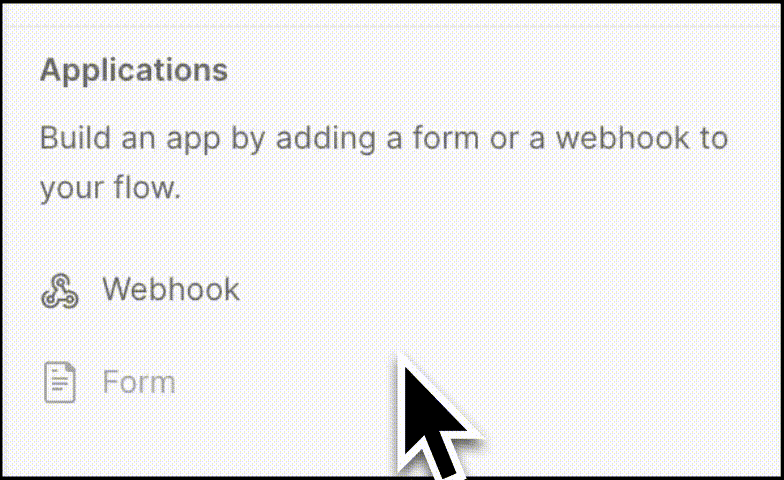
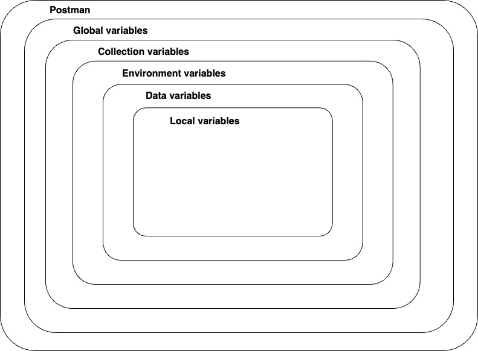
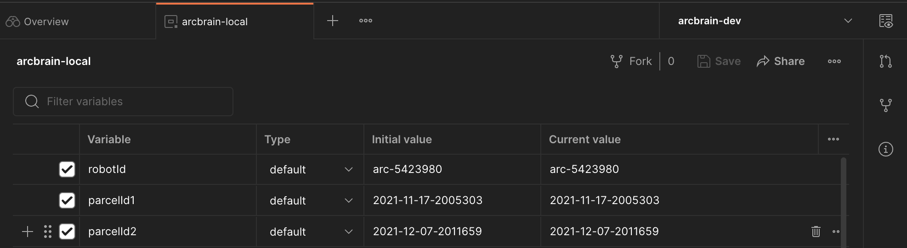

# 1. What Is Postman Flows?

Postman Flows is a tool used to define and automate workflows by connecting several types of building blocks together. Flows provides a UI that lets you define a workflow without writing a single line of code, so anyone—not just developers—can easily use Flows. Let's take a look at the main features and capabilities of Postman Flows below.

## 1.1 References

- [Learning Center: Postman Flows](https://learning.postman.com/docs/postman-flows/gs/flows-overview/)
- [Flow Snippets](https://www.postman.com/postman/workspace/flows-snippets/overview)
- [Postman Flows - Youtube Video Playlist](https://www.youtube.com/playlist?list=PLM-7VG-sgbtCWIWHJSXdJPbahXb_QWWEC)
- [Various Postman Flows Usecase Example](https://learning.postman.com/docs/postman-flows/gs/flows-overview/#what-can-you-do-with-flows)

> Postman provides various forms of documentation, making it easy to learn Postman Flows.
>

## 1.2 Postman Flows Features and Capabilities

- By default, you can use various values such as Collections and Environments provided by Postman directly within Flows
- It provides several types of Flow Blocks
    - e.g. creating/filtering data information, conditions, repetition, execution, results
    - You can display the resulting information in forms such as JSON, charts, table, video, images, etc.
- You can write the `Flow Query Language` (`FQL`) used in the Evaluate block through AI prompts
    - Since it is still an `Alpha` version, it does not seem to deliver performance on par with chatGPT
- You can deploy a Flow and run it in the cloud, allowing integration with other applications

## 1.3 Flow Blocks

Flows provides several block types as shown below.

- **Information blocks**
    - `Template`, `Record` (e.g. Map), `List`, `Date`, etc
    - `Select`
        - Acts as a filter that lets you select a specific value from a JSON result
    - `Start`
        - The first block that runs when a Flow is executed

- **Decision blocks**
    - `If`
        -  Passes the value handed in via Data to the next block depending on the `FQL` condition value
    - `Evaluate`
        -  Runs an `FQL` and can pass the result to the next block

- **Repeating blocks**
    - `Repeat`
        - Repeats execution as many times as the value you enter. e.g. input value: `5` -> `0, 1, 2, 3, 4`
    - `For`
        - Passes the data in a list such as `[1,2,3]` or `["one", "two", "three"]` to the next block one by one
    - `Collect`
        - Takes a single value from `For` or `Repeat`, creates a new list, and passes it to the next block
- **Action blocks**
    - `Delay`
        - Waits for the delay you enter (ns ms) and then executes
    - `Send Request`
        - Executes a request in a Postman Collection
- **Output blocks**
    - `Log (Console)`
        - Outputs to the Postman console
    - `Output`
        - Can output information in forms such as JSON, charts, table, image, videos types

### 1.3.1 References

- [Postman Flows blocks](https://learning.postman.com/docs/postman-flows/reference/blocks-list/)
- [Flow Snippets](https://www.postman.com/postman/workspace/flows-snippets/overview)

## 1.4 Flows Query Language (FQL)

`Flows Query Language` (`FQL`) is a language used to parse JSON data and transform it to obtain the fields or structures you want.

- What you can do with FQL
    - Getting basic values (e.g. nested field, specific index)
    - Conditional data selection (e.g. filtering)
    - Returning structured data (e.g. combining multiple pieces of data and returning an array)
    - Data manipulation (e.g. the length of a string)
- It provides a Prompt feature so you can write FQL with the help of a Prompt instead of writing it directly
    - Perhaps because it is an Alpha version, in actual use it cannot properly write complex expressions
- To run multiple FQL functions, write them as shown below and execute with `( ... )` to run them sequentially

### 1.4.1 References

- [Introduction to Flows Query Language](https://learning.postman.com/docs/postman-flows/flows-query-language/introduction-to-fql/)
- [FQL function reference](https://learning.postman.com/docs/postman-flows/flows-query-language/function-reference/)
- [Advanced FQL expressions in Postman Flows](https://blog.postman.com/advanced-fql-expressions-in-postman-flows/)

## 1.5 Organize a Flow

When a Flow accumulates many blocks, it becomes complex, so the following features seem to help you understand a built Flow a little more easily.

- Colors
    - You can select a block and assign a different color to it
- Annotation
    - You can enter text to add additional explanations
- Grouping
    - A feature that groups multiple blocks together

## 1.6 Webhook Feature

You can deploy a Flow to the cloud and trigger it via a Webhook to run the Flow. As shown below, when you create a Flow as a Webhook, an API address is generated, and calling the API can trigger the Flow.

References

- [Publish a Flow to the Postman cloud](https://learning.postman.com/docs/postman-flows/concepts/automatic-runs/)

# 2. Trying Out Postman Flows

## 2.1 Examples

- [Concatenating Strings](https://www.postman.com/postman/workspace/flows-snippets/flow/63db5fecac73d5464a5f18ce)
- [Condition (If...then.else)](https://www.postman.com/postman/workspace/flows-snippets/flow/62c67c1ea47e56004fa14ce5)
- [https://www.postman.com/postman/workspace/flows-snippets/flow/641784c895e5e70033f029ad](https://www.postman.com/postman/workspace/flows-snippets/flow/641784c895e5e70033f029ad)

# 3. FAQ

## 3.1 Where and how can variables be stored in Postman?

In Postman, variables can be stored and used in several places, such as Global, Collection, and Environment. When referencing a variable, Postman looks for the variable to reference based on the scope order below.

### 3.1.1 Postman Variables Scope

- Global
    - Global variables are global-scope variables that can be used anywhere
    - e.g. Collection, Environment, Request, Test Script
- Collection
    - Collection variables can be used across all Requests in a Collection and are independent of the Environment
    - When there is only one environment, using Collection variables is appropriate
- Environment
    - Using Environment variables, you can scope your work to various environments such as local development, testing, and production
- Data
    - Data variables are imported from external CSV or JSON files to define a dataset that can be used when running newman or the Collection Runner
    - Data variables have a current value and do not persist after a request or collection run
- Local
    - Local variables are temporary variables created in a Test Script

Reference: [Store and reuse values using variables](https://learning.postman.com/docs/sending-requests/variables/)

## 3.2 What is the difference between Initial and Current values?

- Initial value
    - The Initial value is the value set in the Collection, Environment, or Global. Once this value is synced to Postman's server, it is shared with your team when you share that element
    - The initial value can be useful when collaborating with team members.
- Current value
    - The current value is used when you send a Request. This value is local and is not synced to the Postman server
    - If you change the current value, it does not persist to the original shared collection, environment, or global

## 3.3 Can a Flow be run periodically?

`Postman Flows` itself does not provide this, but you can run it periodically through the Monitor feature provided by Postman.

- Deploy the Flow you created to the Cloud
- Create a new Collection, create a Post Request, and enter the Flow Webhook address obtained by deploying to the Cloud
- In Postman Monitor, select the Collection to run periodically

Reference: [Scheduling the Flow with a monitor](https://learning.postman.com/docs/postman-flows/tutorials/make-your-own-automatically-scheduled-tasks/)

## 3.4 Can a Flow you created be used in another Flow?

In the Postman Flow UI, you cannot connect flows to each other. However, you can deploy a specific Flow to the Cloud and call it as an API from another Flow to invoke that other Flow.

## 3.5 When was Postman Flows released?

- The exact date is unclear, but Early Access appears to have been released around the end of 2022
    - https://blog.postman.com/announcing-postman-flows-early-access/

## 3.6 Is FQL a standardized language?

- `FQL` is not a standardized query language; it is a custom-developed query language used only in Postman

# 4. Conclusion

## 4.1 Advantages

- You can use the API Collections, Environments, etc. that you normally use in Postman directly within Flows
- It was nice that, using Git-based Forks, you can fork and test out various Flows and Collections written by other people
- For simple logic, non-developers can use flows to write automation or even integration tests

## 4.2 Drawbacks

- You cannot connect flows to each other in the UI
    - A possible workaround is to deploy the Flow to the Cloud and trigger it by calling it as an API
    - Debugging is not easy when running a Flow deployed to the Cloud—it seems debugging only works locally
- When a Flow gets long, it is somewhat difficult to view the whole thing
    - It would be nice to have a feature that hides grouped parts via folding
- For somewhat complex logic, using a flow's FQL felt a bit frustrating
    - This may be because I am not yet used to writing things as flows
