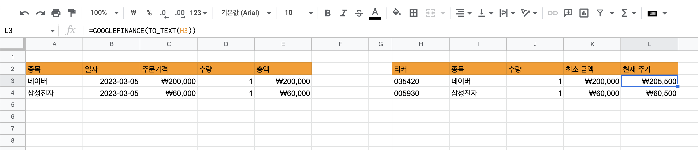
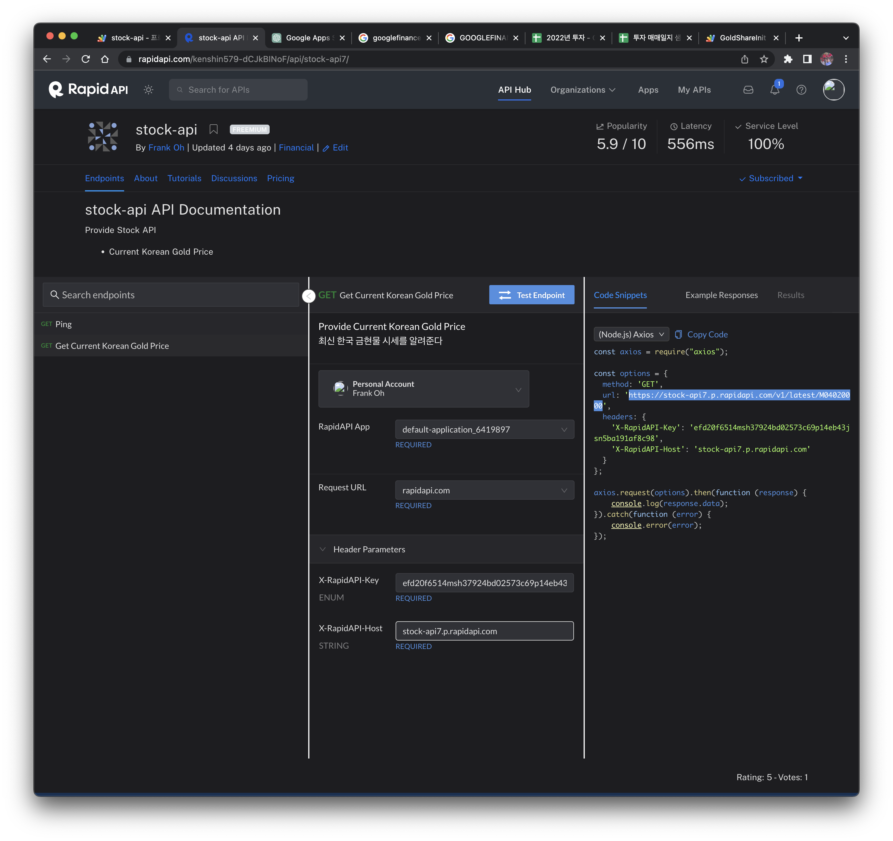
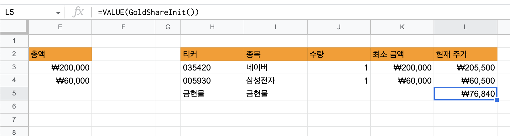

While doing an investment study, I've been keeping a [stock trading journal](https://docs.google.com/spreadsheets/d/112wngK0qecpPl6R-Q-aytDQ-5PH36XC1d_wuT15H6HI/edit?usp=sharing) in Google Sheets, and since I found Google Apps Script quite useful, I'm putting together a quick summary.

# 1. What Is the Google Finance Function?

Before getting into Apps Script, let's look at the Google Finance function. It's a built-in Google Sheets function that fetches real-time stock quote data.

If you enter `=GOOGLEFINANCE("AAPL")` into a cell, it fetches the current Apple stock price and displays it in the cell.

As shown in the image below, I use it to check the current stock price and decide whether to buy or sell.



The Google Finance function provides quote data for most stocks, but there are cases where it doesn't. For example, it does not provide spot gold prices.

# 2. How to Implement a Custom Function?

Since the Google Finance function doesn't provide spot gold prices, you need to implement a custom function that fetches the data through a different API and inserts it into a cell.

To fetch spot gold price information, I use the API from [RapidAPI Stock-API](https://rapidapi.com/kenshin579-dCJkBINoF/api/stock-api7/).



## 2.1 Writing the Apps Script

Google Apps Script is a JavaScript platform for automating and extending Google services like Sheets, Docs, and Gmail.

To write an Apps Script in Google Sheets, click `Extensions` > `Apps Script` to launch it. After writing the code below and clicking the run button, you'll need to go through an authorization step at least once.

> If an "unverified app" warning window appears, click "Advanced" and then "Go to ... (unsafe)" to grant access.


```javascript
function GoldShareInit() {
  var options = {
  'headers' : {
    'X-RapidAPI-Key': 'check this value in the rapid api console',
    'X-RapidAPI-Host': 'stock-api7.p.rapidapi.com'
  }
};

 var res = UrlFetchApp.fetch('https://stock-api7.p.rapidapi.com/v1/latest/M04020000', options);
 var content = res.getContentText();
 var json = JSON.parse(content);
  
 var result = json['currentPrice'];
 return result;
}
```


## 2.2 Using the Custom Function

When you enter the following in Google Sheets, you'll see the spot gold price value displayed.


```javascript
=VALUE(GoldShareInit())
```




# 3. References

- https://developers.google.com/apps-script/reference/url-fetch/url-fetch-app?hl=ko
- https://www.youtube.com/watch?v=k0su6345KDI&t=828s
- https://support.google.com/docs/answer/3093281?hl=en
