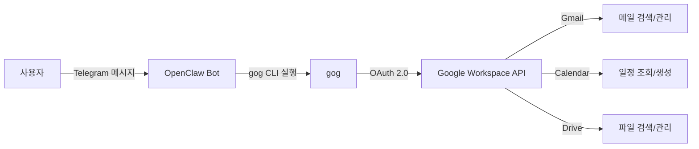
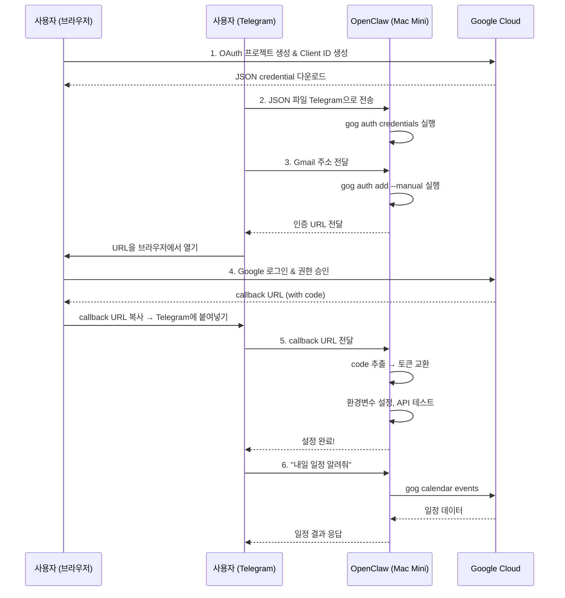

# PRD: OpenClaw에서 gog (Google Workspace CLI) 설정 가이드 블로그

## 1. 개요

OpenClaw Telegram 봇에서 gog CLI를 설정하여 Google Workspace (Gmail, Calendar, Drive 등)를 터미널/챗봇으로 제어하는 방법을 안내하는 블로그 글.

### 핵심 강조 포인트

> **Google Cloud Console에서 OAuth JSON credential 파일을 다운로드한 이후의 모든 작업은 Telegram 채팅으로만 진행했다.**
> 터미널에서 직접 명령어를 입력한 적이 없다.
>
> - JSON 파일을 Telegram 채팅으로 전송 → OpenClaw이 Mac Mini에 저장
> - `gog auth credentials ...` → OpenClaw이 실행
> - `gog auth add ... --manual` → OpenClaw이 실행 후 URL 전달
> - Google 인증 후 callback URL을 채팅으로 전달 → OpenClaw이 토큰 교환
> - `~/.zshrc`에 환경변수 추가 → OpenClaw이 실행
> - API 활성화 후 테스트 → OpenClaw이 실행
>
> 즉, **사용자가 직접 한 것은 오직 3가지**:
> 1. Google Cloud Console에서 OAuth 설정 (웹 브라우저)
> 2. JSON credential 파일 다운로드 후 Telegram으로 전송
> 3. Google 인증 URL 열고 승인 후 callback URL 복사해서 Telegram으로 전송
>
> 나머지 모든 CLI 작업은 OpenClaw AI 에이전트가 대신 처리했다.

이 점이 블로그의 **핵심 차별점**이다. 단순한 gog 설치 가이드가 아니라, AI 에이전트를 통해 복잡한 CLI 설정을 **대화만으로 완료**할 수 있다는 것을 보여주는 글이다.

### 대상 독자
- OpenClaw 사용자
- AI 에이전트에 Google Workspace 연동을 원하는 개발자
- Telegram 봇 기반 자동화에 관심 있는 사용자

### 참고 자료
- **스크린샷**: `docs/start/gog/screenshot/` (28장)
- **Telegram 대화 로그**: `docs/start/gog/ChatExport_2026-02-19/`
- **gog 공식 문서**: https://clawhub.ai/steipete/gog

---

## 2. 블로그 구조

### 제목 (안)
- "OpenClaw에서 gog로 Google Workspace 연동하기 - 터미널 명령어 없이 텔레그램 채팅만으로 설정 완료"
- "gog + OpenClaw: Gmail, Calendar, Drive를 텔레그램 대화만으로 연동하기"

### 목차

#### 2.1. gog란?
- gog (Google Workspace CLI) 소개
- 지원 서비스: Gmail, Calendar, Drive, Contacts, Docs, Sheets, Slides, Tasks, Forms, Chat, Classroom, Apps Script
- OpenClaw과의 연동 개념 (Telegram → OpenClaw → gog → Google Workspace)

#### 2.2. 사전 준비사항
- OpenClaw 설치 및 Telegram 봇 연동 완료
- macOS 환경 (brew 사용 가능)
- Google 계정

#### 2.3. gog 설치 (Telegram 대화)

Telegram에서 OpenClaw 봇에게 설치를 요청하면 자동으로 처리한다.

> **Telegram 대화 - gog 설치**
>
> **나**: gog google workspace를 설정해보고 싶다. https://clawhub.ai/steipete/gog
>
> **OpenClaw**: 이전에 `gogcli`는 이미 설치했어. 이제 **Google 인증 설정**이 필요해. 단계별로 가자:
>
> Step 1: Google Cloud OAuth 클라이언트 만들기
> 1. **Google Cloud Console** 열기
> 2. **새 프로젝트** 생성 (이름: `gog-cli`)
> 3. **APIs & Services → OAuth consent screen** 설정
> 4. **APIs & Services → Credentials → Create Credentials → OAuth client ID**
>    - Application type: **Desktop app**
>    - `client_secret_xxxx.json` 다운로드
>
> Step 2: gog에 등록
> ```
> gog auth credentials ~/Downloads/client_secret_xxxx.json
> gog auth add your-email...@gmail.com
> export GOG_ACCOUNT=your-email...@gmail.com
> ```
- 스크린샷: 11.23.59 (Telegram 대화 화면)

> **참고**: gog가 아직 설치되어 있지 않은 경우, "gog 설치해줘"라고 말하면 OpenClaw이 `brew install gogcli`를 실행한다.

#### 2.4. Google Cloud Console OAuth 설정 (사용자가 직접)

이 단계는 **사용자가 웹 브라우저에서 직접** 수행해야 하는 유일한 구간이다.

**Step 1: 프로젝트 생성**
- Google Cloud Console 접속
- 새 프로젝트 생성 (예: `gog-cli`)
- 스크린샷: 10.43.38 (Console 메인), 10.43.46 (프로젝트 생성)

**Step 2: OAuth consent screen 설정**
- APIs & Services → OAuth consent screen → 시작하기
- 앱 정보: 앱 이름, 사용자 지원 이메일 입력
- 대상: 외부 (External) 선택
- 연락처 정보 입력
- 완료
- 스크린샷: 10.45.33, 10.45.42, 10.46.07, 10.46.16, 10.46.34

**Step 3: OAuth Client ID 생성**
- APIs & Services → Credentials → Create Credentials → OAuth client ID
- 애플리케이션 유형: **데스크톱 앱**
- 이름: `gog-cli`
- **JSON 파일 다운로드** ← 이 파일을 다음 단계에서 Telegram으로 전송
- 스크린샷: 10.47.17, 10.47.39, 10.47.44

> **여기까지가 사용자가 웹 브라우저에서 하는 마지막 작업이다.**
> 이후부터는 다시 Telegram 채팅으로 돌아간다.

#### 2.5. gog 인증 설정 (Telegram 채팅으로 진행)

> **이 섹션부터는 터미널을 직접 조작하지 않는다.** 모든 CLI 명령은 OpenClaw이 대신 실행한다.

---

**Step 1: JSON 크리덴셜 파일 전달**

> **Telegram 대화 - JSON 파일 전송**
>
> **나**: *(client_secret_xxxx...xxxx.json 파일 첨부)*
>
> **OpenClaw**: 파일 받았어! 설정 진행할게.
>
> **OpenClaw**: 크리덴셜 등록 완료! 이제 Google 계정 인증이 필요해.
> 네 Gmail 주소 알려줘 — `--manual` 모드로 실행해서 인증 URL 보내줄게!

**OpenClaw 백그라운드 작업:**
```bash
# 1. Telegram에서 받은 JSON 파일을 Mac Mini에 저장
mv /tmp/telegram_download/client_secret_xxxx.json ~/Downloads/

# 2. gog에 OAuth 크리덴셜 등록
gog auth credentials ~/Downloads/client_secret_xxxx...xxxx.json
```

---

**Step 2: Gmail 주소 전달 → 인증 URL 수신**

> **Telegram 대화 - 이메일 전달 및 인증 URL**
>
> **나**: your-email...@gmail.com
>
> **OpenClaw**: 대기 중! 이제 아래 단계 따라해줘:
>
> **1.** 이 링크를 브라우저에서 열어:
> `https://accounts.google.com/o/oauth2/auth?access_type=offline&client_id=xxxx...xxxx&...`
>
> **2.** Google 로그인 후 권한 승인
>
> **3.** 페이지가 안 열리는 건 정상! 브라우저 **주소창의 전체 URL**을 복사해서 나한테 보내줘
> `http://127.0.0.1:.../oauth2/callback?state=...&code=...` 이런 식으로 생긴 URL이야!

**OpenClaw 백그라운드 작업:**
```bash
# --manual 모드로 인증 시작 (브라우저 대신 URL을 직접 출력)
gog auth add your-email...@gmail.com --manual

# 출력된 OAuth 인증 URL을 Telegram 메시지로 전달
# 로컬 콜백 서버(127.0.0.1:50554)를 백그라운드에서 대기
```

---

**Step 2-1: 트러블슈팅 - 403 access_denied**

처음 인증 URL을 열면 403 에러가 발생할 수 있다.

> **Telegram 대화 - 403 에러 해결**
>
> **나**: *(403 access_denied 스크린샷 전송)*
>
> **OpenClaw**: `403 access_denied` — OAuth 앱이 아직 **테스트 모드**라서 그래. 테스트 사용자를 추가해야 해.
>
> Google Cloud Console에서:
> 1. **APIs & Services → OAuth consent screen** 이동
> 2. **Test users** 섹션에서 **Add users** 클릭
> 3. `your-email...@gmail.com` 추가
>
> **나**: 나는 테스트 사용자를 추가하고 싶지 않고 실제 동작하면 된다. 앱 게시를 클릭하면 될까?
>
> **OpenClaw**: 응, **앱 게시(Publish)** 하면 돼! 본인만 쓰는 거면 문제없어.
>
> **나**: 게시 완료했다

- 스크린샷: 10.52.15 (403 에러), 10.53.47 (앱 게시 페이지), 10.54.38 (게시 확인 다이얼로그)

---

**Step 3: Google 로그인 → callback URL 전달**

앱 게시 후 인증 URL을 다시 열면 정상적으로 Google 로그인이 진행된다.

1. 계정 선택 → 스크린샷: 10.55.35
2. "Google에서 확인하지 않은 앱" 경고 → 고급 → 계속 → 스크린샷: 10.55.40
3. gog-cli 권한 요청 → 허용 → 스크린샷: 10.55.50, 10.55.56
4. 리디렉션된 페이지 (로딩 안 됨 - 정상) → 주소창의 URL 복사

> **Telegram 대화 - callback URL 전달**
>
> **나**: `http://127.0.0.1:50554/oauth2/callback?state=xxxx...xxxx&code=4/0Axxxx...xxxx&scope=email%20profile%20...`
>
> **OpenClaw**: 인증 완료!
> ```
> email     your-email...@gmail.com
> services  appscript, calendar, chat, classroom, contacts,
>           docs, drive, forms, gmail, people, sheets, slides, tasks
> ```

**OpenClaw 백그라운드 작업:**
```bash
# 1. 사용자가 보내준 callback URL에서 authorization code 추출
#    http://127.0.0.1:50554/oauth2/callback?code=4/0Axxxx...xxxx&...
#    → code = "4/0Axxxx...xxxx"

# 2. authorization code로 Google OAuth 토큰 교환
#    (gog 내부적으로 code → access_token + refresh_token 교환)

# 3. 토큰을 macOS 키체인에 안전하게 저장

# 4. 인증 결과 확인
gog auth list
# → email: your-email...@gmail.com, services: 13개 서비스 연동 확인
```

---

**Step 3-1: 트러블슈팅 - macOS 키체인 접근**

> **Telegram 대화 - 키체인 문제**
>
> **OpenClaw**: `gog auth list`가 계속 멈추는데, macOS 키체인 접근 문제일 수 있어.
> Mac Mini에서 직접 터미널로 테스트해봐 — 키체인 접근 허용 팝업이 뜰 수 있어.
>
> **나**: 키체인 접근 팝업 창이 많이 떴는데, 일반 암호 입력하고 완료를 했다
>
> **OpenClaw**: 좋아! 키체인 접근 허용했으니 이제 될 거야. 다시 테스트해볼게!

- 키체인 팝업은 Mac Mini 화면에서 직접 처리 필요 (1회만)

---

**Step 4: 환경변수 설정**

> **Telegram 대화 - 환경변수**
>
> **나**: GOG_ACCOUNT 환경 변수도 설정이 되어 있을까?
>
> **OpenClaw**: 안 돼있어! 설정해줄게.
>
> **OpenClaw**: 추가 완료!
> - `~/.zshrc`에 `export GOG_ACCOUNT=your-email...@gmail.com` 추가됨
> - 새 터미널 세션부터 자동 적용
>
> **나**: source ~/.zshrc 를 실행해줘
>
> **OpenClaw**: 설정 완료! `GOG_ACCOUNT=your-email...@gmail.com` 적용됐어.

**OpenClaw 백그라운드 작업:**
```bash
# 1. ~/.zshrc에 환경변수 추가
echo 'export GOG_ACCOUNT=your-email...@gmail.com' >> ~/.zshrc

# 2. 현재 세션에 적용
source ~/.zshrc

# 3. 확인
echo $GOG_ACCOUNT  # → your-email...@gmail.com
```
- 환경변수 설정도 Telegram 대화만으로 완료

---

#### 2.6. Google API 활성화

인증은 완료됐지만, Google Cloud 프로젝트에서 사용할 API를 활성화해야 실제 동작한다.

> **Telegram 대화 - API 활성화 필요**
>
> **OpenClaw**: 진전이 있어! 키체인은 해결됐고, 이제 **Google Cloud에서 API를 활성화**해야 해.
>
> 1. **Gmail API**: `https://console.developers.google.com/apis/api/gmail.googleapis.com/...`
> 2. **Calendar API**: `https://console.developers.google.com/apis/api/calendar-json.googleapis.com/...`
> 3. **Drive API**: `https://console.developers.google.com/apis/api/drive.googleapis.com/...`
>
> **나**: 위 3개 API 활성화 시켰다
>
> **OpenClaw**: 됐다! Gmail 정상 작동!
>
> **OpenClaw**: 전부 정상!
> | 서비스 | 상태 |
> |---|---|
> | Gmail | 메일 검색 OK |
> | Calendar | 캘린더 목록 OK |
> | Drive | 파일 목록 OK |
>
> **gog 설정 완료!** 이제 나한테 이런 거 시킬 수 있어:
> - "오늘 온 메일 확인해줘"
> - "이번 주 일정 알려줘"
> - "드라이브에서 XX 파일 찾아줘"

**OpenClaw 백그라운드 작업 (API 활성화 후):**
```bash
# 사용자가 "활성화 시켰다"고 말하면 바로 테스트 실행
gog gmail search 'newer_than:1d'     # → Gmail API 정상 확인
gog calendar calendars                # → Calendar API 정상 확인
gog drive files list                  # → Drive API 정상 확인

# 결과를 정리하여 Telegram으로 응답
```

- 스크린샷: 11.10.39 (Gmail API), 11.10.55 (Gmail 활성화 완료), 11.11.03 (Calendar API), 11.12.44 (Calendar 활성화 완료), 11.12.53 (Drive API), 11.13.08 (Drive 활성화 완료)
- API 활성화는 사용자가 웹 브라우저에서 Enable 버튼 클릭 → 테스트는 OpenClaw이 자동 실행

---

#### 2.7. 테스트 및 활용 예시 (Telegram 대화)

설정이 완료되면 자연어로 Google Workspace를 조회할 수 있다.

> **Telegram 대화 - 일정 조회**
>
> **나**: 내일 일정 알려줘
>
> **OpenClaw**: 내일 (2/20 금) 일정 없어! 깨끗한 하루야
>
> ---
>
> **나**: 3월 달 주말 일정도 알려줘
>
> **OpenClaw**: 3월 **주말 일정** 정리해줄게:
>
> | 날짜 | 일정 |
> |---|---|
> | 3/7 (토) ~ 3/8 (일) | 없음 |
> | 3/14 (토) ~ 3/15 (일) | 없음 |
> | 3/21 (토) ~ 3/22 (일) | 촬영: ... (3/21) |
> | 3/28 (토) ~ 3/29 (일) | 촬영: ... (3/28) |

- 사용자가 `gog calendar events` 같은 명령어를 알 필요 없다
- 자연어로 요청하면 OpenClaw이 적절한 gog 명령을 선택하고 실행한 후 결과를 정리해서 답변

**OpenClaw 백그라운드 작업 (사용자 요청 → 자동 변환):**

| 사용자 (자연어) | OpenClaw이 실행하는 명령 |
|---|---|
| "내일 일정 알려줘" | `gog calendar events --from 2026-02-20 --to 2026-02-21` |
| "3월 달 주말 일정도 알려줘" | `gog calendar events --from 2026-03-01 --to 2026-03-31` + 주말 필터링 |
| "오늘 온 메일 확인해줘" | `gog gmail search 'newer_than:1d'` |
| "드라이브에서 XX 파일 찾아줘" | `gog drive files list --query 'name contains "XX"'` |

> 사용자는 gog 명령어 문법을 전혀 몰라도 된다. OpenClaw이 자연어를 해석하여 적절한 명령어로 변환하고, 결과를 사람이 읽기 쉬운 형태로 정리해서 Telegram으로 응답한다.
- "3월 주말 일정도 알려줘"

---

## 3. 스크린샷 매핑 및 보안 처리

### 3.1. 사용할 스크린샷과 용도

| 파일명 (시간 기준) | 용도 | 블로그 섹션 | 보안 처리 필요 |
|---|---|---|---|
| 10.43.38 | Google Cloud Console 메인 | 2.4 Step 1 | **프로젝트 번호 blur** |
| 10.43.46 | 새 프로젝트 생성 | 2.4 Step 1 | 없음 |
| 10.45.33 | OAuth consent screen 초기 | 2.4 Step 2 | 없음 |
| 10.45.42 | OAuth 앱 정보 입력 폼 | 2.4 Step 2 | 없음 |
| 10.46.07 | 대상 선택 (External) | 2.4 Step 2 | 없음 |
| 10.46.10 | 앱 정보 입력 완료 | 2.4 Step 2 | **이메일 blur** |
| 10.46.16 | OAuth 설정 최종 확인 | 2.4 Step 2 | 없음 |
| 10.46.34 | OAuth 구성 완료 | 2.4 Step 2 | 없음 |
| 10.47.17 | Credentials 메뉴 (OAuth client ID) | 2.4 Step 3 | 없음 |
| 10.47.39 | OAuth 클라이언트 ID 만들기 | 2.4 Step 3 | 없음 |
| 10.47.44 | OAuth 클라이언트 생성 완료 | 2.4 Step 3 | **클라이언트 ID, 보안 비밀번호 blur** |
| 10.52.15 | 403 access_denied 에러 | 2.5 트러블슈팅 | **이메일 blur** |
| 10.53.47 | 앱 게시 페이지 | 2.4 Step 4 | 없음 |
| 10.54.38 | 프로덕션 게시 확인 다이얼로그 | 2.4 Step 4 | 없음 |
| 10.55.35 | Google 계정 선택 화면 | 2.5 인증 | **이름, 이메일 blur** |
| 10.55.40 | 확인되지 않은 앱 경고 | 2.5 인증 | **이메일 blur** |
| 10.55.50 | gog-cli 권한 요청 1 | 2.5 인증 | **이메일 blur** |
| 10.55.56 | gog-cli 권한 요청 2 (전체 scope) | 2.5 인증 | **이메일 blur** |
| 11.10.39 | Gmail API 활성화 페이지 | 2.6 API 활성화 | 없음 |
| 11.10.55 | Gmail API 활성화 완료 | 2.6 API 활성화 | 없음 |
| 11.11.03 | Calendar API 활성화 페이지 | 2.6 API 활성화 | 없음 |
| 11.12.44 | Calendar API 활성화 완료 | 2.6 API 활성화 | 없음 |
| 11.12.53 | Drive API 활성화 페이지 | 2.6 API 활성화 | 없음 |
| 11.13.08 | Drive API 활성화 완료 | 2.6 API 활성화 | 없음 |
| 11.23.59 | Telegram에서 gog 설정 대화 | 2.8 활용 | 없음 |

### 3.2. 사용하지 않는 스크린샷

| 파일명 (시간 기준) | 내용 | 미사용 사유 |
|---|---|---|
| 10.44.52 | APIs & Services 대시보드 | 10.44.59와 중복 |
| 10.44.59 | API 라이브러리 메인 | 직접적 절차와 무관 |
| 10.45.38 | OAuth consent screen (10.45.33과 동일) | 중복 |

### 3.3. 보안 처리 대상 (blur 필수)

**스크린샷에서 blur 처리할 항목:**

| 항목 | 해당 스크린샷 |
|---|---|
| 이메일 주소 (kenshin...@gmail.com) | 10.46.10, 10.52.15, 10.55.35, 10.55.40, 10.55.50, 10.55.56 |
| 사용자 실명 (Frank O...) | 10.55.35, 10.55.50 |
| OAuth Client ID | 10.47.44 |
| OAuth Client Secret (GOCSPX-...) | 10.47.44 |
| Google Cloud 프로젝트 번호 | 10.43.38 |

**블로그 본문에서 마스킹할 항목:**
- 이메일 → `your-email@gmail.com`
- OAuth Client ID → `xxxx...xxxx.apps.googleusercontent.com`
- Client Secret → `GOCSPX-xxxx...xxxx`
- 프로젝트 번호 → `xxxx`
- Telegram Bot Token → `xxxx:AAxxxx...xxxx`
- Telegram User ID → `xxxx`
- OAuth callback code → `4/0Axxxx...xxxx`

---

## 4. 추가 필요 스크린샷

현재 자료에 **빠져 있는** 스크린샷 목록:

| 번호 | 필요한 스크린샷 | 용도 | 촬영 방법 |
|---|---|---|---|
| 1 | `gog --version` 터미널 출력 | 2.3 설치 확인 | Mac Mini 터미널에서 캡처 |
| 2 | `gog auth credentials ...` 실행 화면 | 2.5 크리덴셜 등록 | Mac Mini 터미널에서 캡처 |
| 3 | `gog auth add ... --manual` 실행 → URL 출력 화면 | 2.5 인증 (manual 모드) | Mac Mini 터미널에서 캡처 |
| 4 | `gog auth list` 실행 결과 | 2.5 인증 확인 | Mac Mini 터미널에서 캡처 |
| 5 | `gog gmail search 'newer_than:1d'` 결과 | 2.8 테스트 | Mac Mini 터미널에서 캡처 |
| 6 | `gog calendar calendars` 결과 | 2.8 테스트 | Mac Mini 터미널에서 캡처 |
| 7 | `gog drive files list` 결과 | 2.8 테스트 | Mac Mini 터미널에서 캡처 |
| 8 | Telegram에서 "오늘 온 메일 확인해줘" 등 실사용 예시 | 2.8 활용 | Telegram 앱에서 캡처 |
| 9 | OpenClaw 전체 아키텍처 다이어그램 | 2.1 소개 | Mermaid로 직접 생성 |

> **참고**: #1~#7은 터미널 출력이므로, gog가 설치된 Mac Mini에서 직접 캡처 필요.
> #8은 실제 Telegram 앱에서 캡처 필요.
> #9는 블로그 작성 시 Mermaid 다이어그램으로 생성 가능.

---

## 5. 블로그 작성 시 주의사항

### 5.1. 민감 정보 처리 규칙

- **스크린샷**: 해당 영역을 blur/mosaic 처리
- **코드 블록/텍스트**: 아래와 같이 마스킹

```
# Good
gog auth credentials ~/Downloads/client_secret_xxxx...xxxx.json
gog auth add your-email@gmail.com
export GOG_ACCOUNT=your-email@gmail.com

# Bad (실제 값 노출 금지)
gog auth credentials ~/Downloads/client_secret_489624713318_33e22jfv0cm4p7gblos1fgekrk2c0upt_apps.json
gog auth add kenshin579@gmail.com
```

### 5.2. 트러블슈팅 섹션 포함

실제 설정 과정에서 발생한 이슈들을 정리:

1. **403 access_denied** → 앱 게시로 해결
2. **macOS 키체인 팝업** → 암호 입력 후 허용
3. **Google API 미활성화** → Cloud Console에서 API Enable
4. **GOG_ACCOUNT 환경변수 미설정** → `~/.zshrc`에 export 추가
5. **--manual 모드에서 PTY URL 잘림** → callback URL에서 code 직접 추출

### 5.3. 다이어그램 (Mermaid)

**전체 아키텍처**


**설정 과정에서의 역할 분담**


---

## 6. 작업 계획

### Phase 1: 준비
- [ ] 추가 스크린샷 촬영 (위 섹션 4 참조)
- [ ] 기존 스크린샷 blur 처리 (위 섹션 3.3 참조)
- [ ] gog 공식 문서 최신 내용 확인

### Phase 2: 블로그 초안 작성
- [ ] `docs/start/openclaw에서-gog-google-workspace-연동하기/index.md` 작성
- [ ] 스크린샷 이미지 복사 및 배치
- [ ] Mermaid 다이어그램 삽입
- [ ] 코드 블록 민감 정보 마스킹 확인

### Phase 3: 리뷰 및 게시
- [ ] PR 생성 및 리뷰
- [ ] 최종 게시 (`contents/` 디렉토리로 이동)

---

## 7. 참고: Telegram 대화에서 추출한 핵심 정보

### gog 지원 서비스 (인증 성공 시 확인됨)
- appscript, calendar, chat, classroom, contacts, docs, drive, forms, gmail, people, sheets, slides, tasks

### gog 설정 완료 후 활용 예시 (실제 대화에서)
- "내일 일정 알려줘" → 캘린더 조회 성공
- "3월 달 주말 일정도 알려줘" → 상세 일정 테이블로 응답

### OpenClaw 버전 정보
- 설정 시점: 2026.2.17
- gog 버전: v0.11.0
