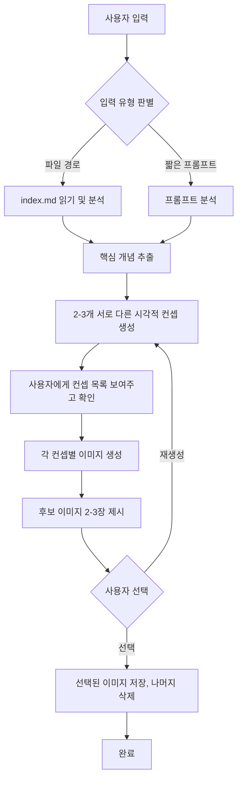

# 블로그 이미지 생성 Skill 개선 PRD

## 1. 현재 상태

### 1.1 기존 에이전트: `generate-blog-image`

- **위치**: `.claude/agents/generate-blog-image.md`
- **MCP 서버**: nanobanana (Gemini API 기반)
- **동작**: `index.md` 읽기 → 핵심 개념 추출 → 프롬프트 생성 → 사용자 확인 → 이미지 1장 생성
- **제한사항**:
  - 이미지 1장만 생성 (비교/선택 불가)
  - `index.md` 경로를 반드시 전달해야 함
  - 짧은 프롬프트로 직접 생성 불가 (ex. "mqtt 관련 이미지 생성해줘")
  - Gemini API만 지원 (OpenAI 이미지 생성 미지원)

---

## 2. ChatGPT API 이미지 생성 가능 여부

### 2.1 결론: 가능하다

OpenAI는 전용 이미지 생성 API를 제공하며, 현재 3가지 모델을 사용할 수 있다.

### 2.2 사용 가능한 모델

| 모델 | 출시일 | 특징 | 상태 |
|------|--------|------|------|
| **GPT Image 1.5** | 2025.12 | 최신, 가장 빠름, 텍스트 렌더링 최고 | Active |
| **GPT Image 1** | 2025.04 | 오리지널 GPT-4o 이미지 생성 | Active |
| **GPT Image 1 Mini** | 2025.10 | GPT Image 1 대비 80% 저렴 | Active |
| **DALL-E 3** | 2023 | 2026.05.12 지원 종료 예정 | Deprecated |

### 2.3 API 사용법

**엔드포인트**: `POST https://api.openai.com/v1/images/generations`

```bash
curl -X POST "https://api.openai.com/v1/images/generations" \
  -H "Authorization: Bearer $OPENAI_API_KEY" \
  -H "Content-type: application/json" \
  -d '{
    "model": "gpt-image-1",
    "prompt": "A clean modern tech blog hero image about MQTT protocol...",
    "n": 3,
    "size": "1536x1024",
    "quality": "medium",
    "output_format": "png"
  }'
```

**핵심 파라미터**:

| 파라미터 | 값 | 기본값 | 설명 |
|----------|-----|--------|------|
| `model` | `gpt-image-1`, `gpt-image-1.5`, `gpt-image-1-mini` | - | 필수 |
| `n` | 1-10 | 1 | **한 번에 최대 10장 생성 가능** |
| `size` | `1024x1024`, `1024x1536`, `1536x1024`, `auto` | `auto` | 블로그용: `1536x1024` |
| `quality` | `low`, `medium`, `high` | `high` | 낮을수록 빠르고 저렴 |
| `output_format` | `png`, `jpeg`, `webp` | `png` | - |
| `background` | `transparent`, `opaque` | `opaque` | PNG/WebP만 지원 |

> **참고**: GPT Image 모델은 항상 base64 인코딩된 이미지를 반환한다 (`response_format` 파라미터 미지원).

### 2.4 가격 비교

**블로그 썸네일 1장 기준 (1536x1024, landscape)**:

| 모델 | Quality | 가격/장 | 3장 생성 시 |
|------|---------|---------|------------|
| GPT Image 1.5 | Medium | ~$0.050 | ~$0.15 |
| GPT Image 1.5 | High | ~$0.200 | ~$0.60 |
| GPT Image 1 Mini | High | ~$0.052 | ~$0.16 |
| Gemini 2.5 Flash (nanobanana normal) | - | ~$0.039 | ~$0.12 |
| Gemini 3 Pro (nanobanana pro) | - | ~$0.134 | ~$0.40 |

### 2.5 OpenAI용 MCP 서버

| MCP 서버 | 지원 모델 | 설치 방법 |
|----------|----------|-----------|
| **[spartanz51/imagegen-mcp](https://github.com/spartanz51/imagegen-mcp)** | gpt-image-1, DALL-E 2/3 | `npx imagegen-mcp --models gpt-image-1` |
| [Garoth/dalle-mcp](https://github.com/Garoth/dalle-mcp) | DALL-E 2/3 (gpt-image-1 미지원) | npm install |
| [writingmate/imagegen-mcp](https://github.com/writingmate/imagegen-mcp) | gpt-image-1, DALL-E 2/3 | npx |

**추천**: `spartanz51/imagegen-mcp` - gpt-image-1 지원, npx 기반 간편 설치

```json
// .mcp.json에 추가
{
  "mcpServers": {
    "imagegen": {
      "command": "npx",
      "args": ["imagegen-mcp", "--models", "gpt-image-1"],
      "env": {
        "OPENAI_API_KEY": "${OPENAI_API_KEY}"
      }
    }
  }
}
```

---

## 3. 개선 요구사항

### 3.1 두 가지 입력 모드 지원

**모드 A: md 파일 기반** (기존 방식 강화)
```
/generate-blog-image contents/database/mqtt-v5-guide
```
- `index.md` 분석 → 자동 프롬프트 생성 → 이미지 생성

**모드 B: 짧은 프롬프트 기반** (신규)
```
/generate-blog-image mqtt 프로토콜 관련 이미지 생성해줘
/generate-blog-image kubernetes pod 스케줄링 다이어그램
```
- 사용자 프롬프트를 블로그 스타일에 맞게 변환 → 이미지 생성

**모드 판별 로직**:
- 인자가 파일 경로처럼 보이면 (`.md`, `contents/`, `docs/` 포함) → 모드 A
- 그 외 텍스트 → 모드 B

### 3.2 후보 이미지 다중 생성

- **기본 2~3장** 생성하여 사용자가 선택
- 각 이미지에 **약간 다른 시각적 컨셉** 적용
  - 예: 같은 MQTT 주제라도 "브로커 중심 아키텍처", "pub/sub 메시지 흐름", "IoT 디바이스 네트워크" 등 다른 관점
- 사용자 선택 후 나머지 이미지 삭제

### 3.3 다중 모델 지원 (선택사항)

**옵션 A: Gemini만 사용 (현재 nanobanana)**
- 장점: 이미 설정됨, 추가 설정 불필요
- 단점: OpenAI 대비 품질이 다소 낮을 수 있음

**옵션 B: OpenAI 추가 (imagegen-mcp)**
- 장점: GPT Image 1.5의 높은 품질
- 단점: 추가 MCP 서버 설정 필요, API 키 필요

**옵션 C: 둘 다 지원 (사용자 선택)**
- 장점: 유연성 최대
- 단점: 복잡도 증가

---

## 4. 제안: 개선된 에이전트 설계

### 4.1 동작 흐름



### 4.2 프롬프트 변형 전략

같은 주제에서 다른 이미지를 만들기 위한 3가지 관점:

1. **아키텍처 뷰**: 시스템 구조, 컴포넌트 관계, 데이터 흐름
2. **개념 추상화 뷰**: 핵심 개념을 메타포로 표현 (예: MQTT → 우체국 시스템)
3. **기술 아이콘 뷰**: 관련 기술 로고/심볼의 조합 (텍스트 없이)

### 4.3 파일 저장 규칙

| 입력 모드 | 저장 경로 |
|-----------|-----------|
| 모드 A (md 경로) | `{index.md 디렉토리}/thumbnail.png` |
| 모드 B (프롬프트) | 사용자에게 저장 경로 질문 또는 `~/Downloads/blog-image-{timestamp}.png` |

후보 이미지 파일명:
- `thumbnail_candidate_1.png`
- `thumbnail_candidate_2.png`
- `thumbnail_candidate_3.png`
- 선택 후 → `thumbnail.png`로 rename

---

## 5. 구현 방안

### 5.1 방안 A: 기존 에이전트 수정 (권장)

`.claude/agents/generate-blog-image.md`를 수정하여:
- 입력 모드 판별 로직 추가
- 다중 이미지 생성 루프 추가
- 사용자 선택 인터랙션 추가

**장점**: 기존 인프라 활용, 최소 변경
**작업량**: 에이전트 프롬프트 수정만으로 가능

### 5.2 방안 B: OpenAI MCP 추가 + 에이전트 수정

1. `.mcp.json`에 `imagegen-mcp` 추가
2. 에이전트에 모델 선택 옵션 추가
3. OpenAI와 Gemini 모두 지원

**장점**: 더 높은 품질의 이미지 옵션
**작업량**: MCP 서버 설정 + 에이전트 수정

### 5.3 방안 C: Skill로 전환

에이전트 대신 `.claude/skills/` 아래 Skill로 구현하여 자동 활성화 지원

**장점**: 특정 파일 패턴에서 자동 트리거 가능
**단점**: Skill은 주로 편집 시 자동 활성화 용도, 이미지 생성은 명시적 호출이 적합

---

## 6. 결정 사항

| 항목 | 결정 | 비고 |
|------|------|------|
| **모델** | OpenAI (GPT Image 1) | `imagegen-mcp` MCP 서버 추가 |
| **후보 이미지 수** | 2장 | 서로 다른 시각적 컨셉으로 생성 |
| **짧은 프롬프트 저장 경로** | `~/Desktop` | `blog-image-{timestamp}.png` |
| **스타일** | AI 자동 판단 | 주제에 맞는 최적 스타일을 에이전트가 결정 |

### 구현 방안: 방안 B 채택

1. `.mcp.json`에 `imagegen-mcp` (OpenAI) 추가
2. `.claude/agents/generate-blog-image.md` 재작성
   - OpenAI 이미지 생성 도구 사용
   - 두 가지 입력 모드 (md 경로 / 짧은 프롬프트)
   - 2장 후보 생성 → 사용자 선택
   - 주제에 맞는 스타일 자동 결정

---

## 7. 참고 자료

- [OpenAI Image Generation API](https://platform.openai.com/docs/guides/image-generation)
- [OpenAI API 가격표](https://openai.com/api/pricing/)
- [spartanz51/imagegen-mcp (GitHub)](https://github.com/spartanz51/imagegen-mcp)
- [nanobanana MCP 서버](https://github.com/nicholasgriffintn/nanobanana-mcp-server)
- [Google Gemini 이미지 생성](https://ai.google.dev/gemini-api/docs/image-generation)
