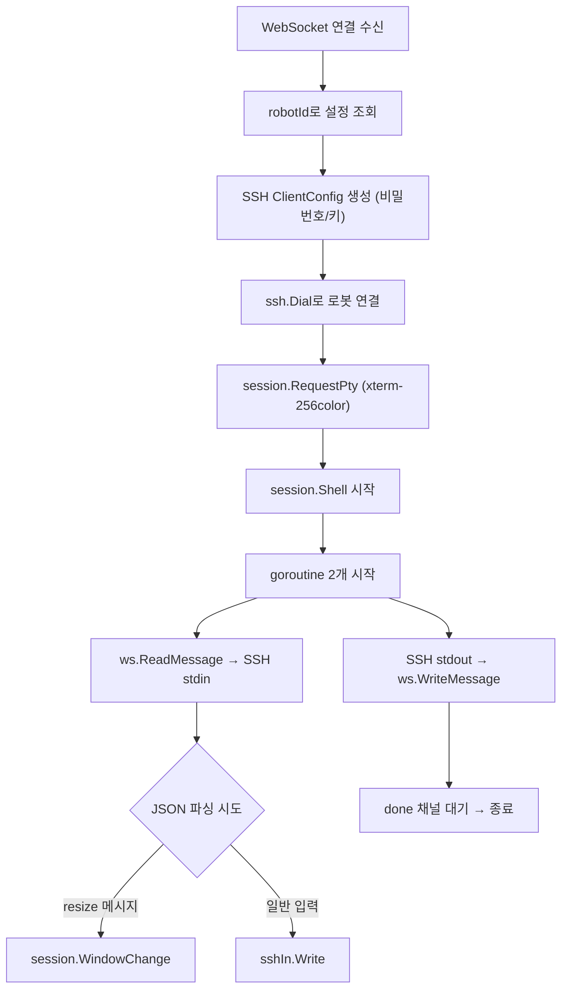

# 웹 기반 SSH 로봇 관리 시스템 - 구현 문서

## 1. 산출물

| 산출물 | 위치 | 설명 |
|--------|------|------|
| Go 백엔드 | `tutorials-go/web-ssh-terminal/backend/` | Echo v4 + WebSocket + SSH 브릿지 |
| React 프론트엔드 | `tutorials-go/web-ssh-terminal/frontend/` | Vite + xterm.js + React Router |
| Docker Compose | `tutorials-go/web-ssh-terminal/docker-compose.yaml` | 테스트용 SSH 서버 |
| 블로그 글 (Draft) | `docs/start/go-web-ssh-터미널-로봇-관리/index.md` | 한국어, 1편 통합 |

## 2. Go 백엔드 구현

### 2.1 프로젝트 구조

```
backend/
├── go.mod
├── go.sum
├── main.go                         # Echo 서버 + 라우트 등록
├── config.yaml                     # 로봇 목록 설정
├── .env                            # SSH 비밀번호 (gitignore)
└── internal/
    ├── config/
    │   └── config.go               # YAML 설정 로더
    ├── handler/
    │   ├── robot.go                # GET /api/robots
    │   └── terminal.go             # GET /ws/terminal (WebSocket + SSH)
    └── model/
        └── robot.go                # Robot 구조체
```

### 2.2 의존성

```
module web-ssh-terminal

go 1.25

require (
    github.com/gorilla/websocket v1.5.3
    github.com/labstack/echo/v4 v4.13.3
    golang.org/x/crypto v0.32.0
    gopkg.in/yaml.v3 v3.0.1
)
```

### 2.3 API 엔드포인트

| Method | Path | 설명 |
|--------|------|------|
| GET | `/api/robots` | 로봇 목록 + 온라인 상태 (TCP 포트 체크) |
| GET | `/ws/terminal?robotId=xxx` | WebSocket → SSH 브릿지 |
| GET | `/` (Static) | React 빌드 정적 파일 서빙 (프로덕션) |

### 2.4 핵심 로직: WebSocket + SSH 브릿지 (`handler/terminal.go`)

처리 흐름:



구현 핵심:
- `gorilla/websocket.Upgrader`로 HTTP → WebSocket 업그레이드
- `ssh.Dial("tcp", addr, config)`로 SSH 연결
- `session.RequestPty("xterm-256color", rows, cols, modes)` → `session.Shell()`
- 2개 goroutine으로 양방향 파이프: SSH stdout → WebSocket, WebSocket → SSH stdin
- 리사이즈: JSON `{"type":"resize","cols":N,"rows":N}` 메시지 감지 → `session.WindowChange()`
- `done` 채널로 SSH 세션 종료 대기

### 2.5 SSH 인증 방식

| 방식 | 설정 | 구현 |
|------|------|------|
| 비밀번호 | config.yaml: `authType: password` | 환경변수 `ROBOT_{ID}_PASSWORD`에서 로드 → `ssh.Password()` |
| 공개키 | config.yaml: `authType: privateKey` | `ssh.privateKeyPath`에서 PEM 읽기 → `ssh.ParsePrivateKey()` → `ssh.PublicKeys()` |

### 2.6 로봇 상태 체크 (`handler/robot.go`)

- `net.DialTimeout("tcp", addr, 2s)`로 SSH 포트(22) 접속 가능 여부 확인
- 응답 시 `isOnline` 필드에 결과 포함

### 2.7 CORS 설정

- 개발: `AllowOrigins: ["http://localhost:5173"]` (Vite dev server)
- 프로덕션: React 빌드를 Go 서버가 직접 서빙하므로 CORS 불필요

## 3. React 프론트엔드 구현

### 3.1 프로젝트 구조

```
frontend/
├── package.json
├── vite.config.ts
├── index.html
├── tsconfig.json
└── src/
    ├── main.tsx
    ├── App.tsx                     # React Router (/, /terminal/:robotId)
    ├── api/
    │   └── robots.ts               # fetch /api/robots
    ├── components/
    │   ├── RobotCard.tsx           # 로봇 카드 (상태 뱃지, Connect 버튼)
    │   ├── RobotList.tsx           # 로봇 목록 그리드
    │   ├── Terminal.tsx            # xterm.js 래퍼
    │   └── StatusBadge.tsx         # Online/Offline 뱃지
    └── pages/
        ├── HomePage.tsx            # GET /api/robots → 카드 목록
        └── TerminalPage.tsx        # useParams(robotId) → Terminal 컴포넌트
```

### 3.2 의존성

```json
{
  "dependencies": {
    "react": "^19.0.0",
    "react-dom": "^19.0.0",
    "react-router-dom": "^7.0.0",
    "@xterm/xterm": "^5.5.0",
    "@xterm/addon-fit": "^0.10.0",
    "@xterm/addon-web-links": "^0.11.0"
  },
  "devDependencies": {
    "@vitejs/plugin-react": "^4.0.0",
    "vite": "^6.0.0",
    "tailwindcss": "^4.0.0",
    "typescript": "^5.0.0"
  }
}
```

### 3.3 라우팅

| Path | 컴포넌트 | 설명 |
|------|---------|------|
| `/` | `HomePage` | 로봇 카드 목록, 온라인 상태 표시 |
| `/terminal/:robotId` | `TerminalPage` | xterm.js 터미널 + 헤더 바 + 상태 바 |

### 3.4 핵심 로직: Terminal 컴포넌트

처리 흐름:
1. 마운트 시 `new XTerm()` 생성 + `FitAddon` 로드
2. WebSocket 연결: `ws://localhost:8080/ws/terminal?robotId=xxx`
3. `ws.onmessage` → JSON 상태 메시지이면 상태 표시, 아니면 `term.write(data)`
4. `term.onData(data)` → `ws.send(data)` (키 입력 전송)
5. `window.resize` 이벤트 → `fitAddon.fit()` + resize JSON 메시지 전송
6. 언마운트 시 WebSocket close + xterm dispose

### 3.5 Vite 프록시 설정

개발 환경에서 Go 백엔드로 API/WebSocket 프록시:

```typescript
// vite.config.ts
export default defineConfig({
  server: {
    proxy: {
      '/api': 'http://localhost:8080',
      '/ws': {
        target: 'http://localhost:8080',
        ws: true,
      },
    },
  },
});
```

> Vite 프록시 사용 시 Terminal 컴포넌트에서 별도 호스트 분기 불필요.

## 4. 테스트 환경

### 4.1 Docker Compose

```yaml
# docker-compose.yaml
services:
  robot-1:
    image: lscr.io/linuxserver/openssh-server:latest
    ports:
      - "2222:22"
    environment:
      - PUID=1000
      - PGID=1000
      - PASSWORD_ACCESS=true
      - USER_PASSWORD=testpass
      - USER_NAME=ubuntu

  robot-2:
    image: lscr.io/linuxserver/openssh-server:latest
    ports:
      - "2223:22"
    environment:
      - PUID=1000
      - PGID=1000
      - PASSWORD_ACCESS=true
      - USER_PASSWORD=testpass
      - USER_NAME=ubuntu
```

### 4.2 테스트용 config.yaml

```yaml
server:
  port: 8080

ssh:
  privateKeyPath: ~/.ssh/id_rsa

robots:
  - id: robot-1
    name: Test Robot A
    host: localhost
    port: 2222
    username: ubuntu
    authType: password
    description: 테스트 로봇 A

  - id: robot-2
    name: Test Robot B
    host: localhost
    port: 2223
    username: ubuntu
    authType: password
    description: 테스트 로봇 B
```

### 4.3 테스트용 .env

```
ROBOT_ROBOT-1_PASSWORD=testpass
ROBOT_ROBOT-2_PASSWORD=testpass
```

## 5. 실행 순서

```bash
# 1. 테스트 SSH 서버 실행
cd web-ssh-terminal
docker compose up -d

# 2. Go 백엔드 실행
cd backend
go run main.go

# 3. React 프론트엔드 실행 (별도 터미널)
cd frontend
npm install
npm run dev

# 4. 브라우저에서 확인
# http://localhost:5173
```

## 6. 블로그 글 구성

### 6.1 위치 및 구조

```
docs/start/go-web-ssh-터미널-로봇-관리/
├── index.md          # 블로그 본문
└── cover.png         # 커버 이미지
```

### 6.2 frontmatter

```yaml
---
title: "Go + xterm.js로 웹 기반 SSH 터미널 만들기"
description: "Go 백엔드(Echo + x/crypto/ssh)와 React 프론트엔드(xterm.js)로 브라우저에서 SSH 접속하는 로봇 관리 시스템 구축하기"
date: 2026-04-XX
update: 2026-04-XX
tags:
  - Go
  - SSH
  - WebSocket
  - xterm.js
  - React
  - Echo
---
```

### 6.3 목차

```
1. 소개 — 왜 웹 기반 SSH 터미널인가?
2. 아키텍처 — Browser ↔ WebSocket ↔ SSH ↔ Robot
3. 프로젝트 셋업 — Go 백엔드 + React 프론트엔드
4. Go 백엔드 구현 — WebSocket + SSH 브릿지, 로봇 API
5. React 프론트엔드 구현 — xterm.js 터미널, 로봇 목록
6. 실행 및 데모 — Docker Compose + 접속 테스트
7. 개선 아이디어
8. 정리 + 참고 자료
```

## 7. 작성 규칙

- 샘플 코드는 `tutorials-go/web-ssh-terminal/`에 작성
- 블로그 글에서 GitHub 코드 참조/링크
- 코드를 먼저 작성하고, 동작 확인 후 블로그 글 작성
- 다이어그램은 Mermaid 형식 (ASCII art 금지)
- UTF-8 인코딩 확인 필수 (`file -I`)
- Draft는 `docs/start/`에 작성, `contents/`에 직접 넣지 않음
- 테스트는 MCP Playwright로 웹 UI 동작 검증
