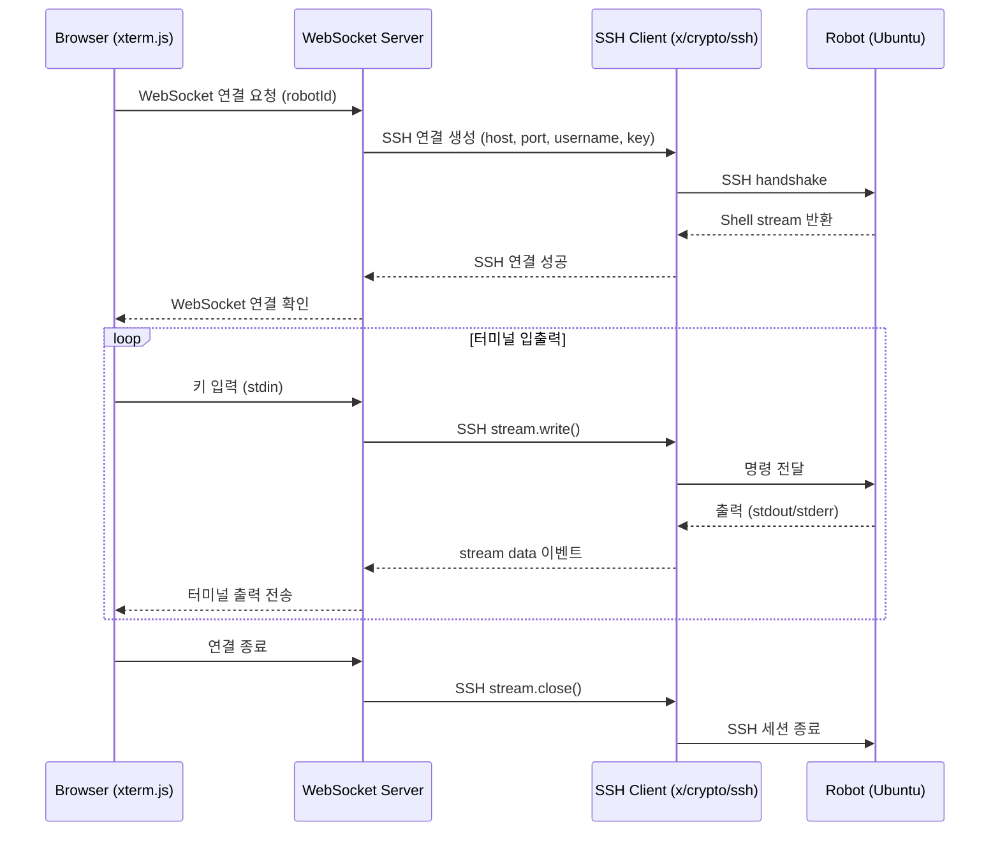
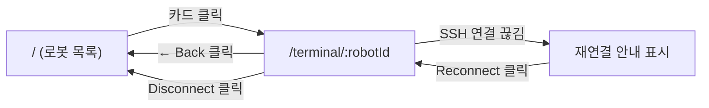

# 웹 기반 SSH 로봇 관리 시스템 PRD — 샘플 코드 및 블로그 작성

## 1. 배경

로봇(Ubuntu 기반)을 원격으로 관리할 때 보통 터미널에서 직접 `ssh user@robot-ip`로 접속한다. 로봇이 1~2대면 문제없지만, 여러 대의 로봇을 관리해야 하는 환경에서는 다음과 같은 불편함이 있다:

- 매번 IP와 인증 정보를 기억하거나 찾아야 함
- 여러 터미널 창을 열어 각 로봇에 접속해야 함
- 로봇의 상태(온라인/오프라인)를 한눈에 파악하기 어려움
- 비개발자(운영자)가 터미널에 직접 접근하기 부담스러움

**목표**: 웹 브라우저에서 등록된 로봇 목록을 보고, 클릭 한 번으로 SSH 터미널을 열어 명령어를 실행하고 결과를 확인할 수 있는 시스템을 구축한다. 이를 실습하고 블로그 포스트로 정리한다.

---

## 2. 시스템 아키텍처

### 2.1 전체 흐름

```
┌─────────────┐     WebSocket      ┌─────────────────┐      SSH       ┌───────────┐
│   Browser   │ ◄──────────────► │  Backend Server  │ ◄───────────► │  Robot    │
│  (xterm.js) │                    │  (Go + Echo)     │               │  (Ubuntu) │
└─────────────┘                    └─────────────────┘               └───────────┘
       │                                   │
       │  HTTP REST                        │  Config (robot 목록/인증정보)
       │ (로봇 목록 CRUD)                    │
       └───────────────────────────────────┘
```

### 2.2 핵심 컴포넌트

| 컴포넌트 | 역할 | 기술 |
|---------|------|------|
| **Web Terminal** | 브라우저에서 터미널 UI 렌더링 | xterm.js + xterm-addon-fit |
| **WebSocket 서버** | 브라우저 ↔ 서버 간 실시간 데이터 전송 | gorilla/websocket (Go) |
| **SSH 클라이언트** | 서버 → 로봇 SSH 연결 | golang.org/x/crypto/ssh |
| **로봇 관리 API** | 로봇 목록 CRUD, 상태 확인 | Echo v4 (Go) |
| **프론트엔드** | 로봇 목록 UI, 터미널 탭 관리 | React 19 + Vite + Tailwind CSS |

### 2.3 데이터 흐름 (터미널 세션)



---

## 3. 핵심 기술 스택

### 3.1 xterm.js — 브라우저 터미널 에뮬레이터

| 항목 | 내용 |
|------|------|
| 저장소 | [xtermjs/xterm.js](https://github.com/xtermjs/xterm.js) |
| 라이선스 | MIT |
| 용도 | 브라우저에서 완전한 터미널 에뮬레이션 제공 |
| 주요 기능 | ANSI 이스케이프 코드 해석, 컬러 출력, 복사/붙여넣기, 리사이즈 |
| 핵심 Addon | `xterm-addon-fit` (컨테이너 크기 자동 맞춤), `xterm-addon-web-links` (URL 클릭) |

**왜 xterm.js인가?**
- VS Code 내장 터미널, GitHub Codespaces, Jupyter 등에서 사용하는 사실상 표준
- 성능이 뛰어남 (Canvas/WebGL 렌더링)
- 다양한 addon 생태계

### 3.2 golang.org/x/crypto/ssh — Go SSH 클라이언트

| 항목 | 내용 |
|------|------|
| 패키지 | [golang.org/x/crypto/ssh](https://pkg.go.dev/golang.org/x/crypto/ssh) |
| 용도 | Go 표준 확장 라이브러리의 SSH 프로토콜 구현 |
| 인증 방식 | 비밀번호, 공개키(PEM), SSH Agent |
| 핵심 메서드 | `session.RequestPty()` + `session.Shell()` — interactive shell 세션 생성 |
| 특징 | Go 표준 라이브러리 확장으로 안정성 보장, 순수 Go 구현 |

### 3.3 gorilla/websocket — Go WebSocket 라이브러리

| 항목 | 내용 |
|------|------|
| 패키지 | [github.com/gorilla/websocket](https://github.com/gorilla/websocket) |
| 용도 | 브라우저 ↔ Go 서버 간 양방향 실시간 통신 |
| 선택 이유 | 터미널 입출력은 지속적인 양방향 스트림이므로 HTTP polling으로는 부적합 |
| 특징 | Go 생태계에서 가장 널리 쓰이는 WebSocket 구현, Echo v4와 자연스럽게 통합 |

### 3.4 Echo v4 — Go 웹 프레임워크

| 항목 | 내용 |
|------|------|
| 패키지 | [github.com/labstack/echo/v4](https://echo.labstack.com/) |
| 용도 | REST API 서빙 + 정적 파일(React 빌드) 서빙 + WebSocket 엔드포인트 |
| 선택 이유 | 경량, 고성능, 미들웨어 생태계 풍부, WebSocket 핸들러 내장 지원 |

---

## 4. 구현 범위

### 4.1 MVP (블로그 + 샘플 코드)

| 기능 | 설명 | 우선순위 |
|------|------|---------|
| 로봇 목록 표시 | 등록된 로봇을 카드/리스트로 표시 | P0 |
| 온라인 상태 표시 | SSH 포트(22) ping으로 접속 가능 여부 표시 | P0 |
| 웹 터미널 열기 | 로봇 클릭 → xterm.js 터미널 팝업/탭 | P0 |
| SSH 연결/해제 | WebSocket → x/crypto/ssh로 셸 세션 관리 | P0 |
| 터미널 리사이즈 | 브라우저 창 크기 변경 시 터미널 자동 조절 | P1 |
| 다중 터미널 탭 | 여러 로봇에 동시 접속, 탭으로 전환 | P1 |
| 비밀번호/키 인증 | 비밀번호 또는 SSH 키 파일로 인증 | P0 |

### 4.2 범위 제외 (블로그에서는 다루지 않음)

- 로봇 등록/수정/삭제 UI (하드코딩된 목록 사용)
- 사용자 인증/권한 관리 (로그인 시스템)
- SSH 키 관리 UI
- 파일 전송 (SCP/SFTP)
- 세션 녹화/재생

---

## 5. UI 구성

### 5.1 전체 화면 구성

```
┌──────────────────────────────────────────────────────────────┐
│  🤖 Robot Manager                               [Dark Mode] │
├──────────────────────────────────────────────────────────────┤
│                                                              │
│  페이지 1: 로봇 목록 (/)                                       │
│  ┌─────────────────────────────────────────────────────────┐ │
│  │  🔍 Search robots...                                    │ │
│  └─────────────────────────────────────────────────────────┘ │
│                                                              │
│  ┌──────────────┐  ┌──────────────┐  ┌──────────────┐       │
│  │ 🟢 Online    │  │ 🟢 Online    │  │ 🔴 Offline   │       │
│  │              │  │              │  │              │       │
│  │ Assembly     │  │ Inspection   │  │ Delivery     │       │
│  │ Robot A      │  │ Robot B      │  │ Robot C      │       │
│  │              │  │              │  │              │       │
│  │ 192.168.1.101│  │ 192.168.1.102│  │ 192.168.1.103│       │
│  │ 조립 라인 1번  │  │ 품질 검사     │  │ 배송 로봇 3호기│       │
│  │              │  │              │  │              │       │
│  │ [Connect]    │  │ [Connect]    │  │ [Disabled]   │       │
│  └──────────────┘  └──────────────┘  └──────────────┘       │
│                                                              │
└──────────────────────────────────────────────────────────────┘
```

### 5.2 터미널 페이지

```
┌──────────────────────────────────────────────────────────────┐
│  🤖 Robot Manager    ← Back to List                         │
├──────────────────────────────────────────────────────────────┤
│                                                              │
│  페이지 2: 터미널 (/terminal/:robotId)                         │
│                                                              │
│  ┌─────────────────────────────────────────────────────────┐ │
│  │ 🟢 Assembly Robot A (192.168.1.101)     [Disconnect]    │ │
│  ├─────────────────────────────────────────────────────────┤ │
│  │                                                         │ │
│  │  ubuntu@robot-1:~$ ls -la                               │ │
│  │  total 32                                               │ │
│  │  drwxr-xr-x  5 ubuntu ubuntu 4096 Apr 11 09:00 .       │ │
│  │  drwxr-xr-x  3 root   root   4096 Apr 10 15:30 ..      │ │
│  │  -rw-r--r--  1 ubuntu ubuntu  220 Apr 10 15:30 .bash..  │ │
│  │  drwxr-xr-x  2 ubuntu ubuntu 4096 Apr 11 09:00 logs    │ │
│  │  -rwxr-xr-x  1 ubuntu ubuntu 8192 Apr 10 16:00 robot.. │ │
│  │  ubuntu@robot-1:~$ █                                    │ │
│  │                                                         │ │
│  │                                                         │ │
│  │                                                         │ │
│  └─────────────────────────────────────────────────────────┘ │
│                                                              │
│  ┌─────────────────────────────────────────────────────────┐ │
│  │ ℹ️  SSH: ubuntu@192.168.1.101:22 | Session: 00:05:23    │ │
│  └─────────────────────────────────────────────────────────┘ │
│                                                              │
└──────────────────────────────────────────────────────────────┘
```

### 5.3 UI 컴포넌트 상세

#### 로봇 카드 (RobotCard)

| 요소 | 설명 |
|------|------|
| 상태 뱃지 | 🟢 Online (초록) / 🔴 Offline (빨강) — TCP 포트 체크 결과 |
| 로봇 이름 | 카드 제목, 굵은 글씨 |
| IP 주소 | 모노스페이스 폰트, 회색 |
| 설명 | 로봇 용도 한 줄 설명 |
| Connect 버튼 | Online → 클릭 가능 (파랑), Offline → 비활성화 (회색) |
| 호버 효과 | 카드 그림자 확대, 경계선 색상 변경 |

#### 터미널 영역 (Terminal)

| 요소 | 설명 |
|------|------|
| 헤더 바 | 로봇 이름 + IP + 연결 상태 + Disconnect 버튼 |
| 터미널 본체 | xterm.js 렌더링 영역, 어두운 배경 (Catppuccin Mocha 테마) |
| 상태 바 | SSH 접속 정보 + 세션 경과 시간 표시 |
| 리사이즈 | 브라우저 창 크기에 맞춰 터미널 자동 조절 (FitAddon) |

#### 화면 전환 흐름



---

## 6. 샘플 코드 구조

### 6.1 프로젝트 구조

```
web-ssh-terminal/
├── backend/                        # Go 백엔드
│   ├── go.mod
│   ├── go.sum
│   ├── main.go                     # 엔트리포인트
│   ├── config.yaml                 # 로봇 설정 파일
│   ├── .env                        # SSH 비밀번호 등 (gitignore)
│   └── internal/
│       ├── config/
│       │   └── config.go           # 설정 로드 (YAML + 환경변수)
│       ├── handler/
│       │   ├── robot.go            # GET /api/robots — 로봇 목록 API
│       │   └── terminal.go         # GET /ws/terminal — WebSocket + SSH 브릿지
│       └── model/
│           └── robot.go            # Robot 구조체
├── frontend/                       # React 프론트엔드
│   ├── package.json
│   ├── vite.config.ts
│   ├── index.html
│   └── src/
│       ├── main.tsx
│       ├── App.tsx                 # React Router 라우팅
│       ├── api/
│       │   └── robots.ts           # API 호출 유틸리티
│       ├── components/
│       │   ├── RobotCard.tsx       # 로봇 카드 컴포넌트
│       │   ├── RobotList.tsx       # 로봇 목록 컴포넌트
│       │   ├── Terminal.tsx        # xterm.js 래퍼 컴포넌트
│       │   └── StatusBadge.tsx     # 온라인/오프라인 뱃지
│       └── pages/
│           ├── HomePage.tsx        # 로봇 목록 페이지
│           └── TerminalPage.tsx    # 터미널 페이지
├── docker-compose.yaml             # 테스트용 SSH 서버 컨테이너
└── README.md
```

### 6.2 핵심 코드 미리보기

#### (1) 로봇 모델 정의 — `backend/internal/model/robot.go`

```go
package model

type AuthType string

const (
	AuthPassword   AuthType = "password"
	AuthPrivateKey AuthType = "privateKey"
)

type Robot struct {
	ID          string   `json:"id" yaml:"id"`
	Name        string   `json:"name" yaml:"name"`
	Host        string   `json:"host" yaml:"host"`
	Port        int      `json:"port" yaml:"port"`
	Username    string   `json:"username" yaml:"username"`
	AuthType    AuthType `json:"authType" yaml:"authType"`
	Description string   `json:"description,omitempty" yaml:"description"`
	IsOnline    bool     `json:"isOnline" yaml:"-"`
}
```

#### (2) 설정 로드 — `backend/internal/config/config.go`

```go
package config

import (
	"os"

	"web-ssh-terminal/internal/model"

	"gopkg.in/yaml.v3"
)

type Config struct {
	Server ServerConfig  `yaml:"server"`
	SSH    SSHConfig     `yaml:"ssh"`
	Robots []model.Robot `yaml:"robots"`
}

type ServerConfig struct {
	Port int `yaml:"port"`
}

type SSHConfig struct {
	PrivateKeyPath string `yaml:"privateKeyPath"`
}

func Load(path string) (*Config, error) {
	data, err := os.ReadFile(path)
	if err != nil {
		return nil, err
	}

	var cfg Config
	if err := yaml.Unmarshal(data, &cfg); err != nil {
		return nil, err
	}

	if cfg.Server.Port == 0 {
		cfg.Server.Port = 8080
	}

	return &cfg, nil
}
```

#### (3) config.yaml — 로봇 목록 설정

```yaml
server:
  port: 8080

ssh:
  privateKeyPath: ~/.ssh/id_rsa

robots:
  - id: robot-1
    name: Assembly Robot A
    host: 192.168.1.101
    port: 22
    username: ubuntu
    authType: privateKey
    description: 조립 라인 1번 로봇

  - id: robot-2
    name: Inspection Robot B
    host: 192.168.1.102
    port: 22
    username: ubuntu
    authType: password
    description: 품질 검사 로봇

  - id: robot-3
    name: Delivery Robot C
    host: 192.168.1.103
    port: 22
    username: ubuntu
    authType: privateKey
    description: 배송 로봇 3호기
```

#### (4) WebSocket + SSH 브릿지 핸들러 — `backend/internal/handler/terminal.go`

```go
package handler

import (
	"encoding/json"
	"fmt"
	"net"
	"os"
	"time"

	"web-ssh-terminal/internal/config"
	"web-ssh-terminal/internal/model"

	"github.com/gorilla/websocket"
	"github.com/labstack/echo/v4"
	"golang.org/x/crypto/ssh"
)

var upgrader = websocket.Upgrader{
	CheckOrigin: func(r *http.Request) bool { return true }, // 개발용: 모든 origin 허용
}

type resizeMessage struct {
	Type string `json:"type"`
	Cols int    `json:"cols"`
	Rows int    `json:"rows"`
}

type TerminalHandler struct {
	cfg *config.Config
}

func NewTerminalHandler(cfg *config.Config) *TerminalHandler {
	return &TerminalHandler{cfg: cfg}
}

// HandleTerminal — GET /ws/terminal?robotId=xxx
func (h *TerminalHandler) HandleTerminal(c echo.Context) error {
	robotID := c.QueryParam("robotId")

	// 로봇 찾기
	var robot *model.Robot
	for i := range h.cfg.Robots {
		if h.cfg.Robots[i].ID == robotID {
			robot = &h.cfg.Robots[i]
			break
		}
	}
	if robot == nil {
		return echo.NewHTTPError(404, "robot not found")
	}

	// WebSocket 업그레이드
	ws, err := upgrader.Upgrade(c.Response(), c.Request(), nil)
	if err != nil {
		return err
	}
	defer ws.Close()

	// SSH 클라이언트 설정
	sshConfig, err := h.buildSSHConfig(robot)
	if err != nil {
		ws.WriteJSON(map[string]string{"type": "error", "message": err.Error()})
		return nil
	}

	// SSH 연결
	addr := fmt.Sprintf("%s:%d", robot.Host, robot.Port)
	conn, err := ssh.Dial("tcp", addr, sshConfig)
	if err != nil {
		ws.WriteJSON(map[string]string{"type": "error", "message": "SSH connection failed: " + err.Error()})
		return nil
	}
	defer conn.Close()

	// SSH 세션 생성
	session, err := conn.NewSession()
	if err != nil {
		ws.WriteJSON(map[string]string{"type": "error", "message": "SSH session failed: " + err.Error()})
		return nil
	}
	defer session.Close()

	// PTY 요청
	modes := ssh.TerminalModes{
		ssh.ECHO:          1,
		ssh.TTY_OP_ISPEED: 14400,
		ssh.TTY_OP_OSPEED: 14400,
	}
	if err := session.RequestPty("xterm-256color", 24, 80, modes); err != nil {
		ws.WriteJSON(map[string]string{"type": "error", "message": "PTY request failed: " + err.Error()})
		return nil
	}

	// stdin/stdout 파이프
	sshIn, err := session.StdinPipe()
	if err != nil {
		return err
	}
	sshOut, err := session.StdoutPipe()
	if err != nil {
		return err
	}

	// Shell 시작
	if err := session.Shell(); err != nil {
		ws.WriteJSON(map[string]string{"type": "error", "message": "Shell start failed: " + err.Error()})
		return nil
	}

	ws.WriteJSON(map[string]string{"type": "status", "message": "connected"})

	// SSH stdout → WebSocket (Browser)
	done := make(chan struct{})
	go func() {
		defer close(done)
		buf := make([]byte, 4096)
		for {
			n, err := sshOut.Read(buf)
			if err != nil {
				return
			}
			if err := ws.WriteMessage(websocket.TextMessage, buf[:n]); err != nil {
				return
			}
		}
	}()

	// WebSocket (Browser) → SSH stdin
	go func() {
		for {
			_, msg, err := ws.ReadMessage()
			if err != nil {
				session.Close()
				return
			}

			// 리사이즈 메시지 처리
			var resize resizeMessage
			if json.Unmarshal(msg, &resize) == nil && resize.Type == "resize" {
				session.WindowChange(resize.Rows, resize.Cols)
				continue
			}

			sshIn.Write(msg)
		}
	}()

	// SSH 세션 종료 대기
	<-done
	return nil
}

func (h *TerminalHandler) buildSSHConfig(robot *model.Robot) (*ssh.ClientConfig, error) {
	config := &ssh.ClientConfig{
		User:            robot.Username,
		HostKeyCallback: ssh.InsecureIgnoreHostKey(), // 개발용: 프로덕션에서는 known_hosts 검증 필요
		Timeout:         10 * time.Second,
	}

	switch robot.AuthType {
	case model.AuthPassword:
		// 환경변수에서 비밀번호 로드: ROBOT_ROBOT_1_PASSWORD 형태
		envKey := fmt.Sprintf("ROBOT_%s_PASSWORD", robot.ID)
		password := os.Getenv(envKey)
		config.Auth = []ssh.AuthMethod{ssh.Password(password)}

	case model.AuthPrivateKey:
		keyPath := h.cfg.SSH.PrivateKeyPath
		key, err := os.ReadFile(keyPath)
		if err != nil {
			return nil, fmt.Errorf("failed to read private key: %w", err)
		}
		signer, err := ssh.ParsePrivateKey(key)
		if err != nil {
			return nil, fmt.Errorf("failed to parse private key: %w", err)
		}
		config.Auth = []ssh.AuthMethod{ssh.PublicKeys(signer)}
	}

	return config, nil
}
```

#### (5) 로봇 목록 API 핸들러 — `backend/internal/handler/robot.go`

```go
package handler

import (
	"fmt"
	"net"
	"net/http"
	"time"

	"web-ssh-terminal/internal/config"
	"web-ssh-terminal/internal/model"

	"github.com/labstack/echo/v4"
)

type RobotHandler struct {
	cfg *config.Config
}

func NewRobotHandler(cfg *config.Config) *RobotHandler {
	return &RobotHandler{cfg: cfg}
}

// ListRobots — GET /api/robots
func (h *RobotHandler) ListRobots(c echo.Context) error {
	robots := make([]model.Robot, len(h.cfg.Robots))
	copy(robots, h.cfg.Robots)

	for i := range robots {
		robots[i].IsOnline = checkSSHPort(robots[i].Host, robots[i].Port)
	}

	return c.JSON(http.StatusOK, robots)
}

func checkSSHPort(host string, port int) bool {
	addr := fmt.Sprintf("%s:%d", host, port)
	conn, err := net.DialTimeout("tcp", addr, 2*time.Second)
	if err != nil {
		return false
	}
	conn.Close()
	return true
}
```

#### (6) 메인 엔트리포인트 — `backend/main.go`

```go
package main

import (
	"fmt"
	"log"

	"web-ssh-terminal/internal/config"
	"web-ssh-terminal/internal/handler"

	"github.com/labstack/echo/v4"
	"github.com/labstack/echo/v4/middleware"
)

func main() {
	cfg, err := config.Load("config.yaml")
	if err != nil {
		log.Fatalf("Failed to load config: %v", err)
	}

	e := echo.New()

	// 미들웨어
	e.Use(middleware.Logger())
	e.Use(middleware.Recover())
	e.Use(middleware.CORSWithConfig(middleware.CORSConfig{
		AllowOrigins: []string{"http://localhost:5173"}, // Vite dev server
	}))

	// 핸들러
	robotHandler := handler.NewRobotHandler(cfg)
	terminalHandler := handler.NewTerminalHandler(cfg)

	// API 라우트
	e.GET("/api/robots", robotHandler.ListRobots)
	e.GET("/ws/terminal", terminalHandler.HandleTerminal)

	// 프로덕션: React 빌드 결과 정적 파일 서빙
	e.Static("/", "../frontend/dist")

	addr := fmt.Sprintf(":%d", cfg.Server.Port)
	log.Printf("Server starting on %s", addr)
	e.Logger.Fatal(e.Start(addr))
}
```

#### (7) xterm.js 터미널 컴포넌트 — `frontend/src/components/Terminal.tsx`

```tsx
import { useEffect, useRef, useCallback } from 'react';
import { Terminal as XTerm } from '@xterm/xterm';
import { FitAddon } from '@xterm/addon-fit';
import '@xterm/xterm/css/xterm.css';

interface TerminalProps {
  robotId: string;
  onDisconnect?: () => void;
}

export default function Terminal({ robotId, onDisconnect }: TerminalProps) {
  const terminalRef = useRef<HTMLDivElement>(null);

  const connect = useCallback(() => {
    if (!terminalRef.current) return;

    const term = new XTerm({
      cursorBlink: true,
      fontSize: 14,
      fontFamily: 'Menlo, Monaco, "Courier New", monospace',
      theme: {
        background: '#1e1e2e',
        foreground: '#cdd6f4',
        cursor: '#f5e0dc',
      },
    });

    const fitAddon = new FitAddon();
    term.loadAddon(fitAddon);
    term.open(terminalRef.current);
    fitAddon.fit();

    term.writeln('Connecting to robot...');

    // Go 백엔드 WebSocket 연결
    const wsHost = import.meta.env.DEV ? 'localhost:8080' : window.location.host;
    const protocol = window.location.protocol === 'https:' ? 'wss:' : 'ws:';
    const ws = new WebSocket(`${protocol}//${wsHost}/ws/terminal?robotId=${robotId}`);

    ws.onopen = () => {
      term.writeln('WebSocket connected. Waiting for SSH...');
    };

    ws.onmessage = (event) => {
      const data = event.data;
      try {
        const parsed = JSON.parse(data);
        if (parsed.type === 'status') {
          term.writeln(`SSH ${parsed.message}\r\n`);
          return;
        }
        if (parsed.type === 'error') {
          term.writeln(`Error: ${parsed.message}`);
          return;
        }
      } catch {
        // JSON이 아니면 터미널 출력
      }
      term.write(data);
    };

    ws.onclose = () => {
      term.writeln('\r\n\r\nConnection closed.');
      onDisconnect?.();
    };

    // 키 입력 → WebSocket 전송
    term.onData((data) => {
      if (ws.readyState === WebSocket.OPEN) {
        ws.send(data);
      }
    });

    // 리사이즈 처리
    const handleResize = () => {
      fitAddon.fit();
      if (ws.readyState === WebSocket.OPEN) {
        ws.send(JSON.stringify({ type: 'resize', cols: term.cols, rows: term.rows }));
      }
    };
    window.addEventListener('resize', handleResize);

    return () => {
      window.removeEventListener('resize', handleResize);
      ws.close();
      term.dispose();
    };
  }, [robotId, onDisconnect]);

  useEffect(() => {
    const cleanup = connect();
    return cleanup;
  }, [connect]);

  return (
    <div ref={terminalRef} className="w-full h-full min-h-[400px] bg-[#1e1e2e] rounded-lg p-1" />
  );
}
```

#### (8) 로봇 카드 컴포넌트 — `frontend/src/components/RobotCard.tsx`

```tsx
import { Link } from 'react-router-dom';

interface RobotCardProps {
  id: string;
  name: string;
  host: string;
  description?: string;
  isOnline: boolean;
}

export default function RobotCard({ id, name, host, description, isOnline }: RobotCardProps) {
  return (
    <Link to={`/terminal/${id}`}>
      <div className="border rounded-xl p-6 hover:shadow-lg transition-shadow cursor-pointer bg-white dark:bg-gray-800">
        <div className="flex items-center justify-between mb-3">
          <h3 className="text-lg font-semibold">{name}</h3>
          <span
            className={`inline-flex items-center gap-1.5 px-2.5 py-0.5 rounded-full text-xs font-medium ${
              isOnline ? 'bg-green-100 text-green-800' : 'bg-red-100 text-red-800'
            }`}
          >
            <span className={`w-2 h-2 rounded-full ${isOnline ? 'bg-green-500' : 'bg-red-500'}`} />
            {isOnline ? 'Online' : 'Offline'}
          </span>
        </div>
        <p className="text-sm text-gray-500 font-mono">{host}</p>
        {description && <p className="text-sm text-gray-600 mt-2">{description}</p>}
      </div>
    </Link>
  );
}
```

### 6.3 주요 의존성

**Go 백엔드 (`backend/go.mod`)**:

```
module web-ssh-terminal

go 1.25

require (
    github.com/gorilla/websocket v1.5.3
    github.com/labstack/echo/v4 v4.13.3
    golang.org/x/crypto v0.32.0
    gopkg.in/yaml.v3 v3.0.1
)
```

**React 프론트엔드 (`frontend/package.json`)**:

```json
{
  "dependencies": {
    "react": "^19.0.0",
    "react-dom": "^19.0.0",
    "react-router-dom": "^7.0.0",
    "@xterm/xterm": "^5.5.0",
    "@xterm/addon-fit": "^0.10.0",
    "@xterm/addon-web-links": "^0.11.0"
  },
  "devDependencies": {
    "@vitejs/plugin-react": "^4.0.0",
    "vite": "^6.0.0",
    "tailwindcss": "^4.0.0",
    "typescript": "^5.0.0"
  }
}
```

---

## 7. 보안 고려사항

| 항목 | 대응 방안 |
|------|----------|
| SSH 자격 증명 노출 | 환경 변수(.env.local)로 관리, 절대 프론트엔드에 노출하지 않음 |
| WebSocket 무단 접근 | 프로덕션에서는 JWT/세션 기반 인증 필수 |
| 중간자 공격 | HTTPS + WSS 사용, SSH host key 검증 |
| 명령어 제한 | 프로덕션에서는 rbash(restricted bash) 또는 명령 화이트리스트 고려 |
| 동시 접속 제한 | 로봇당 최대 세션 수 제한 |

> **블로그 주의사항**: 샘플 코드는 학습 목적이므로 인증/보안이 최소화되어 있다. 프로덕션에서는 반드시 적절한 보안 조치를 추가해야 한다.

---

## 8. 블로그 구성안

### 8.1 블로그 포스트 구조

```
1. 소개
   - 왜 웹 기반 SSH 터미널이 필요한가?
   - 완성 화면 미리보기 (스크린샷/GIF)

2. 아키텍처 설계
   - 전체 데이터 흐름 (Browser ↔ WebSocket ↔ SSH ↔ Robot)
   - 핵심 기술 스택 소개 (xterm.js, x/crypto/ssh, gorilla/websocket)
   - 왜 Go 백엔드인가? (단일 바이너리 배포, 고성능 동시성)
   - 왜 WebSocket인가? (HTTP polling 대비 장점)

3. 프로젝트 셋업
   - Go 백엔드 프로젝트 구조 (Echo v4)
   - React 프론트엔드 프로젝트 구조 (Vite + xterm.js)
   - config.yaml로 로봇 목록 관리
   - Docker Compose로 테스트용 SSH 서버 구성

4. 핵심 구현 — Go 백엔드
   4.1 WebSocket + SSH 브릿지 핸들러
       - x/crypto/ssh로 SSH 연결, PTY 요청, Shell 시작
       - gorilla/websocket ↔ SSH stdin/stdout 양방향 파이프
       - 터미널 리사이즈 (WindowChange) 처리
   4.2 로봇 목록 REST API
       - TCP dial로 온라인 상태 체크
       - JSON 응답

5. 핵심 구현 — React 프론트엔드
   5.1 xterm.js 터미널 컴포넌트
       - xterm.js 초기화 및 FitAddon 설정
       - WebSocket 연결 및 입출력 바인딩
   5.2 로봇 목록 페이지
       - 로봇 카드 UI + 온라인/오프라인 상태 표시
       - React Router로 터미널 페이지 전환

6. 실행 및 테스트
   - Docker Compose로 SSH 서버 실행
   - Go 백엔드 + React 프론트엔드 동시 실행
   - 실제 접속 데모

7. 개선 아이디어
   - 다중 터미널 탭
   - 세션 녹화/재생
   - SFTP 파일 관리
   - 사용자 인증 연동 (JWT)

8. 정리
   - 핵심 요약
   - 참고 자료
```

### 8.2 대안 기술 비교 (블로그에 포함)

| 기술 | 장점 | 단점 | 비고 |
|------|------|------|------|
| **xterm.js + Go (직접 구현)** | 커스터마이징 자유도 높음, 단일 바이너리, 고성능 | 직접 구현 필요 | 이 블로그에서 채택 |
| [Apache Guacamole](https://guacamole.apache.org/) | SSH/VNC/RDP 통합, 완성도 높음 | Java 기반, 무거움, 별도 서버 필요 | 엔터프라이즈 환경에 적합 |
| [Wetty](https://github.com/butlerx/wetty) | 설치 간단, 즉시 사용 가능 | 커스터마이징 제한적 | 단일 서버 접속에 적합 |
| [ttyd](https://github.com/tsl0922/ttyd) | C 기반 경량, 빠름 | 웹 UI 커스터마이징 어려움 | CLI 도구 웹 공유에 적합 |
| [Gotty](https://github.com/yudai/gotty) | Go 기반, 설치 간단 | 유지보수 중단, 읽기 전용 기본 | 데모/모니터링용 |

### 8.3 테스트 환경 구성 가이드 (블로그에 포함)

실제 로봇이 없어도 Docker로 SSH 서버를 띄워서 테스트할 수 있다:

```bash
# Ubuntu SSH 서버 컨테이너 실행
docker run -d \
  --name test-robot-1 \
  -p 2222:22 \
  -e PUID=1000 \
  -e PGID=1000 \
  -e PASSWORD_ACCESS=true \
  -e USER_PASSWORD=testpass \
  -e USER_NAME=ubuntu \
  lscr.io/linuxserver/openssh-server:latest

# 접속 테스트
ssh -p 2222 ubuntu@localhost
```

---

## 9. 작업 항목

> 상세 체크리스트는 `12_ssh_todo.md` 참조

---

## 10. 참고 자료

- [xterm.js 공식 문서](https://xtermjs.org/)
- [golang.org/x/crypto/ssh](https://pkg.go.dev/golang.org/x/crypto/ssh) — Go SSH 클라이언트
- [gorilla/websocket](https://github.com/gorilla/websocket) — Go WebSocket 라이브러리
- [Echo v4 공식 문서](https://echo.labstack.com/) — Go 웹 프레임워크
- [WebSocket API (MDN)](https://developer.mozilla.org/en-US/docs/Web/API/WebSocket)
- [Apache Guacamole](https://guacamole.apache.org/) — 대안 참고
- [Wetty](https://github.com/butlerx/wetty) — 대안 참고
