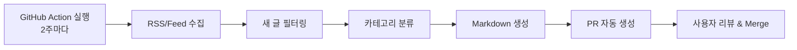

# IT Biweekly News 자동 수집 시스템 PRD

## 1. 개요 (Overview)

IT 블로그 및 뉴스 사이트에서 새로운 글을 자동으로 수집하여 카테고리별로 정리된 Markdown 아티클을 생성하는 시스템.

## 2. 목표 (Goal)

- **2주 단위(Bi-weekly)**로 여러 IT 블로그 및 뉴스 사이트에서 새로 게시된 글만 수집
- 카테고리별로 정리된 하나의 Markdown 아티클을 자동 생성
- 생성된 결과물은 GitHub PR 형태로 제출되어 수동 리뷰 후 블로그에 반영(merge)

## 3. 핵심 사용자 시나리오 (Workflow)



1. GitHub Action이 2주마다 자동 실행
2. 관리 중인 RSS/Feed 목록에서 글 수집
3. 이전 실행 이후 새로 올라온 글만 필터링
4. 카테고리별로 분류
5. Markdown 파일 생성
6. 자동으로 PR 생성
7. 사용자는 PR 리뷰 후 merge

## 4. 기능 요구사항 (Functional Requirements)

### 4.1 RSS/Feed 소스 관리

#### 필수 요구사항
- RSS/Atom Feed URL 목록을 설정 파일로 관리
- Feed 추가/삭제가 쉬워야 함

#### 설계 고려사항
> **Note**: 각 RSS 소스에서 다양한 주제의 글이 올라올 수 있으므로, Feed 단위로 카테고리를 미리 지정하기 어렵다.
> 따라서 카테고리는 설정 파일에서 지정하지 않고, 수집 후 별도 로직으로 분류한다. (4.3 참조)

#### 설정 파일 예시 (YAML)
```yaml
# config/feeds.yaml
feeds:
  - https://aws.amazon.com/blogs/aws/feed/
  - https://cloud.google.com/blog/rss
  - https://kubernetes.io/feed.xml
  - https://openai.com/blog/rss/
  - https://netflixtechblog.com/feed
```

> **Note**: 소스 이름은 RSS Feed의 `title` 필드에서 자동으로 추출

### 4.2 새 글 필터링 (중복 방지)

#### 필수 요구사항
- 이전 실행 이후 새로 올라온 글만 수집
- 중복 글 제거

#### 구현 방식 (택 1)
- **Option A**: `last_run_at` 타임스탬프 기록 파일 유지
- **Option B**: 기존 생성된 Markdown 파일을 파싱하여 이미 포함된 URL 제외
- **Option C (권장)**: Supabase DB에 수집된 글 URL 저장 및 중복 체크

#### 권장 방식: Supabase DB 활용
> 이미 Supabase 계정이 있으므로, DB를 활용하여 상태 관리

**장점:**
- GitHub Action 실행 간 상태 유지가 안정적
- 수집 이력 조회 및 통계 가능
- 향후 확장성 (글 메타데이터 저장 등)

**테이블 스키마 예시:**
```sql
-- collected_articles 테이블
CREATE TABLE collected_articles (
  id SERIAL PRIMARY KEY,
  url TEXT UNIQUE NOT NULL,
  title TEXT NOT NULL,
  source_name TEXT NOT NULL,
  category TEXT,
  published_at TIMESTAMP,
  collected_at TIMESTAMP DEFAULT NOW(),
  included_in_issue TEXT  -- 포함된 뉴스레터 날짜 (e.g., "2025-03-14")
);
```

**중복 체크 로직:**
```python
# 수집된 URL이 이미 DB에 있는지 확인
existing_urls = supabase.table('collected_articles').select('url').execute()
new_articles = [a for a in articles if a.url not in existing_urls]
```

### 4.3 카테고리 분류

#### 필수 요구사항
- 각 글은 **하나의 카테고리에만** 속함 (첫 번째 매칭된 카테고리 적용)
- 분류되지 않은 글은 "기타(Misc)" 카테고리로 처리

#### 설계 고려사항
> **Note**: 각 RSS 소스에서 다양한 주제의 글이 올라오므로, 소스 단위 분류가 불가능하다.
> 따라서 **글 제목/태그 기반 키워드 매칭**으로 분류한다.

#### 분류 방식: 키워드 매칭 + SEO 태그 활용

> **Note**: RSS Feed의 각 글에는 SEO 메타 정보(tags, categories)가 포함되어 있다.
> 이 정보를 제목과 함께 활용하면 더 정확한 카테고리 분류가 가능하다.

**분류 시 활용하는 정보:**
1. **글 제목** (`title`)
2. **RSS 태그** (`tags`) - 각 사이트에서 지정한 태그/카테고리
3. **RSS 카테고리** (`category`) - RSS feed의 category 필드

```yaml
# config/categories.yaml
categories:
  - name: Cloud & Infra
    emoji: ☁️
    keywords:
      # Cloud
      - aws
      - gcp
      - azure
      - cloud
      - serverless
      - lambda
      - ec2
      - s3
      - 클라우드
      - 서버리스
      # Kubernetes
      - kubernetes
      - k8s
      - helm
      - kubectl
      - container
      - docker
      - pod
      - 쿠버네티스
      - 컨테이너
      - 도커
      # DevOps
      - ci/cd
      - jenkins
      - github actions
      - terraform
      - ansible
      - devops

  - name: AI / ML
    emoji: 🤖
    keywords:
      - ai
      - ml
      - machine learning
      - deep learning
      - llm
      - gpt
      - openai
      - tensorflow
      - pytorch
      - 인공지능
      - 머신러닝
      - 딥러닝

  - name: Development
    emoji: 💻
    keywords:
      # Backend
      - api
      - rest
      - graphql
      - microservice
      - spring
      - django
      - fastapi
      # Frontend
      - react
      - vue
      - angular
      - javascript
      - typescript
      - css
      # Database
      - database
      - sql
      - nosql
      - mongodb
      - postgresql
      - redis

  - name: Security
    emoji: 🔒
    keywords:
      - security
      - vulnerability
      - cve
      - authentication
      - oauth
      - 보안

  - name: Misc
    emoji: 📌
    keywords: []  # 기본 카테고리 (매칭 안 된 글)
```

#### 분류 로직
```python
def categorize_article(title: str, tags: list[str], rss_categories: list[str]) -> str:
    """
    글 제목, RSS 태그, RSS 카테고리를 모두 활용하여 분류

    Args:
        title: 글 제목
        tags: RSS feed의 tags 필드 (각 사이트의 SEO 태그)
        rss_categories: RSS feed의 category 필드
    """
    # 모든 정보를 하나의 텍스트로 결합
    text = (title + " " + " ".join(tags) + " " + " ".join(rss_categories)).lower()

    for category in categories:
        if any(keyword in text for keyword in category['keywords']):
            return category['name']
    return "Misc"
```

**RSS Feed에서 SEO 정보 추출 예시:**
```python
# feedparser로 파싱된 entry에서 태그/카테고리 추출
tags = [tag.get("term", "") for tag in entry.get("tags", [])]
rss_categories = [cat.get("term", "") for cat in entry.get("categories", [])]
```

#### 기본 카테고리 목록
| 카테고리 | 이모지 | 설명 |
|---------|--------|------|
| Cloud & Infra | ☁️ | AWS, GCP, Azure, Kubernetes, DevOps |
| AI / ML | 🤖 | 인공지능, 머신러닝, LLM |
| Development | 💻 | Backend, Frontend, Database |
| Security | 🔒 | 보안, 취약점 |
| Misc | 📌 | 기타 (분류되지 않은 글) |

#### 카테고리 표시 규칙
> **최소 글 수 기준**: 카테고리에 **5개 이상**의 글이 있어야 별도 섹션으로 표시
> - 5개 미만인 카테고리의 글은 "Misc" 카테고리로 통합
> - 이를 통해 Markdown 결과물이 너무 세분화되는 것을 방지

```python
MIN_ARTICLES_PER_CATEGORY = 5

def merge_small_categories(articles: list[dict]) -> list[dict]:
    """글 수가 적은 카테고리는 Misc로 통합"""
    from collections import Counter

    # 카테고리별 글 수 집계
    category_counts = Counter(a["category"] for a in articles)

    for article in articles:
        if category_counts[article["category"]] < MIN_ARTICLES_PER_CATEGORY:
            article["category"] = "Misc"
            article["category_emoji"] = "📌"

    return articles
```

### 4.4 Markdown 아티클 생성

#### 필수 요구사항
- 하나의 Markdown 파일로 생성
- 사람이 읽기 좋은 포맷
- 블로그에 바로 업로드 가능한 형태
- Frontmatter 포함

#### 출력 파일 경로
```
contents/news/biweekly-news-YYYY-MM-DD/index.md
```

#### 예시 포맷
> **Note**: Frontmatter 형식은 기존 블로그 글(`contents/` 디렉토리)과 동일하게 유지

**Series 명명 규칙:**
- 상반기 (1월~6월): `"Frank's IT News 2025 상반기"`
- 하반기 (7월~12월): `"Frank's IT News 2025 하반기"`

```markdown
---
title: "Frank's IT Biweekly News (2025-03-01 ~ 2025-03-14)"
description: "Frank's IT Biweekly News (2025-03-01 ~ 2025-03-14)"
date: 2025-03-14
update: 2025-03-14
tags:
  - news
  - biweekly
  - tech
series: "Frank's IT News 2025 상반기"
---

## 개요

2주간의 주요 IT 뉴스를 카테고리별로 정리했습니다.

---

## ☁️ Cloud
- [AWS launches XYZ](https://aws.amazon.com/...) - AWS Blog
- [GCP announces ABC](https://cloud.google.com/...) - Google Cloud Blog

## ⚙️ Kubernetes
- [Kubernetes 1.30 Released](https://kubernetes.io/...) - Kubernetes Blog

## 🤖 AI / ML
- [OpenAI 발표 요약](https://openai.com/...) - OpenAI Blog

---

*이 글은 자동으로 생성되었습니다.*
```

### 4.5 실행 방식 (Automation)

#### 필수 요구사항
- GitHub Actions 사용
- 2주 주기 cron 실행
- 실행 결과는 PR 생성

#### GitHub Action 설정
```yaml
# .github/workflows/biweekly-news.yml
name: IT Biweekly News Generator

on:
  schedule:
    # 매 2주 월요일 09:00 KST (00:00 UTC)
    - cron: '0 0 1,15 * *'
  workflow_dispatch: # 수동 실행 가능

jobs:
  generate-news:
    runs-on: ubuntu-latest
    steps:
      - uses: actions/checkout@v4

      - name: Setup Python
        uses: actions/setup-python@v5
        with:
          python-version: '3.12'

      - name: Install dependencies
        run: pip install -e ./scripts/news

      - name: Generate news article
        run: python scripts/generate_news.py

      - name: Create Pull Request
        uses: peter-evans/create-pull-request@v6
        with:
          title: "[News] IT Biweekly News - ${{ env.DATE_RANGE }}"
          body: |
            자동 생성된 IT Biweekly News 아티클입니다.

            리뷰 후 merge 해주세요.
          branch: news/biweekly-${{ env.DATE }}
          labels: news, auto-generated
```

## 5. 기술 스택 (Tech Stack)

| 구분 | 기술 | 비고 |
|------|------|------|
| 언어 | Python 3.12 | 스크립트 작성 |
| 패키지 관리 | pyproject.toml | PEP 621 표준 |
| RSS 파싱 | feedparser | Python 라이브러리 |
| Markdown 생성 | 표준 텍스트 처리 | 별도 라이브러리 불필요 |
| 설정 관리 | PyYAML | feeds.yaml, categories.yaml 파싱 |
| 데이터베이스 | Supabase (PostgreSQL) | 중복 체크 및 수집 이력 관리 |
| DB 클라이언트 | supabase-py | Python Supabase 클라이언트 |
| CI/CD | GitHub Actions | cron 스케줄링 |
| PR 생성 | peter-evans/create-pull-request | GitHub Action |

## 6. 디렉토리 구조

```
/scripts
  /news
    pyproject.toml        # Python 의존성 및 프로젝트 설정
    generate_news.py      # 메인 스크립트
    feed_parser.py        # RSS 파싱 모듈
    categorizer.py        # 카테고리 분류 모듈
    markdown_generator.py # Markdown 생성 모듈
    db_client.py          # Supabase DB 클라이언트

/config
  feeds.yaml              # RSS Feed 목록
  categories.yaml         # 카테고리 및 키워드 정의

/.github
  /workflows
    biweekly-news.yml     # GitHub Action 워크플로우
```

**환경 변수:**
- `BLOG_IT_NEWS_SUPABASE_URL`: Supabase 프로젝트 URL
- `BLOG_IT_NEWS_SUPABASE_API_KEY`: Supabase API 키

> 로컬: `~/.zshrc`에 설정 / GitHub Action: Secrets에 설정

## 7. 향후 확장 계획 (Future Enhancements)

### Phase 2
- [ ] 키워드 기반 자동 카테고리 분류
- [ ] 글 요약 자동 생성 (AI 활용)
- [ ] 중요도 순위 정렬

### Phase 3
- [ ] 한글 번역 지원
- [ ] 이메일 알림 기능
- [ ] 통계 대시보드

## 8. 성공 지표 (Success Metrics)

- PR 생성 성공률: 95% 이상
- 중복 글 비율: 5% 미만
- 수집된 글 평균 개수: 회당 20개 이상

## 9. 일정 (Timeline)

| 단계 | 내용 | 상태 |
|------|------|------|
| 1 | PRD 작성 | ✅ 완료 |
| 2 | 기본 구조 설계 | 🔲 예정 |
| 3 | Supabase DB 테이블 생성 | 🔲 예정 |
| 4 | RSS 파싱 모듈 개발 | 🔲 예정 |
| 5 | 카테고리 분류 모듈 개발 | 🔲 예정 |
| 6 | Markdown 생성 모듈 개발 | 🔲 예정 |
| 7 | GitHub Action 설정 | 🔲 예정 |
| 8 | 테스트 및 디버깅 | 🔲 예정 |
| 9 | 운영 시작 | 🔲 예정 |

## 10. 참고 자료

- [feedparser Documentation](https://feedparser.readthedocs.io/)
- [peter-evans/create-pull-request](https://github.com/peter-evans/create-pull-request)
- [GitHub Actions Cron Syntax](https://docs.github.com/en/actions/using-workflows/events-that-trigger-workflows#schedule)
- [Supabase Python Client](https://supabase.com/docs/reference/python/introduction)
- [Supabase Database](https://supabase.com/docs/guides/database)
