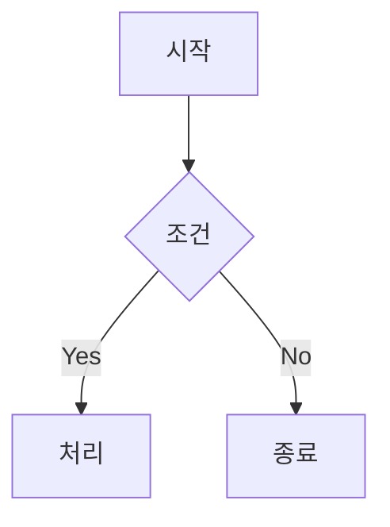

# Mermaid 다이어그램 렌더링 구현 문서

## 1. 구현 개요

마크다운 내 ` ```mermaid ` 코드 블록을 SVG 다이어그램으로 렌더링한다.

**구현 방식**: 클라이언트 사이드 렌더링 (mermaid.js)

> **참고**: 초기 계획은 빌드 타임 렌더링(rehype-mermaid)이었으나, Next.js Turbopack과의 호환성 문제(`import.meta.resolve` 미지원)로 클라이언트 렌더링으로 전환함.

---

## 2. 수정 파일 목록

| 파일 | 수정 내용 |
|-----|----------|
| `package.json` | mermaid 의존성 추가 |
| `components/article/mermaid-renderer.tsx` | **신규** - Mermaid 클라이언트 렌더링 컴포넌트 |
| `app/[slug]/page.tsx` | MermaidRenderer 컴포넌트 사용 |
| `app/globals.css` | Mermaid 다이어그램 스타일 추가 |

---

## 3. 구현 상세

### 3.1 패키지 설치

```bash
npm install mermaid
```

### 3.2 MermaidRenderer 컴포넌트

**파일**: `components/article/mermaid-renderer.tsx`

```typescript
'use client';

import { useEffect, useRef } from 'react';
import { useTheme } from 'next-themes';
import mermaid from 'mermaid';

interface MermaidRendererProps {
  html: string;
}

export function MermaidRenderer({ html }: MermaidRendererProps) {
  const containerRef = useRef<HTMLDivElement>(null);
  const { resolvedTheme } = useTheme();

  useEffect(() => {
    if (!containerRef.current) return;

    // Mermaid 초기화
    mermaid.initialize({
      startOnLoad: false,
      theme: resolvedTheme === 'dark' ? 'dark' : 'default',
      securityLevel: 'loose',
      fontFamily: 'inherit',
    });

    // language-mermaid 코드 블록 찾기
    const codeBlocks = containerRef.current.querySelectorAll(
      'code.language-mermaid'
    );

    codeBlocks.forEach(async (codeBlock, index) => {
      const pre = codeBlock.parentElement;
      if (!pre || pre.tagName !== 'PRE') return;

      const code = codeBlock.textContent || '';
      if (!code.trim()) return;

      try {
        const id = `mermaid-diagram-${index}-${Date.now()}`;
        const { svg } = await mermaid.render(id, code);

        // pre 요소를 mermaid 다이어그램으로 교체
        const wrapper = document.createElement('div');
        wrapper.className = 'mermaid-diagram';
        wrapper.innerHTML = svg;
        pre.replaceWith(wrapper);
      } catch (error) {
        console.error('Mermaid 렌더링 실패:', error);
        pre.classList.add('mermaid-error');
      }
    });
  }, [html, resolvedTheme]);

  return (
    <div
      ref={containerRef}
      className="prose prose-lg dark:prose-invert max-w-none"
      dangerouslySetInnerHTML={{ __html: html }}
    />
  );
}
```

### 3.3 스타일

**파일**: `app/globals.css`

```css
/* Mermaid 다이어그램 스타일 */
.mermaid-diagram {
  @apply my-6 flex justify-center overflow-x-auto;
}

.mermaid-diagram svg {
  @apply max-w-full h-auto;
}

/* Mermaid 에러 발생 시 원본 코드 블록 스타일 */
.prose pre.mermaid-error {
  @apply border-l-4 border-destructive;
}
```

---

## 4. 다크모드 지원

mermaid.js 네이티브 테마 기능 사용:
- `resolvedTheme`이 변경되면 `useEffect`가 재실행
- `mermaid.initialize()`에서 테마 설정
- 다이어그램이 자동으로 재렌더링됨

---

## 5. 지원 다이어그램 유형

- Flowchart
- Sequence Diagram
- Class Diagram
- State Diagram
- Entity Relationship Diagram
- Gantt Chart
- Git Graph
- 기타 Mermaid 공식 지원 유형

---

## 6. 사용 예시

마크다운에서 다음과 같이 작성:

````markdown

````

테스트용 글: `contents/test/mermaid-test/index.md`
