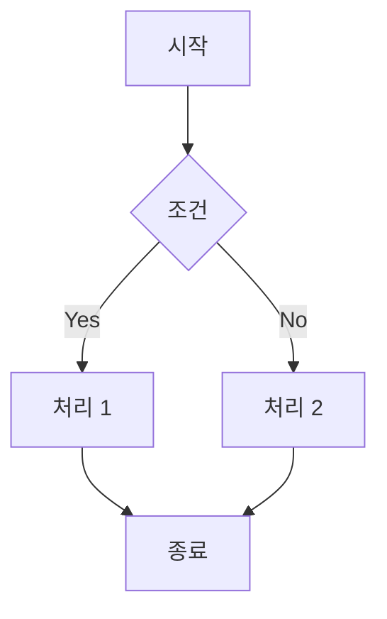

# Mermaid 다이어그램 렌더링 기능 PRD

## 1. 개요

마크다운 파일 내 Mermaid 코드 블록을 다이어그램으로 렌더링하는 기능을 구현한다.

### 1.1 목표
- 마크다운에서 ` ```mermaid ` 코드 블록을 시각적 다이어그램으로 변환
- 블로그 콘텐츠의 가독성 향상 (플로우차트, 시퀀스 다이어그램 등 지원)
- 다크/라이트 모드 테마 지원

### 1.2 지원 다이어그램 유형
- Flowchart
- Sequence Diagram
- Class Diagram
- State Diagram
- Entity Relationship Diagram
- Gantt Chart
- Git Graph
- etc. (Mermaid 공식 지원 모든 유형)

---

## 2. 현재 시스템 분석

### 2.1 마크다운 처리 파이프라인
**파일**: `lib/markdown.ts`

```
remarkParse → remarkGfm → remarkRehype → rehypeSlug → rehypeAutolinkHeadings → rehypePrism → rehypeStringify
```

### 2.2 기술 스택
- **프레임워크**: Next.js 16 (React 19)
- **마크다운 파서**: unified + remark + rehype
- **코드 하이라이팅**: rehype-prism-plus
- **테마**: next-themes (다크/라이트 모드)

---

## 3. 구현 방안

### 3.1 옵션 비교

| 방안 | 장점 | 단점 |
|-----|------|-----|
| **A. 클라이언트 렌더링 (mermaid.js)** | 구현 간단, 실시간 렌더링 | 초기 로딩 지연, JS 번들 크기 증가 (~700KB) |
| **B. 빌드 타임 렌더링 (rehype-mermaid)** | 빠른 로딩, SEO 친화적, 작은 번들 | 빌드 시간 증가, SSG와 호환성 확인 필요 |
| **C. 하이브리드 (빌드 타임 + 폴백)** | 최적 성능 + 안정성 | 구현 복잡도 증가 |

### 3.2 권장 방안: **B. 빌드 타임 렌더링**

Next.js SSG 환경에서 빌드 시점에 SVG로 변환하여 최적 성능 제공

---

## 4. 상세 요구사항

### 4.1 기능 요구사항

#### FR-1: Mermaid 코드 블록 렌더링
- [ ] ` ```mermaid ` 코드 블록을 SVG 다이어그램으로 변환
- [ ] 변환된 SVG는 `<figure class="mermaid-diagram">` 래퍼로 감싸기
- [ ] 원본 코드 블록은 제거하고 SVG로 대체

#### FR-2: 테마 지원
- [ ] 라이트 모드: 밝은 배경 + 어두운 텍스트
- [ ] 다크 모드: 어두운 배경 + 밝은 텍스트
- [ ] 테마 전환 시 다이어그램 색상 자동 변경

#### FR-3: 반응형 디자인
- [ ] 다이어그램이 컨테이너 너비에 맞게 조정
- [ ] 모바일에서도 가독성 유지
- [ ] 가로 스크롤 또는 줌 기능 (큰 다이어그램)

#### FR-4: 에러 처리
- [ ] 잘못된 Mermaid 구문 시 에러 메시지 표시
- [ ] 빌드 실패 방지 (graceful fallback)

### 4.2 비기능 요구사항

#### NFR-1: 성능
- 빌드 타임 렌더링으로 런타임 오버헤드 최소화
- SVG 최적화 (불필요한 속성 제거)

#### NFR-2: 접근성
- SVG에 적절한 `role="img"` 및 `aria-label` 추가
- 스크린 리더 호환성

---

## 5. 구현 참고사항

- 최신 라이브러리 문서 및 코드 예제가 필요한 경우 **MCP Context7** 도구 활용
- 상세 구현 내용: [2_mermaid_implementation.md](./2_mermaid_implementation.md) 참조
- 작업 체크리스트: [2_mermaid_todo.md](./2_mermaid_todo.md) 참조

---

## 6. 사용 예시

마크다운에서 다음과 같이 작성:

````markdown

````

렌더링 결과:
- 시각적인 플로우차트 다이어그램으로 표시됨

---

## 7. 참고 자료

- [Mermaid 공식 문서](https://mermaid.js.org/)
- [rehype-mermaid](https://github.com/remcohaszing/rehype-mermaid)
- [Next.js Static Export](https://nextjs.org/docs/app/building-your-application/deploying/static-exports)
