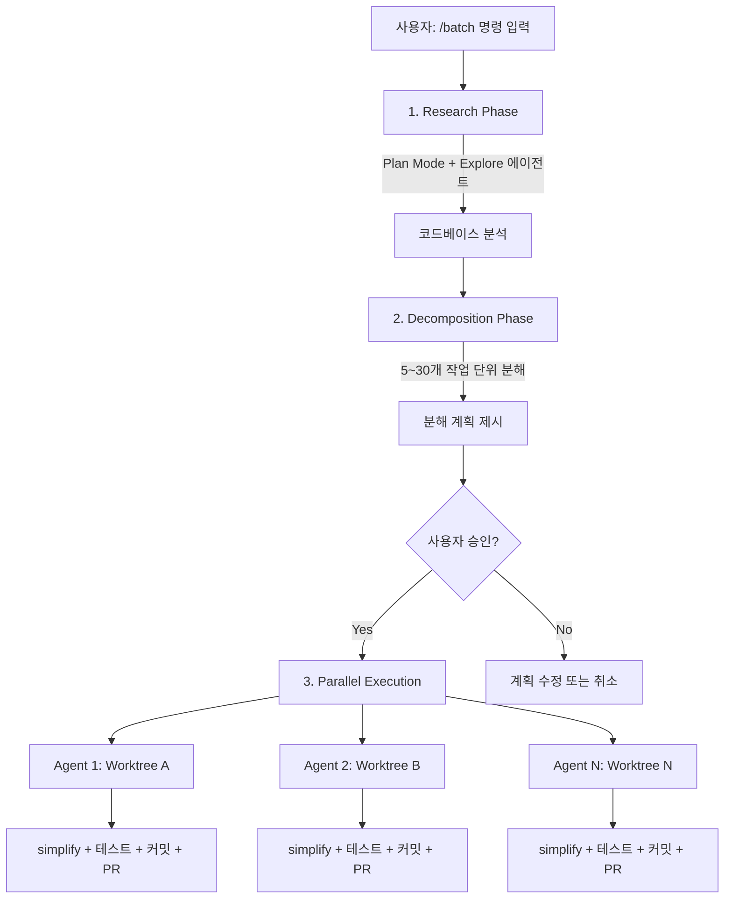

# Claude Code 추가 기능 블로그 PRD

## 배경

기존에 작성한 Claude Code 블로그 포스트:
1. **Claude Code 확장 기능 완벽 가이드: Command, Skill, Subagent** (2026-02-06) - 슬래시 커맨드, 스킬, 서브에이전트 개념과 실전 활용법
2. **Claude Code 멀티 계정 전환 가이드** (2026-02-28) - OAuth/API Key 인증 방식, 계정 전환 설정

위 포스트에서 다루지 않은 Claude Code의 최신 기능 중 `/btw`, `/voice`, `/batch`, `remote-control`, `/simplify`, `/loop`, `/rewind`를 중심으로 스터디하고 블로그로 정리한다.

---

## 핵심 주제: 최근 추가된 명령어 3가지

### 주제 1: `/btw` — 작업 중 사이드 질문

**"By The Way"의 약자. Claude가 작업 중일 때 대화 기록을 오염시키지 않고 빠르게 질문하는 기능.**

**핵심 특징:**
- Claude가 응답 생성 중에도 **병렬로** 질문 가능
- 현재 대화 컨텍스트를 **전부 볼 수 있음** (이미 읽은 코드, 이전 결정 사항 등)
- 질문과 응답이 **ephemeral** — dismissible overlay로 표시되며 대화 기록에 남지 않음
- **도구 접근 불가** — 파일 읽기, 명령어 실행, 웹 검색 없이 기존 컨텍스트로만 답변
- **단발성** — 후속 대화 턴 없음. 대화가 필요하면 일반 프롬프트 사용

**사용법:**
```
/btw 아까 그 설정 파일 이름이 뭐였지?
/btw 이 함수가 어떤 인터페이스를 구현하는 거야?
```

**답변 닫기:** Space, Enter, 또는 Escape 키

**비용 이점:**
- 부모 대화의 **프롬프트 캐시를 재사용** → 일반 프롬프트 대비 최대 **50% 토큰 절약**

**비교표:**

| 특성 | `/btw` | 서브에이전트 | 일반 프롬프트 |
|------|--------|------------|-------------|
| 전체 대화 컨텍스트 접근 | O | X | O |
| 도구 접근 | X | O | O |
| 메인 작업 중단 | X | O | O |
| 후속 대화 | X | O | O |
| 비용 효율 | 매우 높음 | 보통 | 보통 |

**블로그에서 다룰 내용:**
- `/btw`가 필요한 상황 예시 (코드 리뷰 중 컨텍스트 확인, 리팩토링 중 기존 구조 질문)
- 일반 프롬프트 vs `/btw` vs 서브에이전트 사용 시점 구분
- 프롬프트 캐시 재사용으로 인한 비용 절약 원리
- 제한사항 (도구 불가, 단발성)

---

### 주제 2: `/voice` — 음성 입력 모드

**2026년 3월 3일 출시. 키보드 대신 음성으로 Claude Code에 명령을 내리는 기능.**

**핵심 특징:**
- **Push-to-talk 방식**: 스페이스바를 누르고 있는 동안 음성 입력, 놓으면 제출
- 음성이 텍스트로 변환되어 Claude에 전달 (STT)
- 세션 컨텍스트와 프로젝트 인식이 그대로 유지됨
- 출력은 텍스트 (음성 출력은 아직 미지원)

**사용법:**
```
/voice          # 음성 모드 토글 ON/OFF
```
→ 터미널에 음성 인디케이터 표시 → 스페이스바 홀드 → 말하기 → 스페이스바 릴리스

**요구사항:**
- macOS, Linux, Windows 지원
- 마이크 연결 필요
- 현재 **점진적 롤아웃 중** (~5% → 전체 사용자로 확대 중)
- 추가 비용 없음 (모든 유료 플랜 포함)

**설정:**
- `/voice` — 세션 내 토글
- `/config` — 기본값으로 설정 가능

**블로그에서 다룰 내용:**
- 음성 모드 활성화 및 사용 데모
- 실용적인 활용 시나리오:
  - 코드 리뷰하면서 핸즈프리로 수정 지시
  - 아키텍처 설계 시 구두 설명으로 빠르게 프로토타이핑
  - 영상 튜토리얼 촬영 시 음성으로 Claude 제어
- 음성 인식 정확도와 한계점 (배경 소음, 한국어 지원 여부 확인 필요)
- Push-to-talk UX 분석

---

### 주제 3: `/batch` — 대규모 병렬 코드 변경

**코드베이스 전체에 걸친 대규모 변경을 5~30개 에이전트가 병렬로 처리하고 자동으로 PR을 생성하는 기능.**

**동작 흐름:**



**핵심 특징:**
- **Research → Decompose → Execute 3단계** 구조
- 각 에이전트가 **독립된 Git worktree**에서 작업 (충돌 방지)
- 작업 완료 후 각 에이전트가 자동으로:
  - `/simplify` 실행 (코드 품질 검토)
  - 테스트 스위트 실행
  - 커밋 & 푸시
  - `gh pr create`로 PR 생성
- 코드베이스 크기와 변경 복잡도에 따라 **5~30개 에이전트** 자동 결정

**사용법:**
```
/batch 모든 TypeScript 파일에서 '@utils/old' import를 '@utils/new'로 변경
/batch var를 모두 const로 교체
/batch 모든 API 엔드포인트에 rate limiting 미들웨어 추가
```

**요구사항:**
- Git 저장소 + 원격 설정
- GitHub CLI (`gh`) 설치 및 인증
- 충분한 디스크 공간 (worktree 여러 개 생성)

**적합한 작업:**
- 라이브러리 버전 업데이트 (50+ 파일)
- 함수/클래스 이름 일괄 변경
- 린트 규칙 일괄 적용
- 설정 포맷 마이그레이션
- API 엔드포인트 일괄 수정

**부적합한 작업:**
- 파일 간 의존성이 있는 복잡한 리팩토링
- 소규모 코드베이스 (100개 미만 파일)
- 수동 QA가 필요한 변경
- DB 마이그레이션 (상호 의존성)

**블로그에서 다룰 내용:**
- `/batch` 전체 워크플로우 실습 (실제 프로젝트에서 데모)
- Worktree 격리 원리 (Git worktree 간단 설명 포함)
- Research → Decompose → Execute 각 단계 상세 설명
- 에이전트 수 자동 결정 로직
- 비용 고려사항 (에이전트 수 × 컨텍스트 = 비용 스케일링)
- 실패 시 대응 방법 (테스트 실패, 충돌 발생 등)
- `/batch` vs 수동 작업 비교 (시간/비용 트레이드오프)

---

### 주제 4: Remote Control — 어디서든 로컬 Claude Code 제어

**로컬 머신에서 실행 중인 Claude Code 세션을 웹 브라우저나 모바일에서 원격으로 제어하는 기능.**

**핵심 특징:**
- 코드는 **로컬에서 실행**, 원격 기기는 제어/모니터링만 수행
- **인바운드 포트 개방 없음** — 아웃바운드 HTTPS 폴링 방식으로 보안 유지
- claude.ai/code 또는 Claude 모바일 앱에서 접속
- 로컬 파일시스템, MCP 서버, 도구 모두 원격에서 접근 가능

**3가지 시작 방법:**

```bash
# 1. 서버 모드 (다중 동시 세션 지원)
claude remote-control
claude remote-control --name "My Project" --spawn worktree --capacity 10

# 2. 인터랙티브 세션에 원격 접근 추가
claude --remote-control "My Project"

# 3. 기존 세션에서 활성화
/remote-control My Project
```

**서버 모드 옵션:**

| 옵션 | 설명 |
|------|------|
| `--name "이름"` | 세션 목록에 표시될 이름 |
| `--spawn same-dir` | 동일 디렉토리에서 세션 생성 (기본값) |
| `--spawn worktree` | 각 세션마다 독립 Git worktree 생성 |
| `--capacity N` | 최대 동시 세션 수 (기본 32) |
| `--verbose` | 상세 연결 로그 출력 |

**연결 방법:**
- **URL 직접 접속** — 터미널에 표시되는 URL을 브라우저에서 열기
- **QR 코드** — 스페이스바로 QR 코드 표시 → Claude 모바일 앱으로 스캔
- **세션 목록** — claude.ai/code 또는 앱에서 세션 이름으로 찾기

**vs Claude Code on the Web:**

| 구분 | Remote Control | Claude Code on the Web |
|------|---------------|----------------------|
| 코드 실행 위치 | 로컬 머신 | Anthropic 클라우드 |
| 로컬 파일 접근 | O | X |
| 로컬 MCP 서버 | O | X |
| 환경 설정 필요 | X (기존 환경 사용) | X (클라우드 환경) |
| 터미널 유지 필요 | O | X |

**요구사항:**
- Claude Code v2.1.51+
- Pro, Max, Team, Enterprise 플랜 (API Key 미지원)
- 터미널이 열려 있어야 세션 유지 (~10분 이상 네트워크 끊김 시 타임아웃)

**블로그에서 다룰 내용:**
- Remote Control 아키텍처 (아웃바운드 폴링 방식, 보안 모델)
- 서버 모드 vs 인터랙티브 모드 차이
- `--spawn worktree`로 다중 세션 병렬 운영
- 모바일 앱 연결 데모 (QR 코드 스캔)
- 실전 시나리오:
  - 데스크탑에서 시작한 작업을 모바일에서 모니터링
  - 긴 빌드/테스트 실행 중 외출 시 모바일로 상태 확인
  - 팀원에게 세션 공유하여 실시간 협업
- Claude Code on the Web과의 차이점 비교

---

### 주제 5: `/simplify` — 병렬 코드 리뷰 & 자동 수정

**3개의 리뷰 에이전트가 병렬로 코드를 분석하고 자동으로 개선하는 기능.**

**핵심 특징:**
- 최근 변경된 파일을 대상으로 **3개 에이전트가 동시 리뷰**
- 각 에이전트가 서로 다른 관점에서 분석:
  - **코드 재사용**: 중복 코드, DRY 원칙 위반, 공통 로직 추출 기회
  - **코드 품질**: 코드 스멜, 가독성, 유지보수성, 베스트 프랙티스
  - **효율성**: 성능 병목, 메모리 낭비, 알고리즘 개선점
- 3개 에이전트 결과를 **종합한 뒤 자동으로 수정 적용**

**사용법:**
```
/simplify                              # 전체 관점 리뷰
/simplify focus on performance         # 성능에 집중
/simplify focus on code reuse          # 코드 재사용에 집중
/simplify focus on memory efficiency   # 메모리 효율에 집중
/simplify focus on readability         # 가독성에 집중
```

**`/batch`와의 관계:**

| 구분 | `/simplify` | `/batch` |
|------|------------|---------|
| 범위 | 최근 변경 파일 | 프로젝트 전체 |
| 에이전트 수 | 3개 (고정) | 5~30개 (자동 결정) |
| 실행 방식 | 직접 수정 적용 | 각 에이전트가 PR 생성 |
| 용도 | 코드 품질 개선 | 대규모 일괄 변경 |
| 연동 | `/batch` 완료 후 자동 실행됨 | `/simplify`를 내부적으로 호출 |

**블로그에서 다룰 내용:**
- 3개 병렬 리뷰 에이전트의 역할 분담
- focus 파라미터 활용법 (상황별 포커스 추천)
- `/batch` → `/simplify` 자동 연동 흐름
- 실전 데모: 기능 구현 후 `/simplify`로 코드 정리
- `/simplify` 전후 diff 비교 예시

---

### 주제 6: `/loop` — 반복 작업 자동 스케줄링

**지정한 간격으로 프롬프트를 반복 실행하는 기능. 배포 모니터링, PR 체크, 빌드 확인 등에 활용.**

**핵심 특징:**
- 세션이 열려 있는 동안 **백그라운드에서 주기적으로 실행**
- Claude가 응답 중이면 대기 후 유휴 상태에서 실행
- 기본 간격: **10분** (지정하지 않으면)
- 최대 **50개** 태스크 등록 가능
- **3일 후 자동 만료** (무한 루프 방지)

**사용법:**
```
/loop 5m 배포가 완료되었는지 확인해줘
/loop 빌드 상태 체크해줘                    # 기본 10분 간격
/loop 빌드 상태 체크해줘 every 2 hours      # trailing 문법
/loop 20m /review-pr 1234                  # 다른 스킬과 조합
```

**간격 단위:** `s`(초, 분 단위로 올림), `m`(분), `h`(시간), `d`(일)

**일회성 리마인더도 가능:**
```
45분 후에 통합 테스트 결과 확인해줘
오후 3시에 릴리스 브랜치 푸시 알려줘
```

**태스크 관리:**
```
현재 예약된 태스크 뭐가 있어?      # 목록 조회
deploy check 태스크 취소해줘       # 취소
```

**제한사항:**
- 세션이 열려 있을 때만 동작 (터미널 닫으면 전부 취소)
- Claude가 바쁘면 놓친 실행은 1번만 보충 (catch-up 없음)
- 세션 재시작 시 초기화 (영속적 스케줄링은 GitHub Actions 또는 Desktop 사용)
- 3일 자동 만료

**블로그에서 다룰 내용:**
- `/loop` 문법 (leading interval, trailing every, 기본값)
- 실전 시나리오:
  - 배포 후 상태 모니터링
  - PR 리뷰 상태 주기적 체크
  - CI/CD 빌드 결과 폴링
- 다른 스킬과 조합 (`/loop 20m /review-pr 1234`)
- 일회성 리마인더 활용
- 제한사항 (3일 만료, 세션 종속)

---

### 주제 7: `/rewind` (Esc+Esc) — 체크포인트 & 실행 취소

**코드와 대화를 이전 시점으로 되돌리는 체크포인트/언두 시스템.**

**핵심 특징:**
- **모든 사용자 프롬프트마다 자동으로 체크포인트 생성**
- 체크포인트는 **세션 재개(resume) 시에도 유지**
- 30일 후 자동 정리 (설정 가능)
- Claude의 파일 도구(Write, Edit)로 한 변경만 추적 (bash 명령 변경은 미추적)

**사용법:** `Esc` + `Esc` 또는 `/rewind`

**복원 메뉴 (5가지 선택지):**

| 선택지 | 동작 |
|--------|------|
| **Restore code and conversation** | 코드 파일 + 대화 기록 모두 해당 시점으로 복원 (완전 되돌리기) |
| **Restore conversation** | 대화만 되돌리고 현재 코드는 유지 |
| **Restore code** | 코드만 되돌리고 대화 기록은 유지 |
| **Summarize from here** | 선택 시점부터 이후 대화를 요약으로 압축 (컨텍스트 확보) |
| **Never mind** | 취소 |

**복원 후 동작:**
- 해당 시점의 원래 프롬프트가 입력창에 복원됨 → 수정 후 다시 보내기 가능

**Rewind vs Fork vs Compact 비교:**

| 기능 | Rewind | Fork | Compact |
|------|--------|------|---------|
| 특정 시점으로 분기 | O | O | X |
| 원본 보존 | X | O (fork 세션) | X |
| 대화 복원 | O | X | X (요약) |
| 코드 복원 | O | X | X |

**추적되지 않는 변경:**
- bash 명령으로 한 파일 변경 (`rm`, `mv`, `cp` 등)
- Claude 외부에서 수동으로 편집한 파일
- 환경 변수, 실행 중인 프로세스 상태

**블로그에서 다룰 내용:**
- 체크포인트 자동 생성 원리
- 5가지 복원 옵션 상세 설명 + 각각의 활용 시나리오
- Summarize from here로 컨텍스트 절약하는 팁
- 실전 시나리오:
  - 리팩토링 방향 A/B 비교 후 되돌리기
  - 버그 수정 시도 실패 시 빠른 복구
  - 긴 디버깅 세션 중간부터 요약하여 컨텍스트 확보
- Git과의 역할 구분 (체크포인트 = 로컬 undo, Git = 영구 이력)
- 추적 범위 제한사항 (bash 변경 미추적)

---

## 블로그 구성 논의

### 결정: 하나의 통합 포스트로 작성

정확한 분량을 모르기 때문에 우선 하나의 포스트로 작성한다. 작성 후 분량이 과도하면 분리를 검토한다.

**제목 예시:** "Claude Code 최신 기능 7가지 완벽 가이드"

**확정 목차:**
```
1. 개요
2. /btw — 작업 흐름을 끊지 않는 사이드 질문
   2.1 개념과 동작 방식
   2.2 사용 예시
   2.3 비용 절약 원리
   2.4 언제 /btw vs 서브에이전트 vs 일반 프롬프트?
3. /voice — 음성으로 코딩하기
   3.1 활성화 및 사용법
   3.2 Push-to-talk 동작 방식
   3.3 실전 활용 시나리오
   3.4 한계점과 팁
4. /batch — 대규모 변경의 병렬 처리
   4.1 동작 흐름 (Research → Decompose → Execute)
   4.2 Git Worktree 격리 원리
   4.3 실전 데모
   4.4 적합/부적합 작업 구분
   4.5 비용 및 성능 고려사항
5. /simplify — 병렬 코드 리뷰 & 자동 수정
   5.1 3개 에이전트 병렬 리뷰 구조
   5.2 focus 파라미터 활용
   5.3 /batch와의 연동
   5.4 실전 전후 비교
6. /loop — 반복 작업 자동 스케줄링
   6.1 간격 문법과 사용법
   6.2 다른 스킬과 조합
   6.3 일회성 리마인더
   6.4 제한사항 (3일 만료, 세션 종속)
7. /rewind — 체크포인트 & 실행 취소
   7.1 자동 체크포인트 생성 원리
   7.2 5가지 복원 옵션 상세
   7.3 Summarize from here 활용
   7.4 추적 범위와 제한사항
8. Remote Control — 어디서든 로컬 세션 제어
   8.1 아키텍처와 보안 모델
   8.2 서버 모드 vs 인터랙티브 모드
   8.3 모바일 앱 연결 데모
   8.4 Claude Code on the Web과 비교
9. 7가지 기능 비교 정리
10. 마무리
```

---

## 사전 확인 필요 사항

1. [ ] `/voice` 롤아웃 상태 확인 — 내 계정에서 사용 가능한지 테스트
2. [ ] `/voice` 한국어 음성 인식 지원 여부 확인
3. [ ] `/batch` 실습용 프로젝트 선정 (tutorials-go 또는 blog-v2 중)
4. [ ] `/btw` 비용 절약 효과 실측 (토큰 사용량 비교)
5. [ ] `/simplify` focus 파라미터별 결과 차이 테스트
6. [ ] `/loop` 실제 동작 확인 (간격 문법, 만료 동작)
7. [ ] `/rewind` 5가지 복원 옵션 각각 테스트
8. [ ] Remote Control 모바일 앱 연결 테스트
9. [ ] 스크린샷/GIF 캡처 준비 (각 기능 데모)

## 다음 단계

1. [ ] 블로그 구성 방식 결정 (Option A/B/C)
2. [ ] `/voice` 사용 가능 여부 테스트
3. [ ] `/batch` 실습 시나리오 설계
4. [ ] 상세 목차(TOC) 확정
5. [ ] 블로그 초안 작성 → `docs/start/` 에 draft
6. [ ] 리뷰 후 `contents/ai/` 디렉토리로 이동하여 발행
