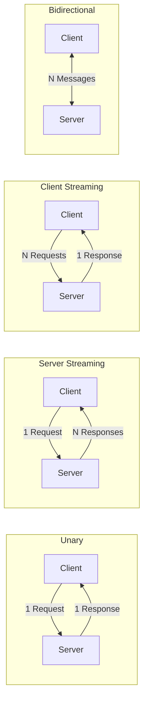
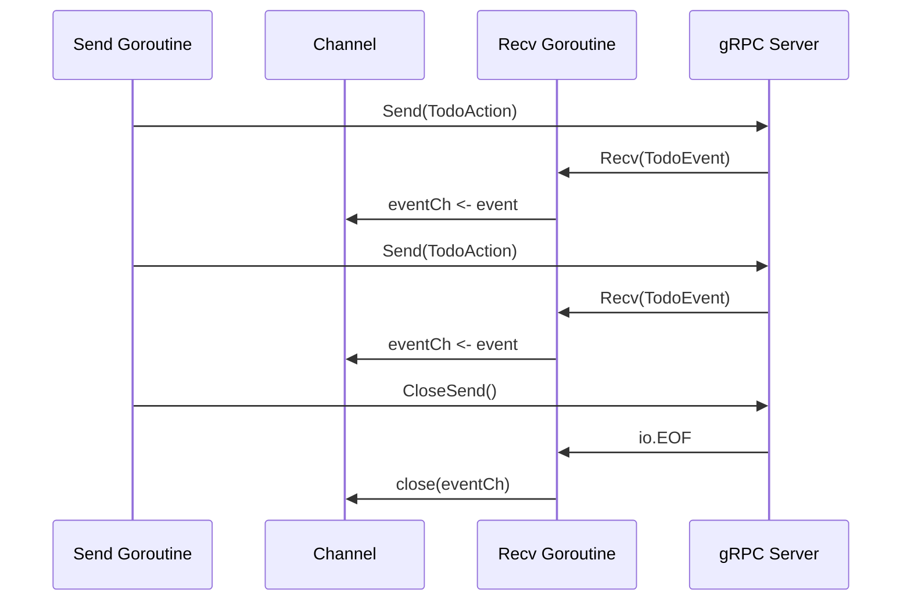

# gRPC Streaming RPC 패턴 - 구현 문서

> PRD: `6_13_go_grpc_streaming_prd.md`

---

## 1. 작업 범위

기존 `tutorials-go/grpc/todolist/`의 TodoList 도메인을 확장하여, 별도 프로젝트 `tutorials-go/grpc/todolist-streaming/`에 3가지 Streaming RPC 구현. 코드 작성 → 테스트 → 벤치마크 → 블로그 글 순서로 진행.

---

## 2. 샘플 코드 구현

### 2.1 프로젝트 구조

```
tutorials-go/grpc/todolist-streaming/
├── proto/
│   └── todo_streaming.proto       # 3가지 Streaming RPC 정의
├── buf.yaml
├── buf.gen.yaml
├── gen/
│   └── todopb/                    # buf generate 자동 생성
├── server/
│   └── main.go                    # gRPC 서버 + 3가지 Streaming 구현
├── client/
│   └── main.go                    # gRPC 클라이언트 (고루틴 패턴 포함)
├── interceptor/
│   └── stream_logging.go          # StreamServerInterceptor 구현
├── server_test.go                 # bufconn 기반 Streaming 테스트
├── benchmark_test.go              # Unary vs Streaming 성능 비교
└── Makefile                       # buf generate, 서버/클라이언트 실행
```

### 2.2 Proto 정의

```protobuf
syntax = "proto3";
package todopb;
option go_package = "github.com/kenshin579/tutorials-go/grpc/todolist-streaming/gen/todopb";

import "google/protobuf/timestamp.proto";

message Todo {
  string id = 1;
  string title = 2;
  string description = 3;
  bool completed = 4;
  google.protobuf.Timestamp created_at = 5;
}

// --- Server Streaming ---
message ListTodosRequest {
  bool completed_filter = 1;  // true: 완료된 것만, false: 전체
}

// --- Client Streaming ---
message CreateTodoRequest {
  string title = 1;
  string description = 2;
}

message BatchCreateResponse {
  int32 created_count = 1;
  repeated string ids = 2;
}

// --- Bidirectional Streaming ---
enum ActionType {
  ACTION_CREATE = 0;
  ACTION_COMPLETE = 1;
  ACTION_DELETE = 2;
}

message TodoAction {
  ActionType action = 1;
  string todo_id = 2;      // COMPLETE, DELETE 시 사용
  string title = 3;         // CREATE 시 사용
  string description = 4;   // CREATE 시 사용
}

enum EventType {
  EVENT_CREATED = 0;
  EVENT_COMPLETED = 1;
  EVENT_DELETED = 2;
  EVENT_ERROR = 3;
}

message TodoEvent {
  EventType event = 1;
  string todo_id = 2;
  string message = 3;
}

service TodoStreaming {
  rpc ListTodos(ListTodosRequest) returns (stream Todo);
  rpc BatchCreateTodos(stream CreateTodoRequest) returns (BatchCreateResponse);
  rpc TodoUpdates(stream TodoAction) returns (stream TodoEvent);
}

// --- Unary (벤치마크 비교용) ---
service TodoUnary {
  rpc CreateTodo(CreateTodoRequest) returns (Todo);
  rpc GetTodos(ListTodosRequest) returns (TodoList);
}

message TodoList {
  repeated Todo todos = 1;
}
```

### 2.3 Server Streaming 구현 핵심

```go
func (s *server) ListTodos(req *todopb.ListTodosRequest, stream todopb.TodoStreaming_ListTodosServer) error {
    for _, todo := range s.todos {
        if req.CompletedFilter && !todo.Completed {
            continue
        }
        if err := stream.Send(todo); err != nil {
            return status.Errorf(codes.Internal, "send error: %v", err)
        }
        // 실전에서는 DB 쿼리 등으로 대체
    }
    return nil
}
```

### 2.4 Client Streaming 구현 핵심

```go
// 서버
func (s *server) BatchCreateTodos(stream todopb.TodoStreaming_BatchCreateTodosServer) error {
    var ids []string
    for {
        req, err := stream.Recv()
        if err == io.EOF {
            return stream.SendAndClose(&todopb.BatchCreateResponse{
                CreatedCount: int32(len(ids)),
                Ids:          ids,
            })
        }
        if err != nil {
            return err
        }
        todo := createTodo(req)
        ids = append(ids, todo.Id)
    }
}

// 클라이언트
for _, req := range requests {
    if err := stream.Send(req); err != nil {
        return err
    }
}
resp, err := stream.CloseAndRecv()
```

### 2.5 Bidirectional Streaming + 고루틴 패턴

#### 서버 측: recv → channel → send 파이프라인

```go
func (s *server) TodoUpdates(stream todopb.TodoStreaming_TodoUpdatesServer) error {
    for {
        action, err := stream.Recv()
        if err == io.EOF {
            return nil
        }
        if err != nil {
            return err
        }
        event := s.processAction(action)
        if err := stream.Send(event); err != nil {
            return err
        }
    }
}
```

#### 클라이언트 측: send/recv 고루틴 분리 (directional channel)

```go
func bidiStreaming(client todopb.TodoStreamingClient, actions []*todopb.TodoAction) error {
    stream, err := client.TodoUpdates(context.Background())
    if err != nil {
        return err
    }

    // directional channel로 이벤트 수신
    eventCh := make(chan *todopb.TodoEvent)
    errCh := make(chan error, 1)

    // recv 고루틴 (<-chan 방향)
    go func() {
        defer close(eventCh)
        for {
            event, err := stream.Recv()
            if err == io.EOF {
                return
            }
            if err != nil {
                errCh <- err
                return
            }
            eventCh <- event
        }
    }()

    // send 고루틴 (chan<- 방향은 메인에서 처리)
    go func() {
        for _, action := range actions {
            if err := stream.Send(action); err != nil {
                errCh <- err
                return
            }
        }
        stream.CloseSend()
    }()

    // 이벤트 처리
    for event := range eventCh {
        log.Printf("event: %s - %s", event.Event, event.Message)
    }

    select {
    case err := <-errCh:
        return err
    default:
        return nil
    }
}
```

#### errgroup 패턴 (더 깔끔한 버전)

```go
func bidiWithErrgroup(stream todopb.TodoStreaming_TodoUpdatesClient, actions []*todopb.TodoAction) error {
    g, ctx := errgroup.WithContext(context.Background())

    // send 고루틴
    g.Go(func() error {
        for _, action := range actions {
            select {
            case <-ctx.Done():
                return ctx.Err()
            default:
                if err := stream.Send(action); err != nil {
                    return err
                }
            }
        }
        return stream.CloseSend()
    })

    // recv 고루틴
    g.Go(func() error {
        for {
            event, err := stream.Recv()
            if err == io.EOF {
                return nil
            }
            if err != nil {
                return err
            }
            log.Printf("event: %s", event.Message)
        }
    })

    return g.Wait()
}
```

### 2.6 Stream 인터셉터

```go
func StreamLoggingInterceptor(srv interface{}, ss grpc.ServerStream, info *grpc.StreamServerInfo, handler grpc.StreamHandler) error {
    start := time.Now()
    log.Printf("[STREAM START] %s", info.FullMethod)

    wrapped := &wrappedStream{ServerStream: ss, method: info.FullMethod}
    err := handler(srv, wrapped)

    log.Printf("[STREAM END] %s | duration=%s | err=%v", info.FullMethod, time.Since(start), err)
    return err
}

type wrappedStream struct {
    grpc.ServerStream
    method string
}

func (w *wrappedStream) SendMsg(m interface{}) error {
    log.Printf("[STREAM SEND] %s", w.method)
    return w.ServerStream.SendMsg(m)
}

func (w *wrappedStream) RecvMsg(m interface{}) error {
    log.Printf("[STREAM RECV] %s", w.method)
    return w.ServerStream.RecvMsg(m)
}
```

### 2.7 벤치마크: Unary vs Streaming

```go
// benchmark_test.go
func BenchmarkUnaryCreateTodos(b *testing.B) {
    // bufconn으로 서버 생성
    client := setupBenchClient(b)
    for i := 0; i < b.N; i++ {
        for j := 0; j < 1000; j++ {
            client.CreateTodo(ctx, &todopb.CreateTodoRequest{...})
        }
    }
}

func BenchmarkStreamingCreateTodos(b *testing.B) {
    client := setupBenchClient(b)
    for i := 0; i < b.N; i++ {
        stream, _ := client.BatchCreateTodos(ctx)
        for j := 0; j < 1000; j++ {
            stream.Send(&todopb.CreateTodoRequest{...})
        }
        stream.CloseAndRecv()
    }
}

func BenchmarkUnaryGetTodos(b *testing.B) {
    // 1000개 Todo를 Unary로 한번에 가져오기
}

func BenchmarkStreamingGetTodos(b *testing.B) {
    // 1000개 Todo를 Server Streaming으로 가져오기
}
```

**비교 지표**: `go test -bench=. -benchmem`으로 측정
- ns/op (소요시간)
- B/op (메모리 할당)
- allocs/op (할당 횟수)

---

## 3. 블로그 글 구성

### 3.1 글 위치

**경로**: `blog-v2.advenoh.pe.kr/docs/start/go-grpc-streaming/index.md`

### 3.2 참조할 소스 코드 (핵심 발췌)

| 섹션 | 참조 파일 | 발췌 포인트 |
|---|---|---|
| §2.1 개요 | — | Mermaid 다이어그램 (4가지 RPC 패턴) |
| §2.2.1 Server Streaming | `server/main.go` | ListTodos 구현 (Send 루프) |
| §2.2.1 Server Streaming | `client/main.go` | Recv 루프 + io.EOF |
| §2.2.2 Client Streaming | `server/main.go` | BatchCreateTodos (Recv + SendAndClose) |
| §2.2.2 Client Streaming | `client/main.go` | Send 루프 + CloseAndRecv |
| §2.2.3 Bidi Streaming | `server/main.go`, `client/main.go` | TodoUpdates 양방향 |
| §2.3 고루틴 패턴 | `client/main.go` | directional channel + errgroup |
| §2.4.1 에러 처리 | `server/main.go` | context timeout, EOF |
| §2.4.2 인터셉터 | `interceptor/stream_logging.go` | wrappedStream 패턴 |
| §2.5 성능 비교 | `benchmark_test.go` | 벤치마크 결과 표 |

### 3.3 Mermaid 다이어그램

**4가지 RPC 패턴 비교 (§2.1)**:


**Bidi 고루틴 패턴 (§2.3)**:

