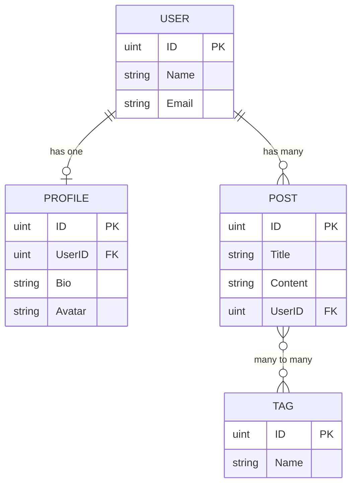

# GORM으로 MySQL 다루기 - 구현 문서

> PRD: `6_4_go_gorm_mysql_prd.md`

---

## 1. 샘플 코드 프로젝트 구성

### 1.1 프로젝트 위치 및 구조

**경로**: `tutorials-go/database/gorm-mysql/`

```
database/gorm-mysql/
├── docker-compose.yml          # MySQL 8.0 컨테이너
├── Makefile                    # 실행 편의 명령어
├── config/
│   ├── config.go               # YAML 파싱 (gopkg.in/yaml.v3)
│   └── config.yaml             # DSN, logLevel 설정
├── internal/
│   ├── domain/                 # 엔티티 (순수 Go 구조체 + Repository 인터페이스)
│   │   ├── user.go             # User, Profile 엔티티
│   │   ├── post.go             # Post 엔티티
│   │   └── tag.go              # Tag 엔티티
│   ├── repository/             # GORM 기반 Repository 구현
│   │   ├── user_repository.go
│   │   ├── user_repository_test.go
│   │   ├── post_repository.go
│   │   └── post_repository_test.go
│   └── infrastructure/
│       └── database/
│           └── mysql.go        # GORM v2 DB 초기화
├── scripts/
│   └── init.sql                # DB 초기 스키마 (docker-entrypoint-initdb.d용)
└── main_test.go                # 통합 테스트 (전체 시나리오)
```

### 1.2 기존 코드와의 관계

- 기존 `database/mysql/`: Spatial, N-gram 예제 (GORM v1) → **유지**
- 신규 `database/gorm-mysql/`: 이 글의 예제 (GORM v2) → **신규 작성**
- `go.mod`: 루트에 단일 모듈 (`github.com/kenshin579/tutorials-go`), GORM v2로 업그레이드

### 1.3 GORM 버전 업그레이드

현재 `go.mod`에 GORM v1.22.5 → **v2 최신 버전**으로 업그레이드

```bash
cd tutorials-go
go get -u gorm.io/gorm
go get -u gorm.io/driver/mysql
go mod tidy
```

> 기존 `database/mysql/` 코드가 이미 `gorm.io/gorm` import 경로를 사용하므로 v2 업그레이드 시 호환성 문제 없음

---

## 2. Docker Compose 구성

### 2.1 docker-compose.yml

```yaml
services:
  mysql:
    image: mysql:8.0
    container_name: gorm-mysql
    ports:
      - "3306:3306"
    environment:
      MYSQL_ROOT_PASSWORD: gomysql
      MYSQL_DATABASE: gorm_db
    volumes:
      - ./scripts/init.sql:/docker-entrypoint-initdb.d/init.sql
      - mysql-data:/var/lib/mysql
    command: --character-set-server=utf8mb4 --collation-server=utf8mb4_unicode_ci

volumes:
  mysql-data:
```

### 2.2 Makefile

```makefile
.PHONY: up down reset

up:
	docker compose up -d

down:
	docker compose down

reset:
	docker compose down -v && docker compose up -d

test:
	go test -v -count=1 ./database/gorm-mysql/...
```

---

## 3. 도메인 모델 설계

### 3.1 엔티티 관계

```
User 1:1 Profile    (Has One)
User 1:N Post       (Has Many)
Post N:M Tag        (Many To Many, 중간 테이블: post_tags)
```

### 3.2 User 엔티티

```go
// internal/domain/user.go
type User struct {
    gorm.Model
    Name    string   `gorm:"type:varchar(100);not null"`
    Email   string   `gorm:"type:varchar(200);uniqueIndex;not null"`
    Profile Profile  // Has One
    Posts   []Post   // Has Many
}

type Profile struct {
    gorm.Model
    UserID uint   `gorm:"uniqueIndex;not null"`
    Bio    string `gorm:"type:text"`
    Avatar string `gorm:"type:varchar(500)"`
}

// Repository 인터페이스
type UserRepository interface {
    Create(user *User) error
    FindByID(id uint) (*User, error)
    FindByEmail(email string) (*User, error)
    FindAll(offset, limit int) ([]User, error)
    Update(user *User) error
    Delete(id uint) error
    CreateWithProfile(user *User) error  // 트랜잭션 예제용
}
```

### 3.3 Post 엔티티

```go
// internal/domain/post.go
type Post struct {
    gorm.Model
    Title   string `gorm:"type:varchar(200);not null"`
    Content string `gorm:"type:text"`
    UserID  uint   `gorm:"index;not null"`
    User    User
    Tags    []Tag  `gorm:"many2many:post_tags"`
}

type PostRepository interface {
    Create(post *Post) error
    FindByID(id uint) (*Post, error)
    FindByUserID(userID uint) ([]Post, error)
    FindWithTags(id uint) (*Post, error)
    Update(post *Post) error
    Delete(id uint) error
    AddTag(postID uint, tag *Tag) error
    RemoveTags(postID uint) error
}
```

### 3.4 Tag 엔티티

```go
// internal/domain/tag.go
type Tag struct {
    gorm.Model
    Name  string `gorm:"type:varchar(50);uniqueIndex;not null"`
    Posts []Post `gorm:"many2many:post_tags"`
}
```

---

## 4. Repository 구현 핵심 패턴

### 4.1 CRUD 기본 (UserRepository)

```go
// internal/repository/user_repository.go
type userRepository struct {
    db *gorm.DB
}

func NewUserRepository(db *gorm.DB) domain.UserRepository {
    return &userRepository{db: db}
}

func (r *userRepository) Create(user *domain.User) error {
    return r.db.Create(user).Error
}

func (r *userRepository) FindByID(id uint) (*domain.User, error) {
    var user domain.User
    err := r.db.Preload("Profile").Preload("Posts").First(&user, id).Error
    if err != nil {
        return nil, err
    }
    return &user, nil
}

func (r *userRepository) FindAll(offset, limit int) ([]domain.User, error) {
    var users []domain.User
    err := r.db.Offset(offset).Limit(limit).Order("created_at DESC").Find(&users).Error
    return users, err
}
```

### 4.2 트랜잭션 (User + Profile 생성)

```go
func (r *userRepository) CreateWithProfile(user *domain.User) error {
    return r.db.Transaction(func(tx *gorm.DB) error {
        if err := tx.Create(user).Error; err != nil {
            return err
        }
        // Profile은 User.Profile에 포함되어 있으므로 GORM이 자동 처리
        return nil
    })
}
```

### 4.3 관계 매핑 (PostRepository - N:M)

```go
func (r *postRepository) FindWithTags(id uint) (*domain.Post, error) {
    var post domain.Post
    err := r.db.Preload("Tags").Preload("User").First(&post, id).Error
    return &post, err
}

func (r *postRepository) AddTag(postID uint, tag *domain.Tag) error {
    var post domain.Post
    if err := r.db.First(&post, postID).Error; err != nil {
        return err
    }
    return r.db.Model(&post).Association("Tags").Append(tag)
}
```

### 4.4 Raw SQL 및 Scopes

```go
// Raw SQL 예제
func (r *userRepository) CountByDomain(domain string) (int64, error) {
    var count int64
    err := r.db.Raw("SELECT COUNT(*) FROM users WHERE email LIKE ?", "%@"+domain).Scan(&count).Error
    return count, err
}

// Scopes 예제
func ActiveUsers(db *gorm.DB) *gorm.DB {
    return db.Where("deleted_at IS NULL")
}

func Paginate(offset, limit int) func(db *gorm.DB) *gorm.DB {
    return func(db *gorm.DB) *gorm.DB {
        return db.Offset(offset).Limit(limit)
    }
}
```

---

## 5. DB 초기화 (Infrastructure)

### 5.1 GORM v2 연결

```go
// internal/infrastructure/database/mysql.go
func NewMySQLDB(cfg *config.Config) (*gorm.DB, error) {
    db, err := gorm.Open(mysql.Open(cfg.MySQL.URL), &gorm.Config{
        Logger:      logger.Default.LogMode(parseLogLevel(cfg.MySQL.LogLevel)),
        PrepareStmt: true,
    })
    if err != nil {
        return nil, fmt.Errorf("failed to connect to MySQL: %w", err)
    }

    sqlDB, err := db.DB()
    if err != nil {
        return nil, err
    }
    sqlDB.SetMaxOpenConns(10)
    sqlDB.SetMaxIdleConns(5)
    sqlDB.SetConnMaxLifetime(time.Hour)

    return db, nil
}
```

### 5.2 Auto Migration

```go
func AutoMigrate(db *gorm.DB) error {
    return db.AutoMigrate(
        &domain.User{},
        &domain.Profile{},
        &domain.Post{},
        &domain.Tag{},
    )
}
```

---

## 6. 테스트 전략

### 6.1 통합 테스트 (Docker MySQL 필요)

```go
// main_test.go - 전체 시나리오
func TestMain(m *testing.M) {
    // Docker MySQL이 실행 중이어야 함
    // config.yaml의 DSN으로 연결
    os.Exit(m.Run())
}
```

### 6.2 Repository 테스트

```go
// internal/repository/user_repository_test.go
func setupTestDB(t *testing.T) *gorm.DB {
    cfg := config.ParseFromFile("../../config/config.yaml")
    db, err := database.NewMySQLDB(cfg)
    require.NoError(t, err)
    database.AutoMigrate(db)
    return db
}

func Test_UserRepository_CRUD(t *testing.T) {
    db := setupTestDB(t)
    repo := NewUserRepository(db)

    // Create
    user := &domain.User{Name: "Frank", Email: "frank@example.com"}
    err := repo.Create(user)
    assert.NoError(t, err)
    assert.NotZero(t, user.ID)

    // Read
    found, err := repo.FindByID(user.ID)
    assert.NoError(t, err)
    assert.Equal(t, "Frank", found.Name)

    // Update
    found.Name = "Frank Updated"
    err = repo.Update(found)
    assert.NoError(t, err)

    // Delete (Soft)
    err = repo.Delete(user.ID)
    assert.NoError(t, err)
}
```

### 6.3 관계 매핑 테스트

```go
func Test_PostRepository_WithTags(t *testing.T) {
    // 1:1 - User + Profile 생성 (트랜잭션)
    // 1:N - User의 Post 생성/조회
    // N:M - Post에 Tag 추가, Preload 조회
}
```

---

## 7. 블로그 글 작성 포인트

### 블로그에서 강조할 내용

| 섹션 | 핵심 포인트 |
|---|---|
| §1 들어가며 | v2 import 경로 변경, database/sql과의 비교표 |
| §2 환경 설정 | docker-compose 실행 한 줄로 시작, Clean Architecture 디렉토리 구조 다이어그램 |
| §3 모델 정의 | gorm.Model 필드 설명, 구조체 태그 cheat sheet |
| §4 CRUD | 각 메서드별 실행 SQL 로그 출력 결과 포함 |
| §5 관계 매핑 | ER 다이어그램 (Mermaid), Preload vs Joins 성능 비교 |
| §6 트랜잭션 | 자동 vs 수동 비교, 롤백 시나리오 |
| §7 실전 팁 | N+1 문제 SQL 로그로 시각화 |

### Mermaid ER 다이어그램 (블로그 §5에서 사용)


