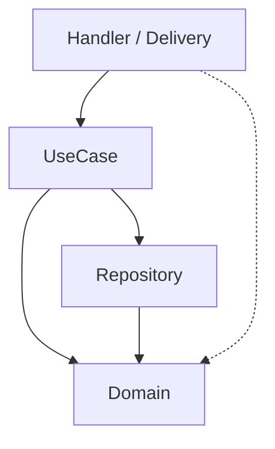
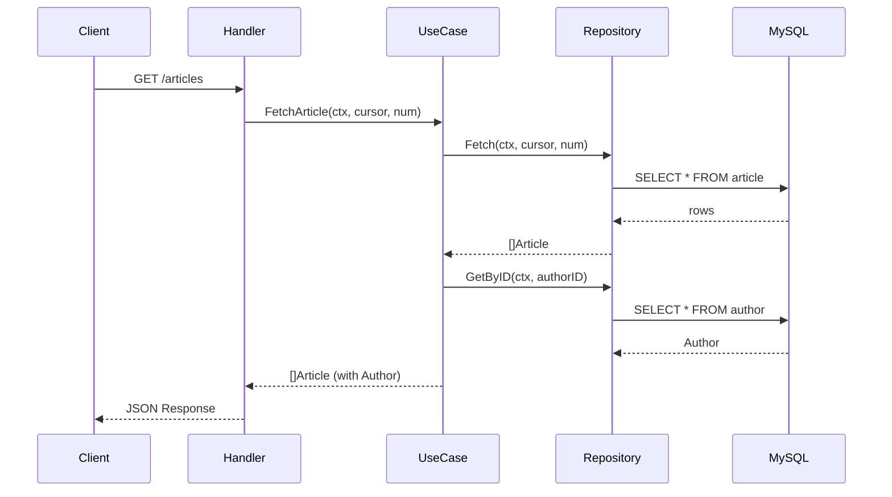

# Go 프로젝트 레이아웃과 Clean Architecture - 구현 문서

> PRD: `6_7_go_clean_architecture_prd.md`

---

## 1. 작업 범위

기존 코드(`tutorials-go/project-layout/go-clean-arch-v1/`, `go-clean-arch-v2/`)를 기반으로 블로그 글 작성. 코드 신규 작성 없음.

---

## 2. 블로그 글 구성

### 2.1 글 위치

**경로**: `blog-v2.advenoh.pe.kr/docs/start/go-clean-architecture/index.md`

### 2.2 참조할 소스 코드 (V2 기준, 핵심 발췌)

| 섹션 | 참조 파일 | 발췌 포인트 |
|---|---|---|
| §3 Clean Architecture | — | Mermaid 다이어그램 (레이어 의존성) |
| §4.1 Domain | `domain/article.go`, `domain/author.go`, `domain/errors.go` | Article 구조체, ArticleRepository/ArticleUsecase 인터페이스 |
| §4.2 Repository | `article/repository.go` (V2), `article/helper.go` | Fetch 메서드 (cursor 페이지네이션), DecodeCursor/EncodeCursor |
| §4.3 UseCase | `article/usecase.go` | fillAuthorDetails (errgroup 패턴), context 타임아웃 |
| §4.4 Handler | `article/handler.go` | NewArticleHandler 라우트 등록, getStatusCode 에러 매핑, isRequestValid |
| §5 V1 vs V2 | V1/V2 디렉토리 트리 | 구조 비교 (코드 블록 + 표) |
| §6 테스트 | `article/handler_test.go`, `article/usecase_test.go` | Mock 주입 패턴 핵심 발췌 |

### 2.3 Mermaid 다이어그램

**레이어 의존성 (§3)**:


**요청 흐름 (§4)**:


### 2.4 코드 발췌 기준

- **Domain**: 구조체 + 인터페이스 전체 (핵심이므로)
- **Repository**: `Fetch()` 메서드 + cursor 헬퍼 (페이지네이션 패턴)
- **UseCase**: `fillAuthorDetails()` (errgroup 동시성 패턴)
- **Handler**: `NewArticleHandler()` 라우트 등록 + `getStatusCode()` 에러 매핑
- **테스트**: Handler 테스트 1개 (Mock UseCase 주입 패턴)
- **DI**: `cmd/main.go`에서 fx.Provide 부분만 간단히 (상세는 별도 글)

### 2.5 frontmatter

```yaml
title: "Go 프로젝트 레이아웃과 Clean Architecture"
description: "Go에서 Clean Architecture를 적용하여 프로젝트를 구성하는 방법을 Article CRUD API 예제와 V1/V2 구조 비교를 통해 알아봅니다"
date: 2026-03-04
update: 2026-03-04
tags:
  - golang
  - go
  - clean-architecture
  - project-layout
  - echo
  - repository-pattern
  - 고랭
  - 클린아키텍처
```
