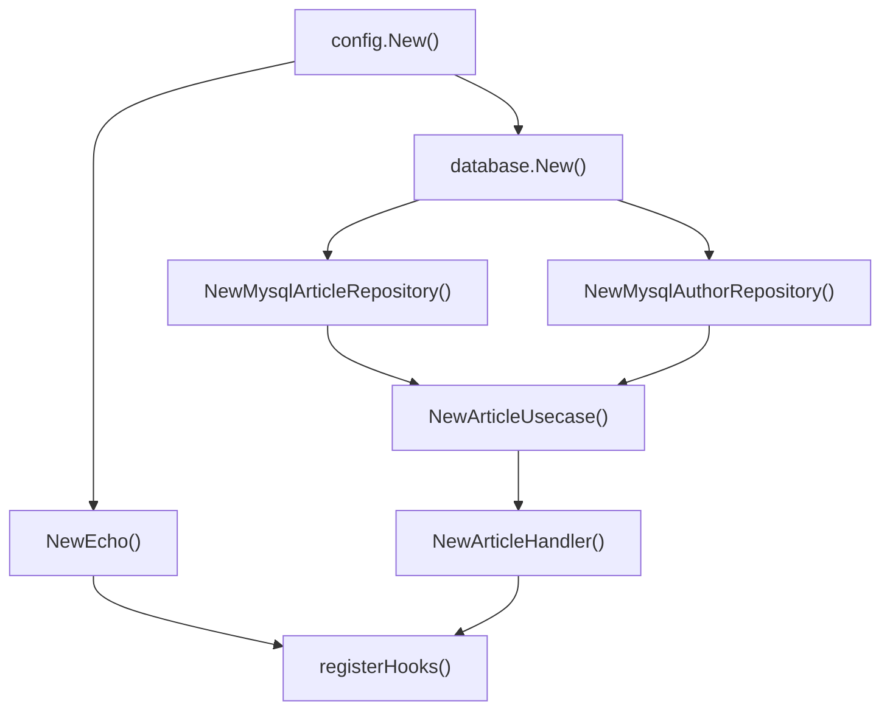

# uber/fx로 의존성 주입 구현하기 PRD

> 시리즈: Golang 블로그 주제 Phase 3 - 아키텍처 (2/2)
> 참조: `6_golang_topic_prd.md` C-2

---

## 1. 개요

uber/fx는 Go의 대표적인 DI(Dependency Injection) 프레임워크. Clean Architecture에서 레이어 간 의존성을 자동으로 연결하고, 앱 수명주기(Lifecycle)를 관리한다. 이전 글(Clean Architecture)의 프로젝트에 fx가 어떻게 적용되는지를 중심으로 설명한다.

**대상 독자**: Clean Architecture 글을 읽은 개발자, DI 패턴에 관심 있는 개발자
**난이도**: 중고급
**예제 코드**: `tutorials-go/project-layout/go-clean-arch-v2/`
**선행 지식**: 이전 글 (Go Clean Architecture)

---

## 2. 블로그 구조

### 2.1 Go에서 DI가 필요한 이유
- 수동 DI의 문제점: main()에서 의존성 수동 조립의 복잡도 증가
- DI 컨테이너의 역할: 자동 의존성 해결, 수명주기 관리
- fx 소개: uber에서 만든 런타임 DI 프레임워크 (리플렉션 기반, dig 위에 구축)

### 2.2 fx 기본 개념
- `fx.New()` - 앱 생성
- `fx.Provide()` - 생성자 등록 (의존성 그래프 구성)
- `fx.Invoke()` - 부수 효과 실행 (서버 시작 등)
- `fx.Supply()` - 이미 생성된 값 제공
- 자동 의존성 해결: 생성자의 매개변수/반환값으로 그래프 구성

### 2.3 Clean Architecture에서의 fx 적용
- 참고 코드: `go-clean-arch-v2/cmd/main.go`

```go
app := fx.New(
    fx.Provide(
        config.New,              // Config 생성
        database.New,            // DB 연결
        NewEcho,                 // Echo 인스턴스
        article.NewArticleHandler,    // Handler
        article.NewArticleUsecase,    // UseCase
        article.NewMysqlArticleRepository, // Repository
        author.NewMysqlAuthorRepository,   // Repository
    ),
    fx.Invoke(registerHooks),    // 서버 시작
)
```

- 생성자 체인: Config → Database → Repository → UseCase → Handler
- 의존성 자동 해결 과정 설명

### 2.4 Lifecycle 관리
- `fx.Lifecycle` 인터페이스
- `OnStart`: 앱 시작 시 실행 (Echo 서버 goroutine 시작)
- `OnStop`: 앱 종료 시 실행 (Graceful Shutdown)
- `registerHooks()` 구현 패턴

### 2.5 fx.Module 패턴
- `fx.Module()` - 도메인별 의존성을 모듈 단위로 그룹화
- 모듈 분리의 장점: 관심사 분리, 재사용성, 가독성
- 예제:

```go
var ArticleModule = fx.Module("article",
    fx.Provide(
        NewArticleHandler,
        NewArticleUsecase,
        NewMysqlArticleRepository,
    ),
)

var AuthorModule = fx.Module("author",
    fx.Provide(
        NewMysqlAuthorRepository,
    ),
)

app := fx.New(
    fx.Provide(config.New, database.New, NewEcho),
    ArticleModule,
    AuthorModule,
    fx.Invoke(registerHooks),
)
```

### 2.6 fx.Decorate 패턴
- `fx.Decorate()` - 기존 의존성을 래핑/변경 (미들웨어 패턴)
- 사용 사례: 로깅 추가, 캐시 래핑, 메트릭 수집
- 예제:

```go
fx.Decorate(func(repo ArticleRepository) ArticleRepository {
    return NewCachedArticleRepository(repo) // 기존 repo를 캐시로 래핑
})
```

### 2.7 고급 패턴
- `fx.Annotate()` - 같은 인터페이스의 여러 구현체 구분
- `fx.In`/`fx.Out` - 매개변수/결과 그룹화
- Named 의존성: 동일 타입 여러 인스턴스 관리

### 2.8 테스트에서의 fx
- `fx.Replace()` - 테스트 시 Mock 주입
- `fxtest.New()` - 테스트용 앱 생성
- 통합 테스트에서 실제 의존성 vs Mock 전환

### 2.9 의존성 그래프 시각화

Clean Architecture에서의 fx 의존성 그래프를 Mermaid로 표현:



### 2.10 실전 팁
- 순환 의존성 디버깅: `fx.NopLogger` 대신 상세 로그
- 과도한 DI 주의점: 단순한 앱에는 수동 DI가 나을 수 있음

---

## 3. 샘플 코드 참조

| 파일 | 내용 |
|------|------|
| `go-clean-arch-v2/cmd/main.go` | fx.New, Provide, Invoke 설정 |
| `go-clean-arch-v2/pkg/config/config.go` | `config.New` 생성자 |
| `go-clean-arch-v2/pkg/database/db.go` | `database.New` 생성자 |
| `go-clean-arch-v2/article/handler.go` | `NewArticleHandler` 생성자 |
| `go-clean-arch-v2/article/usecase.go` | `NewArticleUsecase` 생성자 |
| `go-clean-arch-v2/article/repository.go` | `NewMysqlArticleRepository` 생성자 |

---

## 4. 논의 사항 (결정 완료)

- [x] fx vs Wire 비교 → 비교표 불필요, fx 중심으로만 다룸
- [x] fx.Module 패턴 → 추가 (2.5절)
- [x] 의존성 그래프 → Mermaid로 시각화 (2.9절)
- [x] `fx.Decorate()` → 포함 (2.6절)
- [ ] 이전 글(Clean Arch)과의 중복 최소화 방법
