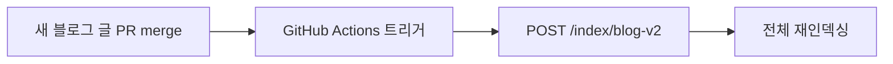
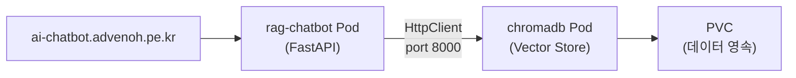

# RAG 기반 블로그 Q&A 챗봇 - 프로젝트 PRD

## 1. 개요

### 1.1 목적
RAG(Retrieval-Augmented Generation)와 Prompt Engineering을 활용한 블로그 Q&A 챗봇 **API 서버 + 독립 채팅 UI**를 구축한다.

- **Backend API**: FastAPI 기반 RAG 서버 (`/chat`, `/index`, `/health`)
- **독립 채팅 UI**: React + Next.js 기반 채팅 페이지 (`ai-chatbot.advenoh.pe.kr`)
- **멀티 블로그**: ChromaDB Collection 분리로 블로그별 독립 검색 지원

> 각 블로그(blog-v2, investment)에 ChatWindow 컴포넌트를 통합하는 작업은 별도 PRD 참조: `7_blog_chat_integration_prd.md`

### 1.2 프로젝트 도메인
**블로그 Q&A 챗봇 서버** - 각 블로그의 글을 독립된 knowledge base(Collection)로 관리하여 블로그별 콘텐츠 기반 질문에 답하는 API 서버. 독립 채팅 UI(`ai-chatbot.advenoh.pe.kr`)를 통해 RAG 기능을 바로 검증할 수 있다.

### 1.3 기술 스택
- **Backend**: Python 3.12+ / FastAPI
- **LLM**: OpenAI GPT-4o-mini (비용 효율) / GPT-4o (고품질)
- **RAG Framework**: LangChain
- **Vector Store**: ChromaDB (클라이언트-서버 모드, 별도 Pod로 배포)
- **Embedding**: OpenAI text-embedding-3-small
- **Frontend**: React 19 + Next.js 15 (블로그와 동일 스택으로 통합 용이)
- **평가**: RAGAS (RAG 품질 평가)

### 1.4 Repo
- **이름**: `ai-chatbot.advenoh.pe.kr`
- **URL**: https://github.com/kenshin579/ai-chatbot.advenoh.pe.kr
- **로컬 경로**: `workspace_blogv2/ai-chatbot.advenoh.pe.kr/`

---

## 2. 프로젝트 구조

```
ai-chatbot.advenoh.pe.kr/
├── README.md
├── Makefile                       # 루트 실행 명령어 (dev, build 등)
│
├── backend/
│   ├── pyproject.toml             # Python 의존성 관리 (uv)
│   ├── .env.example               # API 키 템플릿
│   ├── Dockerfile
│   ├── app/
│   │   ├── __init__.py
│   │   ├── main.py                # FastAPI 앱 엔트리포인트
│   │   ├── config.py              # 설정 관리
│   │   ├── api/
│   │   │   ├── __init__.py
│   │   │   ├── routes.py          # API 라우트 (/chat, /documents)
│   │   │   └── models.py          # Pydantic 요청/응답 모델
│   │   ├── rag/
│   │   │   ├── __init__.py
│   │   │   ├── document_loader.py # 문서 로딩 (MD)
│   │   │   ├── chunker.py         # 텍스트 청킹 전략
│   │   │   ├── embedder.py        # 임베딩 생성
│   │   │   ├── vector_store.py    # 벡터 저장소 관리
│   │   │   ├── retriever.py       # 검색 로직
│   │   │   └── chain.py           # RAG 체인 (검색 + 생성)
│   │   ├── prompts/
│   │   │   ├── __init__.py
│   │   │   └── templates.py       # 프롬프트 템플릿 모음
│   │   └── evaluation/
│   │       ├── __init__.py
│   │       ├── evaluator.py       # RAGAS 기반 평가
│   │       └── dataset.py         # 평가 데이터셋
│   ├── data/
│   │   └── documents/             # 인덱싱할 문서 (MD)
│   ├── tests/
│   │   ├── test_chunker.py
│   │   ├── test_retriever.py
│   │   └── test_chain.py
│   └── scripts/
│       ├── index_documents.py     # 문서 인덱싱 스크립트
│       └── evaluate.py            # 평가 실행 스크립트
│
└── frontend/
    ├── package.json
    ├── next.config.js
    ├── src/
    │   ├── app/
    │   │   ├── layout.tsx
    │   │   └── page.tsx           # 채팅 메인 페이지
    │   └── components/
    │       ├── ChatWindow.tsx     # 채팅 창 컴포넌트
    │       ├── MessageList.tsx    # 메시지 목록
    │       └── ChatInput.tsx      # 입력 컴포넌트
    └── public/
```

---

## 3. Knowledge Base 구성

블로그 콘텐츠만을 knowledge base로 활용한다. 외부 문서는 포함하지 않으며, 블로그별로 **ChromaDB Collection을 분리**하여 독립적으로 관리한다.

### 3.1 Collection 분리 구조

```
ChromaDB Vector Store
├── collection: "blog-v2"        ← IT 블로그 (1차)
└── collection: "investment"     ← 투자 블로그 (2차)
```

### 3.2 블로그별 데이터 소스

| Collection | 소스 | 형식 | 설명 |
|------------|------|------|------|
| `blog-v2` | IT 블로그 포스트 | Markdown | `blog-v2.advenoh.pe.kr/contents/` 전체 블로그 글 (Go, Python, Java, DevOps 등) |
| `blog-v2` | 블로그 메타데이터 | YAML frontmatter | 제목, 날짜, 태그, 카테고리, excerpt 등 |
| `investment` | 투자 블로그 포스트 | Markdown | `investment.advenoh.pe.kr/contents/` 투자 인사이트 글 (2차) |
| `investment` | 블로그 메타데이터 | YAML frontmatter | 제목, 날짜, 태그, 카테고리, excerpt 등 (2차) |

### 3.3 API 요청 흐름

```
POST /chat
{
  "blog_id": "blog-v2",          ← Collection 선택 키
  "question": "Go에서 goroutine 사용법은?"
}
```

- `blog_id`로 어떤 Collection을 검색할지 결정
- 인덱싱도 `blog_id`별로 독립 실행
- Collection 간 완전 격리 → 검색 결과가 섞이지 않음

### 3.4 인덱싱 갱신 전략

블로그에 새 글이 추가되면 **GitHub Actions**가 자동으로 RAG 서버의 재인덱싱을 트리거한다.



- **트리거 조건**: 블로그 repo에서 `contents/` 경로에 변경이 있는 PR이 merge될 때
- **인덱싱 방식**: 전체 재인덱싱 (개인 블로그 규모에서 충분)
- **위치**: 각 블로그 repo(blog-v2, investment)의 `.github/workflows/`에 워크플로우 추가
- **동작**: RAG 서버의 `POST /index/{blog_id}` API 호출

---

## 4. 핵심 기능

1. **문서 인덱싱**: Markdown 블로그 글을 청킹 → 임베딩 → 벡터 저장 (GitHub Actions 자동 트리거)
2. **멀티 블로그 지원**: `blog_id` 기반 ChromaDB Collection 분리로 블로그별 독립 검색
3. **RAG 기반 Q&A**: 질문에 관련 문서를 검색하고 LLM으로 답변 생성
4. **대화 히스토리**: 멀티턴 대화 지원 (이전 질문/답변 컨텍스트 유지)
5. **소스 인용**: 답변에 참조한 블로그 글 출처 표시 (제목 + URL)
6. **독립 채팅 UI**: `ai-chatbot.advenoh.pe.kr`에서 바로 RAG 기능 검증 가능
7. **LangSmith 트레이싱**: 환경변수 설정으로 RAG 실행 트레이스 자동 수집
8. **평가 파이프라인**: RAGAS로 RAG 품질 자동 평가

> 사용자 피드백(👍👎), Admin 대시보드, 쿼리 로그는 별도 PRD: `8_chatbot_monitoring_prd.md`

---

## 5. 구현 순서 (마일스톤)

| 단계 | 작업 | 산출물 |
|------|------|--------|
| M1 | 프로젝트 셋업, 문서 로딩/청킹/임베딩 (blog-v2 Collection) | 인덱싱 파이프라인 |
| M2 | RAG 체인 구현, FastAPI 엔드포인트 (`blog_id` 기반 멀티 Collection) | REST API (/chat) |
| M3 | 독립 채팅 UI (ai-chatbot.advenoh.pe.kr), 대화 히스토리 | 채팅 페이지 |
| M4 | LangSmith 트레이싱 연동 | 실행 트레이스 수집 |
| M5 | 프롬프트 최적화, Hybrid Search | 검색 품질 개선 |
| M6 | RAGAS 평가 파이프라인 | 품질 측정 결과 |
| M7 | Docker 빌드, Helm Chart 배포 | 프로덕션 배포 |

> 각 블로그에 ChatWindow 통합 및 investment Collection 추가는 `7_blog_chat_integration_prd.md` 참조

---

## 6. 주요 라이브러리

| 라이브러리 | 버전 | 용도 |
|-----------|------|------|
| langchain | 0.3.x | RAG 프레임워크 |
| langchain-openai | 0.3.x | OpenAI 통합 |
| langchain-chroma | 0.2.x | ChromaDB 벡터 저장소 |
| chromadb | 0.5.x | 로컬 벡터 DB |
| openai | 1.x | OpenAI API 클라이언트 |
| fastapi | 0.115.x | REST API 서버 |
| uvicorn | 0.34.x | ASGI 서버 |
| next | 15.x | React 프레임워크 (채팅 UI) |
| react | 19.x | UI 라이브러리 |
| shadcn/ui | - | UI 컴포넌트 (블로그와 동일) |
| langsmith | - | LLM 트레이싱 (LangChain 공식, 환경변수만 설정) |
| ragas | 0.2.x | RAG 품질 평가 |
| pydantic | 2.x | 데이터 검증 |
| python-dotenv | 1.x | 환경변수 관리 |

---

## 7. 배포

### 7.1 도메인

- **확정**: `ai-chatbot.advenoh.pe.kr`

> 기존 도메인 패턴: inspire-me.advenoh.pe.kr, moneyflow.advenoh.pe.kr

### 7.2 배포 구성

- **rag-chatbot**: Docker 이미지 → `kenshin579/rag-chatbot:{version}`, Helm Chart → `charts/charts/rag-chatbot/`
- **chromadb**: 공식 이미지 → `chromadb/chroma:{version}`, Helm Chart → [amikos-tech/chromadb-chart](https://github.com/amikos-tech/chromadb-chart) 사용
- ArgoCD ApplicationSet에 두 앱 모두 추가 (`bootstrap/macmini-app.yaml`)
- Gateway HTTPRoute로 `ai-chatbot.advenoh.pe.kr` 도메인 라우팅



### 7.3 Dockerfile (Python multi-stage)

```dockerfile
# backend/Dockerfile
FROM python:3.12-slim AS builder
WORKDIR /app
COPY pyproject.toml ./
RUN pip install --no-cache-dir .

FROM python:3.12-slim
WORKDIR /app
COPY --from=builder /usr/local/lib/python3.12/site-packages /usr/local/lib/python3.12/site-packages
COPY --from=builder /usr/local/bin /usr/local/bin
COPY . .
EXPOSE 8080
CMD ["uvicorn", "app.main:app", "--host", "0.0.0.0", "--port", "8080"]
```

### 7.4 Helm Chart 구조

**rag-chatbot (`charts/charts/rag-chatbot/`):**

```
rag-chatbot/
├── Chart.yaml
├── values.yaml
└── templates/
    ├── deployment.yaml
    ├── service.yaml
    ├── configmap.yaml
    └── secret.yaml
```

**chromadb (기존 Helm Chart 사용):**

```bash
# amikos-tech/chromadb-chart (https://github.com/amikos-tech/chromadb-chart)
helm repo add chroma https://amikos-tech.github.io/chromadb-chart/
helm repo update

# values.yaml만 작성하여 ArgoCD에 등록
charts/charts/chromadb/
├── Chart.yaml              # dependency로 chroma/chromadb 참조
└── values.yaml             # 커스텀 설정 (포트, PVC, 리소스 등)
```

### 7.5 values.yaml 핵심 설정

```yaml
namespace: app
phase: "real"
application: rag-chatbot

image:
  name_tag: kenshin579/rag-chatbot:0.1.0
  pullPolicy: IfNotPresent

replicas: 1

resources:
  requests:
    memory: "512Mi"
    cpu: "250m"
  limits:
    memory: "1Gi"
    cpu: "500m"

service:
  type: ClusterIP
  port: 80
  targetPort: 8080

config:
  nodeEnv: "production"
  port: "8080"
  chromaHost: "chromadb-service.infra.svc.cluster.local"
  chromaPort: "8000"

secrets:
  openai:
    apiKey: ""

healthCheck:
  liveness:
    enabled: true
    path: /health
    initialDelaySeconds: 30
  readiness:
    enabled: true
    path: /health
    initialDelaySeconds: 10
```

### 7.6 Gateway HTTPRoute 추가 (charts/charts/gateway/values.yaml)

```yaml
# certificate.dnsNames에 추가
- ai-chatbot.advenoh.pe.kr

# routes에 추가
- name: rag-chatbot-route
  hostname: ai-chatbot.advenoh.pe.kr
  path: /
  service:
    name: rag-chatbot-service
    port: 80
    namespace: app
```

---

## 8. 개발 가이드

### 8.1 MCP Context7 활용

구현 시 최신 라이브러리 코드와 API를 참고하려면 **MCP Context7**을 사용한다.

```
# Claude Code에서 Context7 MCP 도구 사용 예시
# 1. resolve-library-id로 라이브러리 ID 조회
# 2. query-docs로 최신 문서/코드 예제 검색
```

**주요 조회 대상 라이브러리:**
- `langchain` - RAG 체인, Document Loader, Text Splitter
- `langchain-openai` - OpenAI Embedding, ChatModel 연동
- `chromadb` - 벡터 저장소 CRUD API
- `fastapi` - API 라우트, 미들웨어 패턴
- `ragas` - RAG 평가 메트릭 및 파이프라인

---

## 9. 참고 자료

- [bytebyteai.com - Build a Customer Support Chatbot using RAGs](https://bytebyteai.com/)
- [LangChain RAG Documentation](https://docs.langchain.com/oss/python/langchain/rag)
- [Real Python - Build an LLM RAG Chatbot With LangChain](https://realpython.com/build-llm-rag-chatbot-with-langchain/)
- [Building a Production-Ready RAG Chatbot with FastAPI and LangChain](https://blog.futuresmart.ai/building-a-production-ready-rag-chatbot-with-fastapi-and-langchain)
- [RAGAS - RAG Assessment](https://docs.ragas.io/)
- [RAG examples from real companies](https://www.evidentlyai.com/blog/rag-examples)
- [5 Essential Steps to Build a RAG Chatbot with LangChain](https://www.chatrag.ai/blog/2026-02-02-5-essential-steps-to-build-a-rag-chatbot-with-langchain-and-why-most-teams-get-stuck)
