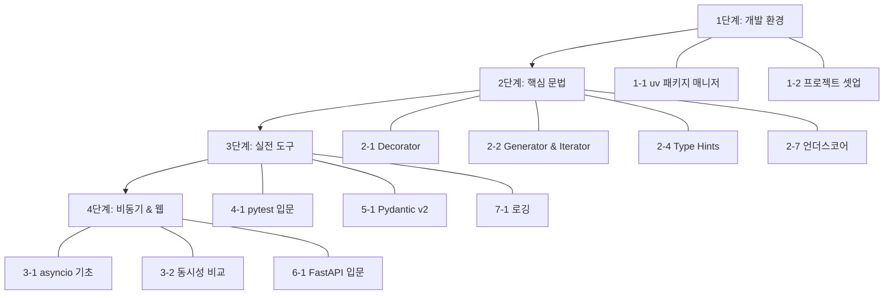

# Python 블로그 스터디 주제 정리

> 작성일: 2026-03-02
> 목적: Python 스터디 및 블로그 작성을 위한 주제 선정

## 기존 작성 완료 목록

아래 주제는 이미 블로그 또는 tutorials-python에 작성되어 있음.

| 주제 | 블로그 | 튜토리얼 코드 |
|------|--------|---------------|
| argparse (CLI 파싱) | O | O (12개 예제) |
| lambda 함수 | O | O |
| 웹 스크래핑 (BeautifulSoup) | O | O |
| 웹 스크래핑 차단 방지 (Tor) | O | O |
| Rate Limiting (aiolimiter, aiometer) | O | O |
| Docker + Python | O | O (Flask) |
| pipx 사용법 | O | X |
| PyPI 패키지 배포 | O | X |
| Gitbook 전자책 | O | X |
| template_string | X | O (1개 예제) |

---

## 추천 스터디 주제

### 카테고리 1: 패키지 & 개발 환경

Python 생태계가 빠르게 변화 중. 다른 주제를 학습하기 전에 개발 환경부터 정리하면 이후 학습 효율이 높아짐.

| # | 주제 | 난이도 | 우선순위 | 설명 |
|---|------|--------|----------|------|
| 1-1 | **uv: 차세대 Python 패키지 매니저** | 초 | ★★★ | Rust 기반 초고속 패키지 매니저, pip/poetry 대체, pyproject.toml 관리 |
| 1-2 | **Python 프로젝트 셋업 모범 사례 (2026)** | 초-중 | ★★☆ | pyproject.toml, uv/poetry, ruff, pre-commit, GitHub Actions CI 구성 |

### 카테고리 2: Python 핵심 문법 심화

실무에서 자주 사용되지만, 제대로 이해하지 못하고 넘어가기 쉬운 주제들.

| # | 주제 | 난이도 | 우선순위 | 설명 |
|---|------|--------|----------|------|
| 2-1 | **Decorator 완벽 가이드** | 중 | ★★★ | 함수/클래스 데코레이터, functools.wraps, 데코레이터 팩토리, 실전 활용 (로깅, 캐싱, 인증, retry) |
| 2-2 | **Generator & Iterator** | 중 | ★★★ | yield, send(), generator expression, itertools 활용, 메모리 효율적 처리 |
| 2-3 | **Context Manager (with 문)** | 중 | ★★☆ | __enter__/__exit__, contextlib, 리소스 관리 패턴, 실전 예제 (DB 연결, 파일, 락) |
| 2-4 | **Type Hints 실전 가이드** | 중 | ★★★ | typing 모듈, Generic, Protocol, TypeVar, mypy 활용, 점진적 타이핑 전략 |
| 2-5 | **Dataclasses & attrs** | 초-중 | ★★☆ | dataclass 기본/고급, field(), __post_init__, attrs/cattrs 비교 |
| 2-6 | **패턴 매칭 (match/case)** | 중 | ★☆☆ | Python 3.10+ structural pattern matching, guard 조건, 실전 활용 사례 |
| 2-7 | **언더스코어의 모든 것** | 초 | ★★☆ | _, __, __dunder__, name mangling, 컨벤션 정리 |
| 2-8 | **Enum 활용법** | 초-중 | ★☆☆ | Enum, IntEnum, Flag, auto(), 상태 관리 패턴 |
| 2-9 | **ABC와 Protocol** | 중 | ★☆☆ | Abstract Base Class vs Protocol, 구조적 서브타이핑, 인터페이스 설계 |

### 카테고리 3: 비동기 프로그래밍

Python에서 가장 진입장벽이 높지만 실무 가치가 큰 영역.

| # | 주제 | 난이도 | 우선순위 | 설명 |
|---|------|--------|----------|------|
| 3-1 | **asyncio 기초부터 실전까지** | 중-고 | ★★★ | event loop, coroutine, Task, Future, async/await 패턴 |
| 3-2 | **동시성 비교: threading vs multiprocessing vs asyncio** | 중 | ★★★ | GIL 이해, CPU-bound vs I/O-bound, 선택 기준, 벤치마크 |
| 3-3 | **asyncio 실전 패턴** | 고 | ★★☆ | Semaphore, Queue, gather vs TaskGroup, 에러 핸들링, graceful shutdown |

### 카테고리 4: 테스팅

코드 품질의 핵심. tutorials-python에 테스트 코드가 거의 없어 시리즈로 작성하면 좋음.

| # | 주제 | 난이도 | 우선순위 | 설명 |
|---|------|--------|----------|------|
| 4-1 | **pytest 입문: unittest에서 pytest로** | 초-중 | ★★★ | 기본 사용법, assertion, fixture, conftest.py, parametrize |
| 4-2 | **pytest 심화: mock과 monkeypatch** | 중 | ★★☆ | unittest.mock, pytest-mock, monkeypatch, 외부 의존성 테스트 전략 |
| 4-3 | **pytest 플러그인과 실전 팁** | 중 | ★☆☆ | pytest-cov, pytest-xdist, pytest-asyncio, 커스텀 fixture, CI 연동 |

### 카테고리 5: 데이터 검증 & ORM

API 개발과 데이터 처리에서 필수적인 도구들.

| # | 주제 | 난이도 | 우선순위 | 설명 |
|---|------|--------|----------|------|
| 5-1 | **Pydantic v2 완벽 가이드** | 중 | ★★★ | BaseModel, validator, 직렬화/역직렬화, Settings 관리, FastAPI 연동 |
| 5-2 | **SQLAlchemy 2.0 + SQLModel** | 중-고 | ★★☆ | ORM 기초, 세션 관리, 관계 설정, SQLModel로 FastAPI 통합 |
| 5-3 | **Peewee ORM 실전 가이드** | 초-중 | ★★☆ | 경량 ORM, 모델 정의, CRUD, 관계 설정, 마이그레이션, FastAPI 연동 |

### 카테고리 6: 웹 프레임워크

기존 Flask 튜토리얼이 있으므로 FastAPI 중심으로 확장.

| # | 주제 | 난이도 | 우선순위 | 설명 |
|---|------|--------|----------|------|
| 6-1 | **FastAPI 입문: Flask에서 FastAPI로** | 중 | ★★★ | 기본 구조, 라우팅, 의존성 주입, 자동 문서화, 비동기 엔드포인트 |
| 6-2 | **FastAPI 실전: 프로젝트 구조와 패턴** | 중-고 | ★★☆ | 레이어드 아키텍처, 미들웨어, 에러 핸들링, 인증/인가, 테스트 |

### 카테고리 7: 실용 유틸리티

단발성이지만 실무에서 바로 쓸 수 있는 주제.

| # | 주제 | 난이도 | 우선순위 | 설명 |
|---|------|--------|----------|------|
| 7-1 | **Python 로깅 제대로 하기** | 초-중 | ★★☆ | logging 모듈, 핸들러/포맷터, structlog, loguru 비교 |

---

## 시리즈 구성

주제들을 시리즈로 묶어 연재 순서대로 정리.

### 시리즈 A: Python 개발 환경 구축 (2편)

> 모든 학습의 출발점. 개발 환경을 먼저 갖추면 이후 시리즈에서 바로 활용 가능.

| 순서 | 주제 | 번호 |
|------|------|------|
| 1 | uv: 차세대 Python 패키지 매니저 | 1-1 |
| 2 | Python 프로젝트 셋업 모범 사례 (2026) | 1-2 |

### 시리즈 B: Python 핵심 문법 마스터 (9편)

> 기초부터 심화까지 순서대로 진행. 앞 글의 개념이 뒤 글에서 활용됨.

| 순서 | 주제 | 번호 |
|------|------|------|
| 1 | 언더스코어의 모든 것 | 2-7 |
| 2 | Enum 활용법 | 2-8 |
| 3 | Dataclasses & attrs | 2-5 |
| 4 | Type Hints 실전 가이드 | 2-4 |
| 5 | Decorator 완벽 가이드 | 2-1 |
| 6 | Generator & Iterator | 2-2 |
| 7 | Context Manager (with 문) | 2-3 |
| 8 | 패턴 매칭 (match/case) | 2-6 |
| 9 | ABC와 Protocol | 2-9 |

### 시리즈 C: Python 비동기 프로그래밍 (3편)

> 동시성 개념부터 asyncio 실전까지 단계적으로 학습.

| 순서 | 주제 | 번호 |
|------|------|------|
| 1 | 동시성 비교: threading vs multiprocessing vs asyncio | 3-2 |
| 2 | asyncio 기초부터 실전까지 | 3-1 |
| 3 | asyncio 실전 패턴 | 3-3 |

### 시리즈 D: pytest로 테스트 마스터하기 (3편)

> 테스트 입문부터 실전 활용까지.

| 순서 | 주제 | 번호 |
|------|------|------|
| 1 | pytest 입문: unittest에서 pytest로 | 4-1 |
| 2 | pytest 심화: mock과 monkeypatch | 4-2 |
| 3 | pytest 플러그인과 실전 팁 | 4-3 |

### 시리즈 E: FastAPI 풀스택 개발 (5편)

> Pydantic → SQLAlchemy → FastAPI 순서로, 데이터 계층부터 웹 계층까지 쌓아올림.

| 순서 | 주제 | 번호 |
|------|------|------|
| 1 | Pydantic v2 완벽 가이드 | 5-1 |
| 2 | SQLAlchemy 2.0 + SQLModel | 5-2 |
| 3 | Peewee ORM 실전 가이드 | 5-3 |
| 4 | FastAPI 입문: Flask에서 FastAPI로 | 6-1 |
| 5 | FastAPI 실전: 프로젝트 구조와 패턴 | 6-2 |

### 독립 글

| 주제 | 번호 |
|------|------|
| Python 로깅 제대로 하기 | 7-1 |

---

## 샘플 코드 작성 규칙

- 블로그 글의 샘플 코드는 **`tutorials-python/`** 에 작성
- 디렉토리 구조: `tutorials-python/python/{주제}/{예제명}/`
- 블로그 글에서는 `tutorials-python/`의 코드를 참조하거나 GitHub 링크로 연동
- 코드를 먼저 작성하고 테스트 통과 확인 후 블로그 글 작성

---

## 추천 학습 로드맵

개발 환경 셋업부터 시작하여 단계별로 진행하는 추천 순서.

## 우선 작성 추천 (Top 5)

블로그 트래픽, 실용성, 학습 순서를 종합 고려.

| 순위 | 주제 | 추천 이유 |
|------|------|-----------|
| 1 | **1-1. uv 패키지 매니저** | Python 생태계 최대 화두. 한글 자료 부족, 검색 수요 높음. 다른 학습의 기반 |
| 2 | **2-1. Decorator 완벽 가이드** | 면접 단골 주제, 실무 필수, 풍부한 예제 가능 |
| 3 | **5-1. Pydantic v2 완벽 가이드** | FastAPI와 함께 실무 필수, v2 마이그레이션 수요 |
| 4 | **3-2. 동시성 비교** | threading/multiprocessing/asyncio 비교는 항상 높은 검색량 |
| 5 | **6-1. FastAPI 입문** | Pydantic과 연계, 실무 수요 높음, Flask 대비 장점 비교 가능 |

---

## 논의 사항

- [ ] 시리즈 간 작성 순서 (A → B → C → D → E 순서로 할지, 병렬로 진행할지)
- [ ] 추가하고 싶은 주제가 있는가?
- [ ] 시리즈 B (핵심 문법 9편)가 너무 길면 분리할지 여부
