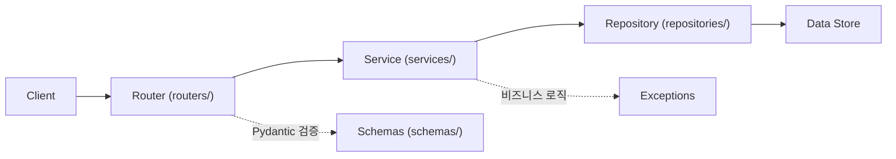
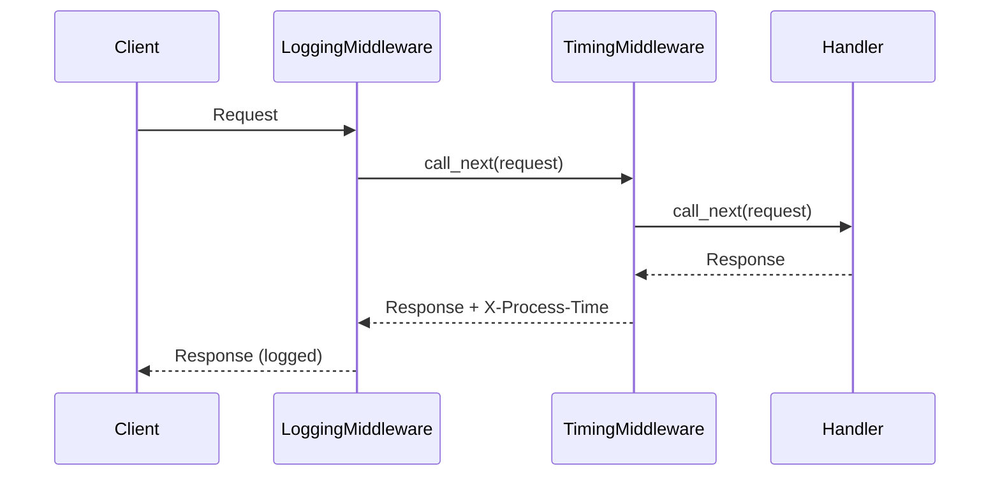
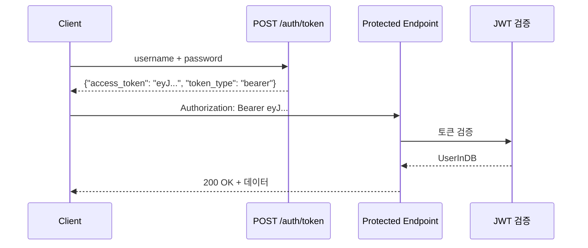

# 1. 들어가며

[FastAPI 입문](../7_21_python_fastapi_intro) 편에서 기본적인 라우팅, 의존성 주입, 자동 문서화를 다뤘다. 이번 글에서는 프로덕션 수준의 FastAPI 애플리케이션을 구성하는 패턴을 다룬다.

- 레이어드 아키텍처 (Router → Service → Repository)
- 환경 설정 관리 (Pydantic BaseSettings)
- 미들웨어와 커스텀 예외 처리
- JWT 인증/인가와 RBAC
- BackgroundTasks와 lifespan 이벤트
- 테스트 전략 (TestClient, httpx.AsyncClient)
- Docker 배포

# 2. 프로젝트 구조와 설정

## 2.1 프로젝트 디렉토리 구조

관심사별로 레이어를 분리하면 코드의 테스트성과 유지보수성이 높아진다.

```
project/
├── app/
│   ├── main.py                # FastAPI 앱 + lifespan + 미들웨어 등록
│   ├── config.py              # BaseSettings 설정 관리
│   ├── dependencies.py        # 공통 의존성
│   ├── routers/               # HTTP 요청/응답 처리
│   │   ├── auth.py
│   │   ├── users.py
│   │   └── items.py
│   ├── services/              # 비즈니스 로직
│   │   ├── user_service.py
│   │   └── item_service.py
│   ├── repositories/          # 데이터 접근
│   │   ├── user_repository.py
│   │   └── item_repository.py
│   ├── schemas/               # Pydantic 요청/응답 모델
│   │   ├── user.py
│   │   ├── item.py
│   │   └── token.py
│   ├── middleware/            # 커스텀 미들웨어
│   ├── exceptions/            # 커스텀 예외 + 핸들러
│   └── auth/                  # JWT 인증 로직
├── tests/
├── Dockerfile
├── docker-compose.yml
├── .env.dev
└── pyproject.toml
```

각 레이어의 역할은 다음과 같다.



| 레이어 | 역할 | 예시 |
|--------|------|------|
| **Router** | HTTP 요청/응답 처리, 스키마 검증 | `@router.get("/users/{id}")` |
| **Service** | 비즈니스 로직, 트랜잭션 관리 | 중복 검사, 패스워드 해싱 |
| **Repository** | 데이터 접근, CRUD 연산 | DB 쿼리, 인메모리 저장소 |
| **Schema** | 요청/응답 데이터 모델 | `UserCreate`, `UserResponse` |

### 라우터 모듈화

`APIRouter`로 도메인별 라우터를 분리하고, `include_router()`로 앱에 등록한다.

```python
# app/routers/users.py
from fastapi import APIRouter

router = APIRouter(prefix="/users", tags=["users"])

@router.get("/{user_id}", response_model=UserResponse)
async def get_user(user_id: int, service: UserService = Depends(get_user_service)):
    return service.get_user(user_id)
```

```python
# app/main.py
from app.routers import auth, users, items

app.include_router(auth.router)
app.include_router(users.router)
app.include_router(items.router)
```

### 의존성 주입으로 레이어 연결

`Depends()`를 사용하여 Service와 Repository를 연결한다.

```python
# app/dependencies.py
from app.repositories.user_repository import user_repository
from app.services.user_service import UserService

def get_user_service() -> UserService:
    return UserService(user_repository)
```

```python
# app/services/user_service.py
class UserService:
    def __init__(self, repository: UserRepository):
        self.repository = repository

    def create_user(self, user_data: UserCreate) -> UserResponse:
        existing = self.repository.get_by_username(user_data.username)
        if existing:
            raise AlreadyExistsError("User", user_data.username)
        user = self.repository.create(
            username=user_data.username,
            email=user_data.email,
            hashed_password=self.hash_password(user_data.password),
            roles=user_data.roles,
        )
        return UserResponse(**user.model_dump())
```

## 2.2 설정 관리 (Pydantic BaseSettings)

`pydantic-settings`의 `BaseSettings`를 사용하면 환경변수 기반으로 설정을 관리할 수 있다.

```python
# app/config.py
from functools import lru_cache
from pydantic_settings import BaseSettings, SettingsConfigDict

class Settings(BaseSettings):
    app_name: str = "FastAPI Advanced"
    secret_key: str = "dev-secret-key-change-in-production"
    access_token_expire_minutes: int = 30
    database_url: str = "sqlite:///./dev.db"
    debug: bool = True

    model_config = SettingsConfigDict(env_file=".env.dev", extra="ignore")

@lru_cache
def get_settings() -> Settings:
    return Settings()
```

**핵심 패턴:**
- `BaseSettings`는 환경변수를 자동으로 읽어 필드에 매핑한다
- `model_config`의 `env_file`로 `.env` 파일을 지정한다
- `@lru_cache`로 설정 인스턴스를 캐싱하여 매번 파일을 읽지 않는다
- `Depends(get_settings)`로 설정을 의존성으로 주입할 수 있다

### 환경별 설정 파일 분리

```ini
# .env.dev
APP_NAME=FastAPI Advanced (Dev)
SECRET_KEY=dev-secret-key-change-in-production
ACCESS_TOKEN_EXPIRE_MINUTES=30
DEBUG=true
```

```ini
# .env.prod
APP_NAME=FastAPI Advanced
SECRET_KEY=replace-with-secure-random-key
ACCESS_TOKEN_EXPIRE_MINUTES=15
DEBUG=false
```

# 3. 미들웨어와 예외 처리

## 3.1 미들웨어

미들웨어는 모든 요청/응답을 가로채어 공통 처리를 수행한다. FastAPI는 Starlette의 미들웨어 시스템을 사용한다.

### 응답 시간 측정 미들웨어 (BaseHTTPMiddleware)

```python
# app/middleware/timing.py
import time
from starlette.middleware.base import BaseHTTPMiddleware

class TimingMiddleware(BaseHTTPMiddleware):
    async def dispatch(self, request, call_next):
        start = time.perf_counter()
        response = await call_next(request)
        process_time = time.perf_counter() - start
        response.headers["X-Process-Time"] = f"{process_time:.4f}"
        return response
```

### 요청/응답 로깅 미들웨어

```python
# app/middleware/logging.py
import logging
import time
from starlette.middleware.base import BaseHTTPMiddleware

logger = logging.getLogger("fastapi.access")

class LoggingMiddleware(BaseHTTPMiddleware):
    async def dispatch(self, request, call_next):
        start = time.perf_counter()
        response = await call_next(request)
        duration = time.perf_counter() - start
        logger.info(
            "%s %s %d %.4fs",
            request.method, request.url.path, response.status_code, duration,
        )
        return response
```

### 미들웨어 등록과 실행 순서

미들웨어는 **등록 역순**으로 실행된다. 마지막에 등록한 미들웨어가 가장 먼저 실행된다.

```python
# app/main.py
app.add_middleware(TimingMiddleware)   # 2번째로 실행
app.add_middleware(LoggingMiddleware)  # 1번째로 실행
```



## 3.2 커스텀 예외 처리

### 커스텀 예외 클래스

도메인 예외를 정의하고, 핸들러를 등록하면 일관된 에러 응답을 제공할 수 있다.

```python
# app/exceptions/handlers.py
from fastapi import Request
from fastapi.responses import JSONResponse

class NotFoundError(Exception):
    def __init__(self, resource: str, id: int | str):
        self.resource = resource
        self.id = id

class AlreadyExistsError(Exception):
    def __init__(self, resource: str, identifier: str):
        self.resource = resource
        self.identifier = identifier

async def not_found_handler(request: Request, exc: NotFoundError) -> JSONResponse:
    return JSONResponse(
        status_code=404,
        content={"detail": f"{exc.resource} with id '{exc.id}' not found", "code": "NOT_FOUND"},
    )

async def already_exists_handler(request: Request, exc: AlreadyExistsError) -> JSONResponse:
    return JSONResponse(
        status_code=409,
        content={"detail": f"{exc.resource} '{exc.identifier}' already exists", "code": "ALREADY_EXISTS"},
    )
```

### 핸들러 등록

```python
# app/main.py
from fastapi.exceptions import RequestValidationError

app.add_exception_handler(NotFoundError, not_found_handler)
app.add_exception_handler(AlreadyExistsError, already_exists_handler)
app.add_exception_handler(RequestValidationError, validation_error_handler)
```

### RequestValidationError 오버라이드

기본 검증 에러 응답을 커스텀 포맷으로 변경할 수 있다.

```python
async def validation_error_handler(request: Request, exc: RequestValidationError) -> JSONResponse:
    return JSONResponse(
        status_code=422,
        content={"detail": exc.errors(), "code": "VALIDATION_ERROR"},
    )
```

모든 에러 응답이 `{"detail": ..., "code": ...}` 형태로 통일된다.

# 4. 인증/인가

## 4.1 OAuth2 + JWT 인증

FastAPI는 OAuth2 표준을 기본 지원한다. `OAuth2PasswordBearer`로 토큰 스키마를 정의하고, `PyJWT`로 JWT를 생성/검증한다.



### JWT 생성/검증

```python
# app/auth/jwt.py
import jwt
from datetime import datetime, timedelta, timezone
from fastapi import Depends, HTTPException, status
from fastapi.security import OAuth2PasswordBearer

ALGORITHM = "HS256"
oauth2_scheme = OAuth2PasswordBearer(tokenUrl="auth/token")

def create_access_token(data: dict, settings: Settings, expires_delta: timedelta | None = None) -> str:
    to_encode = data.copy()
    expire = datetime.now(timezone.utc) + (expires_delta or timedelta(minutes=settings.access_token_expire_minutes))
    to_encode.update({"exp": expire})
    return jwt.encode(to_encode, settings.secret_key, algorithm=ALGORITHM)
```

### 현재 사용자 의존성

`Depends(get_current_user)`로 인증된 사용자를 자동으로 주입한다.

```python
def get_current_user(
    token: str = Depends(oauth2_scheme),
    settings: Settings = Depends(get_settings),
) -> UserInDB:
    credentials_exception = HTTPException(
        status_code=status.HTTP_401_UNAUTHORIZED,
        detail="Could not validate credentials",
        headers={"WWW-Authenticate": "Bearer"},
    )
    try:
        payload = jwt.decode(token, settings.secret_key, algorithms=[ALGORITHM])
        username: str | None = payload.get("sub")
        if username is None:
            raise credentials_exception
    except jwt.InvalidTokenError:
        raise credentials_exception

    user = user_repository.get_by_username(username)
    if user is None:
        raise credentials_exception
    return user
```

### 토큰 발급 엔드포인트

```python
# app/routers/auth.py
from fastapi.security import OAuth2PasswordRequestForm

@router.post("/token", response_model=Token)
async def login(
    form_data: OAuth2PasswordRequestForm = Depends(),
    service: UserService = Depends(get_user_service),
    settings: Settings = Depends(get_settings),
):
    user = service.authenticate(form_data.username, form_data.password)
    if not user:
        raise HTTPException(status_code=401, detail="Incorrect username or password")
    access_token = create_access_token(data={"sub": user.username}, settings=settings)
    return Token(access_token=access_token)
```

## 4.2 역할 기반 접근 제어 (RBAC)

의존성 팩토리 패턴으로 역할별 접근 제어를 구현한다.

```python
def require_role(role: str):
    def role_checker(current_user: UserInDB = Depends(get_current_user)) -> UserInDB:
        if role not in current_user.roles:
            raise HTTPException(status_code=403, detail=f"Role '{role}' required")
        return current_user
    return role_checker
```

사용 예시:

```python
@router.delete("/{user_id}", status_code=204)
async def delete_user(
    user_id: int,
    _current_user: UserInDB = Depends(require_role("admin")),  # admin만 가능
    service: UserService = Depends(get_user_service),
):
    service.delete_user(user_id)
```

## 4.3 Security() vs Depends()

`Security()`는 `Depends()`와 동일하게 동작하지만, OpenAPI 문서에 보안 스키마를 자동 등록한다.

```python
from fastapi import Security

@router.get("/me-security", response_model=UserResponse)
async def get_me_with_security(current_user: UserInDB = Security(get_current_user)):
    return UserResponse(**current_user.model_dump())
```

실질적으로 `Depends(get_current_user)`를 사용해도 `OAuth2PasswordBearer`가 이미 보안 스키마를 등록하므로 동작 차이는 없다. `Security()`는 의도를 명시적으로 표현할 때 사용한다.

# 5. 비동기 작업과 이벤트

## 5.1 BackgroundTasks

응답을 먼저 반환하고, 백그라운드에서 추가 작업을 실행한다.

```python
import logging

logger = logging.getLogger(__name__)

def send_welcome_email(email: str):
    logger.info("Sending welcome email to %s (simulated)", email)

@router.post("/", response_model=UserResponse, status_code=201)
async def create_user(
    user: UserCreate,
    background_tasks: BackgroundTasks,
    service: UserService = Depends(get_user_service),
):
    new_user = service.create_user(user)
    background_tasks.add_task(send_welcome_email, new_user.email)  # 응답 후 실행
    return new_user
```

**사용 사례:** 이메일 발송, 로그 기록, 알림 전송 등 응답에 영향을 주지 않는 작업.

> **주의:** 무거운 작업(대용량 데이터 처리, 외부 API 호출 등)은 Celery, RQ, Dramatiq 등 별도 태스크 큐를 사용해야 한다.

## 5.2 Lifespan 이벤트

`lifespan` 컨텍스트 매니저로 앱의 시작/종료 시 리소스를 관리한다.

```python
# app/main.py
from contextlib import asynccontextmanager

@asynccontextmanager
async def lifespan(app: FastAPI):
    # startup: 앱 시작 시 실행
    settings = get_settings()
    logger.info("Starting %s...", settings.app_name)
    app.state.settings = settings  # 공유 리소스 저장
    yield
    # shutdown: 앱 종료 시 실행
    logger.info("Shutting down %s...", settings.app_name)

app = FastAPI(title="FastAPI Advanced", lifespan=lifespan)
```

**실무 활용 예시:**
- **startup:** DB 커넥션 풀 초기화, 캐시 워밍업, ML 모델 로드
- **shutdown:** 커넥션 풀 종료, 임시 파일 정리
- `app.state`에 저장한 리소스는 모든 요청에서 `request.app.state`로 접근할 수 있다

# 6. 테스트

## 6.1 TestClient (동기 테스트)

`TestClient`는 `requests` 호환 API로 동기적으로 테스트한다.

```python
# tests/conftest.py
import pytest
from fastapi.testclient import TestClient
from app.main import app

@pytest.fixture
def client():
    with TestClient(app) as c:
        yield c

@pytest.fixture
def auth_headers(client):
    # 사용자 생성 후 토큰 발급
    client.post("/users/", json={"username": "testuser", "email": "test@example.com", "password": "testpass123"})
    resp = client.post("/auth/token", data={"username": "testuser", "password": "testpass123"})
    token = resp.json()["access_token"]
    return {"Authorization": f"Bearer {token}"}
```

```python
# tests/test_users.py
def test_create_user(client):
    response = client.post(
        "/users/",
        json={"username": "newuser", "email": "new@example.com", "password": "pass123"},
    )
    assert response.status_code == 201
    data = response.json()
    assert data["username"] == "newuser"
    assert "password" not in data  # 응답에 비밀번호 미포함

def test_get_user_not_found(client):
    response = client.get("/users/999")
    assert response.status_code == 404
    assert response.json()["code"] == "NOT_FOUND"
```

## 6.2 의존성 오버라이드

`app.dependency_overrides`로 테스트 시 의존성을 교체할 수 있다.

```python
from app.config import get_settings, Settings

@pytest.fixture
def client_with_custom_settings():
    def override_settings():
        return Settings(app_name="Test App", secret_key="test-secret")

    app.dependency_overrides[get_settings] = override_settings
    with TestClient(app) as c:
        yield c
    app.dependency_overrides.clear()
```

## 6.3 httpx.AsyncClient (비동기 테스트)

`httpx.ASGITransport`를 사용하면 비동기 엔드포인트를 네이티브하게 테스트할 수 있다.

```python
# tests/test_middleware.py
import httpx
import pytest
from app.main import app

@pytest.mark.asyncio
async def test_health_async():
    transport = httpx.ASGITransport(app=app)
    async with httpx.AsyncClient(transport=transport, base_url="http://test") as ac:
        response = await ac.get("/health")
    assert response.status_code == 200
    assert response.json() == {"status": "ok"}
    assert "x-process-time" in response.headers
```

> **참고:** httpx 0.28+에서는 `app` 파라미터가 제거되었다. `ASGITransport`를 통해 전달해야 한다.

## 6.4 인증/인가 테스트

```python
# tests/test_auth.py
def test_login_success(client, test_user):
    response = client.post("/auth/token", data={"username": "testuser", "password": "testpass123"})
    assert response.status_code == 200
    assert "access_token" in response.json()

def test_protected_endpoint_without_token(client):
    response = client.get("/users/me")
    assert response.status_code == 401

def test_rbac_admin_only(client, test_user, auth_headers):
    # 일반 사용자가 삭제 시도 → 403
    response = client.delete(f"/users/{test_user['id']}", headers=auth_headers)
    assert response.status_code == 403

def test_rbac_admin_access(client, test_user, admin_headers):
    # admin 사용자가 삭제 시도 → 204
    response = client.delete(f"/users/{test_user['id']}", headers=admin_headers)
    assert response.status_code == 204
```

# 7. Docker + docker-compose 배포

## 7.1 Multi-stage Dockerfile

빌드 단계와 실행 단계를 분리하여 이미지 크기를 최소화한다.

```dockerfile
FROM python:3.12-slim AS builder
WORKDIR /app
COPY requirements.txt .
RUN pip install --no-cache-dir -r requirements.txt

FROM python:3.12-slim
COPY --from=builder /usr/local/lib/python3.12/site-packages /usr/local/lib/python3.12/site-packages
COPY --from=builder /usr/local/bin/uvicorn /usr/local/bin/uvicorn
COPY ./app /app/app
EXPOSE 8000
CMD ["uvicorn", "app.main:app", "--host", "0.0.0.0", "--port", "8000"]
```

## 7.2 docker-compose

```yaml
services:
  api:
    build: .
    ports:
      - "8000:8000"
    depends_on:
      - db
      - redis
    environment:
      - DATABASE_URL=postgresql://fastapi:fastapi@db:5432/fastapi
      - SECRET_KEY=replace-with-secure-random-key

  db:
    image: postgres:16-alpine
    environment:
      POSTGRES_USER: fastapi
      POSTGRES_PASSWORD: fastapi
      POSTGRES_DB: fastapi

  redis:
    image: redis:7-alpine
```

## 7.3 프로덕션 실행

개발 환경에서는 `uvicorn --reload`를 사용하지만, 프로덕션에서는 gunicorn + uvicorn worker 조합을 권장한다.

```bash
# 개발
uvicorn app.main:app --reload

# 프로덕션 (CPU 코어 수에 맞게 worker 설정)
gunicorn app.main:app -w 4 -k uvicorn.workers.UvicornWorker --bind 0.0.0.0:8000
```

### 헬스체크 엔드포인트

```python
@app.get("/health")
async def health_check():
    return {"status": "ok"}
```

# 8. 마무리

이 글에서 다룬 패턴을 정리하면 다음과 같다.

| 패턴 | 핵심 포인트 |
|------|------------|
| 레이어드 아키텍처 | Router → Service → Repository 분리, `Depends()`로 연결 |
| 설정 관리 | `BaseSettings` + `@lru_cache` + `.env` 파일 |
| 미들웨어 | `BaseHTTPMiddleware`, 등록 역순 실행 |
| 예외 처리 | 커스텀 예외 + 핸들러, 일관된 에러 포맷 |
| 인증/인가 | `OAuth2PasswordBearer` + JWT + RBAC |
| BackgroundTasks | 응답 후 비동기 작업, 무거운 작업은 태스크 큐 |
| Lifespan | startup/shutdown 리소스 관리 |
| 테스트 | `TestClient`, `httpx.ASGITransport`, 의존성 오버라이드 |
| Docker | multi-stage 빌드, gunicorn + uvicorn worker |

## 샘플 코드

전체 샘플 코드는 GitHub에서 확인할 수 있다.
- [tutorials-python/python/fastapi/advanced/](https://github.com/kenshin579/tutorials-python/tree/master/python/fastapi/advanced)

## 참고 자료

- [FastAPI Advanced 공식 문서](https://fastapi.tiangolo.com/advanced/)
- [FastAPI Best Practices](https://github.com/zhanymkanov/fastapi-best-practices)
- [Pydantic Settings](https://docs.pydantic.dev/latest/concepts/pydantic_settings/)
- [PyJWT 공식 문서](https://pyjwt.readthedocs.io/)
