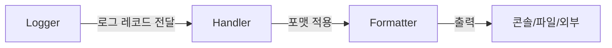
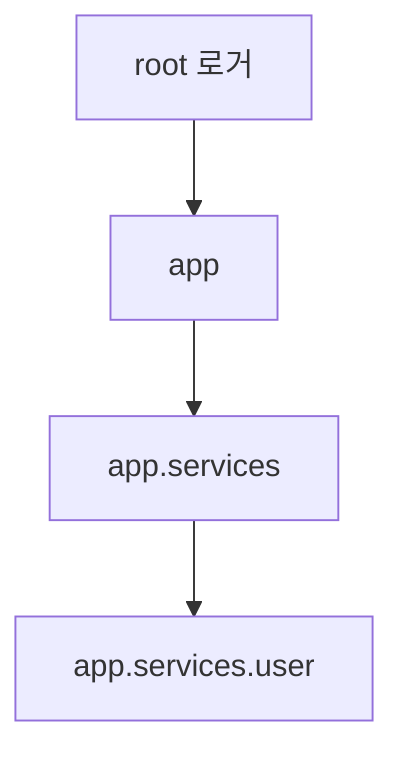
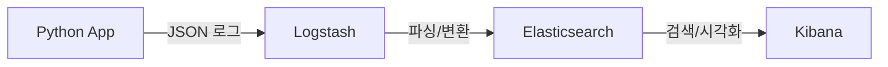

# 1. 들어가며

Python 프로젝트에서 `print()` 대신 로깅을 사용해야 하는 이유는 명확하다.

- **레벨 제어**: DEBUG, INFO, WARNING 등 레벨로 출력을 제어할 수 있다
- **출력 대상 분리**: 콘솔, 파일, 외부 시스템 등 다양한 곳으로 로그를 보낼 수 있다
- **포맷 통일**: 시간, 모듈명, 레벨 등 일관된 형식으로 로그를 남길 수 있다
- **프로덕션 대응**: 운영 환경에서 print 출력은 관리할 수 없지만, 로깅은 체계적으로 관리된다

이 글에서는 Python 표준 `logging` 모듈의 기본부터 서드파티 라이브러리(structlog, loguru)까지 비교하고, FastAPI 실전 패턴까지 다룬다.

# 2. logging 표준 라이브러리

## 2.1 logging 모듈 기본 (Logger, Handler, Formatter)

Python의 `logging` 모듈은 세 가지 핵심 컴포넌트로 구성된다.



- **Logger**: 로그 메시지를 생성하는 진입점
- **Handler**: 로그를 어디에 출력할지 결정 (콘솔, 파일 등)
- **Formatter**: 로그의 출력 형식을 정의

### getLogger와 basicConfig

가장 간단한 방법은 `basicConfig()`를 사용하는 것이다.

```python
import logging

logging.basicConfig(
    level=logging.DEBUG,
    format="%(asctime)s - %(name)s - %(levelname)s - %(message)s",
)
logger = logging.getLogger(__name__)
logger.info("basicConfig로 설정한 로거입니다")
```

`getLogger(__name__)`은 현재 모듈 이름으로 로거를 생성한다. 이 패턴을 사용하면 로그 출처를 쉽게 파악할 수 있다.

### 수동 설정

더 세밀한 제어가 필요하면 핸들러와 포맷터를 직접 구성한다.

```python
logger = logging.getLogger("my_app")
logger.setLevel(logging.DEBUG)

# 핸들러 + 포맷터 설정
handler = logging.StreamHandler()
formatter = logging.Formatter(
    "%(asctime)s - %(name)s - %(levelname)s - %(message)s"
)
handler.setFormatter(formatter)
logger.addHandler(handler)

logger.info("수동 설정 로거입니다")
```

### 로거 계층 구조와 전파(propagation)

로거는 점(`.`) 표기법으로 계층 구조를 형성한다.



```python
root_logger = logging.getLogger()          # root
app_logger = logging.getLogger("app")       # app
service_logger = logging.getLogger("app.services")  # app.services
```

하위 로거에서 발생한 로그는 기본적으로 상위 로거로 **전파(propagate)**된다. `propagate=False`로 설정하면 전파를 차단할 수 있다.

```python
service_logger.propagate = False  # 상위 로거로 전파하지 않음
```

## 2.2 로그 레벨 (DEBUG, INFO, WARNING, ERROR, CRITICAL)

| 레벨 | 숫자 값 | 용도 |
|------|---------|------|
| DEBUG | 10 | 개발 시 상세 디버깅 정보 |
| INFO | 20 | 정상 동작 확인 |
| WARNING | 30 | 잠재적 문제 (기본 레벨) |
| ERROR | 40 | 오류 발생, 기능 실패 |
| CRITICAL | 50 | 심각한 오류, 프로그램 종료 가능 |

```python
logger.debug("변수 x=42, 리스트 길이=100")
logger.info("서버가 포트 8000에서 시작되었습니다")
logger.warning("디스크 사용률이 85%를 초과했습니다")
logger.error("데이터베이스 연결에 실패했습니다")
logger.critical("메모리 부족으로 시스템이 중단됩니다")
```

### 로거 레벨 vs 핸들러 레벨

로그 메시지는 **로거 레벨**과 **핸들러 레벨** 두 단계 필터링을 거친다.

```python
logger.setLevel(logging.DEBUG)  # 로거: DEBUG 이상 허용

# 핸들러 1: WARNING 이상만 출력
handler_warning = logging.StreamHandler()
handler_warning.setLevel(logging.WARNING)

# 핸들러 2: DEBUG 이상 모두 출력
handler_debug = logging.StreamHandler()
handler_debug.setLevel(logging.DEBUG)
```

### 환경별 레벨 설정

```python
import os

log_level = os.environ.get("LOG_LEVEL", "INFO").upper()
logging.basicConfig(level=getattr(logging, log_level, logging.INFO))
```

실행 시 환경 변수로 레벨을 변경할 수 있다.

```bash
LOG_LEVEL=DEBUG python app.py
```

## 2.3 핸들러 종류

### StreamHandler - 콘솔 출력

```python
import sys

# stdout으로 출력
stdout_handler = logging.StreamHandler(sys.stdout)

# stderr로 출력 (기본값)
stderr_handler = logging.StreamHandler(sys.stderr)
```

### FileHandler - 파일 출력

```python
file_handler = logging.FileHandler("app.log", encoding="utf-8")
```

### RotatingFileHandler - 파일 크기 기반 로테이션

파일 크기가 `maxBytes`를 초과하면 새 파일로 교체한다.

```python
from logging.handlers import RotatingFileHandler

handler = RotatingFileHandler(
    "app.log",
    maxBytes=10 * 1024 * 1024,  # 10MB
    backupCount=5,               # 최대 5개 백업 파일
    encoding="utf-8",
)
```

### TimedRotatingFileHandler - 시간 기반 로테이션

일정 시간 간격으로 파일을 교체한다.

```python
from logging.handlers import TimedRotatingFileHandler

handler = TimedRotatingFileHandler(
    "app.log",
    when="midnight",   # 매일 자정 로테이션
    interval=1,
    backupCount=30,    # 30일 보관
    encoding="utf-8",
)
```

`when` 옵션: `S`(초), `M`(분), `H`(시간), `D`(일), `midnight`(자정), `W0`-`W6`(요일)

### 복수 핸들러 등록

실무에서는 콘솔과 파일에 동시에 출력하되, 서로 다른 레벨을 적용하는 패턴이 일반적이다.

```python
logger = logging.getLogger("app")
logger.setLevel(logging.DEBUG)

# 콘솔: DEBUG 이상 모두 출력
console_handler = logging.StreamHandler()
console_handler.setLevel(logging.DEBUG)

# 파일: WARNING 이상만 기록
file_handler = logging.FileHandler("errors.log", encoding="utf-8")
file_handler.setLevel(logging.WARNING)

logger.addHandler(console_handler)
logger.addHandler(file_handler)
```

## 2.4 포맷터 커스터마이징

### 주요 포맷 속성

| 속성 | 설명 | 예시 |
|------|------|------|
| `%(asctime)s` | 시간 | 2026-03-06 14:30:00,123 |
| `%(name)s` | 로거 이름 | app.services |
| `%(levelname)s` | 로그 레벨 | INFO |
| `%(message)s` | 로그 메시지 | 서버 시작 |
| `%(filename)s` | 파일 이름 | main.py |
| `%(funcName)s` | 함수 이름 | process_request |
| `%(lineno)d` | 줄 번호 | 42 |
| `%(process)d` | 프로세스 ID | 12345 |
| `%(thread)d` | 스레드 ID | 67890 |

```python
# 실무에서 자주 사용하는 포맷
formatter = logging.Formatter(
    "%(asctime)s [%(name)s] %(levelname)-8s %(filename)s:%(lineno)d - %(message)s",
    datefmt="%Y-%m-%d %H:%M:%S",
)
```

### colorlog - 컬러 출력

터미널에서 레벨별 색상을 적용하면 가독성이 크게 향상된다.

```python
import colorlog

handler = logging.StreamHandler()
handler.setFormatter(
    colorlog.ColoredFormatter(
        "%(log_color)s%(levelname)-8s%(reset)s %(blue)s%(name)s%(reset)s - %(message)s",
        log_colors={
            "DEBUG": "cyan",
            "INFO": "green",
            "WARNING": "yellow",
            "ERROR": "red",
            "CRITICAL": "red,bg_white",
        },
    )
)
```

## 2.5 logging.config (dictConfig, fileConfig)

### dictConfig - 딕셔너리 기반 설정

대규모 프로젝트에서는 `dictConfig()`로 로깅 전체를 한 곳에서 설정하는 것이 좋다.

```python
import logging.config

config = {
    "version": 1,
    "disable_existing_loggers": False,
    "formatters": {
        "detailed": {
            "format": "%(asctime)s [%(name)s] %(levelname)-8s %(filename)s:%(lineno)d - %(message)s",
            "datefmt": "%Y-%m-%d %H:%M:%S",
        },
    },
    "handlers": {
        "console": {
            "class": "logging.StreamHandler",
            "level": "DEBUG",
            "formatter": "detailed",
            "stream": "ext://sys.stdout",
        },
        "file": {
            "class": "logging.FileHandler",
            "level": "WARNING",
            "formatter": "detailed",
            "filename": "app.log",
            "encoding": "utf-8",
        },
    },
    "loggers": {
        "app": {
            "level": "DEBUG",
            "handlers": ["console", "file"],
            "propagate": False,
        },
    },
    "root": {
        "level": "INFO",
        "handlers": ["console"],
    },
}

logging.config.dictConfig(config)
```

### YAML 파일에서 설정 로드

설정을 YAML 파일로 분리하면 코드와 설정을 분리할 수 있다.

```yaml
# logging_config.yaml
version: 1
disable_existing_loggers: false

formatters:
  detailed:
    format: "%(asctime)s [%(name)s] %(levelname)-8s - %(message)s"
    datefmt: "%Y-%m-%d %H:%M:%S"

handlers:
  console:
    class: logging.StreamHandler
    level: DEBUG
    formatter: detailed
    stream: ext://sys.stdout

loggers:
  app:
    level: DEBUG
    handlers: [console]
    propagate: false

root:
  level: WARNING
  handlers: [console]
```

```python
import yaml
import logging.config

with open("logging_config.yaml") as f:
    config = yaml.safe_load(f)

logging.config.dictConfig(config)
```

# 3. 서드파티 로깅 라이브러리

## 3.1 structlog 소개 (구조화된 로깅)

[structlog](https://www.structlog.org/)는 **구조화된 로깅(Structured Logging)**을 지원하는 라이브러리다. 기존 로깅이 문자열 기반이라면, structlog는 key=value 쌍으로 데이터를 기록한다.

### 기본 사용법

```python
import structlog

logger = structlog.get_logger()

logger.info("사용자 로그인", user_id=123, ip="192.168.1.1")
logger.warning("느린 쿼리 감지", query_time_ms=1500, table="users")
logger.error("결제 실패", order_id="ORD-001", reason="잔액 부족")
```

출력:
```
2026-03-06 14:30:00 [info     ] 사용자 로그인     ip=192.168.1.1 user_id=123
2026-03-06 14:30:00 [warning  ] 느린 쿼리 감지    query_time_ms=1500 table=users
```

### 프로세서 파이프라인

structlog의 핵심은 **프로세서 파이프라인**이다. 로그가 출력되기 전에 여러 프로세서를 거치며 데이터가 가공된다.


```python
structlog.configure(
    processors=[
        structlog.stdlib.add_log_level,
        structlog.processors.TimeStamper(fmt="iso"),
        structlog.processors.format_exc_info,
        structlog.processors.JSONRenderer(sort_keys=True),
    ],
    wrapper_class=structlog.stdlib.BoundLogger,
    context_class=dict,
    logger_factory=structlog.PrintLoggerFactory(),
)
```

### 바인딩 - 컨텍스트 추가

`bind()`로 로거에 컨텍스트 정보를 추가하면, 이후 모든 로그에 자동으로 포함된다.

```python
logger = structlog.get_logger()

# 사용자 컨텍스트 바인딩
user_logger = logger.bind(user_id=123, username="kenshin")
user_logger.info("프로필 조회")       # user_id=123, username=kenshin 자동 포함
user_logger.info("설정 변경", setting="theme")

# 추가 바인딩
order_logger = user_logger.bind(order_id="ORD-456")
order_logger.info("주문 생성")        # user_id + order_id 모두 포함

# 컨텍스트 제거
clean_logger = order_logger.unbind("order_id")
```

### stdlib 통합

기존 `logging` 모듈과 함께 사용할 수 있다.

```python
import logging

structlog.configure(
    processors=[
        structlog.stdlib.filter_by_level,
        structlog.stdlib.add_log_level,
        structlog.processors.TimeStamper(fmt="iso"),
        structlog.stdlib.ProcessorFormatter.wrap_for_formatter,
    ],
    logger_factory=structlog.stdlib.LoggerFactory(),
)

formatter = structlog.stdlib.ProcessorFormatter(
    processor=structlog.dev.ConsoleRenderer(),
)

handler = logging.StreamHandler()
handler.setFormatter(formatter)

root_logger = logging.getLogger()
root_logger.addHandler(handler)
root_logger.setLevel(logging.DEBUG)
```

## 3.2 loguru 소개 (간편한 로깅)

[loguru](https://github.com/Delgan/loguru)는 **설정 없이 즉시 사용**할 수 있는 로깅 라이브러리다.

### 기본 사용법

```python
from loguru import logger

logger.info("설정 없이 바로 사용 가능!")
logger.debug("컬러, 포맷, 시간 모두 기본 제공")
```

출력:
```
2026-03-06 14:30:00.123 | INFO     | __main__:<module>:3 - 설정 없이 바로 사용 가능!
```

### 파일 핸들러 - 한 줄로 설정

```python
# 크기 기반 로테이션 + 압축 + 보관 기간
logger.add(
    "app.log",
    rotation="10 MB",      # 10MB마다 로테이션
    retention="7 days",    # 7일 보관
    compression="zip",     # 오래된 파일 압축
    encoding="utf-8",
)

# 시간 기반 로테이션
logger.add("daily.log", rotation="00:00")  # 매일 자정
```

### @logger.catch - 예외 자동 로깅

```python
@logger.catch
def divide(a, b):
    return a / b

divide(10, 0)  # 예외 발생 → 자동으로 상세 트레이스백 로깅 (프로그램 중단 없음)
```

### logger.opt - 고급 옵션

```python
# 지연 평가: 로그 레벨에 따라 연산 여부 결정
logger.opt(lazy=True).debug("결과: {result}", result=expensive_computation)

# JSON 직렬화 출력
logger.remove()
logger.add(sys.stdout, serialize=True)
logger.info("JSON 로그", user_id=123)
```

### InterceptHandler - 기존 logging 모듈과 통합

표준 `logging` 모듈의 모든 로그를 loguru로 리다이렉트할 수 있다.

```python
import logging

class InterceptHandler(logging.Handler):
    def emit(self, record: logging.LogRecord) -> None:
        try:
            level = logger.level(record.levelname).name
        except ValueError:
            level = record.levelno

        frame, depth = logging.currentframe(), 2
        while frame.f_code.co_filename == logging.__file__:
            frame = frame.f_back
            depth += 1

        logger.opt(depth=depth, exception=record.exc_info).log(
            level, record.getMessage()
        )

# 모든 표준 로그를 loguru로 통합
logging.basicConfig(handlers=[InterceptHandler()], level=0, force=True)
```

## 3.3 logging vs structlog vs loguru 비교

| 항목 | logging | structlog | loguru |
|------|---------|-----------|--------|
| **설정 복잡도** | 높음 | 중간 | 낮음 |
| **구조화 로깅** | 수동 (extra 활용) | 네이티브 지원 | 부분 지원 (serialize) |
| **성능** | 기준 | 유사 | 유사 |
| **표준 라이브러리** | O | X | X |
| **컬러 출력** | colorlog 필요 | 기본 제공 | 기본 제공 |
| **파일 로테이션** | 핸들러 직접 설정 | logging에 위임 | 한 줄 설정 |
| **예외 로깅** | exc_info 수동 | format_exc_info | @logger.catch |
| **컨텍스트 바인딩** | LoggerAdapter | bind/unbind | bind |

### 프로젝트 규모별 선택 가이드

- **소규모 프로젝트 / 스크립트**: **loguru** - 설정 없이 빠르게 시작
- **중규모 프로젝트**: **loguru** 또는 **structlog** - 구조화된 로깅이 필요하면 structlog
- **대규모 / MSA**: **structlog** - 프로세서 파이프라인, JSON 로그, 표준 logging 통합
- **레거시 프로젝트**: **logging** - 추가 의존성 없이 표준 라이브러리 활용

# 4. 실전 패턴

## 4.1 FastAPI 미들웨어 로깅

FastAPI에서 모든 요청/응답을 자동으로 로깅하는 미들웨어 패턴이다.

```python
import time
import uuid
import logging

from fastapi import FastAPI, Request
from starlette.middleware.base import BaseHTTPMiddleware

app = FastAPI()
logger = logging.getLogger("fastapi_app")

class RequestLoggingMiddleware(BaseHTTPMiddleware):
    async def dispatch(self, request: Request, call_next):
        request_id = str(uuid.uuid4())[:8]
        start_time = time.time()

        logger.info("[%s] %s %s", request_id, request.method, request.url.path)

        response = await call_next(request)

        duration_ms = (time.time() - start_time) * 1000
        logger.info(
            "[%s] %s %s → %d (%.1fms)",
            request_id, request.method, request.url.path,
            response.status_code, duration_ms,
        )

        response.headers["X-Request-ID"] = request_id
        return response

app.add_middleware(RequestLoggingMiddleware)
```

## 4.2 JSON 로그 포맷

로그 수집 시스템(ELK, Datadog 등)과 연동하려면 JSON 형식이 필수다.

```python
from pythonjsonlogger import json as jsonlogger

formatter = jsonlogger.JsonFormatter(
    fmt="%(asctime)s %(name)s %(levelname)s %(message)s",
    datefmt="%Y-%m-%dT%H:%M:%S",
)

handler = logging.StreamHandler()
handler.setFormatter(formatter)
```

## 4.3 상관관계 ID (Correlation ID)

MSA 환경에서 하나의 요청이 여러 서비스를 거칠 때, 상관관계 ID로 로그를 추적할 수 있다.

```python
from contextvars import ContextVar

correlation_id_var: ContextVar[str] = ContextVar("correlation_id", default="")

class CorrelationIdFilter(logging.Filter):
    def filter(self, record):
        record.correlation_id = correlation_id_var.get("")
        return True
```

요청 시작 시 고유 ID를 설정하면, 같은 요청의 모든 로그에 동일한 ID가 포함된다.

```python
import uuid

# 요청 시작 시
correlation_id_var.set(str(uuid.uuid4()))

# 이후 모든 로그에 correlation_id가 자동 포함
logger.info("요청 수신", extra={"endpoint": "/api/users"})
logger.info("DB 쿼리 실행", extra={"table": "users"})
logger.info("응답 전송", extra={"status_code": 200})
```

## 4.4 ELK 연동 개요



- **Python App**: JSON 포맷으로 로그 출력 (파일 또는 stdout)
- **Logstash**: 로그 수집, 파싱, 변환
- **Elasticsearch**: 로그 저장 및 인덱싱
- **Kibana**: 대시보드, 검색, 시각화

# 5. 마무리

Python 로깅의 핵심을 정리하면 다음과 같다.

- **logging 표준 라이브러리**: Logger-Handler-Formatter 3단 구조, dictConfig로 설정 관리
- **structlog**: 구조화된 로깅, 프로세서 파이프라인, 컨텍스트 바인딩
- **loguru**: 설정 없이 즉시 사용, @logger.catch, 한 줄 파일 핸들러
- **실전**: JSON 포맷, 상관관계 ID, 미들웨어 로깅

프로젝트 규모와 요구사항에 맞는 라이브러리를 선택하되, 어떤 것을 쓰든 `print()` 대신 로깅을 사용하는 것이 중요하다.

## 샘플 코드

- [tutorials-python/python/logging/](https://github.com/kenshin579/tutorials-python/tree/master/python/logging)

## 참고

- [Python logging 공식 문서](https://docs.python.org/3/library/logging.html)
- [structlog 공식 문서](https://www.structlog.org/)
- [loguru GitHub](https://github.com/Delgan/loguru)
