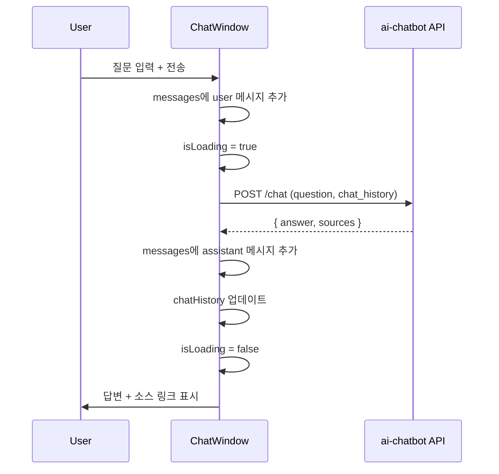

# 블로그 ChatWindow 통합 (blog-v2) - Implementation

## 1. 프로젝트 구조

```
components/chat/
├── ChatButton.tsx        # 우하단 플로팅 채팅 버튼
├── ChatWindow.tsx        # 채팅 창 컨테이너 (열림/닫힘)
├── MessageList.tsx       # 메시지 목록 (질문/답변 표시)
├── ChatInput.tsx         # 입력 필드 + 전송 버튼
└── SourceLinks.tsx       # 참조 블로그 글 링크 목록

lib/
└── chatApi.ts            # RAG API 호출 클라이언트
```

---

## 2. API 클라이언트

### 2.1 `lib/chatApi.ts`

```typescript
const CHAT_API_URL = process.env.NEXT_PUBLIC_CHAT_API_URL || "https://ai-chatbot.advenoh.pe.kr";
const BLOG_ID = "blog-v2";

interface SourceDocument {
  title: string;
  url: string;
  snippet?: string;
}

interface ChatResponse {
  answer: string;
  sources: SourceDocument[];
}

export async function sendChatMessage(
  question: string,
  chatHistory: [string, string][]
): Promise<ChatResponse> {
  const res = await fetch(`${CHAT_API_URL}/chat`, {
    method: "POST",
    headers: { "Content-Type": "application/json" },
    body: JSON.stringify({
      blog_id: BLOG_ID,
      question,
      chat_history: chatHistory,
    }),
  });

  if (!res.ok) {
    throw new Error(`Chat API error: ${res.status}`);
  }

  return res.json();
}
```

### 2.2 환경 변수

```bash
# .env.local
NEXT_PUBLIC_CHAT_API_URL=https://ai-chatbot.advenoh.pe.kr
```

---

## 3. 컴포넌트 구현

### 3.1 ChatButton (플로팅 버튼)

- 화면 우하단 `fixed` 위치 (`bottom-6 right-6`)
- `lucide-react`의 `MessageCircle` 아이콘 사용
- 클릭 시 ChatWindow 토글
- 채팅 창 열린 상태에서는 `X` 아이콘으로 변경
- shadcn/ui `Button` 컴포넌트 사용 (`size="icon"`, `rounded-full`)
- z-index: 50 (다른 요소 위에 표시)

### 3.2 ChatWindow (채팅 창)

- ChatButton 상위에 위치하는 카드 형태 오버레이
- 크기: `w-[400px] h-[500px]` (데스크톱), 모바일에서는 전체 화면 (`fixed inset-0`)
- shadcn/ui `Card` 컴포넌트 사용
- 구성: 헤더(타이틀 + 닫기) → MessageList → ChatInput
- 애니메이션: `framer-motion` 사용 (slide-up + fade)
- 상태 관리: `useState`로 messages, isLoading, chatHistory 관리
- z-index: 50

### 3.3 MessageList (메시지 목록)

- shadcn/ui `ScrollArea` 사용 (자동 스크롤)
- 사용자 메시지: 우측 정렬, 파란색 배경
- 봇 메시지: 좌측 정렬, 회색 배경 (다크모드 대응)
- 봇 답변 하단에 `SourceLinks` 컴포넌트 렌더링
- 로딩 중: 타이핑 인디케이터 (... 애니메이션)
- 초기 상태: 환영 메시지 표시
- 새 메시지 추가 시 자동 스크롤 (하단으로)

### 3.4 ChatInput (입력 필드)

- shadcn/ui `Input` + `Button` 사용
- Enter 키로 전송 지원
- 로딩 중 입력 비활성화 + 전송 버튼 disabled
- `lucide-react`의 `Send` 아이콘
- placeholder: "블로그에 대해 궁금한 것을 물어보세요..."

### 3.5 SourceLinks (출처 링크)

- 봇 답변 하단에 참조 블로그 글 링크 목록 표시
- shadcn/ui `Badge` 사용하여 컴팩트하게 표시
- 클릭 시 해당 블로그 글로 이동 (`target="_blank"`)
- 소스가 없으면 렌더링하지 않음

---

## 4. 레이아웃 통합

### 4.1 `app/layout.tsx`에 ChatButton 추가

```tsx
// app/layout.tsx 하단에 추가
<ChatButton />
```

- 모든 페이지에서 플로팅 버튼 노출
- `"use client"` 컴포넌트이므로 layout에서 직접 import

---

## 5. 상태 관리

### 5.1 메시지 타입

```typescript
interface Message {
  id: string;
  role: "user" | "assistant";
  content: string;
  sources?: SourceDocument[];
  timestamp: Date;
}
```

### 5.2 상태 흐름



---

## 6. 스타일링

- 블로그 기존 디자인 시스템 (shadcn/ui + Tailwind CSS) 일관성 유지
- 다크/라이트 모드: `next-themes`와 연동 (기존 블로그 테마 따름)
- 반응형: `md:` 브레이크포인트 기준으로 데스크톱/모바일 분기
- 폰트: 기존 블로그와 동일 (Inter, JetBrains Mono)

---

## 7. API 서버 CORS 설정

`ai-chatbot.advenoh.pe.kr` 서버에 blog-v2 도메인 CORS 허용 추가:

```python
# ai-chatbot.advenoh.pe.kr/app/main.py
app.add_middleware(
    CORSMiddleware,
    allow_origins=[
        "https://blog-v2.advenoh.pe.kr",
        "http://localhost:3000",  # 개발 환경
    ],
    allow_methods=["POST"],
    allow_headers=["Content-Type"],
)
```

---

## 8. 에러 처리

- API 호출 실패 시: 메시지 목록에 에러 메시지 표시 ("답변을 가져오지 못했습니다. 다시 시도해주세요.")
- 네트워크 오류: 재시도 버튼 표시
- 빈 질문 전송 방지 (trim 후 빈 문자열 체크)
