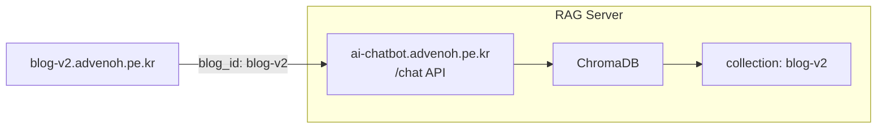

# 블로그 ChatWindow 통합 (blog-v2) - 프로젝트 PRD

## 1. 개요

### 1.1 목적
RAG 챗봇 API 서버(`ai-chatbot.advenoh.pe.kr`)가 배포된 후, IT 블로그(`blog-v2.advenoh.pe.kr`)에 ChatWindow 컴포넌트를 추가하여 방문자가 블로그 내에서 바로 Q&A를 이용할 수 있도록 한다.

> 투자 블로그(`investment.advenoh.pe.kr`) ChatWindow 통합은 `10_investment_chat_integration_*` 문서 참조

### 1.2 선행 조건
- `ai-chatbot.advenoh.pe.kr` API 서버 배포 완료 (`6_chatbot_project_prd.md`)
- blog-v2 Collection 인덱싱 완료
- `/chat` API 엔드포인트 정상 동작 확인

### 1.3 관련 Repo

| Repo | 역할 |
|------|------|
| [ai-chatbot.advenoh.pe.kr](https://github.com/kenshin579/ai-chatbot.advenoh.pe.kr) | RAG API 서버 (이미 배포됨) |
| [blog-v2.advenoh.pe.kr](https://github.com/kenshin579/blog-v2.advenoh.pe.kr) | IT 블로그 - ChatWindow 추가 |

---

## 2. 아키텍처



- blog-v2 FE에서 `ai-chatbot.advenoh.pe.kr/chat` API를 호출
- `blog_id: "blog-v2"` 고정값으로 전송
- CORS 설정: API 서버에서 blog-v2 도메인 허용 필요

---

## 3. ChatWindow 컴포넌트 설계

### 3.1 컴포넌트 구조

```
client/src/components/chat/
├── ChatButton.tsx        # 화면 우하단 플로팅 채팅 버튼
├── ChatWindow.tsx        # 채팅 창 (열림/닫힘 토글)
├── MessageList.tsx       # 메시지 목록 (질문/답변)
├── ChatInput.tsx         # 입력 필드 + 전송 버튼
└── SourceLinks.tsx       # 참조 블로그 글 링크 목록
```

### 3.2 동작 방식

1. 블로그 페이지 우하단에 **플로팅 채팅 버튼** 표시
2. 클릭 시 ChatWindow 오픈 (오버레이)
3. 질문 입력 → `POST ai-chatbot.advenoh.pe.kr/chat` 호출
4. 답변 + 참조 블로그 글 출처 표시
5. 멀티턴 대화 지원 (chat_history 전송)

### 3.3 API 호출

```typescript
// lib/chatApi.ts
const CHAT_API_URL = "https://ai-chatbot.advenoh.pe.kr";
const BLOG_ID = "blog-v2"; // 블로그별 고정값

export async function sendChatMessage(
  question: string,
  chatHistory: [string, string][]
): Promise<ChatResponse> {
  const res = await fetch(`${CHAT_API_URL}/chat`, {
    method: "POST",
    headers: { "Content-Type": "application/json" },
    body: JSON.stringify({
      blog_id: BLOG_ID,
      question,
      chat_history: chatHistory,
    }),
  });
  return res.json();
}
```

### 3.4 UI 요구사항

- 플로팅 버튼: 우하단 고정, 채팅 아이콘
- 채팅 창: 400x500px, 반응형 (모바일에서는 전체 화면)
- 메시지: 사용자(우측), 봇(좌측) 정렬
- 소스 인용: 답변 하단에 참조 블로그 글 링크 목록
- 로딩 상태: 타이핑 인디케이터
- 다크/라이트 모드: 블로그 테마와 연동
- shadcn/ui 컴포넌트 사용 (블로그 디자인 시스템 일관성)

---

## 4. API 서버 CORS 설정

ChatWindow 통합 시 API 서버에 CORS 허용 도메인 추가 필요:

```python
# ai-chatbot.advenoh.pe.kr/app/main.py
from fastapi.middleware.cors import CORSMiddleware

app.add_middleware(
    CORSMiddleware,
    allow_origins=[
        "https://blog-v2.advenoh.pe.kr",
        "http://localhost:3000",  # 개발 환경
    ],
    allow_methods=["POST"],
    allow_headers=["Content-Type"],
)
```

---

## 5. 구현 순서 (마일스톤)

| 단계 | 작업 | 산출물 |
|------|------|--------|
| M1 | API 서버 CORS 설정 (blog-v2 도메인 허용) | CORS 미들웨어 |
| M2 | blog-v2에 ChatWindow 컴포넌트 구현 | 채팅 컴포넌트 |
| M3 | blog-v2 배포 및 E2E 테스트 | 프로덕션 채팅 기능 |

---

## 6. 테스트

- **MCP Playwright** 사용하여 E2E 테스트:
  - 플로팅 버튼 클릭 → ChatWindow 오픈 확인
  - 질문 입력 → 답변 수신 확인
  - 소스 인용 링크 표시 확인
  - 멀티턴 대화 동작 확인
  - 모바일 반응형 확인
