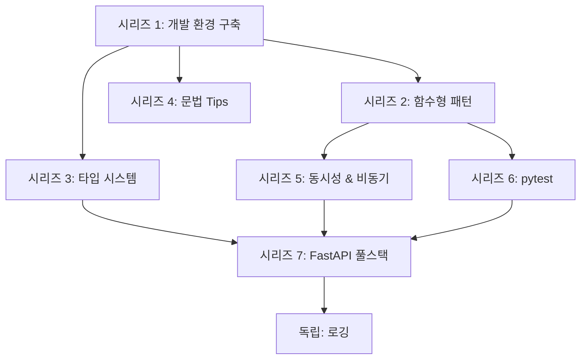

# Python 시리즈 PRD 리뷰 (최종)

> 대상: 7_2 ~ 7_23 (7_1_python_uv_prd.md 제외)
> 리뷰 날짜: 2026-03-02

---

## 1. 최종 시리즈 구조

기존 6개 시리즈 → **7개 독립 시리즈 + 독립 글 1편**으로 재편.
기존 "핵심 문법 마스터" 9편을 3개 독립 시리즈로 분리, 시리즈 5/6(FastAPI)을 시리즈 7로 통합.

### 시리즈 1: Python 개발 환경 구축 (2편)

| 번호 | 파일 | 제목 | 난이도 | 우선순위 |
|------|------|------|--------|----------|
| 1-1 | (별도 작성중) | uv 패키지 매니저 | - | - |
| 1-2 | 7_2 | Python 프로젝트 셋업 모범 사례 | 초-중급 | ★★☆ |

### 시리즈 2: Python 함수형 패턴 (3편)

> 함수를 다루는 고급 패턴

| 번호 | 파일 | 제목 | 난이도 | 우선순위 |
|------|------|------|--------|----------|
| 2-1 | 7_3 | Decorator 완벽 가이드 | 중급 | ★★★ |
| 2-2 | 7_4 | Generator & Iterator | 중급 | ★★★ |
| 2-3 | 7_5 | Context Manager (with 문) | 중급 | ★★☆ |

### 시리즈 3: Python 타입 시스템 & 데이터 모델링 (4편)

> 타입 안전성 확보와 데이터 구조 설계

| 번호 | 파일 | 제목 | 난이도 | 우선순위 |
|------|------|------|--------|----------|
| 3-1 | 7_6 | Type Hints 실전 가이드 | 중급 | ★★★ |
| 3-2 | 7_7 | Dataclasses & attrs | 초-중급 | ★★☆ |
| 3-3 | 7_10 | Enum 활용법 | 초-중급 | ★☆☆ |
| 3-4 | 7_11 | ABC와 Protocol | 중급 | ★☆☆ |

### 시리즈 4: Python 문법 Tips (2편)

> 독립적으로 읽을 수 있는 가벼운 문법 주제

| 번호 | 파일 | 제목 | 난이도 | 우선순위 |
|------|------|------|--------|----------|
| 4-1 | 7_9 | 언더스코어의 모든 것 | 초급 | ★★☆ |
| 4-2 | 7_8 | 패턴 매칭 (match/case) | 중급 | ★☆☆ |

### 시리즈 5: Python 동시성 & 비동기 프로그래밍 (3편)

> 순서 변경: 동시성 전체 비교 → asyncio 기초 → asyncio 실전

| 번호 | 파일 | 제목 | 난이도 | 우선순위 |
|------|------|------|--------|----------|
| 5-1 | 7_13 | 동시성 비교 (threading vs multiprocessing vs asyncio) | 중급 | ★★★ |
| 5-2 | 7_12 | asyncio 기초부터 실전까지 | 중-고급 | ★★★ |
| 5-3 | 7_14 | asyncio 실전 패턴 | 고급 | ★★☆ |

### 시리즈 6: pytest로 테스트 마스터하기 (3편)

| 번호 | 파일 | 제목 | 난이도 | 우선순위 |
|------|------|------|--------|----------|
| 6-1 | 7_15 | pytest 입문 | 초-중급 | ★★★ |
| 6-2 | 7_16 | pytest 심화 - mock과 monkeypatch | 중급 | ★★☆ |
| 6-3 | 7_17 | pytest 플러그인과 실전 팁 | 중급 | ★☆☆ |

### 시리즈 7: FastAPI 풀스택 개발 (5편)

> 기존 시리즈 5(데이터/ORM) + 시리즈 6(FastAPI)을 하나로 통합

| 번호 | 파일 | 제목 | 난이도 | 우선순위 |
|------|------|------|--------|----------|
| 7-1 | 7_18 | Pydantic v2 완벽 가이드 | 중급 | ★★★ |
| 7-2 | 7_19 | SQLAlchemy 2.0 + SQLModel | 중-고급 | ★★☆ |
| 7-3 | 7_20 | Peewee ORM 실전 가이드 (SQLAlchemy vs Peewee 비교 관점) | 초-중급 | ★★☆ |
| 7-4 | 7_21 | FastAPI 입문 - Flask에서 FastAPI로 | 중급 | ★★★ |
| 7-5 | 7_22 | FastAPI 실전 - 프로젝트 구조와 패턴 | 중-고급 | ★★☆ |

### 독립 글

| 파일 | 제목 | 난이도 | 우선순위 |
|------|------|--------|----------|
| 7_23 | Python 로깅 제대로 하기 | 초-중급 | ★★☆ |

---

## 2. 주제별 의존 관계

---

## 3. 내용 중복 해결 (적용 완료)

| 중복 지점 | 해결 방식 | 적용 파일 |
|-----------|-----------|-----------|
| Protocol (Type Hints vs ABC/Protocol) | Type Hints에서 간략 소개 + ABC/Protocol 편 링크 | 7_6 |
| asyncio (동시성 비교 vs asyncio 기초) | 동시성 비교에서 asyncio 개요만 + asyncio 기초 편 링크 | 7_13 |
| Pydantic + FastAPI (Pydantic vs FastAPI 입문) | Pydantic: 모델 정의 관점 / FastAPI: 라우팅 활용 관점 | 7_18, 7_21 |
| pytest 설정 (프로젝트 셋업 vs pytest 입문) | 프로젝트 셋업: pyproject.toml 설정만 + pytest 편 링크 | 7_2 |

---

## 4. 작성 순서 (Phase별)

### Phase 1: ★★★ (8편) - 핵심 학습 경로

> 이 8편만으로 Python 핵심 → 테스트 → 웹 개발 전체 학습 경로 커버 가능

| 순서 | 번호 | 제목 | 시리즈 |
|------|------|------|--------|
| 1 | 2-1 | Decorator 완벽 가이드 | 함수형 패턴 |
| 2 | 2-2 | Generator & Iterator | 함수형 패턴 |
| 3 | 3-1 | Type Hints 실전 가이드 | 타입 시스템 |
| 4 | 5-1 | 동시성 비교 | 동시성 & 비동기 |
| 5 | 5-2 | asyncio 기초부터 실전까지 | 동시성 & 비동기 |
| 6 | 6-1 | pytest 입문 | pytest |
| 7 | 7-1 | Pydantic v2 완벽 가이드 | FastAPI 풀스택 |
| 8 | 7-4 | FastAPI 입문 | FastAPI 풀스택 |

### Phase 2: ★★☆ (9편) - 심화 확장

| 순서 | 번호 | 제목 | 시리즈 |
|------|------|------|--------|
| 9 | 1-2 | 프로젝트 셋업 모범 사례 | 개발 환경 구축 |
| 10 | 2-3 | Context Manager | 함수형 패턴 |
| 11 | 3-2 | Dataclasses & attrs | 타입 시스템 |
| 12 | 4-1 | 언더스코어의 모든 것 | 문법 Tips |
| 13 | 5-3 | asyncio 실전 패턴 | 동시성 & 비동기 |
| 14 | 6-2 | pytest mock과 monkeypatch | pytest |
| 15 | 7-2 | SQLAlchemy 2.0 + SQLModel | FastAPI 풀스택 |
| 16 | 7-3 | Peewee ORM 실전 가이드 | FastAPI 풀스택 |
| 17 | 7-5 | FastAPI 실전 | FastAPI 풀스택 |
| 18 | - | Python 로깅 제대로 하기 | 독립 글 |

### Phase 3: ★☆☆ (4편) - 참고/니치

| 순서 | 번호 | 제목 | 시리즈 |
|------|------|------|--------|
| 19 | 3-3 | Enum 활용법 | 타입 시스템 |
| 20 | 3-4 | ABC와 Protocol | 타입 시스템 |
| 21 | 4-2 | 패턴 매칭 (match/case) | 문법 Tips |
| 22 | 6-3 | pytest 플러그인과 실전 팁 | pytest |

---

## 5. 결정 사항 요약

| 논의 항목 | 결정 |
|-----------|------|
| 3-1. 내용 중복 | 제안대로 적용 (관점 분리 + 상호 링크) |
| 3-2. 시리즈 2 규모 | **B) 별도 시리즈 분리** (함수형 패턴 / 타입 시스템 / 문법 Tips) |
| 3-3. Peewee 포함 | **A) 유지** (SQLAlchemy vs Peewee 비교 관점으로 재구성) |
| 3-4. 동시성 순서 | 제안대로 변경 (동시성 비교 → asyncio 기초 → asyncio 실전) |
| 3-5. 로깅 위치 | **A) 독립 유지** |
| 3-6. 작성 순서 | Phase별 우선순위 기반 작성 순서 채택 |
