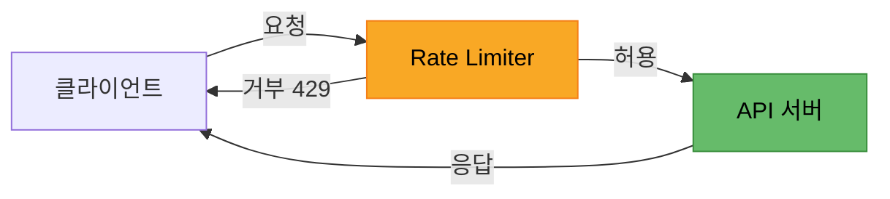
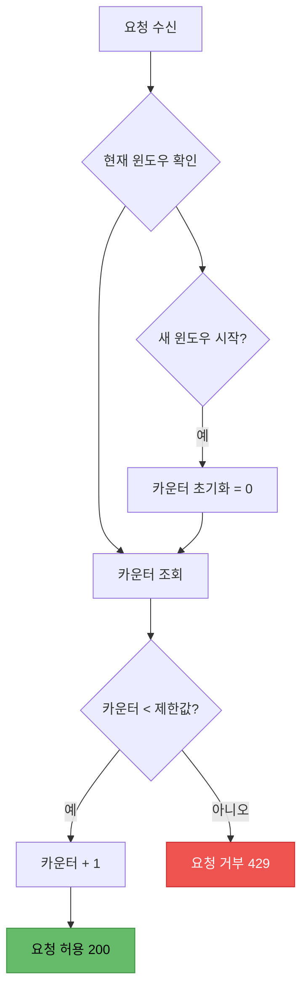
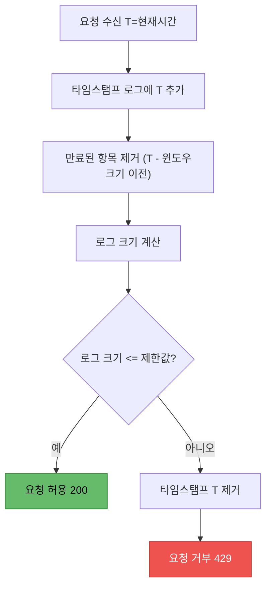
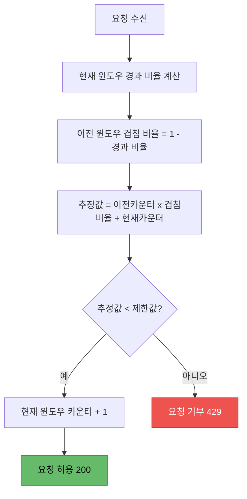
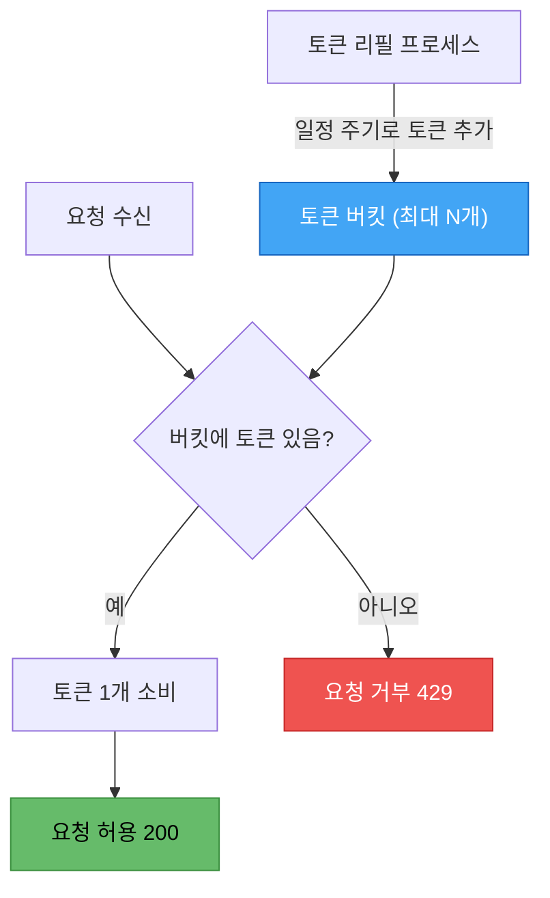
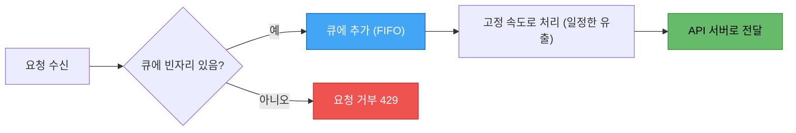
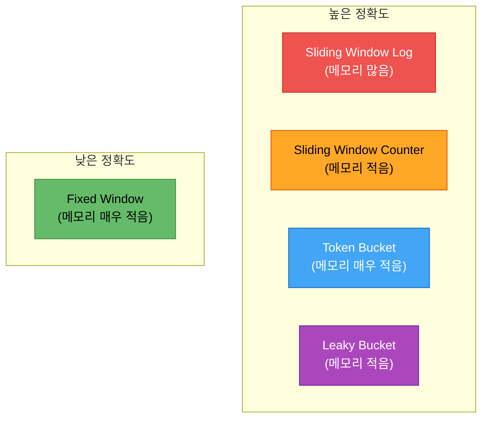
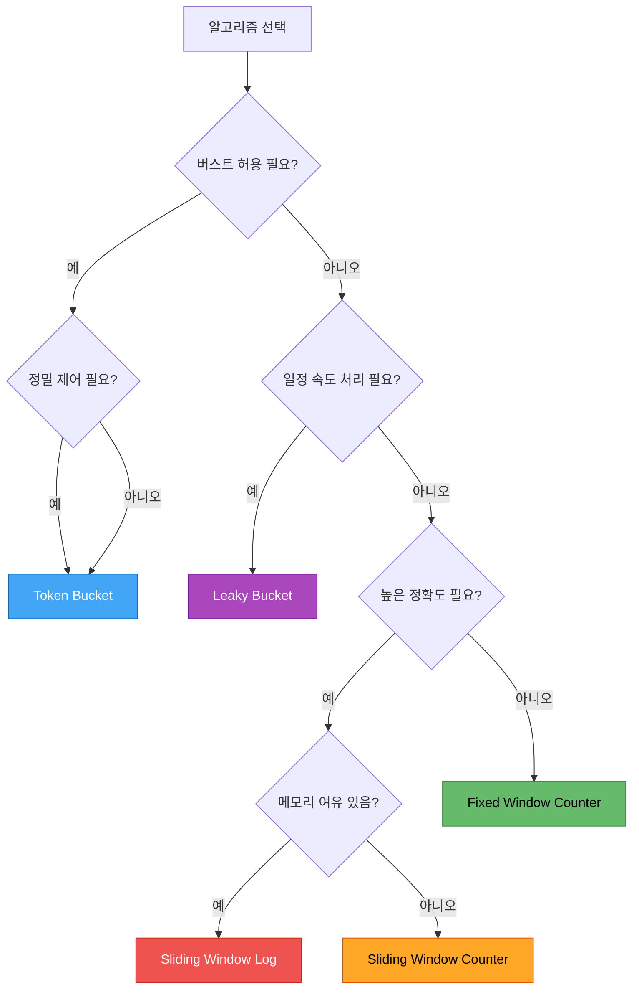
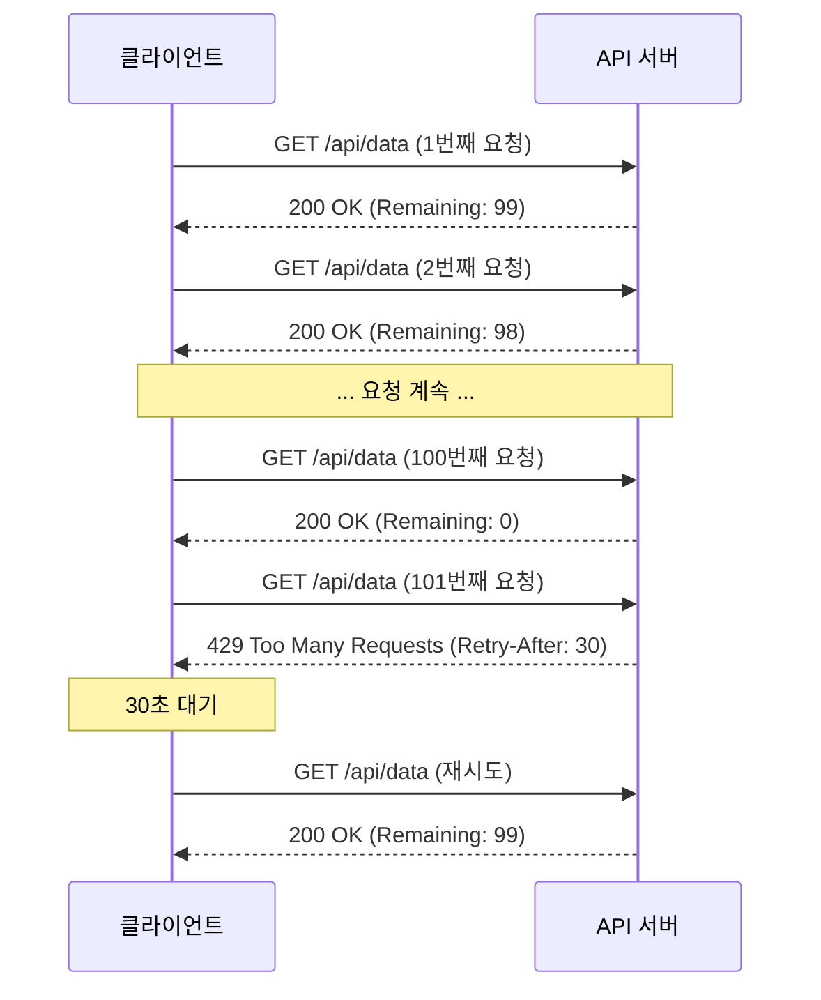

## 1. Rate Limiting이란?

**Rate Limiting**(속도 제한)은 일정 시간 동안 클라이언트가 서버에 보낼 수 있는 요청 수를 제한하는 기술이다. API를 운영하는 모든 서비스에서 필수적으로 적용해야 하는 보호 메커니즘이며, 트래픽을 제어하여 시스템의 안정성과 가용성을 보장한다.

### 왜 필요한가?

Rate Limiting이 없는 API는 마치 잠금장치 없는 수도꼭지와 같다. 누구든 원하는 만큼 자원을 소비할 수 있고, 결국 전체 시스템이 마비될 수 있다.

#### 서버 보호 (Server Protection)

대량의 요청이 한꺼번에 몰리면 서버의 CPU, 메모리, 네트워크 대역폭이 고갈된다. Rate Limiting은 이러한 트래픽 폭주로부터 서버를 보호하고, DDoS 공격이나 악의적인 크롤링 시도를 차단하는 첫 번째 방어선 역할을 한다.

#### 공정성 보장 (Fairness)

하나의 클라이언트가 모든 자원을 독점하면 다른 사용자들은 서비스를 이용할 수 없다. Rate Limiting은 모든 사용자에게 공평한 접근 기회를 제공하여 특정 사용자의 과도한 사용으로 인한 서비스 품질 저하를 방지한다.

#### 비용 관리 (Cost Control)

클라우드 환경에서는 API 호출 횟수가 곧 비용이다. 불필요하거나 과도한 요청을 제한하면 인프라 비용을 예측 가능한 범위 내에서 관리할 수 있다. 특히 외부 서드파티 API를 호출하는 경우, 과도한 호출로 인한 예상치 못한 비용 폭증을 방지할 수 있다.

#### SLA 준수 (Service Level Agreement)

서비스 제공자는 고객에게 일정 수준의 응답 시간과 가용성을 보장한다. Rate Limiting은 시스템이 과부하 상태에 빠지지 않도록 하여, 약속된 SLA를 안정적으로 유지할 수 있게 해준다.



위 다이어그램은 Rate Limiter의 기본 동작을 보여준다. 클라이언트의 요청이 Rate Limiter를 통과하면 API 서버로 전달되고, 제한을 초과하면 **429 Too Many Requests** 응답을 받게 된다.

---

## 2. 5가지 핵심 알고리즘

Rate Limiting을 구현하는 알고리즘은 여러 가지가 있으며, 각각 정확도, 메모리 효율, 구현 복잡도 측면에서 서로 다른 특성을 가진다. 여기서는 가장 널리 사용되는 5가지 알고리즘을 살펴본다.

### 2.1 Fixed Window Counter (고정 윈도우 카운터)

#### 개념

Fixed Window Counter는 가장 직관적인 Rate Limiting 알고리즘이다. 시간을 고정된 크기의 윈도우(예: 1분, 1시간)로 나누고, 각 윈도우마다 요청 횟수를 카운트한다. 카운터가 임계값에 도달하면 해당 윈도우가 끝날 때까지 추가 요청을 거부한다.

#### 동작 방식

1. 현재 시간이 속하는 윈도우를 결정한다 (예: 12:00:00 ~ 12:00:59)
2. 해당 윈도우의 카운터를 1 증가시킨다
3. 카운터가 제한값 이하면 요청을 허용한다
4. 카운터가 제한값을 초과하면 요청을 거부한다
5. 윈도우가 끝나면 카운터를 0으로 초기화한다



예를 들어, 분당 10건의 제한이 있다고 하자. 12:00:00에 윈도우가 시작되면 12:00:59까지 10건의 요청을 허용한다. 11번째 요청부터는 거부되며, 12:01:00에 새 윈도우가 시작되면 카운터가 다시 0이 된다.

#### 장단점

**장점:**
- 구현이 매우 간단하다 (카운터 하나만 관리)
- 메모리 사용량이 매우 적다 (윈도우당 정수 하나)
- Redis의 INCR, EXPIRE 명령으로 쉽게 구현 가능하다

**단점:**
- **경계 문제(Boundary Problem)**: 윈도우 경계에서 최대 2배의 요청이 허용될 수 있다. 예를 들어, 12:00:50에 10건, 12:01:10에 10건이 들어오면 20초 사이에 20건의 요청이 통과한다.

---

### 2.2 Sliding Window Log (슬라이딩 윈도우 로그)

#### 개념

Sliding Window Log는 Fixed Window의 경계 문제를 해결하기 위해 고안되었다. 모든 요청의 타임스탬프를 기록하고, 현재 시점에서 윈도우 크기만큼 이전까지의 요청 수를 계산한다. 가장 정확한 Rate Limiting을 제공하지만, 메모리 사용량이 많다.

#### 동작 방식

1. 새 요청이 들어오면 현재 타임스탬프를 로그에 추가한다
2. 윈도우 시작 시점(현재 시간 - 윈도우 크기) 이전의 오래된 타임스탬프를 제거한다
3. 로그에 남아있는 타임스탬프 수를 카운트한다
4. 카운트가 제한값 이하면 허용, 초과면 거부한다



예를 들어, 분당 5건의 제한이 있고 현재 시간이 12:01:30이라고 하자. 로그에 12:00:45, 12:01:00, 12:01:10, 12:01:20, 12:01:25의 타임스탬프가 있다면, 먼저 12:00:30(=12:01:30 - 60초) 이전의 항목은 제거하고 남은 5개의 항목을 카운트한다. 제한값과 같으므로 추가 요청은 거부된다.

#### 장단점

**장점:**
- 가장 정확한 Rate Limiting을 제공한다 (경계 문제 없음)
- 윈도우가 자연스럽게 슬라이딩되므로 트래픽 스파이크를 효과적으로 방지한다

**단점:**
- **메모리 사용량이 많다**: 모든 요청의 타임스탬프를 저장해야 한다. 분당 1만 건의 제한이라면 최대 1만 개의 타임스탬프를 유지해야 한다
- 오래된 타임스탬프 정리에 추가 연산이 필요하다

---

### 2.3 Sliding Window Counter (슬라이딩 윈도우 카운터)

#### 개념

Sliding Window Counter는 Fixed Window Counter와 Sliding Window Log의 장점을 결합한 **하이브리드 방식**이다. 이전 윈도우와 현재 윈도우의 카운터를 가중 평균하여 현재 시점의 요청 수를 추정한다. 높은 정확도를 유지하면서도 메모리 효율이 좋다.

#### 동작 방식 및 가중 평균 공식

핵심 아이디어는 현재 슬라이딩 윈도우에 걸쳐 있는 이전 윈도우의 비율만큼 이전 카운터를 반영하는 것이다.

**가중 평균 공식:**

```
추정 요청 수 = (이전 윈도우 카운터 × 이전 윈도우 겹침 비율) + 현재 윈도우 카운터
```

예를 들어, 분당 100건 제한에서:
- 이전 윈도우(12:00~12:01): 84건
- 현재 윈도우(12:01~12:02): 36건
- 현재 시간: 12:01:15 (현재 윈도우의 25% 경과)
- 이전 윈도우 겹침 비율: 75% (= 1 - 0.25)
- 추정 요청 수: 84 × 0.75 + 36 = 63 + 36 = 99건



#### 장단점

**장점:**
- Fixed Window의 경계 문제를 대부분 해소한다 (Cloudflare에 따르면 오차율 약 0.003%)
- 메모리 효율이 좋다 (윈도우 2개의 카운터만 유지)
- 구현이 비교적 간단하면서도 높은 정확도를 제공한다

**단점:**
- 완전히 정확하지는 않다 (이전 윈도우의 요청이 균등하게 분포되었다고 가정)
- Fixed Window Counter보다는 약간 더 복잡하다

---

### 2.4 Token Bucket (토큰 버킷)

#### 개념

Token Bucket은 가장 널리 사용되는 Rate Limiting 알고리즘 중 하나로, Amazon API Gateway, Stripe 등 많은 대형 서비스에서 채택하고 있다. 일정한 속도로 토큰이 버킷에 채워지고, 요청을 처리할 때마다 토큰을 소비하는 방식이다.

#### 동작 방식

1. 버킷에는 최대 용량(Max Tokens)만큼의 토큰이 들어갈 수 있다
2. 일정한 속도(Refill Rate)로 토큰이 추가된다 (예: 초당 10개)
3. 요청이 들어오면 버킷에서 토큰 1개를 소비한다
4. 토큰이 있으면 요청을 허용하고, 없으면 거부한다
5. 버킷이 가득 차면 추가 토큰은 버려진다



Token Bucket의 핵심 특성은 **버스트(Burst) 트래픽을 허용**한다는 점이다. 버킷에 토큰이 충분히 쌓여 있으면, 짧은 시간에 여러 요청을 한꺼번에 처리할 수 있다. 이후에는 토큰이 리필될 때까지 요청이 제한된다.

예를 들어, 버킷 최대 용량이 10이고 초당 2개씩 리필된다고 하자. 5초 동안 요청이 없었다면 버킷에는 10개의 토큰이 쌓여 있고, 10건의 요청을 한꺼번에 처리할 수 있다. 이후에는 초당 2건의 속도로 제한된다.

#### 장단점

**장점:**
- 일시적인 버스트 트래픽을 자연스럽게 처리한다
- 평균 처리율과 최대 버스트 크기를 독립적으로 설정할 수 있다
- 구현이 비교적 간단하다
- 메모리 효율이 매우 좋다 (토큰 수, 마지막 리필 시간만 저장)

**단점:**
- 두 개의 파라미터(버킷 크기, 리필 속도)를 적절히 튜닝해야 한다
- 버스트를 허용하므로 순간적으로 서버에 부하가 집중될 수 있다

---

### 2.5 Leaky Bucket (누수 버킷)

#### 개념

Leaky Bucket은 Token Bucket과 비슷하지만 **일정한 처리 속도**를 보장한다는 점에서 차이가 있다. 요청을 큐(FIFO)에 넣고, 고정된 속도로 큐에서 꺼내어 처리한다. 큐가 가득 차면 새로운 요청은 버려진다.

Leaky Bucket은 물이 일정한 속도로 빠져나가는 구멍 뚫린 양동이에 비유할 수 있다. 물(요청)이 아무리 빠르게 들어와도, 빠져나가는 속도(처리 속도)는 항상 일정하다.

#### 동작 방식

1. 새 요청이 들어오면 큐에 추가한다
2. 큐가 가득 차 있으면 요청을 즉시 거부한다
3. 고정된 속도로 큐에서 요청을 꺼내 처리한다
4. 처리 속도는 트래픽 양과 관계없이 항상 일정하다



Token Bucket과의 핵심 차이점은 다음과 같다:
- **Token Bucket**: 토큰이 쌓여 있으면 버스트 허용, 처리 속도가 가변적
- **Leaky Bucket**: 큐를 통해 항상 일정한 속도로 처리, 버스트 불허

#### 장단점

**장점:**
- 처리 속도가 항상 일정하여 서버에 예측 가능한 부하를 준다
- 출력 트래픽의 형태가 매끄럽다 (Traffic Shaping에 적합)
- 구현이 간단하다

**단점:**
- 버스트 트래픽을 수용하지 못한다 (정상적인 트래픽 급증도 지연됨)
- 큐에 대기 중인 요청이 많으면 응답 지연(latency)이 증가한다
- 큐 크기를 적절히 설정해야 한다 (너무 크면 지연 증가, 너무 작으면 요청 손실)

---

## 3. 알고리즘 비교표

| 알고리즘 | 정확도 | 메모리 사용 | Burst 허용 | 구현 난이도 | 대표 사용처 |
|---------|--------|-----------|-----------|-----------|-----------|
| **Fixed Window Counter** | 낮음 | 매우 적음 | 경계에서 2배 가능 | 매우 쉬움 | 간단한 API, 내부 서비스 |
| **Sliding Window Log** | 매우 높음 | 많음 | 불허 | 보통 | 정확한 제한 필요 시 |
| **Sliding Window Counter** | 높음 | 적음 | 부분 허용 | 보통 | Cloudflare, 범용 |
| **Token Bucket** | 높음 | 매우 적음 | 허용 | 쉬움 | AWS, Stripe, 대부분의 API |
| **Leaky Bucket** | 높음 | 적음 | 불허 | 쉬움 | 트래픽 쉐이핑, 네트워크 |



---

## 4. 상황별 알고리즘 선택 가이드

알고리즘 선택은 서비스의 요구사항에 따라 달라진다. 아래는 일반적인 상황별 권장 사항이다.

### 빠른 프로토타이핑이 필요할 때 → Fixed Window Counter

초기 MVP나 내부 서비스에서 빠르게 Rate Limiting을 적용해야 할 때 적합하다. Redis의 `INCR`과 `EXPIRE`만으로 몇 줄 안에 구현할 수 있다. 경계 문제를 감수할 수 있는 상황이라면 가장 실용적인 선택이다.

### 정확한 제한이 중요할 때 → Sliding Window Log 또는 Sliding Window Counter

금융 API나 과금과 직결되는 서비스에서는 정확한 제한이 필수적이다. 메모리 여유가 있다면 Sliding Window Log를, 메모리 효율이 중요하다면 Sliding Window Counter를 선택한다.

### 버스트 트래픽을 허용해야 할 때 → Token Bucket

사용자 경험을 중시하는 서비스에서는 일시적인 트래픽 급증을 자연스럽게 처리할 필요가 있다. 예를 들어, 사용자가 페이지를 열 때 여러 API를 동시에 호출하는 경우, Token Bucket은 이러한 버스트를 허용하면서도 장기적으로는 평균 처리율을 유지한다.

### 안정적인 처리 속도가 필요할 때 → Leaky Bucket

메시지 큐 소비자, 배치 처리 파이프라인, 네트워크 장비 등 일정한 처리 속도가 중요한 환경에 적합하다. 버스트를 허용하면 다운스트림 서비스에 부하가 집중될 수 있는 경우에 효과적이다.

### 대규모 분산 시스템 → Sliding Window Counter + Token Bucket 조합

대규모 시스템에서는 단일 알고리즘으로 모든 요구사항을 충족하기 어렵다. 글로벌 제한에는 Sliding Window Counter를, 사용자별 제한에는 Token Bucket을 적용하는 등 계층적 Rate Limiting 전략을 사용하는 것이 일반적이다.



---

## 5. HTTP 표준 헤더

Rate Limiting을 구현할 때, 클라이언트가 현재 제한 상태를 알 수 있도록 HTTP 헤더를 통해 정보를 전달하는 것이 중요하다. 이를 통해 클라이언트는 요청 속도를 스스로 조절하고, 제한 초과 시 적절히 대응할 수 있다.

### 주요 헤더

#### X-RateLimit-Limit

허용되는 최대 요청 수를 나타낸다.

```
X-RateLimit-Limit: 100
```

클라이언트에게 "1분 동안 최대 100건의 요청을 보낼 수 있다"는 것을 알려준다.

#### X-RateLimit-Remaining

현재 윈도우에서 남은 요청 횟수를 나타낸다.

```
X-RateLimit-Remaining: 47
```

클라이언트는 이 값을 확인하여 요청 속도를 조절할 수 있다. 0에 가까워지면 요청을 줄이는 것이 바람직하다.

#### X-RateLimit-Reset

현재 윈도우가 초기화되는 시점을 Unix timestamp로 나타낸다.

```
X-RateLimit-Reset: 1709913600
```

클라이언트는 이 시점까지 대기한 후 다시 요청을 보낼 수 있다.

#### Retry-After

제한 초과 시 클라이언트가 다시 요청할 수 있을 때까지 대기해야 하는 시간(초)을 나타낸다. RFC 7231에 정의된 표준 헤더이다.

```
Retry-After: 30
```

또는 HTTP 날짜 형식으로도 지정할 수 있다:

```
Retry-After: Sun, 08 Mar 2026 12:01:00 GMT
```

#### 429 Too Many Requests

Rate Limit을 초과했을 때 반환하는 HTTP 상태 코드이다. RFC 6585에 정의되어 있으며, 응답 본문에 제한 초과에 대한 상세 정보를 포함하는 것이 좋다.

```http
HTTP/1.1 429 Too Many Requests
Content-Type: application/json
X-RateLimit-Limit: 100
X-RateLimit-Remaining: 0
X-RateLimit-Reset: 1709913600
Retry-After: 30

{
  "error": {
    "code": "RATE_LIMIT_EXCEEDED",
    "message": "분당 요청 한도(100건)를 초과했습니다. 30초 후에 다시 시도해 주세요."
  }
}
```

### 헤더 전체 흐름



### IETF 표준화 동향

현재 `X-RateLimit-*` 헤더는 사실상의 표준(de facto standard)이지만, 공식 RFC는 아니다. IETF에서는 **RFC 9110** 이후 `RateLimit` 헤더 필드를 표준화하려는 움직임이 있다 ([draft-ietf-httpapi-ratelimit-headers](https://datatracker.ietf.org/doc/draft-ietf-httpapi-ratelimit-headers/)). 향후에는 다음과 같은 표준 헤더가 사용될 수 있다:

```
RateLimit-Limit: 100
RateLimit-Remaining: 47
RateLimit-Reset: 30
```

`X-` 접두사가 제거되고, `Reset` 값이 Unix timestamp 대신 남은 초(seconds)로 변경되는 것이 주요 차이점이다.

---

## 6. 마무리

이번 포스트에서는 Rate Limiting의 핵심 개념과 5가지 대표 알고리즘을 살펴보았다. 각 알고리즘은 서로 다른 트레이드오프를 가지고 있으며, 서비스의 특성에 맞는 알고리즘을 선택하는 것이 중요하다.

핵심 내용을 정리하면:

- **Fixed Window Counter**: 간단하지만 경계 문제가 있다
- **Sliding Window Log**: 가장 정확하지만 메모리를 많이 사용한다
- **Sliding Window Counter**: 정확도와 효율의 균형이 잡혀 있다
- **Token Bucket**: 버스트를 허용하며 가장 널리 사용된다
- **Leaky Bucket**: 일정한 처리 속도를 보장한다

### 다음 포스트 예고

다음 포스트에서는 이론을 실전으로 옮겨, **Go와 Redis를 활용한 Rate Limiting 구현**을 다룬다. Token Bucket과 Sliding Window Counter 알고리즘을 실제 코드로 구현하고, Redis를 사용한 분산 환경에서의 Rate Limiting 처리 방법을 살펴볼 예정이다. 실무에서 바로 활용할 수 있는 미들웨어 코드와 함께 벤치마크 결과도 공유할 것이다.
