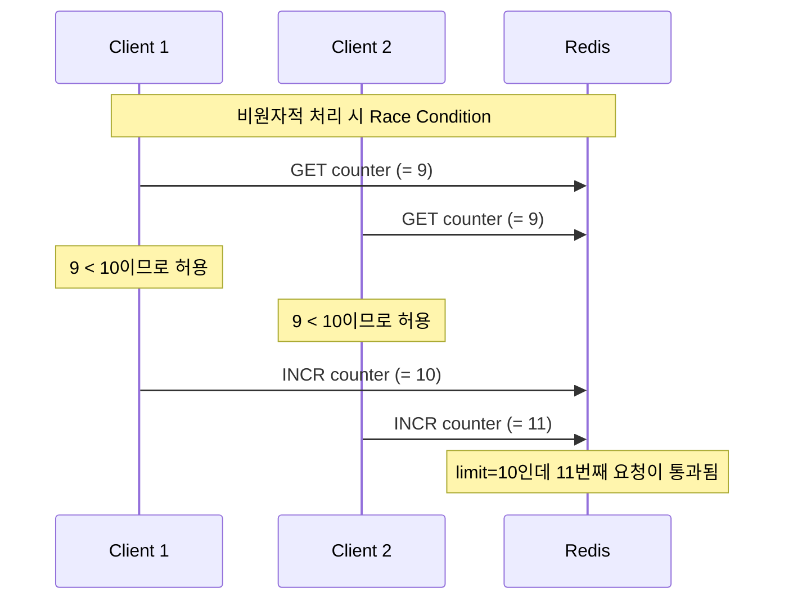
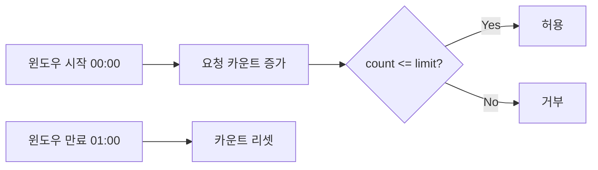
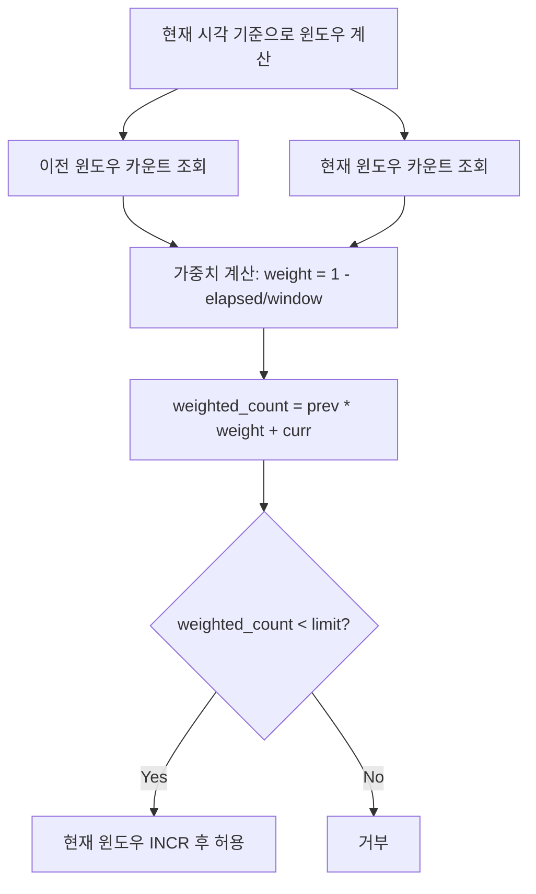
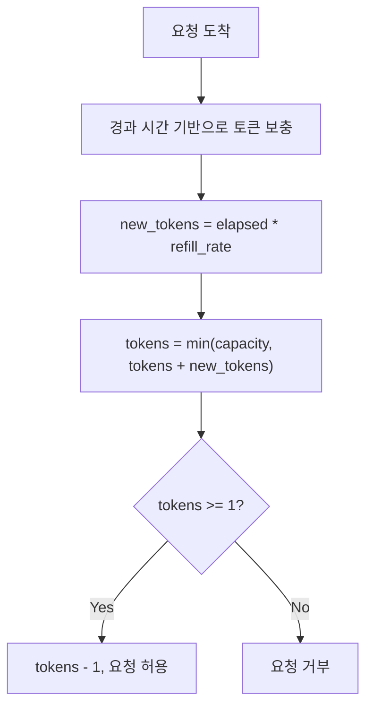
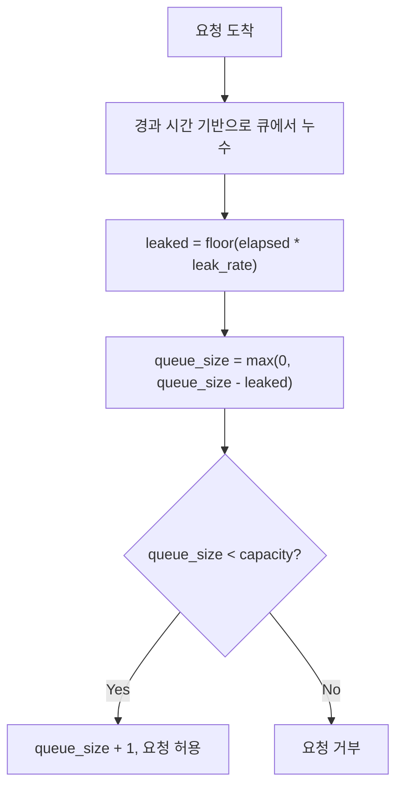

## 1. 소개

[이전 포스트](/article/api-rate-limiting-1-개념과-알고리즘)에서는 Rate Limiting의 개념과 4가지 대표 알고리즘(Fixed Window, Sliding Window, Token Bucket, Leaky Bucket)의 원리를 살펴보았습니다. 이번 포스트에서는 이론을 넘어 **Go와 Redis를 사용하여 4가지 알고리즘을 직접 구현**합니다.

이번 포스트에서 다루는 내용은 다음과 같습니다.

- **Redis Lua Script**로 원자적(atomic) Rate Limiting 로직 구현
- Go **인터페이스 기반 설계**로 알고리즘 간 교체 용이한 구조
- **Echo 미들웨어**로 HTTP API에 Rate Limiting 적용
- **miniredis**를 활용한 단위 테스트

전체 소스 코드는 [tutorials-go/rate-limiting](https://github.com/kenshin579/tutorials-go/tree/master/rate-limiting)에서 확인할 수 있습니다.

## 2. 프로젝트 구조

```
rate-limiting/
├── cmd/
│   └── server/
│       └── main.go              # 서버 진입점
├── internal/
│   ├── handler/
│   │   └── api.go               # API 핸들러
│   ├── limiter/
│   │   ├── limiter.go           # 공통 인터페이스 및 타입
│   │   ├── fixed_window.go      # Fixed Window 알고리즘
│   │   ├── fixed_window_test.go
│   │   ├── sliding_window.go    # Sliding Window Counter 알고리즘
│   │   ├── sliding_window_test.go
│   │   ├── token_bucket.go      # Token Bucket 알고리즘
│   │   ├── token_bucket_test.go
│   │   ├── leaky_bucket.go      # Leaky Bucket 알고리즘
│   │   └── leaky_bucket_test.go
│   └── middleware/
│       ├── ratelimit.go         # Echo 미들웨어
│       └── ratelimit_test.go
├── docker-compose.yml
└── Dockerfile
```

주요 설계 포인트는 다음과 같습니다.

- `internal/limiter/`: 4가지 알고리즘이 공통 인터페이스를 구현
- `internal/middleware/`: Echo 프레임워크와 Rate Limiter를 연결하는 미들웨어
- `internal/handler/`: 테스트용 API 엔드포인트

## 3. 핵심 인터페이스 설계

### 3.1 Limiter 인터페이스와 Result 구조체

모든 Rate Limiting 알고리즘이 동일한 인터페이스를 구현하도록 설계합니다.

```go
// Result contains the rate limiting decision and metadata for HTTP headers.
type Result struct {
    Allowed   bool
    Limit     int
    Remaining int
    ResetAt   time.Time
}

// Limiter is the interface that all rate limiting algorithms must implement.
type Limiter interface {
    Allow(ctx context.Context, key string) (*Result, error)
}
```

- `Result`: Rate Limiting 판정 결과를 담는 구조체입니다. `Allowed`는 요청 허용 여부, `Limit`은 최대 허용 횟수, `Remaining`은 남은 횟수, `ResetAt`은 제한이 초기화되는 시각입니다. 이 값들은 이후 HTTP 응답 헤더(`X-RateLimit-*`)로 클라이언트에게 전달됩니다.
- `Limiter`: 모든 알고리즘이 구현해야 하는 인터페이스입니다. `key`는 클라이언트를 식별하는 값(예: IP 주소)이며, `Allow` 메서드 하나만 존재하므로 알고리즘 교체가 매우 간단합니다.

### 3.2 Clock 추상화 - 테스트 시간 제어

```go
// Clock provides the current time. Override for testing.
type Clock func() time.Time

// RealClock returns time.Now.
func RealClock() time.Time {
    return time.Now()
}
```

`Clock`은 현재 시간을 반환하는 함수 타입입니다. 프로덕션에서는 `RealClock`(= `time.Now`)을 사용하고, 테스트에서는 시간을 직접 제어할 수 있는 `fakeClock`을 주입합니다. Token Bucket과 Leaky Bucket처럼 경과 시간에 따라 동작이 달라지는 알고리즘을 테스트할 때 유용합니다.

## 4. 알고리즘별 구현

### 왜 Redis Lua Script인가?

Rate Limiting에서 가장 중요한 점은 **원자성(atomicity)**입니다. "현재 카운트 읽기 -> 판정 -> 카운트 증가"를 여러 Redis 명령으로 나눠 실행하면, 동시 요청에서 경쟁 조건(race condition)이 발생합니다.



Redis Lua Script는 **단일 스레드에서 원자적으로 실행**되므로, 별도의 락 없이도 읽기-판정-쓰기를 안전하게 처리할 수 있습니다.

### 4.1 Fixed Window Counter

Fixed Window Counter는 시간을 고정 크기의 윈도우로 나누고, 각 윈도우 내 요청 수를 카운트합니다.



#### Lua Script

```lua
local key = KEYS[1]
local limit = tonumber(ARGV[1])
local window = tonumber(ARGV[2])

local current = redis.call("INCR", key)
if current == 1 then
    redis.call("EXPIRE", key, window)
end

local ttl = redis.call("TTL", key)
if ttl < 0 then
    ttl = window
end

return {current, ttl}
```

동작 방식은 다음과 같습니다.

1. `INCR`로 카운트를 증가시킵니다. 키가 없으면 자동으로 1로 초기화됩니다.
2. 카운트가 1(첫 요청)이면 `EXPIRE`로 윈도우 만료 시간을 설정합니다.
3. `TTL`을 반환하여 클라이언트에게 리셋 시간을 알려줍니다.

핵심은 `INCR` + `EXPIRE`를 Lua Script 내에서 원자적으로 실행하는 것입니다. 이 두 명령을 별도로 보내면 `INCR` 이후 `EXPIRE` 전에 장애가 발생할 경우 키가 만료되지 않는 문제가 생깁니다.

#### Go 구현

```go
type FixedWindow struct {
    client *redis.Client
    limit  int
    window time.Duration
}

func (fw *FixedWindow) Allow(ctx context.Context, key string) (*Result, error) {
    windowSec := int(fw.window.Seconds())
    now := time.Now()
    windowStart := now.Truncate(fw.window)
    redisKey := fmt.Sprintf("ratelimit:fw:%s:%d", key, windowStart.Unix())

    res, err := fixedWindowScript.Run(ctx, fw.client, []string{redisKey},
        fw.limit, windowSec).Int64Slice()
    if err != nil {
        return nil, fmt.Errorf("fixed window script error: %w", err)
    }

    current := int(res[0])
    ttl := time.Duration(res[1]) * time.Second

    remaining := fw.limit - current
    if remaining < 0 {
        remaining = 0
    }

    return &Result{
        Allowed:   current <= fw.limit,
        Limit:     fw.limit,
        Remaining: remaining,
        ResetAt:   now.Add(ttl),
    }, nil
}
```

**Key 패턴**: `ratelimit:fw:{사용자키}:{윈도우시작시각}`

- 예: `ratelimit:fw:192.168.1.1:1709856000`
- 윈도우 시작 시각을 키에 포함시켜 윈도우마다 별도의 카운터를 사용합니다.
- `now.Truncate(fw.window)`로 현재 시각을 윈도우 단위로 내림하여 윈도우 시작 시각을 계산합니다.

### 4.2 Sliding Window Counter

Sliding Window Counter는 Fixed Window의 경계 문제를 해결합니다. 이전 윈도우와 현재 윈도우의 카운트를 **가중 평균**하여 더 부드러운 제한을 적용합니다.



#### Lua Script

```lua
local key = KEYS[1]
local limit = tonumber(ARGV[1])
local window = tonumber(ARGV[2])
local now = tonumber(ARGV[3])

local current_window = math.floor(now / window) * window
local prev_window = current_window - window

local prev_key = key .. ":" .. prev_window
local curr_key = key .. ":" .. current_window

local prev_count = tonumber(redis.call("GET", prev_key) or "0") or 0
local curr_count = tonumber(redis.call("GET", curr_key) or "0") or 0

local elapsed = now - current_window
local weight = 1 - (elapsed / window)
local weighted_count = math.floor(prev_count * weight + curr_count)

if weighted_count < limit then
    redis.call("INCR", curr_key)
    redis.call("EXPIRE", curr_key, window * 2)
    curr_count = curr_count + 1
    weighted_count = math.floor(prev_count * weight + curr_count)
    local remaining = limit - weighted_count
    if remaining < 0 then remaining = 0 end
    local reset_at = current_window + window
    return {1, remaining, reset_at}
else
    local remaining = 0
    local reset_at = current_window + window
    return {0, remaining, reset_at}
end
```

가중 평균 계산 예시를 살펴보겠습니다. 윈도우가 60초이고 limit이 10인 상황에서 다음과 같이 동작합니다.

- 이전 윈도우에서 8개 요청, 현재 윈도우에서 2개 요청
- 현재 윈도우 시작으로부터 15초 경과 -> `weight = 1 - 15/60 = 0.75`
- `weighted_count = floor(8 * 0.75 + 2) = floor(8) = 8`

**Key 패턴**: `ratelimit:sw:{사용자키}:{윈도우시작시각}`

- 이전 윈도우와 현재 윈도우에 대해 각각 별도의 키를 사용합니다.
- `EXPIRE`를 `window * 2`로 설정하여 이전 윈도우 카운트가 참조되는 동안 키가 유지됩니다.

#### Go 구현

```go
type SlidingWindow struct {
    client *redis.Client
    limit  int
    window time.Duration
}

func (sw *SlidingWindow) Allow(ctx context.Context, key string) (*Result, error) {
    windowSec := int(sw.window.Seconds())
    now := time.Now()
    nowSec := now.Unix()

    redisKey := fmt.Sprintf("ratelimit:sw:%s", key)

    res, err := slidingWindowScript.Run(ctx, sw.client, []string{redisKey},
        sw.limit, windowSec, nowSec).Int64Slice()
    if err != nil {
        return nil, fmt.Errorf("sliding window script error: %w", err)
    }

    allowed := res[0] == 1
    remaining := int(res[1])
    resetAt := time.Unix(res[2], 0)

    return &Result{
        Allowed:   allowed,
        Limit:     sw.limit,
        Remaining: remaining,
        ResetAt:   resetAt,
    }, nil
}
```

### 4.3 Token Bucket

Token Bucket은 일정 속도로 토큰이 채워지는 버킷에서 요청마다 토큰을 소모하는 방식입니다. 버스트 트래픽을 자연스럽게 수용할 수 있는 장점이 있습니다.



#### Lua Script

```lua
local key = KEYS[1]
local capacity = tonumber(ARGV[1])
local refill_rate = tonumber(ARGV[2])
local now = tonumber(ARGV[3])

local data = redis.call("HMGET", key, "tokens", "last_refill")
local tokens = tonumber(data[1])
local last_refill = tonumber(data[2])

if tokens == nil then
    tokens = capacity
    last_refill = now
end

local elapsed = now - last_refill
local new_tokens = elapsed * refill_rate
tokens = math.min(capacity, tokens + new_tokens)

if tokens >= 1 then
    tokens = tokens - 1
    redis.call("HMSET", key, "tokens", tokens, "last_refill", now)
    redis.call("EXPIRE", key, math.ceil(capacity / refill_rate) * 2)
    return {1, math.floor(tokens)}
else
    redis.call("HMSET", key, "tokens", tokens, "last_refill", now)
    redis.call("EXPIRE", key, math.ceil(capacity / refill_rate) * 2)
    return {0, 0}
end
```

동작 방식은 다음과 같습니다.

1. Redis Hash에서 현재 토큰 수와 마지막 보충 시각을 조회합니다.
2. 첫 요청이면 토큰을 `capacity`로 초기화합니다.
3. 경과 시간 * 보충 속도만큼 토큰을 추가합니다 (최대 `capacity`).
4. 토큰이 1개 이상이면 소모 후 허용, 아니면 거부합니다.
5. `EXPIRE`를 `ceil(capacity / refill_rate) * 2`로 설정하여 충분한 TTL을 보장합니다.

**Key 패턴**: `ratelimit:tb:{사용자키}` (Hash 타입)

- `tokens`: 현재 남은 토큰 수
- `last_refill`: 마지막 토큰 보충 시각 (Unix timestamp)

#### Go 구현

```go
type TokenBucket struct {
    client     *redis.Client
    capacity   int
    refillRate float64 // tokens per second
    clock      Clock
}

func (tb *TokenBucket) Allow(ctx context.Context, key string) (*Result, error) {
    now := tb.clock()
    nowSec := float64(now.UnixMilli()) / 1000.0
    redisKey := fmt.Sprintf("ratelimit:tb:%s", key)

    res, err := tokenBucketScript.Run(ctx, tb.client, []string{redisKey},
        tb.capacity, tb.refillRate, nowSec).Int64Slice()
    if err != nil {
        return nil, fmt.Errorf("token bucket script error: %w", err)
    }

    allowed := res[0] == 1
    remaining := int(res[1])

    // Calculate when one token will be available
    refillTime := time.Duration(float64(time.Second) / tb.refillRate)
    resetAt := now.Add(refillTime)

    return &Result{
        Allowed:   allowed,
        Limit:     tb.capacity,
        Remaining: remaining,
        ResetAt:   resetAt,
    }, nil
}
```

`clock` 필드를 통해 시간 소스를 주입받습니다. `NewTokenBucket`은 `RealClock`을 사용하고, 테스트용 `NewTokenBucketWithClock`은 외부에서 `Clock`을 전달받습니다.

### 4.4 Leaky Bucket

Leaky Bucket은 큐(queue) 기반 알고리즘입니다. 요청이 큐에 들어가고, 일정 속도로 큐에서 빠져나갑니다. 큐가 가득 차면 새 요청은 거부됩니다.



#### Lua Script

```lua
local key = KEYS[1]
local capacity = tonumber(ARGV[1])
local leak_rate = tonumber(ARGV[2])
local now = tonumber(ARGV[3])

local data = redis.call("HMGET", key, "queue_size", "last_leak")
local queue_size = tonumber(data[1]) or 0
local last_leak = tonumber(data[2]) or now

local elapsed = now - last_leak
local leaked = math.floor(elapsed * leak_rate)
queue_size = math.max(0, queue_size - leaked)

if leaked > 0 then
    last_leak = now
end

if queue_size < capacity then
    queue_size = queue_size + 1
    redis.call("HMSET", key, "queue_size", queue_size, "last_leak", last_leak)
    redis.call("EXPIRE", key, math.ceil(capacity / leak_rate) * 2)
    local remaining = capacity - queue_size
    return {1, remaining}
else
    redis.call("HMSET", key, "queue_size", queue_size, "last_leak", last_leak)
    redis.call("EXPIRE", key, math.ceil(capacity / leak_rate) * 2)
    return {0, 0}
end
```

Token Bucket과의 차이점은 다음과 같습니다.

| 항목 | Token Bucket | Leaky Bucket |
|------|-------------|-------------|
| 핵심 개념 | 토큰을 보충하고 소모 | 큐에서 일정 속도로 누수 |
| 버스트 허용 | capacity만큼 허용 | 큐가 차면 즉시 거부 |
| 출력 속도 | 가변적 (버스트 가능) | 일정함 (leak_rate 고정) |
| Redis 저장 | tokens, last_refill | queue_size, last_leak |

**Key 패턴**: `ratelimit:lb:{사용자키}` (Hash 타입)

- `queue_size`: 현재 큐에 쌓인 요청 수
- `last_leak`: 마지막 누수 시각 (Unix timestamp)

#### Go 구현

```go
type LeakyBucket struct {
    client   *redis.Client
    capacity int
    leakRate float64 // requests leaked per second
    clock    Clock
}

func (lb *LeakyBucket) Allow(ctx context.Context, key string) (*Result, error) {
    now := lb.clock()
    nowSec := float64(now.UnixMilli()) / 1000.0
    redisKey := fmt.Sprintf("ratelimit:lb:%s", key)

    res, err := leakyBucketScript.Run(ctx, lb.client, []string{redisKey},
        lb.capacity, lb.leakRate, nowSec).Int64Slice()
    if err != nil {
        return nil, fmt.Errorf("leaky bucket script error: %w", err)
    }

    allowed := res[0] == 1
    remaining := int(res[1])

    // Next leak happens in 1/leakRate seconds
    leakInterval := time.Duration(float64(time.Second) / lb.leakRate)
    resetAt := now.Add(leakInterval)

    return &Result{
        Allowed:   allowed,
        Limit:     lb.capacity,
        Remaining: remaining,
        ResetAt:   resetAt,
    }, nil
}
```

## 5. Echo 미들웨어 구현

4가지 알고리즘을 HTTP API에 적용하기 위해 Echo 미들웨어를 구현합니다.

```go
// KeyFunc extracts a rate limit key from the request.
type KeyFunc func(c echo.Context) string

// IPKeyFunc returns the client IP as the rate limit key.
func IPKeyFunc(c echo.Context) string {
    return c.RealIP()
}

// RateLimitMiddleware creates an Echo middleware that enforces rate limiting.
func RateLimitMiddleware(lim limiter.Limiter, keyFunc KeyFunc) echo.MiddlewareFunc {
    return func(next echo.HandlerFunc) echo.HandlerFunc {
        return func(c echo.Context) error {
            key := keyFunc(c)

            result, err := lim.Allow(c.Request().Context(), key)
            if err != nil {
                return echo.NewHTTPError(http.StatusInternalServerError,
                    "rate limiter error")
            }

            // Set rate limit headers
            c.Response().Header().Set("X-RateLimit-Limit",
                strconv.Itoa(result.Limit))
            c.Response().Header().Set("X-RateLimit-Remaining",
                strconv.Itoa(result.Remaining))
            c.Response().Header().Set("X-RateLimit-Reset",
                strconv.FormatInt(result.ResetAt.Unix(), 10))

            if !result.Allowed {
                retryAfter := time.Until(result.ResetAt).Seconds()
                if retryAfter < 1 {
                    retryAfter = 1
                }
                c.Response().Header().Set("Retry-After",
                    fmt.Sprintf("%.0f", retryAfter))
                return c.JSON(http.StatusTooManyRequests, map[string]string{
                    "error": "rate limit exceeded",
                })
            }

            return next(c)
        }
    }
}
```

미들웨어의 주요 설계 포인트는 다음과 같습니다.

### 5.1 KeyFunc - 클라이언트 식별

`KeyFunc`은 요청에서 Rate Limit 키를 추출하는 함수 타입입니다. 기본 제공되는 `IPKeyFunc`은 클라이언트 IP를 사용하지만, 필요에 따라 API 키, 사용자 ID 등으로 커스터마이즈할 수 있습니다.

```go
// 예: API 키 기반 Rate Limiting
apiKeyFunc := func(c echo.Context) string {
    return c.Request().Header.Get("X-API-Key")
}
```

### 5.2 응답 헤더

모든 응답에 다음 표준 헤더를 포함합니다.

| 헤더 | 설명 | 예시 |
|------|------|------|
| `X-RateLimit-Limit` | 최대 허용 요청 수 | `10` |
| `X-RateLimit-Remaining` | 남은 요청 수 | `7` |
| `X-RateLimit-Reset` | 제한 초기화 시각 (Unix timestamp) | `1709856060` |
| `Retry-After` | 재시도까지 대기 시간 (초, 429일 때만) | `30` |

### 5.3 429 Too Many Requests 응답

제한을 초과하면 `429 Too Many Requests`와 함께 `Retry-After` 헤더를 반환합니다. `retryAfter`가 1초 미만이면 최소 1초로 설정하여 클라이언트가 즉시 재시도하는 것을 방지합니다.

### 5.4 서버 설정

`main.go`에서 미들웨어를 적용하는 방법입니다.

```go
func main() {
    redisAddr := os.Getenv("REDIS_ADDR")
    if redisAddr == "" {
        redisAddr = "localhost:6379"
    }

    rdb := redis.NewClient(&redis.Options{
        Addr: redisAddr,
    })

    // Default: Token Bucket (10 req capacity, refill 2/sec)
    lim := limiter.NewTokenBucket(rdb, 10, 2.0)

    e := echo.New()
    e.Use(echomw.Logger())
    e.Use(echomw.Recover())
    e.Use(middleware.RateLimitMiddleware(lim, middleware.IPKeyFunc))

    handler.RegisterRoutes(e)

    port := os.Getenv("PORT")
    if port == "" {
        port = "8080"
    }

    e.Logger.Fatal(e.Start(":" + port))
}
```

`limiter.NewTokenBucket(rdb, 10, 2.0)` 부분을 다른 알고리즘으로 교체하면 됩니다. `Limiter` 인터페이스 덕분에 나머지 코드는 변경할 필요가 없습니다.

```go
// Fixed Window: 1분에 100회
lim := limiter.NewFixedWindow(rdb, 100, time.Minute)

// Sliding Window: 1분에 100회
lim := limiter.NewSlidingWindow(rdb, 100, time.Minute)

// Token Bucket: 용량 10, 초당 2개 보충
lim := limiter.NewTokenBucket(rdb, 10, 2.0)

// Leaky Bucket: 용량 10, 초당 2개 누수
lim := limiter.NewLeakyBucket(rdb, 10, 2.0)
```

## 6. 테스트 코드

### 6.1 miniredis - 실제 Redis 없이 테스트

[miniredis](https://github.com/alicebob/miniredis)는 Go로 작성된 순수 인메모리 Redis 서버입니다. 실제 Redis 프로세스 없이 Lua Script를 포함한 대부분의 Redis 명령을 지원합니다.

```go
func setupMiniredis(t *testing.T) (*miniredis.Miniredis, *redis.Client) {
    t.Helper()
    mr, err := miniredis.Run()
    require.NoError(t, err)
    t.Cleanup(mr.Close)

    client := redis.NewClient(&redis.Options{Addr: mr.Addr()})
    t.Cleanup(func() { client.Close() })

    return mr, client
}
```

`t.Cleanup`을 사용하여 테스트 종료 시 자동으로 리소스를 정리합니다.

### 6.2 fakeClock - 시간 제어

Token Bucket과 Leaky Bucket 테스트에서는 시간 경과를 시뮬레이션해야 합니다. `fakeClock`으로 시간을 직접 제어합니다.

```go
func fakeClock(start time.Time) (Clock, func(d time.Duration)) {
    var mu sync.Mutex
    now := start
    clock := func() time.Time {
        mu.Lock()
        defer mu.Unlock()
        return now
    }
    advance := func(d time.Duration) {
        mu.Lock()
        defer mu.Unlock()
        now = now.Add(d)
    }
    return clock, advance
}
```

`fakeClock`은 두 값을 반환합니다.

- `clock`: 현재 시각을 반환하는 `Clock` 함수
- `advance`: 시간을 원하는 만큼 앞으로 이동시키는 함수

`sync.Mutex`로 동시 접근을 보호하여 병렬 테스트에서도 안전합니다.

### 6.3 주요 테스트 시나리오

각 알고리즘에 대해 다음 시나리오를 테스트합니다.

**제한 내 요청 허용** - 기본 동작 확인:

```go
func TestFixedWindow_AllowWithinLimit(t *testing.T) {
    _, client := setupMiniredis(t)
    fw := NewFixedWindow(client, 5, time.Minute)
    ctx := context.Background()

    for i := 0; i < 5; i++ {
        result, err := fw.Allow(ctx, "user1")
        require.NoError(t, err)
        assert.True(t, result.Allowed)
        assert.Equal(t, 5, result.Limit)
        assert.Equal(t, 5-i-1, result.Remaining)
    }
}
```

**제한 초과 시 거부** - limit 도달 후 추가 요청 거부 확인:

```go
func TestFixedWindow_RejectOverLimit(t *testing.T) {
    _, client := setupMiniredis(t)
    fw := NewFixedWindow(client, 3, time.Minute)
    ctx := context.Background()

    for i := 0; i < 3; i++ {
        result, err := fw.Allow(ctx, "user1")
        require.NoError(t, err)
        assert.True(t, result.Allowed)
    }

    result, err := fw.Allow(ctx, "user1")
    require.NoError(t, err)
    assert.False(t, result.Allowed)
    assert.Equal(t, 0, result.Remaining)
}
```

**시간 경과 후 리셋** - 윈도우 만료 또는 토큰 보충 후 다시 허용 확인:

```go
func TestTokenBucket_RefillAfterTime(t *testing.T) {
    _, client := newTokenBucketTestClient(t)
    clock, advance := fakeClock(time.Now())
    tb := NewTokenBucketWithClock(client, 2, 1.0, clock)
    ctx := context.Background()

    // Consume all tokens
    for i := 0; i < 2; i++ {
        result, err := tb.Allow(ctx, "user1")
        require.NoError(t, err)
        assert.True(t, result.Allowed)
    }

    result, err := tb.Allow(ctx, "user1")
    require.NoError(t, err)
    assert.False(t, result.Allowed)

    // Advance clock by 2 seconds -> 2 tokens refilled
    advance(2 * time.Second)

    result, err = tb.Allow(ctx, "user1")
    require.NoError(t, err)
    assert.True(t, result.Allowed)
}
```

**독립적인 키** - 서로 다른 사용자 간 Rate Limit이 독립적인지 확인:

```go
func TestFixedWindow_IndependentKeys(t *testing.T) {
    _, client := setupMiniredis(t)
    fw := NewFixedWindow(client, 2, time.Minute)
    ctx := context.Background()

    for i := 0; i < 2; i++ {
        result, err := fw.Allow(ctx, "user1")
        require.NoError(t, err)
        assert.True(t, result.Allowed)
    }

    // user1 is exhausted
    result, err := fw.Allow(ctx, "user1")
    require.NoError(t, err)
    assert.False(t, result.Allowed)

    // user2 should still be allowed
    result, err = fw.Allow(ctx, "user2")
    require.NoError(t, err)
    assert.True(t, result.Allowed)
    assert.Equal(t, 1, result.Remaining)
}
```

**미들웨어 통합 테스트** - HTTP 레벨에서 헤더와 상태 코드 검증:

```go
func TestMiddleware_ExceedLimit_Returns429(t *testing.T) {
    mr, err := miniredis.Run()
    require.NoError(t, err)
    defer mr.Close()

    client := redis.NewClient(&redis.Options{Addr: mr.Addr()})
    defer client.Close()

    fw := limiter.NewFixedWindow(client, 2, time.Minute)
    e := setupTestEcho(t, fw)

    // Consume all
    for i := 0; i < 2; i++ {
        req := httptest.NewRequest(http.MethodGet, "/api/test", nil)
        req.Header.Set("X-Real-Ip", "192.168.1.1")
        rec := httptest.NewRecorder()
        e.ServeHTTP(rec, req)
        assert.Equal(t, http.StatusOK, rec.Code)
    }

    // 3rd request should be rejected
    req := httptest.NewRequest(http.MethodGet, "/api/test", nil)
    req.Header.Set("X-Real-Ip", "192.168.1.1")
    rec := httptest.NewRecorder()
    e.ServeHTTP(rec, req)

    assert.Equal(t, http.StatusTooManyRequests, rec.Code)
    assert.Equal(t, "0", rec.Header().Get("X-RateLimit-Remaining"))
    assert.NotEmpty(t, rec.Header().Get("Retry-After"))
}
```

테스트 실행은 다음 명령어로 합니다.

```bash
cd tutorials-go
go test -v ./rate-limiting/...
```

## 7. Docker Compose로 실행하기

### docker-compose.yml

```yaml
services:
  redis:
    image: redis:7-alpine
    ports:
      - "6379:6379"
    healthcheck:
      test: ["CMD", "redis-cli", "ping"]
      interval: 5s
      timeout: 3s
      retries: 5

  app:
    build: .
    ports:
      - "8080:8080"
    depends_on:
      redis:
        condition: service_healthy
    environment:
      - REDIS_ADDR=redis:6379
      - PORT=8080
```

Redis의 `healthcheck`를 설정하여 앱이 Redis가 준비된 후에 시작되도록 `depends_on` + `condition: service_healthy`를 사용합니다.

### 실행 및 테스트

```bash
# 서버 실행
cd tutorials-go/rate-limiting
docker compose up -d

# API 호출 테스트
curl -v http://localhost:8080/api/ping

# 응답 헤더 확인
# < HTTP/1.1 200 OK
# < X-RateLimit-Limit: 10
# < X-RateLimit-Remaining: 9
# < X-RateLimit-Reset: 1709856060

# Rate Limit 초과 테스트 (빠르게 연속 호출)
for i in $(seq 1 15); do
  echo "--- Request $i ---"
  curl -s -o /dev/null -w "HTTP %{http_code}\n" http://localhost:8080/api/ping
done

# 종료
docker compose down
```

10번째 요청까지는 `200 OK`가 반환되고, 11번째부터는 `429 Too Many Requests`가 반환됩니다 (Token Bucket capacity=10 기본 설정).

## 8. 마무리

이번 포스트에서는 Go와 Redis를 사용하여 4가지 Rate Limiting 알고리즘을 구현했습니다. 핵심 내용을 정리하면 다음과 같습니다.

- **Redis Lua Script**: 읽기-판정-쓰기를 원자적으로 처리하여 동시성 문제를 해결
- **Limiter 인터페이스**: 알고리즘 간 교체가 용이한 구조
- **Clock 추상화**: 테스트에서 시간을 제어할 수 있는 설계
- **miniredis**: 실제 Redis 없이 Lua Script까지 테스트 가능

다음 포스트에서는 **분산 환경에서의 Rate Limiting**을 다룹니다. 여러 서버 인스턴스가 있을 때의 일관성 문제, Redis Cluster 환경에서의 고려 사항, 그리고 실전 운영 팁을 살펴보겠습니다.

## 참고

- [Redis Lua Scripting](https://redis.io/docs/interact/programmability/eval-intro/)
- [go-redis 공식 문서](https://redis.uptrace.dev/)
- [miniredis GitHub](https://github.com/alicebob/miniredis)
- [Echo 프레임워크 미들웨어](https://echo.labstack.com/docs/middleware)
- [IETF RateLimit Header Fields (draft)](https://datatracker.ietf.org/doc/draft-ietf-httpapi-ratelimit-headers/)
