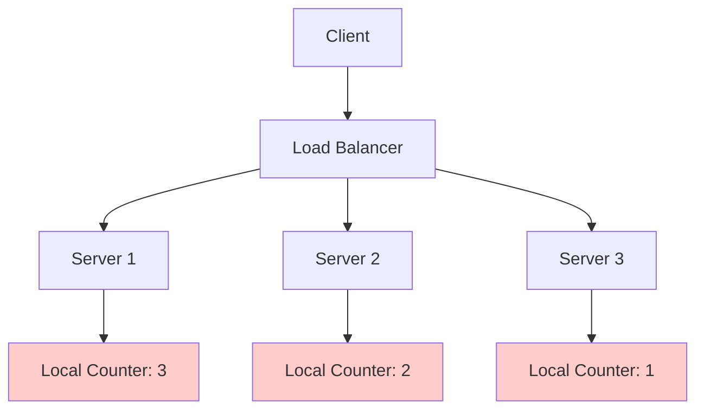
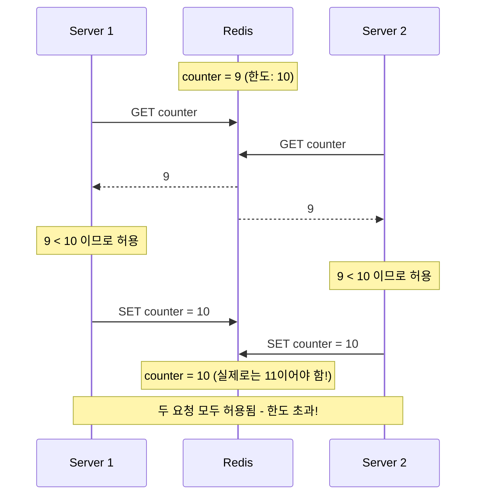
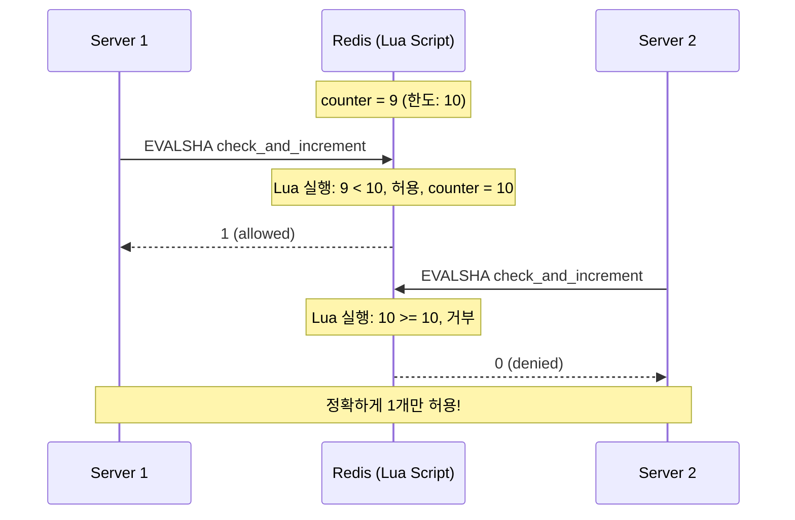
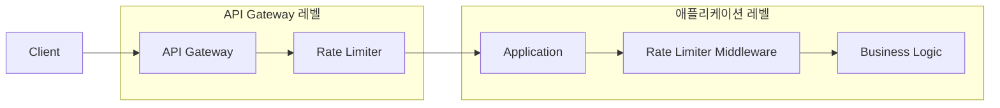
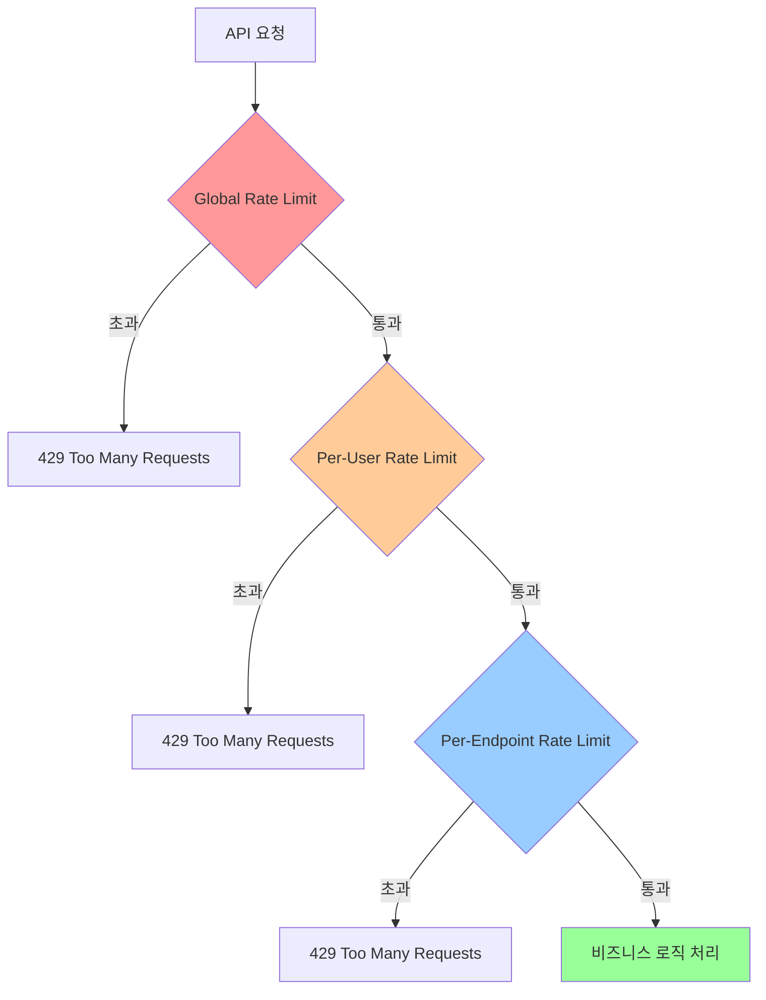
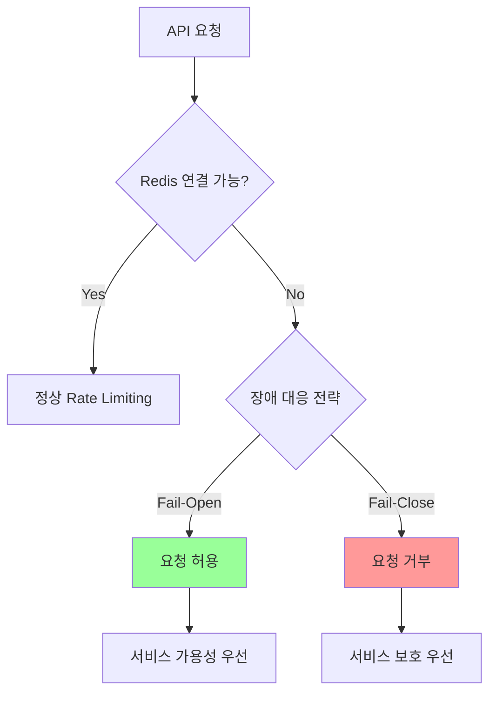
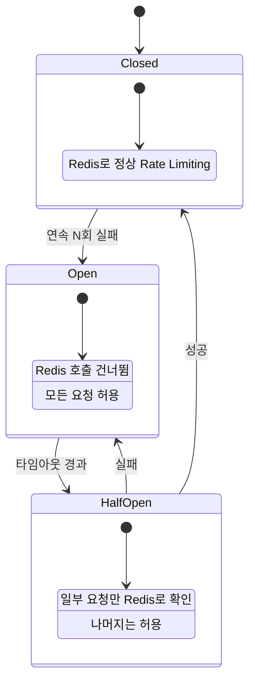
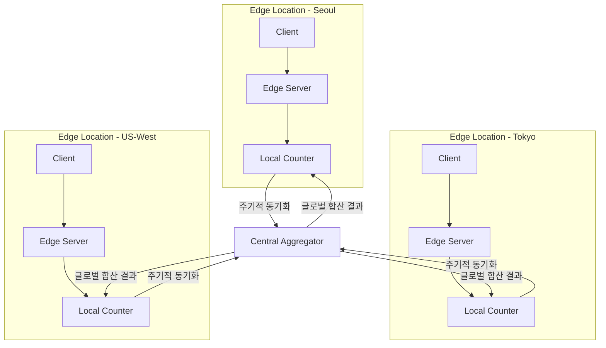
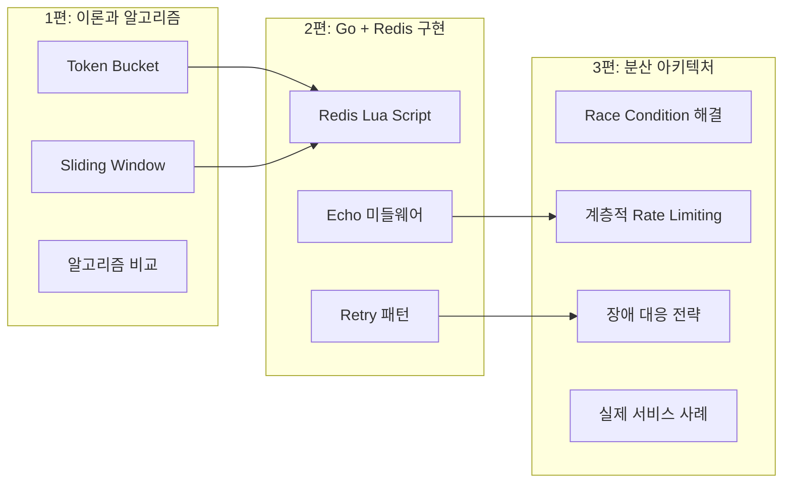

이 글은 API Rate Limiting 시리즈의 마지막 편이다. [1편](/article/api-rate-limiting-1-개념과-알고리즘)에서는 Rate Limiting의 개념과 주요 알고리즘(Token Bucket, Sliding Window 등)을 다뤘고, [2편](/article/api-rate-limiting-2-go-redis-실전-예제)에서는 Go와 Redis를 활용한 실제 구현을 살펴봤다. 이번 편에서는 한 발 더 나아가, **분산 환경에서 Rate Limiting을 안정적으로 운영하기 위한 아키텍처와 실제 서비스들의 사례**를 분석한다.

단일 서버에서는 잘 동작하던 Rate Limiter가 서버가 여러 대로 늘어나면 예상치 못한 문제를 일으킨다. Race Condition, 노드 간 카운터 불일치, Redis 장애 시 대응 등 분산 환경 고유의 도전 과제를 하나씩 풀어보자.

# 1. 분산 환경에서의 새로운 도전

단일 서버 환경에서는 메모리에 카운터를 두면 충분하다. 하지만 로드 밸런서 뒤에 여러 서버가 있는 분산 환경에서는 상황이 완전히 달라진다.



위 구조에서 사용자의 실제 요청 수는 3+2+1 = 6이지만, 각 서버는 자신의 로컬 카운터만 보기 때문에 한도를 넘겼는지 정확히 판단할 수 없다. 한도가 5라면 이미 초과했지만, 어떤 서버도 이를 감지하지 못한다.

## 1.1 핵심 문제 3가지

| 문제 | 설명 | 영향 |
|------|------|------|
| Race Condition | 여러 서버가 동시에 같은 카운터를 읽고 업데이트 | 한도 초과 허용 |
| 노드 간 불일치 | 각 서버의 로컬 카운터가 독립적으로 동작 | 실제 요청 수를 과소평가 |
| 중앙 저장소 장애 | Redis 등 공유 저장소가 다운되면 Rate Limiting 불가 | 서비스 보호 실패 또는 전체 차단 |

# 2. Race Condition과 해결 방법

## 2.1 문제: 동시 요청 시 카운터 정확성

두 서버가 동시에 Redis의 같은 카운터를 읽고 업데이트하면, **Read-Then-Write** 패턴에서 Race Condition이 발생한다.



GET과 SET이 별도 명령으로 실행되므로, 그 사이에 다른 서버의 요청이 끼어들 수 있다. 이로 인해 한도인 10을 초과하는 11번째 요청이 허용되는 문제가 발생한다.

## 2.2 해결 1: Redis Lua Script (Atomic 처리)

Redis는 Lua Script를 **단일 명령처럼 원자적으로 실행**한다. Script 실행 중에는 다른 명령이 끼어들 수 없으므로 Race Condition을 근본적으로 해결한다.

```lua
-- Sliding Window Counter Lua Script
local key = KEYS[1]
local window = tonumber(ARGV[1])   -- 윈도우 크기 (초)
local limit = tonumber(ARGV[2])    -- 최대 허용 수
local now = tonumber(ARGV[3])      -- 현재 타임스탬프

-- 윈도우 밖의 오래된 데이터 제거
redis.call('ZREMRANGEBYSCORE', key, 0, now - window * 1000)

-- 현재 윈도우 내 요청 수 확인
local count = redis.call('ZCARD', key)

if count < limit then
    -- 허용: 현재 타임스탬프를 추가
    redis.call('ZADD', key, now, now .. '-' .. math.random(1000000))
    redis.call('PEXPIRE', key, window * 1000)
    return 1  -- allowed
else
    return 0  -- denied
end
```

이 스크립트는 카운터 확인과 업데이트를 한 번에 수행하므로, 아무리 많은 서버가 동시에 요청해도 정확한 카운팅이 보장된다.



## 2.3 해결 2: MULTI/EXEC 트랜잭션

Redis의 `MULTI/EXEC` 명령을 사용하면 여러 명령을 트랜잭션으로 묶어 실행할 수 있다. `WATCH`와 함께 사용하면 Optimistic Locking을 구현할 수 있다.

```
WATCH ratelimit:user:123
GET ratelimit:user:123
-- 값 확인 후 --
MULTI
INCR ratelimit:user:123
EXPIRE ratelimit:user:123 60
EXEC
```

`WATCH`로 감시 중인 키가 `EXEC` 전에 다른 클라이언트에 의해 변경되면, 트랜잭션이 실패(`nil` 반환)한다. 이 경우 처음부터 재시도해야 한다.

| 방식 | 장점 | 단점 |
|------|------|------|
| Lua Script | 완전한 원자성, 재시도 불필요 | 복잡한 로직 디버깅이 어려움 |
| MULTI/EXEC + WATCH | Redis 기본 기능만 사용 | 충돌 시 재시도 필요, 높은 동시성에서 성능 저하 |
| INCR (단순 카운터) | 가장 간단, 자체로 원자적 | 복합 조건 검사 불가 |

> **실무 권장**: Lua Script 방식을 추천한다. 복잡한 Rate Limiting 로직을 하나의 원자적 연산으로 처리할 수 있고, 재시도 로직이 필요 없어 구현이 깔끔하다.

## 2.4 노드 간 동기화: 로컬 vs 중앙 집중식

분산 환경에서 카운터를 관리하는 방식은 크게 두 가지로 나뉜다.

### 로컬 카운터 방식

각 서버가 독립적인 카운터를 유지하고, 전체 한도를 서버 수로 나누어 배분한다.

```
전체 한도: 1000 req/min
서버 3대 → 각 서버 한도: 333 req/min
```

| 장점 | 단점 |
|------|------|
| 외부 의존성 없음 (Redis 불필요) | 트래픽이 균등하지 않으면 부정확 |
| 네트워크 지연 없이 즉시 판단 | 서버 추가/제거 시 한도 재계산 필요 |
| Redis 장애 영향 없음 | Sticky Session 없으면 사용자별 제한 불가 |

### 중앙 집중식 (Redis 기반)

모든 서버가 Redis의 공유 카운터를 참조한다.

| 장점 | 단점 |
|------|------|
| 정확한 글로벌 카운팅 | Redis 의존성 (SPOF 가능성) |
| 서버 수에 관계없이 일관된 제한 | 네트워크 왕복 지연 추가 |
| 사용자별, 엔드포인트별 세밀한 제어 | Redis 장애 시 대응 전략 필요 |

> **실무에서는 중앙 집중식이 표준**이다. 정확한 Rate Limiting이 필수인 API 서비스에서는 Redis 기반이 사실상 유일한 선택이고, Redis 장애에 대한 대응 전략을 별도로 마련하는 것이 일반적이다.

# 3. Redis Cluster 환경에서의 Rate Limiting

단일 Redis 인스턴스를 넘어 Redis Cluster를 사용하는 대규모 서비스에서는 추가적인 고려 사항이 있다.

## 3.1 Redis Cluster의 키 분배 문제

Redis Cluster는 16,384개의 해시 슬롯에 키를 분배한다. 동일 사용자의 Rate Limiting에 관련된 여러 키가 서로 다른 노드에 분산되면, Lua Script가 실행되지 않는다. Redis Lua Script는 **단일 노드에 있는 키만** 접근할 수 있기 때문이다.

## 3.2 Hash Tag를 사용한 키 설계

Redis Cluster에서는 **Hash Tag** `{}`를 사용해 관련 키들이 같은 노드에 배치되도록 한다.

```
# Hash Tag 없이 (키가 다른 노드에 분산될 수 있음)
ratelimit:user:123:sliding_window
ratelimit:user:123:token_bucket
ratelimit:user:123:config

# Hash Tag 사용 (같은 노드에 배치 보장)
{user:123}:ratelimit:sliding_window
{user:123}:ratelimit:token_bucket
{user:123}:ratelimit:config
```

`{}` 안의 문자열(`user:123`)만으로 해시 슬롯이 결정되므로, 같은 사용자의 모든 Rate Limiting 키가 동일 노드에 위치하게 된다.

## 3.3 단일 노드 vs 클러스터 환경 비교

| 항목 | 단일 Redis | Redis Cluster |
|------|-----------|---------------|
| 키 설계 | 자유로운 네이밍 | Hash Tag 필수 |
| Lua Script | 모든 키 접근 가능 | 같은 슬롯의 키만 접근 가능 |
| 확장성 | 수직 확장만 가능 | 수평 확장 가능 |
| 장애 영향 | 전체 서비스 영향 | 특정 슬롯만 영향 |
| 적합한 규모 | 초당 수만 요청 이하 | 초당 수십만 요청 이상 |

> **주의**: Hash Tag를 사용하면 특정 사용자의 키가 모두 한 노드에 집중되므로, 대량 트래픽을 발생시키는 사용자가 있으면 **Hot Key** 문제가 생길 수 있다. 이 경우 키를 여러 개로 샤딩하는 전략이 필요하다.

# 4. API Gateway vs 애플리케이션 레벨 Rate Limiting

Rate Limiting을 어느 계층에서 적용할지는 아키텍처 설계의 중요한 결정이다.



## 4.1 API Gateway 레벨

### Nginx `limit_req`

Nginx의 내장 모듈로, 설정만으로 Rate Limiting을 적용할 수 있다.

```nginx
http {
    # Zone 정의: 클라이언트 IP 기준, 10MB 메모리, 초당 10 요청
    limit_req_zone $binary_remote_addr zone=api:10m rate=10r/s;

    server {
        location /api/ {
            # burst=20: 최대 20개 초과 요청을 큐에 대기
            # nodelay: 큐 대기 없이 즉시 처리 (burst 내에서)
            limit_req zone=api burst=20 nodelay;
            limit_req_status 429;

            proxy_pass http://backend;
        }
    }
}
```

### Kong Rate Limiting Plugin

Kong API Gateway는 플러그인 방식으로 Rate Limiting을 제공한다. Redis를 백엔드로 사용해 분산 환경을 지원한다.

```yaml
plugins:
  - name: rate-limiting
    config:
      minute: 100
      hour: 10000
      policy: redis          # local, cluster, redis 중 선택
      redis_host: redis.svc
      redis_port: 6379
      redis_timeout: 2000
      fault_tolerant: true   # Redis 장애 시 요청 허용
```

### AWS API Gateway

AWS API Gateway는 두 가지 수준의 제한을 제공한다.

- **계정 수준**: 리전당 기본 10,000 req/sec (상향 요청 가능)
- **사용량 계획(Usage Plan)**: API 키별 Rate/Burst/Quota 설정

### Envoy Rate Limiting

Envoy 프록시는 외부 Rate Limiting 서비스와 연동하는 방식을 사용한다.

```yaml
rate_limits:
  - actions:
      - request_headers:
          header_name: "x-user-id"
          descriptor_key: "user_id"
      - request_headers:
          header_name: ":path"
          descriptor_key: "path"
```

## 4.2 애플리케이션 레벨

2편에서 다룬 Echo 미들웨어 패턴처럼, 애플리케이션 코드에서 직접 Rate Limiting 로직을 구현하는 방식이다. 비즈니스 로직에 따른 세밀한 제어가 가능하다.

```go
// 사용자 등급별 차등 Rate Limiting (애플리케이션 레벨)
func rateLimitMiddleware(redisClient *redis.Client) echo.MiddlewareFunc {
    return func(next echo.HandlerFunc) echo.HandlerFunc {
        return func(c echo.Context) error {
            userID := c.Get("user_id").(string)
            plan := c.Get("plan").(string) // free, pro, enterprise

            var limit int
            switch plan {
            case "free":
                limit = 100
            case "pro":
                limit = 1000
            case "enterprise":
                limit = 10000
            }

            allowed, err := checkRateLimit(redisClient, userID, limit)
            if err != nil {
                // Redis 장애 시 fail-open
                return next(c)
            }
            if !allowed {
                return c.JSON(429, map[string]string{
                    "error": "rate limit exceeded",
                })
            }
            return next(c)
        }
    }
}
```

## 4.3 비교표

| 기준 | API Gateway 레벨 | 애플리케이션 레벨 |
|------|-----------------|-----------------|
| **유연성** | 낮음 (IP, API Key 기준) | 높음 (사용자 등급, 엔드포인트별) |
| **성능** | 높음 (요청이 앱까지 도달 안 함) | 중간 (앱 레벨에서 처리) |
| **구현 복잡도** | 낮음 (설정 기반) | 중간~높음 (코드 작성 필요) |
| **비즈니스 로직 반영** | 어려움 | 쉬움 |
| **운영 부담** | 낮음 (인프라에서 관리) | 중간 (앱과 함께 배포) |
| **적합한 상황** | DDoS 방어, 전역 제한 | 사용자별 차등 제한, 과금 연동 |

> **실무 권장**: **두 계층을 모두 사용**하는 것이 일반적이다. API Gateway에서 전역적인 보호(DDoS, 기본 Rate Limit)를 적용하고, 애플리케이션에서 비즈니스 로직 기반의 세밀한 제어를 추가한다.

# 5. 계층적 Rate Limiting

실제 서비스에서는 단일 한도가 아닌, 여러 계층의 Rate Limiting을 동시에 적용한다.



## 5.1 계층별 역할

| 계층 | 목적 | 예시 |
|------|------|------|
| **Global** | 전체 시스템 보호 | 10,000 req/sec (전체 서비스) |
| **Per-User** | 개별 사용자 공정 사용 | Free: 100 req/min, Pro: 1,000 req/min |
| **Per-Endpoint** | 비싼 API 보호 | POST /api/search: 10 req/min |

## 5.2 Redis 키 설계

```
# Global
{global}:ratelimit:requests          → 전체 요청 수

# Per-User
{user:123}:ratelimit:requests        → 사용자별 요청 수

# Per-Endpoint
{user:123}:ratelimit:POST:/api/search → 사용자+엔드포인트별 요청 수
```

각 계층은 독립적으로 동작하며, **어느 한 계층이라도 한도를 초과하면 요청을 거부**한다. 계층이 많아질수록 Redis 호출 횟수가 증가하므로, Lua Script로 여러 계층을 한 번에 검사하거나 Pipeline을 사용해 네트워크 왕복을 줄이는 최적화가 필요하다.

# 6. 장애 대응 전략

중앙 집중식 Rate Limiting의 가장 큰 약점은 Redis가 다운되면 Rate Limiting 자체가 불가능해진다는 점이다.

## 6.1 Fail-Open vs Fail-Close

Redis에 연결할 수 없을 때 두 가지 전략이 있다.



| 전략 | 동작 | 장점 | 단점 | 적합한 상황 |
|------|------|------|------|-----------|
| **Fail-Open** | Redis 장애 시 요청 허용 | 서비스 가용성 유지 | Rate Limiting 무력화 | 일반 API, 내부 서비스 |
| **Fail-Close** | Redis 장애 시 요청 거부 | 서비스 과부하 방지 | 정상 사용자도 차단 | 과금 API, 보안 중요 서비스 |

대부분의 서비스는 **Fail-Open**을 선택한다. 일시적인 Rate Limiting 무력화보다 서비스 다운이 더 큰 피해를 주기 때문이다. Kong의 `fault_tolerant: true` 설정이 대표적인 Fail-Open 구현이다.

## 6.2 Circuit Breaker 패턴 적용

Redis 연결 장애가 반복되면, 매 요청마다 연결을 시도하는 것 자체가 오버헤드가 된다. Circuit Breaker를 적용해 일정 횟수 이상 실패하면 자동으로 Fail-Open 모드로 전환한다.



Go에서는 `sony/gobreaker` 라이브러리로 쉽게 구현할 수 있다.

```go
import "github.com/sony/gobreaker"

cb := gobreaker.NewCircuitBreaker(gobreaker.Settings{
    Name:        "redis-rate-limiter",
    MaxRequests: 3,                    // Half-Open에서 허용할 요청 수
    Interval:    10 * time.Second,     // Closed 상태에서 카운터 리셋 주기
    Timeout:     30 * time.Second,     // Open → Half-Open 전환 대기 시간
    ReadyToTrip: func(counts gobreaker.Counts) bool {
        return counts.ConsecutiveFailures > 5  // 연속 5회 실패 시 Open
    },
})

func checkRateLimitWithCB(userID string) (bool, error) {
    result, err := cb.Execute(func() (interface{}, error) {
        return checkRateLimitFromRedis(userID)
    })
    if err != nil {
        // Circuit Open 또는 Redis 장애 → Fail-Open
        return true, nil
    }
    return result.(bool), nil
}
```

## 6.3 Graceful Degradation

장애 시 단순히 허용/거부만 하는 것이 아니라, 단계적으로 제한을 완화하는 전략이다.

### Soft Limit과 Hard Limit

```
Soft Limit: 100 req/min (경고 응답 헤더 추가)
Hard Limit: 150 req/min (요청 거부)
```

Soft Limit을 넘으면 응답 헤더에 경고를 추가하고, 클라이언트에게 속도를 줄이라는 신호를 보낸다. Hard Limit을 넘어야 실제로 요청을 거부한다.

### 우선순위 기반 Degradation

장애 시 모든 사용자를 동일하게 처리하지 않고, 우선순위에 따라 차등 대응한다.

| 우선순위 | 대상 | 정상 시 | Redis 장애 시 |
|---------|------|---------|-------------|
| 높음 | Enterprise 고객 | 10,000 req/min | 요청 허용 (제한 없음) |
| 중간 | Pro 고객 | 1,000 req/min | 로컬 카운터로 대략적 제한 |
| 낮음 | Free 사용자 | 100 req/min | 보수적 로컬 제한 적용 |

이를 통해 장애 상황에서도 유료 고객의 서비스 품질을 최대한 유지할 수 있다.

# 7. 실제 서비스 사례 분석

대규모 서비스들이 Rate Limiting을 어떻게 구현하고 있는지 살펴보자. 각 서비스의 접근 방식에서 실무에 적용할 수 있는 인사이트를 얻을 수 있다.

## 7.1 GitHub API

GitHub는 **Primary**와 **Secondary** 두 종류의 Rate Limit을 운영한다.

### Primary Rate Limits

인증 방식에 따라 한도가 다르다.

| 인증 방식 | 한도 |
|----------|------|
| 인증되지 않은 요청 | 60 req/hour |
| Personal Access Token | 5,000 req/hour |
| GitHub App (설치) | 5,000 req/hour (또는 그 이상) |
| GITHUB_TOKEN (Actions) | 1,000 req/hour |

### Secondary Rate Limits

Primary 한도 내에서도 **단시간 과도한 요청**을 방지하기 위한 추가 제한이다.

- 단일 엔드포인트: 100 req/sec 이하 권장
- 동시 요청: 최대 100개
- 컨텐츠 생성 API(이슈, 코멘트 등): 분당 80개

### 응답 헤더

```http
HTTP/2 200 OK
x-ratelimit-limit: 5000
x-ratelimit-remaining: 4987
x-ratelimit-reset: 1709892000
x-ratelimit-used: 13
x-ratelimit-resource: core
```

- `x-ratelimit-remaining`: 남은 요청 수
- `x-ratelimit-reset`: 한도 리셋 시각 (Unix timestamp)
- `x-ratelimit-resource`: `core`, `search`, `graphql` 등 리소스별 구분

**배울 점**: 리소스별로 Rate Limit을 분리하여 검색 API와 일반 API가 서로 영향을 주지 않도록 설계했다. 또한 응답 헤더로 클라이언트가 자체적으로 요청 속도를 조절할 수 있게 한다.

## 7.2 Stripe API

결제 서비스인 Stripe는 보안과 정확성이 매우 중요하므로 엄격한 Rate Limiting을 적용한다.

### Rate Limit 구조

| 모드 | 한도 |
|------|------|
| Live 모드 (실제 결제) | 100 req/sec |
| Test 모드 (테스트) | 25 req/sec |

Stripe는 단순히 시간당 요청 수가 아니라, **초당 요청 수(RPS)**로 제한한다. 이는 버스트 트래픽에 대한 더 세밀한 제어를 제공한다.

### 429 응답과 Retry 전략

```http
HTTP/2 429 Too Many Requests
Retry-After: 1
```

Stripe는 `Retry-After` 헤더로 재시도 대기 시간을 명시적으로 알려준다. 공식 SDK에는 **Exponential Backoff with Jitter**가 내장되어 있다.

```
1차 재시도: 0.5초 후
2차 재시도: 1초 후
3차 재시도: 2초 후 (+ 랜덤 jitter)
최대 재시도: 3회
```

**배울 점**: Rate Limit 초과 시 클라이언트가 올바르게 재시도할 수 있도록 `Retry-After` 헤더와 공식 SDK에 Backoff 로직을 내장했다. "클라이언트 측 구현까지 책임진다"는 관점이 인상적이다.

## 7.3 Cloudflare

Cloudflare는 전 세계 300개 이상의 데이터센터에서 Rate Limiting을 수행해야 하므로, 가장 복잡한 분산 아키텍처를 운영한다.

### 글로벌 분산 카운팅 아키텍처



### Cloudflare의 접근 방식

Cloudflare는 **정확성보다 성능을 우선**하는 설계를 택했다.

1. **로컬 우선 판단**: 각 Edge 서버는 로컬 카운터로 먼저 판단한다
2. **비동기 동기화**: 주기적으로(수 초 간격) 중앙에 카운터를 전송한다
3. **최종 일관성**: 글로벌 합산 결과를 다시 Edge로 전파한다

이 방식은 정확한 실시간 카운팅은 불가능하지만, 지연 시간이 극히 낮고 중앙 저장소 장애에도 강건하다.

| 특성 | Cloudflare 방식 | 일반적인 Redis 방식 |
|------|----------------|-------------------|
| 지연 시간 | 극히 낮음 (로컬 판단) | 네트워크 왕복 필요 |
| 정확도 | 근사치 (수 초 지연) | 거의 정확 |
| 장애 내성 | 매우 높음 | Redis 의존 |
| 적합한 규모 | 수백만 RPS 이상 | 수만~수십만 RPS |

**배울 점**: 글로벌 규모의 서비스에서는 "완벽한 정확성"을 포기하고 "충분히 좋은 근사치"를 빠르게 계산하는 것이 더 실용적이다. CAP 정리에서 Availability와 Partition Tolerance를 선택한 전형적인 사례이다.

## 7.4 사례 비교 요약

| 서비스 | Rate Limit 방식 | 핵심 특징 | 장애 대응 |
|--------|---------------|----------|----------|
| **GitHub** | 시간당 고정 한도 + Secondary | 리소스별 분리, 상세한 헤더 | 헤더 기반 클라이언트 제어 |
| **Stripe** | 초당 RPS 제한 | Retry-After, SDK 내장 Backoff | Exponential Backoff + Jitter |
| **Cloudflare** | 로컬 카운터 + 비동기 동기화 | 글로벌 분산, 성능 우선 | 로컬 Fail-Open |

# 8. 마무리

## 시리즈 전체 요약

이 시리즈를 통해 Rate Limiting의 이론부터 분산 환경 운영까지 전 과정을 다뤘다.



## 핵심 Takeaway

**1. 원자적 연산이 핵심이다**

분산 환경에서 Race Condition을 방지하려면 Redis Lua Script 같은 원자적 연산이 필수다. GET-then-SET 패턴은 반드시 피해야 한다.

**2. 계층적으로 적용하라**

API Gateway에서 전역 보호, 애플리케이션에서 비즈니스 로직 기반 제어를 동시에 적용하는 것이 실무 표준이다.

**3. 장애에 대비하라**

Redis가 영원히 동작할 것이라고 가정하지 말자. Fail-Open + Circuit Breaker + Graceful Degradation을 조합하면 장애 상황에서도 서비스를 보호할 수 있다.

**4. 클라이언트도 함께 설계하라**

`Retry-After`, `X-RateLimit-Remaining` 같은 응답 헤더를 통해 클라이언트가 스스로 속도를 조절할 수 있게 하면, 서버 측 Rate Limiting의 부담이 크게 줄어든다. Stripe처럼 SDK에 Backoff 로직을 내장하는 것이 가장 이상적이다.

**5. 완벽한 정확성보다 실용성을 택하라**

Cloudflare 사례에서 봤듯이, 글로벌 규모에서는 "충분히 좋은 근사치"가 "완벽하지만 느린 정확성"보다 낫다. 서비스의 규모와 요구 사항에 맞는 트레이드오프를 선택하자.

# 참고 자료

- [GitHub API Rate Limiting 문서](https://docs.github.com/en/rest/rate-limit)
- [Stripe API Rate Limiting](https://docs.stripe.com/rate-limits)
- [Cloudflare Rate Limiting 가이드](https://developers.cloudflare.com/waf/rate-limiting-rules/)
- [Redis EVAL 명령어 문서](https://redis.io/commands/eval)
- [Kong Rate Limiting Plugin](https://docs.konghq.com/hub/kong-inc/rate-limiting/)
- [Envoy Rate Limit Service](https://www.envoyproxy.io/docs/envoy/latest/configuration/http/http_filters/rate_limit_filter)
